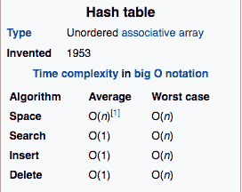
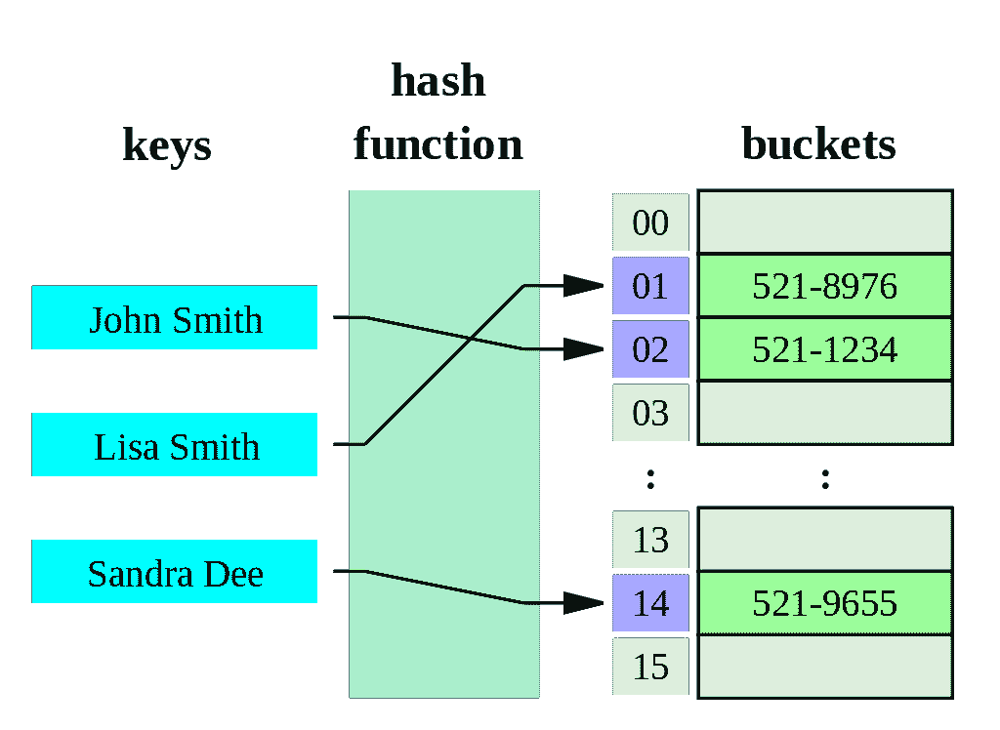
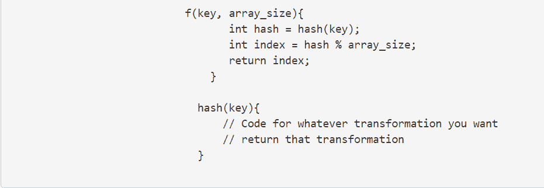
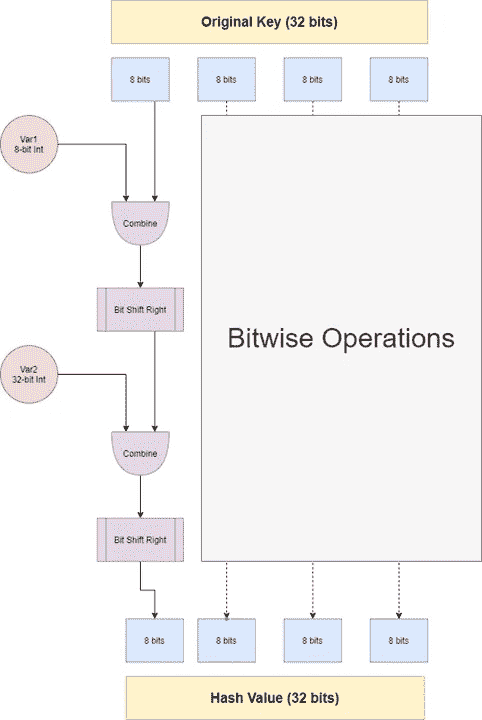
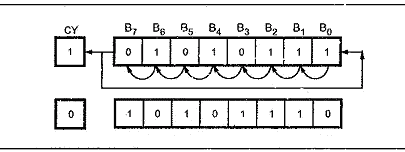
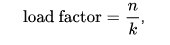

# 哈希表的魔力，快速深入 O(1)

> 原文：<https://medium.com/nerd-for-tech/the-magic-of-hash-tables-a-quick-deep-dive-into-o-1-1295199fcd05?source=collection_archive---------2----------------------->

*如果你想看解释，可以看看上面的视频。*

啊，是的，哈希表，计算机科学的经典。作为软件开发人员，当面对一个不熟悉的问题时，我们的第一个想法通常是:

> “嗯，我可以用哈希表解决这个问题吗？”

我的意思是，这是正确的想法！哈希表不仅使我们的逻辑变得简单，而且在恒定的时间访问速度下，它们也非常快！

# **灵感**

哈希表的时间和空间复杂度

当我写这个简单的`Map<String, Integer> my_map = new Map<String, Integer>();`时，我越来越好奇到底有多少行代码在幕后运行以使这个超级方便的数据结构工作。哪个…让我开始了一次气候之旅，探索我们的朋友哈希表的进进出出。以下是调查结果的摘要！

# 什么是哈希表？

好吧好吧，我会把这部分说得简短而甜蜜，我发誓…我不会怀疑你的智慧。有两个部分:

1.  哈希表是一个简单的内存块(一个数组),它包含保存我们想要映射的数据的“桶”。唷，简单吧？我们称它们为“桶”而不是索引，因为事实上，在一些实现中，索引包含一个链表(用于冲突)。
2.  哈希表也是可抽象寻址的，这意味着我们不用像`Data = (Memory Location of Array) + (array Offset)`那样直接使用偏移量，而是用偏移量替换用户定义的变量，然后**将它散列到一个唯一的***整数中。**

*   ** *在完美世界中，该值是唯一的*

散列表的图示[https://en.wikipedia.org/wiki/Hash_table](https://en.wikipedia.org/wiki/Hash_table)

# 哈希算法

使用函数“f”进行哈希运算

所以你可能会问自己，好的哈希算法，简单！最终目标是，我们希望获得提供的密钥，并将其转换为整数。在我们的例子中:

`Map<String, Integer> my_map = new Map<String, Integer>();`

我们想把我们的键类型`String`转换成一个整数，这样我们就可以用它来代替我们的`Array_Offset`值。这个过程是由一个**散列算法**执行的，它将返回一个大的数字，所以我们使用**模运算**和当前的数组大小来防止一个“*数组越界*错误。

# 仔细看看哈希算法

整洁对吗？！好吧，但现在你可能会问自己:

> “哈希表的键可以是任何对象！不仅仅是一个字符串，我们如何将任何对象转换成整数数组偏移量？”

哈希表的美妙之处在于它可以处理任何对象。怎么会？好吧，在各种各样的物体中唯一普遍的特点是它们最初都是由比特组成的！因此，通过我们的散列函数，我们将使用逐位操作来随机化对象，然后再将其转换为整数。

没有贯穿所有 OOP 语言的“标准哈希函数”，但是`unordered_map`的 C++实现使用了一种叫做“ [**MurmurHash**](https://en.wikipedia.org/wiki/MurmurHash) ”的算法。下面是一个简单的例子，说明如何将一个 32 位的对象散列成一个 32 位的整数。

32 位对象的哈希逻辑示例

## 在上面的例子中:

1.  我们取一个 32 位的对象，把它分成 4 组 8 位的块。
2.  对于每个单独的组，我们用一个随机静态变量`Var1`执行一个`AND`指令
3.  将结果向右移位，或者发出`ROL`指令

ROL 指令的一个例子

4.用不同的变量`Var2`重复步骤`2`和`3`

5.将每个单独的 8 位块组合回一个 32 位对象

6.将结果作为整数读取。

# 负载系数和插入元素

将键散列成一个可索引的整数后，我们准备在那个内存位置(对应的桶)插入一个值。

请记住，哈希表本身是一个内存块，因此在一定数量的插入之后，内存块将不得不重新创建自己。这个过程相对昂贵，因为数据结构必须分配新的内存块，重新散列键，并将值复制到新的索引中。

什么决定了哈希表何时满？一个“负载系数值”。

负载系数方程

负载因子被定义为"*表中的条目数(n)* 除以"*哈希表的大小(k)*

在向哈希表中插入新元素之前会进行检查。**如果在下一次插入时超过了加载因子，那么哈希表将分配一个新的内存块，重新散列关键字，并将所有数据复制回哈希表。**

我们希望哈希表中有一些回旋的空间来避免冲突，这通常意味着数组的大小始终大于条目的数量。

# 结论

Tada！神奇吧？

总的来说，本文的目的是探索如何在恒定时间内实现标准哈希表的插入和搜索时间复杂性。有很多问题没有得到回答，比如“如何最佳地处理与哈希表的冲突？”哈哈…我会让 [stack overflow](https://stackoverflow.com/questions/4980757/how-do-hashtables-deal-with-collisions) 来回答一些你可能有的那些没有回答的问题。然而，我希望您能够自信地看到，使用哈希表是如何实现恒定的时间复杂度的。以下是五个要点:

# 关键要点

*   哈希函数对键值使用逐位操作
*   C++标准库散列函数被称为“ [Murmurhash](https://en.wikipedia.org/wiki/MurmurHash)
*   用于哈希表的哈希算法不是加密算法，并且优先考虑速度而不是安全性。
*   一旦达到负载系数，哈希表就必须重新散列它的值。
*   标准的散列阈值是 3/4，所以一个散列表通常应该比存储一个数组中的所有元素多 25%的内存。