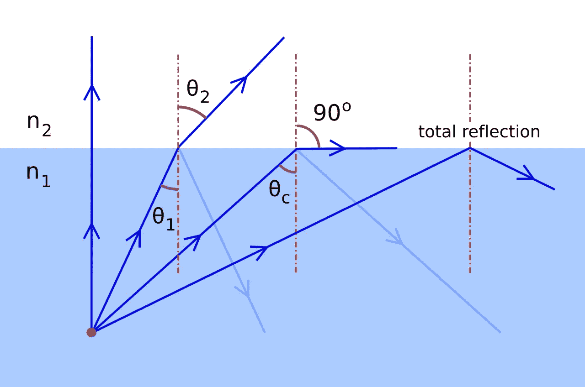
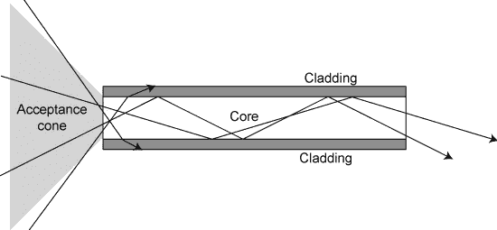
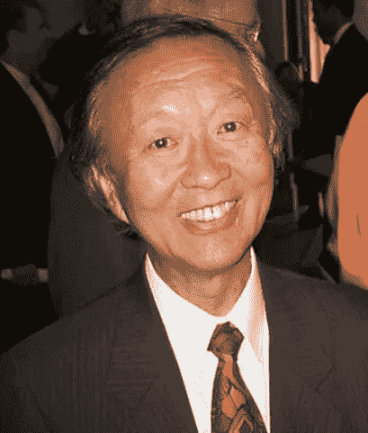

# 让互联网世界成为可能的人

> 原文：<https://medium.com/nerd-for-tech/the-man-who-made-the-internet-world-possible-85d3997d3dd0?source=collection_archive---------4----------------------->

丹尼·米勒在 [Unsplash](https://unsplash.com?utm_source=medium&utm_medium=referral) 上的照片

在当前的时代，有一个正在进行的疫情，我们非常依赖互联网，我们是否确切地知道:什么是互联网？

我们可以说是一个我们可以分享信息、学习更多知识、与世界各地的人们联系等的地方。

从技术上讲，互联网是一堆连接在一起的计算机——遍布世界各地——以光速共享信息！因为光有助于数据传输。我们需要以如此高的速度传输数据，这样你就可以从一台计算机到另一台计算机获得几乎即时的结果，因为它与你共享数据。

为了以光速连接这些计算机，使用了[光纤](https://en.wikipedia.org/wiki/Optical_fiber)。

纳林德·辛格·卡潘尼 是使以光速传输数据的计算机连接成为可能的人。他被称为光纤之父，是光纤技术背后的天才，但他对互联网的贡献几乎没有得到认可。

Darpan 杂志中 Narinder Singh Kapany 的图片

纳林德·辛格·卡潘尼是一位印度裔美国物理学家，他被认为发明了光纤。从阿格拉大学毕业后，纳林德·辛格·卡帕尼前往伦敦帝国理工学院攻读[光学](https://en.wikipedia.org/wiki/Optics#:~:text=Optics%20is%20the%20branch%20of,%2C%20ultraviolet%2C%20and%20infrared%20light.)。

在帝国理工学院，他和他的博士导师哈罗德·霍普金斯一起寻找弯曲光线的解决方案，最初的想法是将其用于内窥镜检查。

他发明了光纤，利用简单的全内反射现象找到了解决这个问题的方法。

光纤利用[全内反射](https://en.wikipedia.org/wiki/Total_internal_reflection#Critical_angle)现象传输光线。当光以大于称为临界角(玻璃为 42 度)的特定角度入射到玻璃管的一端而不是折射时，它会反射到相同的介质中，没有能量损失，比镜子好！

临界角是从光学密度较高的介质到光学密度较低的介质的入射角，折射角为 90 度。当入射角超过特定介质的临界角时，会导致光被反射而不是折射。

解释临界角，维基共享

纳林德·辛格·卡潘尼利用这一现象，提出了沿管道连续反射的想法。因此，这使得光沿着薄玻璃管的路径传播，薄玻璃管很容易弯曲。

纤维光学的工作，维基共享

他利用这一现象创造了[纤维镜](https://en.wikipedia.org/wiki/Fiberscope)，这是一种由管道中的多根光纤组成的设备，其中一根光纤像单个像素一样将光传输到末端。

纤维镜成为老式内窥镜的替代品，老式内窥镜本质上是刚性金属管。这极大地推动了这项技术的革新，以至于同样的原理仍然应用于现代内窥镜。

Kapany 开发的这项技术在短距离内是可靠的，但在长距离内，由于未知原因，光纤末端接收到的光信号并不准确。

后来，一位名叫查尔斯·k·高(Charles K. Kao)的物理学家发现，这是因为玻璃中的杂质分子吸收了光线并将其散射。因此，为了使它在长距离上可靠，必须使用纯玻璃，加入称为**掺杂剂**的物质，使玻璃反射更好。

> 高琨因这一发现获得了诺贝尔奖，但发明光纤的纳林德·辛格·卡潘尼却从未被认可。

高锟的图片，大卫·道金，维基共享

1960 年，Kapany 创建了光学技术公司，并担任了 12 年的董事长、总裁和研究总监。 [*《财富》*](https://en.wikipedia.org/wiki/Fortune_%28magazine%29) 将他评为七位“20 世纪无名英雄”之一，以表彰他的[诺贝尔奖](https://en.wikipedia.org/wiki/Nobel_Prize)-值得嘉奖的发明。

他于 2020 年 12 月 4 日去世，2021 年被追授印度第二高的平民奖 [Padma Vibhushan](https://en.wikipedia.org/wiki/Padma_Vibhushan) 。