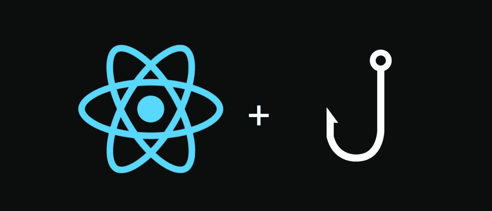
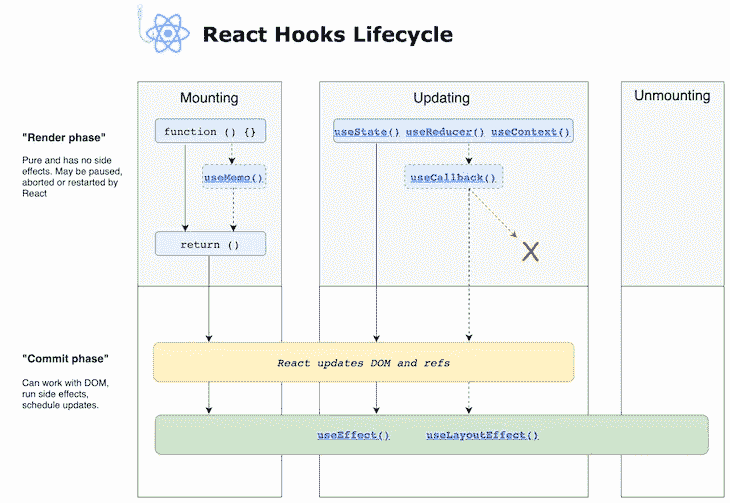

# 使用的多种效果

> 原文：<https://medium.com/nerd-for-tech/the-many-effects-of-useeffect-acf5013b5e14?source=collection_archive---------13----------------------->



图片来源于 [Aditya Loshali](https://levelup.gitconnected.com/handling-complex-form-state-using-react-hooks-76ee7bc937) 和 freeCodeCamp

除了 [useContext](https://javascript.plainenglish.io/putting-context-into-usecontext-5dbe77c276d1) ，另一个我喜欢学习和使用的 React Hook 是 useEffect。

useEffect 是一个 React 挂钩，它模拟组件的生命周期，并将其提供给功能组件。在类组件中，有 componentDidMount()或 componentDidUpdate()这样的生命周期。生命周期用于根据组件更新呈现和重新呈现 DOM。

与 useContext 类似，随着行业标准从类组件转移到功能组件，我们仍然需要一个钩子来解决这个问题。useEffect 就是为此而构建的。事实上，React 官方文档说 useEffect 钩子就像“ [componentDidMount，componentDidUpdate，componentWillUnmount 组合](https://reactjs.org/docs/hooks-effect.html)”。



图像归功于 [LogRocket](https://blog.logrocket.com/guide-to-react-useeffect-hook/)

## 你如何使用它？

像 useContext 一样，useEffect 必须从 React 导入到组件中。在这种情况下，应该在声明函数组件之后、return 语句之前调用 useEffect。

钩子本身“可以接受两个参数，它们是回调函数…和依赖数组”( [Olena Drygalya](https://dev.to/olenadrugalya/basic-hooks-in-react-useeffect-4719) )。

```
import {useEffect} from 'react'export default function TestCase(){
   useEffect(() => {
     /* your callback function goes here()*/
   }, [/* your dependency array goes here */])
}
```

第一个参数，回调函数，也称为副作用。这是因为“我们通常希望在特定条件下执行副作用，例如，数据已经改变，道具已经改变，或者用户第一次看到我们的组件”( [Sebastian Weber](https://blog.logrocket.com/guide-to-react-useeffect-hook/) )。

依赖关系数组的第二个参数确保 useEffect 仅在依赖关系数组发生变化或突变时运行或重新呈现。更有可能的是，您可能已经看到依赖数组被分配给一个空数组的值。这确保了 useEffect 被调用一次。

React 钩子和功能组件没有任何进展——如果有的话，似乎开发人员自从引入钩子以来就非常热衷于使用钩子。React Hooks 在效率和可读性方面与类组件做得一样好，甚至更好，用更少的代码做同样的工作和逻辑。

如果你以前没有使用过 React Hooks 或 useEffect，是 React 新手，或者想学习更多关于前端开发的知识，我鼓励你阅读下面的参考资料。

## 资源

[](https://dev.to/nibble/what-is-useeffect-hook-and-how-do-you-use-it-1p9c) [## 什么是 useEffect 钩子，你如何使用它？

### 介绍使用效果钩子传递什么参数？使用 Effect 的第一个参数返回 effect 的第二个值…

开发到](https://dev.to/nibble/what-is-useeffect-hook-and-how-do-you-use-it-1p9c) [](https://dev.to/olenadrugalya/basic-hooks-in-react-useeffect-4719) [## React - useEffect()中的基本挂钩

### 这篇博文延续了 React Hooks 系列。在这里，我们正在探索一个基本且非常重要的挂钩…

开发到](https://dev.to/olenadrugalya/basic-hooks-in-react-useeffect-4719) [](https://blog.logrocket.com/guide-to-react-useeffect-hook/) [## 你需要的使用效果钩子的最后一个指南

### 理解 useEffect 钩子如何工作是今天掌握 React 最重要的概念之一。如果你有…

blog.logrocket.com](https://blog.logrocket.com/guide-to-react-useeffect-hook/) [](https://blog.webdevsimplified.com/2020-04/use-effect/) [## 关于 useEffect 你需要知道的一切

### 在我的上一篇博文中，我谈到了 React 中的 useState 钩子。在这篇文章中，我想谈谈…

blog.webdevsimplified.com](https://blog.webdevsimplified.com/2020-04/use-effect/) [](https://reactjs.org/docs/hooks-reference.html#useeffect) [## 钩子 API 参考-反应

### 钩子是 React 16.8 中的新增功能。它们允许您使用状态和其他 React 特性，而无需编写类。这个…

reactjs.org](https://reactjs.org/docs/hooks-reference.html#useeffect) [](https://overreacted.io/a-complete-guide-to-useeffect/) [## 使用效果完全指南

### 你用钩子写了几个组件。甚至可能是一个小 app。你基本上满意了。你对 API 很满意…

反应过度了](https://overreacted.io/a-complete-guide-to-useeffect/) [](https://dmitripavlutin.com/react-useeffect-explanation/) [## React.useEffect()的简单说明

### React hooks 的表现力让我印象深刻。你可以写这么少却做这么多。但是钩子的简洁性…

dmitripavlutin.com](https://dmitripavlutin.com/react-useeffect-explanation/)