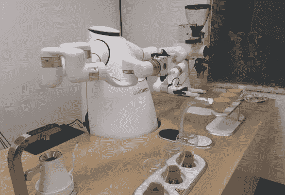

# 服务机器人的市场需求更加广阔

> 原文：<https://medium.com/nerd-for-tech/the-market-demand-for-service-robots-is-broader-1c2d3d9f24ea?source=collection_archive---------7----------------------->

[https://www.robot-china.com/news/202108/20/67009.html](https://www.robot-china.com/news/202108/20/67009.html)

近年来，全球家庭服务机器人产业发展迅速。随着经济发展和人民生活水平的不断提高，医疗卫生、公共环境服务、老年护理、物流、教育等领域对此类机器人的需求不断增加。国家统计局数据显示，上述服务机器人和特种机器人制造企业去年营业收入 500 多亿元，同比增速超过 40%。

**机器人应用的重点正从制造业转向服务业。**服务机器人进入快速增长期，服务功能、参数性能、可靠性也在不断提升。物流、公共环境服务和安全是三种类型的机器人。在生活服务领域应用最为广泛。

未来会有越来越多的家政、保洁、导购、医疗等类型的机器人不断进入我们的日常生活。应用范围会比工业机器人更广，市场需求更显著，增长速度更快。行业也有更大的市场潜力和发展空间。

现在国内很多大医院都开始引进手术机器人。这种设备非常复杂。其成像系统可以将手术过程中细微的病变放大十倍以上，显著提高了手术操作的准确性。而且可以辅助医生完成各种复杂的手术。美国直觉公司是世界上制造手术机器人的领先公司。达芬奇手术机器人在市场上很流行。进口这样的设备也很贵，而且价格不菲(315 万美元左右)，手术机器人的应用近年来也呈现出加速增长的趋势。仅在过去的一年里，全世界各种手术机器人已经协助完成了超过 120 万例手术。

最近，美国亚马逊推出了小型家用机器人“Astro”。它的程序配备了“Alexa”语音控制系统和人工智能服务。这个机器人可以通过摄像头和传感器自动避开障碍物。例如，如果主人外出时，主人可以照顾家里的警卫或帮助照顾老人，“Astro”可以在出现异常情况时及时通过网络系统通知主人。亚马逊计划开始在美国销售这款机器人。

未来，基于更细分、更多样化的应用场景，一批专注于某一特定领域的中小型机器人公司技术水平更高，成熟的应用解决方案将会涌现。他们也会依靠专业、精细化的产品和服务，在激烈的市场中占据一席之地，成为特定细分领域的行业巨头。

今年 9 月中旬，在北京亦庄举行的 2021 世界机器人大会上，多家中小机器人公司展示了智能消毒灭菌机器人、智能医疗咨询机器人、智能园区巡检机器人、防爆消防机器人，以及有效载荷、机器狗等各类生活服务机器人。未来我们会看到越来越多拥有多种功能的机器人代替不同岗位的人，发挥他们的作用。

**更多阅读:** [**探索世界机器人大会热点产品**](https://tinyurl.com/uh3aperk)

随着机器人制造业的蓬勃发展，资本市场对该行业的关注度逐渐提高。从 2021 年 1 月至今，机器人制造业上涨近百倍，融资总额达到 120 多亿元。这为技术的不断升级和产品的不断迭代提供了充足的资金保障。

随着消费的逐步升级，价格的大幅下降，市场需求的逐步恢复，以及新的应用场景的不断出现，在未来十年，将会有大量智能、先进、可靠、经济的机器人进入工厂和企业。到那时，机器人将成为每个家庭生活中不可分割的一部分。

# 工业机器人领域的背后，是数据注释行业

人工智能运行的三个基本要素是计算能力、算法和数据。它们共同构成了人工智能的整体。

这三个要素中，算力是技术设施的能力，算法是工作方法，数据是优化算法的基础。换句话说，前两个是装备和能力。数据是人工智能可以学习的知识材料。

在人工智能系统中，数据有着重要的作用。因此，从谷歌和微软到普通个人开发者，所有开发者都非常重视高质量的标签数据。在当前的人工智能应用实践中，不同水平的数据质量显示出人工智能解决方案的价值有着非常明显的差距。

高质量的训练数据会让人工智能的效率最大化，而低质量的 AI 数据不仅不可能提高效率，还会在一定程度上阻碍人工智能的进化。

## **工业机器人领域常见的数据标注工具有四种:**

*   2D 包围盒
*   3D 边界框
*   [多边形](https://tinyurl.com/u7u4me)
*   [分割](https://tinyurl.com/zt33b3ve)

## 机器人中常见的标签类型

*   物体识别
*   视频中的目标跟踪
*   工业机器人导航
*   机器人手臂导航
*   裂纹检验

①机器人分拣和材料处理，如包裹递送、仓库库存处理

②质量保证检查、维护

*   街道、人行道和风景的语义分割

# 结束

将你的数据标注任务外包给 [ByteBridge](https://tinyurl.com/yckme6w7) ，你可以更便宜更快的获得高质量的 ML 训练数据集！

*   无需信用卡的免费试用:您可以快速获得样品结果，检查输出，并直接向我们的项目经理反馈。
*   100%人工验证
*   透明和标准定价:[有明确的定价](https://www.bytebridge.io/#/?module=price)(包括人工成本)

为什么不试一试？

来源:https://baijiahao . Baidu . com/sid = 1715007503693099349 & wfr = spider & for = PC