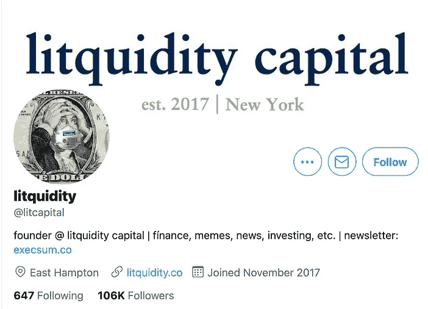
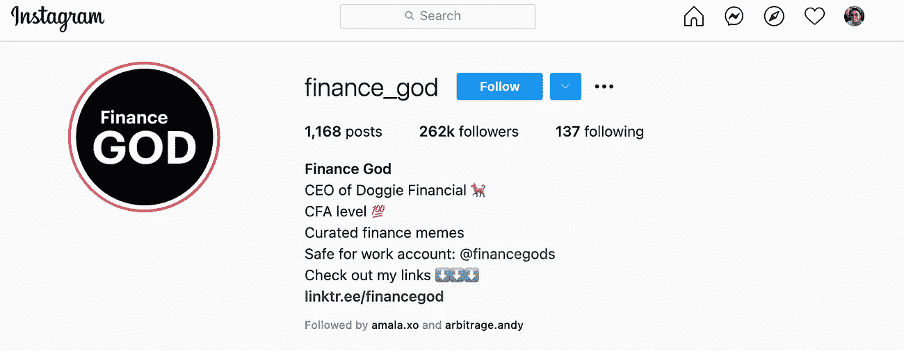
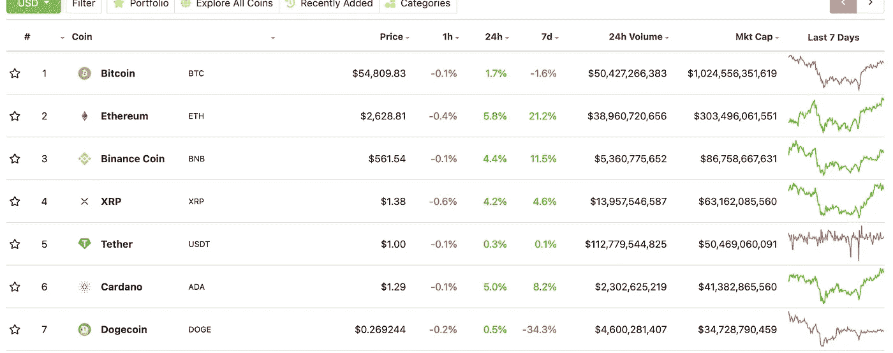
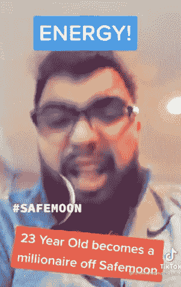
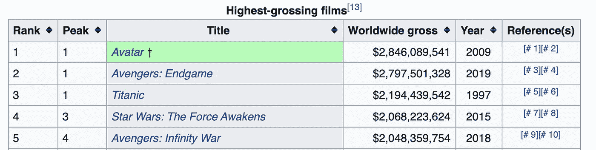
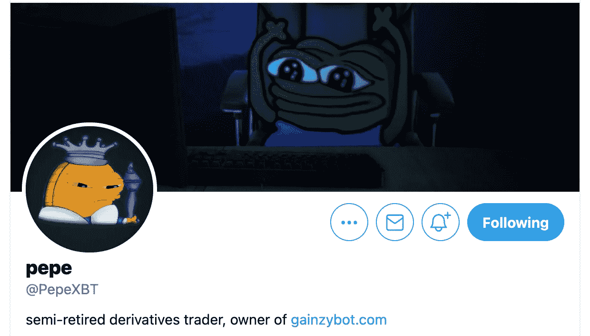
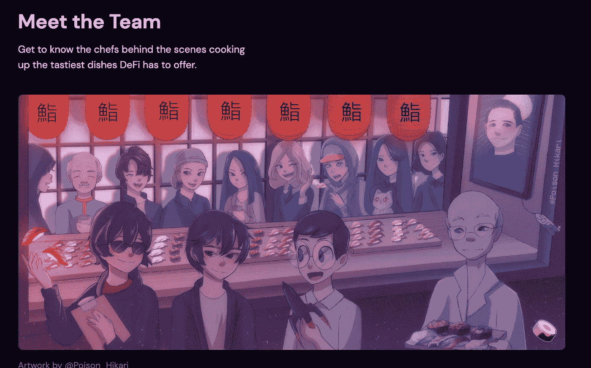

# 金融的迷因化

> 原文：<https://medium.com/nerd-for-tech/the-meme-ification-of-finance-c8237f55aa6c?source=collection_archive---------10----------------------->

## 像金融这样一个无聊的话题是如何变成互联网的

不知道什么时候发生的。

也许是在今年一月，当时 GameStop 和 meme stonks 是所有人都可以谈论的话题。

可能是 2017 年 stonks meme 出来的时候(见上图)。

也许是在 2008 年 Satoshi Nakomoto 发表比特币白皮书——渗入互联网文化的时候。

无论何时，在某个阶段，金融变得很酷。

或者可能不酷，但它成为了一个迷因。这变得很有趣。它成为 Reddit、Twitter 和其他网站上互联网原生社区的基础。

因此，我们现在在 Twitter 和 Instagram 上有了与金融相关的 meme 账户，拥有成千上万的粉丝。

我们创建了拥有 1000 万订户的 r/wallstreetbets，在整个 Reddit 中拥有前 5 名活跃用户群。

我们推动了市场，1 月底/2 月初，BAANG meme stonks(黑莓、AMC、AMD、NAKD 和 GameStop)的股价飙升——促使国会举行听证会，邀请了一位笔名为 u/DeepFuckingValue 的 Redditor 与弗拉德·特涅夫(Robinhood 的首席执行官)和肯·格里芬(Citadel 的首席执行官)同台。

迷因允许像 r/wsb 社区成员这样的散户交易者互相炒作——这是一种反对 2008 年 GFC 从我们手中夺走的对冲基金的战斗口号。

我们让 Dogecoin 成为排名前五的加密货币——尽管它在“迷因能量”之外没有任何用途。

来源: [Coingecko](https://www.coingecko.com/en)

我们有 Zoomer TikTokers 发布关于 SafeMoon 等替代硬币的内容——在几天内超过了几倍。

资料来源:抖音

回想起来，看到像飞蚁一样古板的东西已经变成了一场互联网上的文化迷因运动——一场具有现实世界影响的运动，创造了百万富翁，蒸发了毫无戒心的散户投资者的毕生积蓄，真是超现实。

来自 [Digital Native](https://digitalnative.substack.com/p/memes-and-the-atomic-units-of-culture) 的 Rex Woodbury 称模因为“文化的原子单位”,很明显，这一新的模因金融浪潮正在与数百万人产生共鸣。

# 加密是互联网固有的钱

这纯粹是推测，但我认为加密是我们寻求金融服务迷因化的一个巨大组成部分。

当然，也许人们只是感到无聊，转而在被关在家里的时候，通过交易毒品来获取多巴胺。

当然，也有@financegod 和 r/wsb 这样的非加密迷因社区，它们甚至不谈论加密。

但我认为，加密为互联网将金融作为一个值得迷因的话题铺平了道路。

我这么说是因为加密是互联网上的货币形式。

所有其他形式的货币或金融服务在某种程度上仍然与现实世界息息相关——银行、经纪公司、股票市场。

密码是纯数字的。

有了互联网固有的特性，加密更适合嵌入到互联网的文化中。

互联网总是有能力将以前的边缘行为聚集到主流亚文化中。

这就是为什么以前的“书呆子”活动，如动漫、游戏和漫画书中的超级英雄现在成为了国际运动。

游戏是 CAGR 的一个数字产业，有可能在 T2 的 5 年内市值达到 2500 亿美元。漫威已经连续发行了票房收入数十亿美元的电影，这是以前只有《阿凡达》和《泰坦尼克号》才能做到的。

来源:维基百科

很容易看出金融——尤其是互联网金融——是如何融入这些边缘群体的。

游戏玩家和创作者需要获得报酬——看看 Twitch 和 Patreon 以及 OnlyFans 的成功。

因此，金融和互联网文化的融合形成了一个充满迷因的加密环境。

假名在加密中也非常重要。

毕竟，crypto 的创始人甚至没有真名，Satoshi Nakomoto 是比特币白皮书背后的个人/团队的化名。

加密是一场基于隐私的运动——通过拥有用户拥有的数据来保护数据隐私，以及防止第三方访问个人财务信息的隐私。

因此，加密人不得不转向其他方式来展示他们的身份，他们依靠“文化的原子单位”，使用互联网原生图标作为他们面对世界的数字面孔——主要是面对 Discord 和 Twitter。

人们想成为衍生品交易员，成为 T4 的青蛙佩佩

SushiSwap 团队希望被重新塑造成动漫角色

资料来源:sushi.com

每一个隐藏的不和谐都有一个#迷因频道——当然是针对文化的。

Uniswap Discord 上的迷因

在成为主流或者甚至出现在 r/wsb 上之前，密码社区已经想出了像 HODL、巴格霍尔德、钻石手、BTFD 和希尔这样的词。

迷因成了这些秘密社区的一种身份形式——以及交流和文化。

# 结束语

这不是我最有说服力的博文，但我只想大声疾呼这些天来我对金融的观察——这是一个在互联网文化中更加根深蒂固的缓慢过程。

在这个话题上，我会给你们两个比我聪明得多的人的名言:

创始人基金的约翰·卢蒂格:

> 今天，社交媒体是财富的放大镜……社交媒体充当了情感协调层，增加了文化的[振幅和频率](https://www.piratewires.com/p/jump-23d06adb4cb7)。嫉妒、怨恨和 fomo 比以往任何时候都更具传染性和威力，尤其是当每个人在一级防范禁闭后整天都在电脑前的时候。
> 
> Instagram 对身体形象的影响，wallstreetbets 和 Twitter 对银行账户形象的影响。

一个不需要介绍的人:

*如果你认为这篇博文值得你花 5 分钟来阅读，请帮我在下面鼓掌(最多 50 次)或者与一个会从这篇内容中受益的朋友分享。非常感谢！*