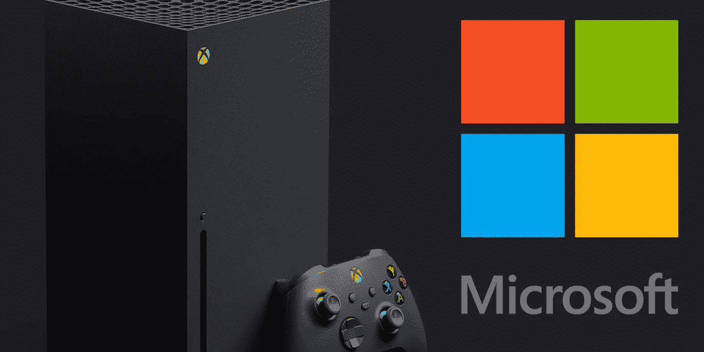

# 微软游戏责任

> 原文：<https://medium.com/nerd-for-tech/the-microsoft-game-responsibility-411d797b7c4d?source=collection_archive---------21----------------------->

游戏开发者、艺术家和设计师对技术和游戏充满热情。他们非常有创造力，技术娴熟，工作勤奋，但他们经常以更好地营销他们制作的游戏为代价，因为营销和商业管理不是他们最关心的事情。这使得他们落在一些利用 MBA 技能与他们的创意作品讨价还价的骗子手里。现在是游戏行业的参与者也关心企业管理和营销的时候了，因为由于个人电脑的革命，游戏已经成为一个行业，这使得 PC 成为一个游戏媒体和一个提高游戏机性能和构建游戏的工具。几个游戏工作室已经诞生，许多游戏大受欢迎，使得游戏玩家的观众规模更大。

游戏玩家群体的规模仍有增长空间，因为很多像我一样的人非常愿意有更多的时间和动力重新开始游戏，越来越多的人愿意开始游戏，即使他们已经老了。那么，增强游戏工作室的能力就很重要，如果这个行业的所有参与者，从平台所有者、主机制造商到游戏工作室，联合起来创造更有创意和更受欢迎的游戏体验，这将变得更加容易。像微软这样的大型科技公司在这一过程中发挥了重要作用，我同意，自从 Windows 的第一个版本以来，这就是微软试图取得成功的原因。该公司整合到其公司产品组合中的游戏技术和工作室的列表可以证明这一点，而不必说任何关于 Xbox 越来越高性能的持续创新。

游戏行业的重大转变和扩张是我们应该寻求的，我相信如果我们利用社区的力量，并强烈表明像我们这样的人做像游戏一样的事情，这更有可能发生。我愿意说像我们这样的人做这样的事情，这是在一个社区中生活的咒语。

我从来没有忘记游戏行业，因为我很早就在 PC 上玩游戏，并与世嘉大师合作。游戏就是这样。一旦我们喜欢它们，我们就离不开它们，因为时间和限制，我们只是试图忽略它们。那么，作为游戏行业的参与者，我们的核心目标是打破这些限制，让人们有时间玩游戏，因为玩游戏有助于学习，而学习反过来又有助于提高生产力，从而实现增长。如果我们做到了这一点，我们将在快乐中成长。

我希望我们会，我也在尽我最大的努力。