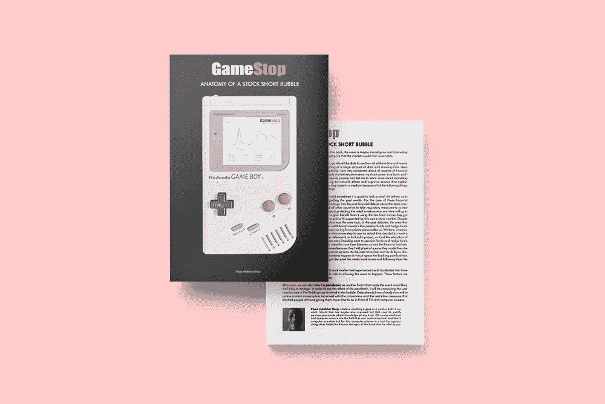
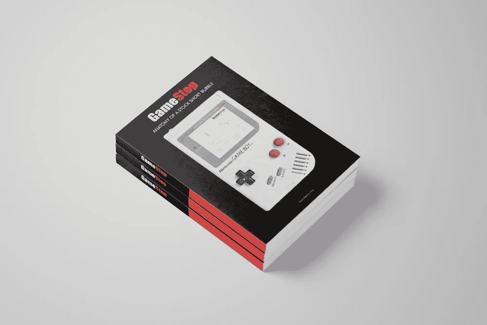
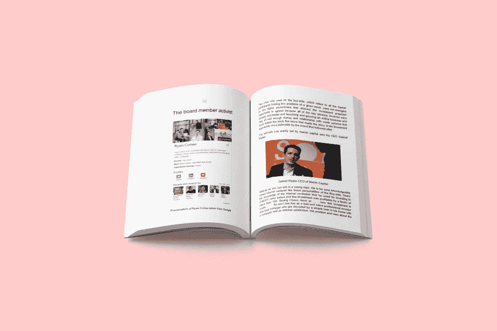
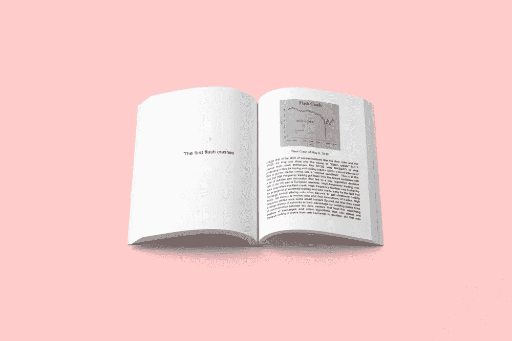
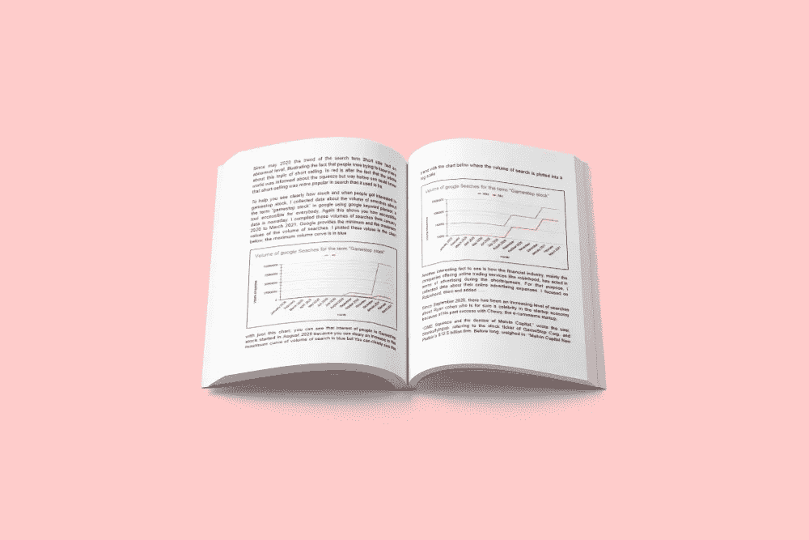
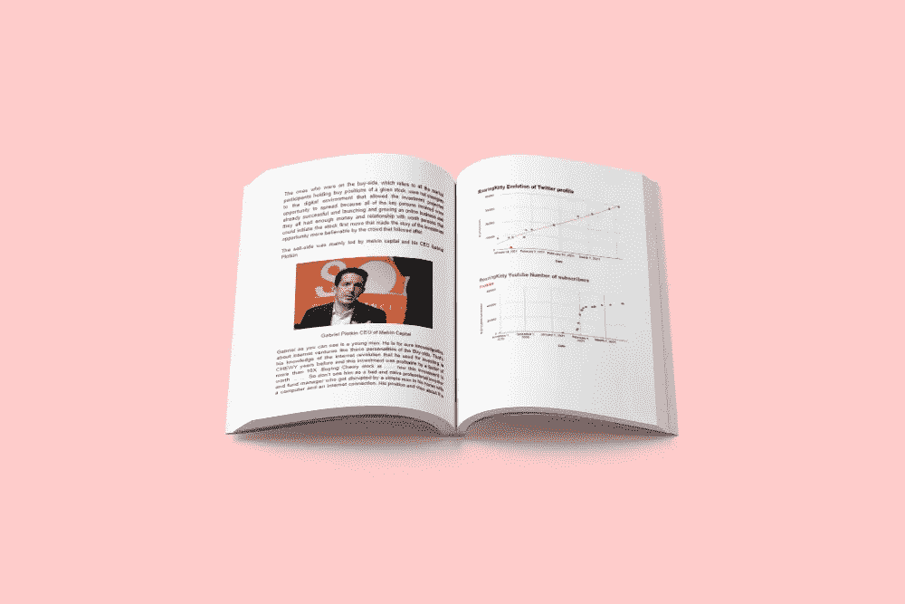
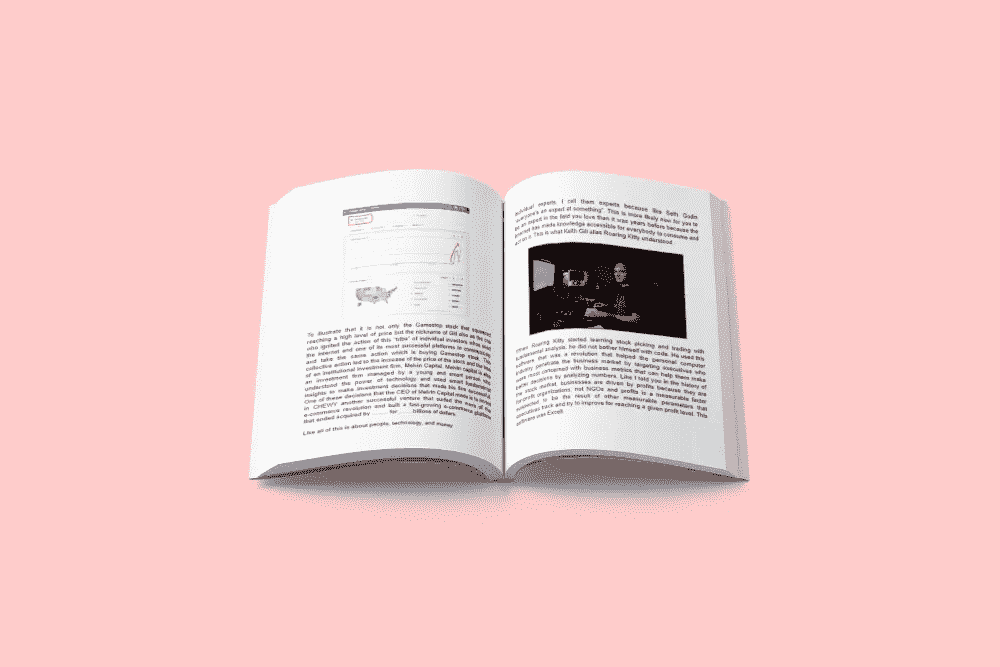
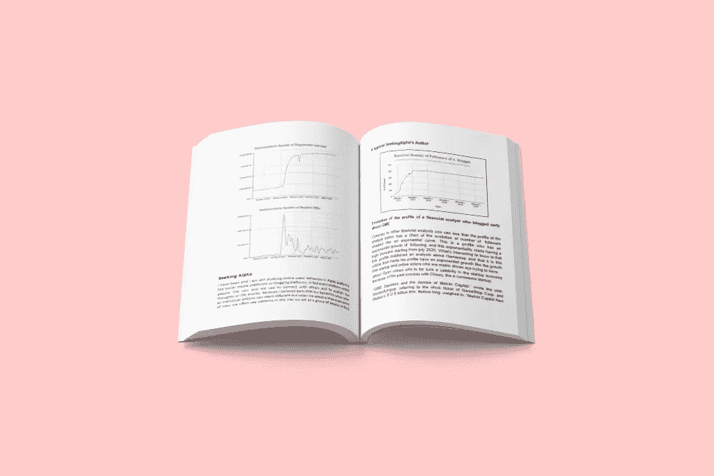
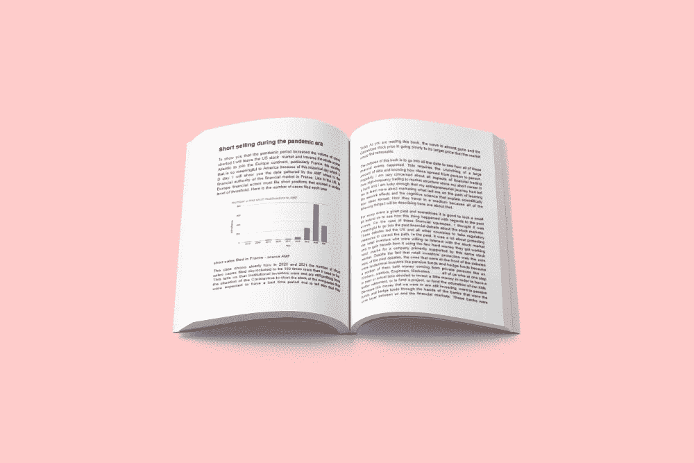
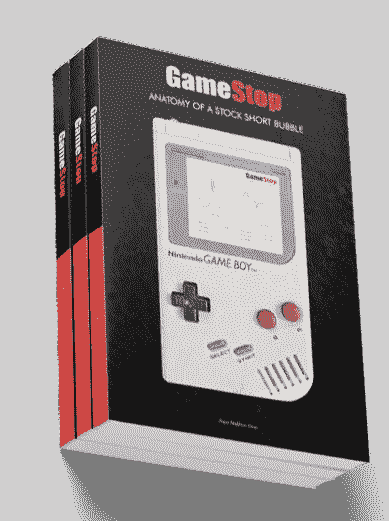

# 最小的组织单位

> 原文：<https://medium.com/nerd-for-tech/the-minimal-organizational-unit-996ef84a9682?source=collection_archive---------24----------------------->

部落是生物的最小组织单位，不管它们是人类还是动物，但是我们，人类，正试图将它分解成家庭，但是当家庭通过彼此联系形成部落时，他们会更成功。如果我们减少了一个社会单位的元素数量，我们就减少了发展新的交流形式和更加同步的机会，而我们之间的同步有助于我们更好地采取行动，推动我们前进。

工业化时代让我们变得自私，通过生产大量商品和创造大量需要我们完成的有偿工作，把我们变成了消费的生物。我们用工作赚来的钱购买了我们生产的商品，我们开始在短时间内竞相凸显我们之间的差异，这可能是因为差异化是老牌公司的战略，它们努力吸引我们的注意力和资金。这段时间短到足以让我们变得自私，把我们的社会单位简化为家庭。在乎的是我和我的家人。但是工业化的目标是标准化和更快地生产。你可以看到，我们的目标与我们创建的系统正好相反。现在一切都几乎标准化了。如果你想要某样特定的东西，你会以高价购买，而变得特定并不容易，因为这需要你变得富有。从统计学的角度来看，富有就是试图将自己定位在这条正态分布曲线的边缘

自从我们第一次开始社交和组建团体，这种组织行为就与我们联系在一起。我们的社会化过程是由我们发展的交流技能点燃的。交流是社会化的抑制因素之一，因为它能使行动同步。你可以通过蚂蚁、蜜蜂或任何其他社会生物的行为来了解这一点。

碰巧的是，我正在研究我们如何在部落中利用互联网组织自己，以及我们如何在部落中产生如此大的影响，比如使股票价格从 4 美元涨到 500 美元。

今天，humble hands 帮我重新设计了我即将出版的书《Gamestop 剖析股票空头泡沫》的封面和登陆页。这是为那些想成为早期读者的人准备的登录页面。[这里](http://clickmetertracking.com/nglj)

这是新的封面和内部预览

