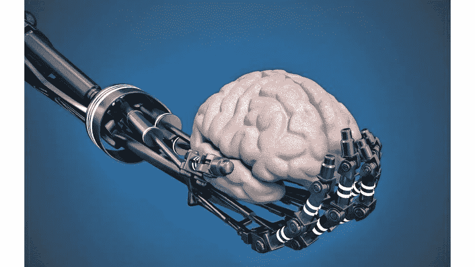
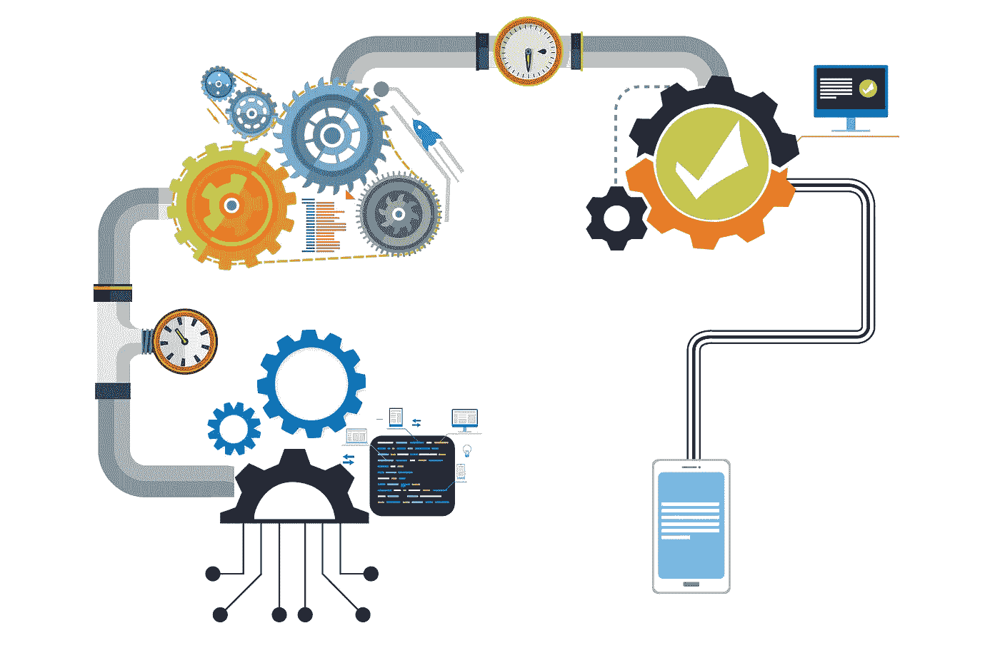

# ML 训练——机器学习管道

> 原文：<https://medium.com/nerd-for-tech/the-ml-train-9eac0f6c7f2d?source=collection_archive---------18----------------------->

如果你在软件行业(或者不是！)，你肯定经常听到机器学习、深度学习、人工智能这样的术语。如果你对每个人和任何人谈论这个领域感到沮丧，你点击了错误的文章。但是如果你对这个领域感兴趣，你可以继续阅读。

现在，互联网上有大量的信息解释机器学习到底是什么，事实上有一些针对婴儿的书籍解释神经网络，所以我不打算重复相同的内容。

> "机器学习是赋予计算机学习能力而无需明确编程的领域."
> 
> ~亚瑟·塞缪尔

鉴于该领域的蓬勃发展，几家公司已经开始适应和应用机器学习来解决几个问题，这导致了对机器学习工程师(或数据科学家)的更高需求。它成了收入最高的工作，导致一些人转向这个领域或提高他们现有的技能。

你没有意识到，但如果你能做到这一点，你已经是一名 ML 工程师了。开个玩笑！

一些在线课程和教程教你如何实现一个 ML/DL 模型。你按照教程，预测房价或一种花的种类，然后*瞧，*你建立了一个 ML/DL 模型。但是，在建立一个可以在现实世界中使用的预测模型的整个过程中，还有很多事情要做，申请该领域相关职位的候选人应该知道这些。

让我们从 ML 列车的旅程开始吧..

## 数据收集

数据对于机器学习就像燃料对于汽车一样🚗

数据就是一切，今天一切都是数据。连接到互联网的设备比人类还多。那么，我们为什么还要担心收藏呢？我们不是已经有了这么多数据，才产生了大数据问题吗？嗯，我们确实有很多很多的数据，但是这些数据并不一定是有组织的/结构化的，或者与我们用来进行预期预测的数据不相关。虽然许多黑客马拉松/竞赛为您提供了干净且可访问的数据，但现实生活中的项目在这一阶段却举步维艰。由于获取构建模型所需的数据需要花费大量时间，因此许多模型甚至被丢弃。

让我们考虑一个项目，我们想用系统玩石头剪子布，系统需要通过摄像头对人的动作进行分类。现在，肯定有几个数据集包含手势的图像，但我们在这里特别寻找 3 个手势。在这种情况下，您可以浏览可用的数据集，找出所有与您相关的数据，并自己扩充或添加更多数据。

市场上也有一些工具可以帮助收集数据。你可以在下面找到一些，

*   https://www.octoparse.com/
*   [https://github.com/tirthajyoti/pydbgen](https://github.com/tirthajyoti/pydbgen)
*   https://www.mozenda.com/
*   【https://www.mockaroo.com/ 
*   [https://lionbridge.ai/](https://lionbridge.ai/)
*   [https://www.mturk.com/](https://www.mturk.com/)
*   [https://appen.com/](https://appen.com/)

这是我们收集数据的方法，

*   我们可以使用现有的数据(有时你可能会幸运地得到你想要的)
*   我们可以调整现有的数据，使用那些为我们提供所需信息的数据
*   有几家公司的唯一目的就是为你收集数据
*   自己收藏吧

一些开源数据集:

*   [https://www . freecodecamp . org/news/https-medium-freecodecamp-org-best-free-open-data-sources-any one-can-use-a65b 514 b 0f 2d/](https://www.freecodecamp.org/news/https-medium-freecodecamp-org-best-free-open-data-sources-anyone-can-use-a65b514b0f2d/)
*   [https://www.kaggle.com/datasets](https://www.kaggle.com/datasets)
*   [https://github.com/awesomedata/awesome-public-datasets](https://github.com/awesomedata/awesome-public-datasets)
*   [https://research.google/tools/datasets/](https://research.google/tools/datasets/)

请记住，数据的质量是非常重要的，质量差的数据可能会导致可怕的经历，就像多米诺骨牌效应一样。所以当你收集数据时，试着解决这些问题，

*   我们需要多少数据？我们能收集多少？
*   我们应该收集哪些数据？哪一个能真正做出贡献？
*   你会把它存放在哪里？你会如何储存？用什么结构/格式存储它？您将如何使其适用于 ML 模型？
*   您需要什么样的硬件/软件设置来收集所需的数据？
*   您的数据包含所有可能的情况吗？确保收集边缘案例。

在收集数据时，你还需要知道如何标注数据。是否可以边收边做，或者以后再做？有时你还必须花很多时间(尤其是在视觉相关的项目中)来注释数据。

一些帮助贴标签的工具可以在找到。

## 数据处理

当你不得不做一道菜时，你从市场上得到所有的原料，你会把它们都倒掉然后吃吗？(希望不是)当然不是！那会很难吃。在烹饪之前，你需要切碎、碾碎或者浸泡一些配料。类似地，需要对数据进行处理并使其与模型相关联，以便从中获取知识。

在此阶段，您可能需要检查要素并检查与目标变量的相关性、估算缺失值、归一化、缩放、派生新要素、减少或合并某些要素(维度减少)、处理分类要素、更正损坏的值、为训练和测试目的拆分数据。对于图像，您可以翻转、调整大小、转换为灰度、裁剪、模糊，甚至增加数据量。

市场上有一些工具和库可以执行数据转换，比如 numpy、pandas、opencv、nltk 等。你甚至可以使用一些分析库，如 [pandas profiling](https://github.com/pandas-profiling/pandas-profiling) 来找出关系，并获得一些关于数据的见解。

## 构建/训练 ML 模型

欢迎来到大家最兴奋的 bogie，也就是机器学习中的黑匣子，它正在根据收集到的数据训练模型。虽然这是最难理解(大量的数学和统计)和调试的，但由于有了库和 API，它是最容易实现的。在训练模型之前，您需要回答几个问题，

*   应该使用哪个指标对模型进行评级？
*   我们应该使用哪个模型？
*   将数据分成训练、验证和测试的比例应该是多少？
*   有多少可用资源，有哪些可用资源？

训练模型是一个耗费时间和金钱的过程，尤其是对于像图像和视频这样的多维数据。调优模型也是很重要的一部分。您可以使用自动化工具来训练或调整模型，下面列出了一些工具:

 [## 概述-3.32.0.4 H2O 文档

### 欢迎来到 H2O 文档网站！根据您感兴趣的领域，从边栏中选择学习路径，或者…

docs.h2o.ai](http://docs.h2o.ai/h2o/latest-stable/h2o-docs/index.html)  [## TPOT

### TPOT 的文档，这是一个 Python 自动机器学习工具，它使用…

epistasislab.github.io](http://epistasislab.github.io/tpot/)  [## AutoKeras

### AutoKeras:基于 Keras 的 AutoML 系统。它是由德克萨斯 A&M 大学的数据实验室开发的。AutoKeras 的目标…

autokeras.com](https://autokeras.com/) 

## 部署应用程序(推理)

所以你得到了数据，你训练了模型，还有最后一步，每个软件都必须经历。生产阶段！在这一阶段，重点是让最终用户能够在不影响模型准确性的情况下，以更快的运行速度进行预测。需要回答的几个问题是:

*   线上还是线下？哪一种可行更快？
*   它的可扩展性如何？在任何给定时刻，它可以执行多少个实例？在什么时候？
*   你将如何升级模型？(CI/CD)
*   兼容哪些模型格式？
*   需要哪些硬件资源？

这个阶段需要更多的 API、硬件、DevOps、前端知识。

您可能需要优化模型，以在不影响准确性的情况下减少模型的大小或执行时间。修剪、量化等技术。是用来处理这种情况的。

一些广泛使用的工具:

 [## MLflow -机器学习生命周期的平台

### 机器学习生命周期的开源平台 MLflow 是一个开源平台，用于管理机器学习生命周期

mlflow.org](https://mlflow.org/) 

我们现在到达目的地了！