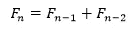
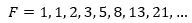
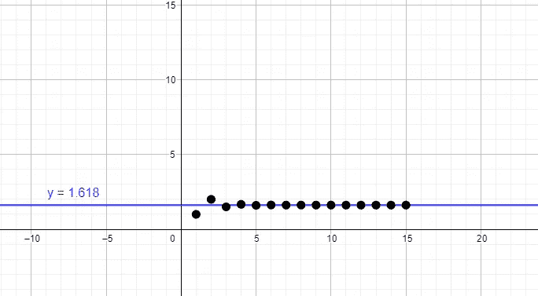
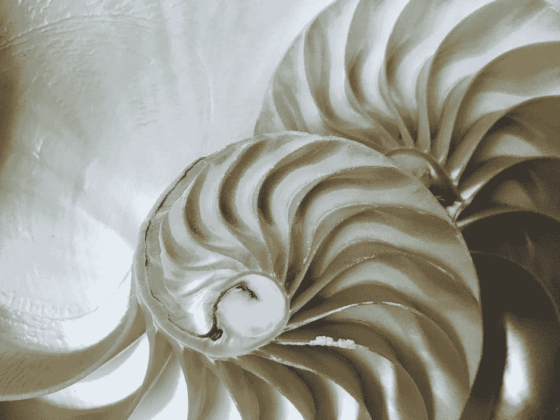
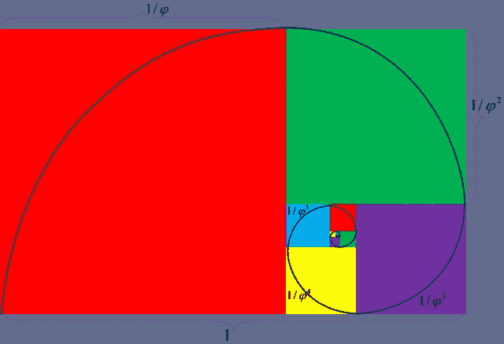
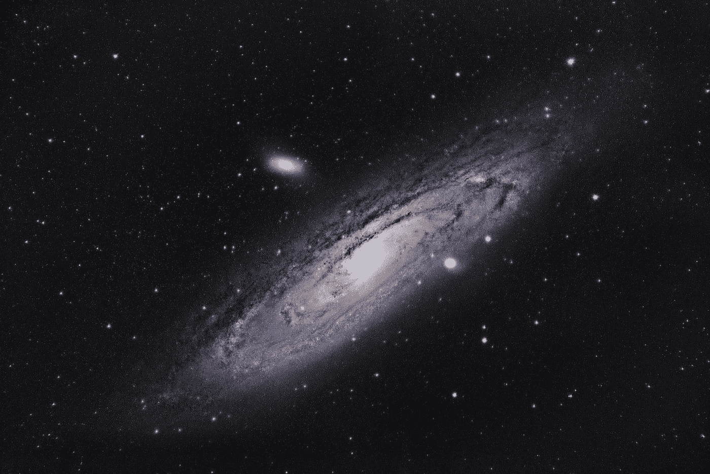
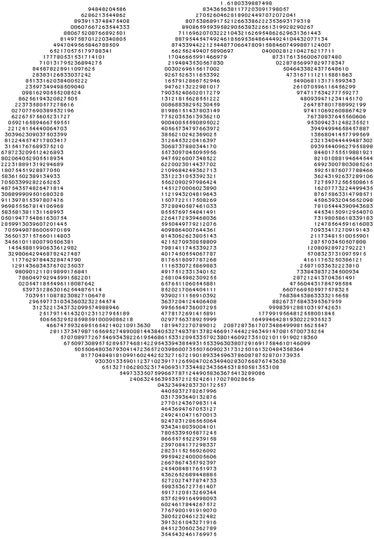

# 数学中最美的数字

> 原文：<https://medium.com/nerd-for-tech/the-most-beautiful-number-in-mathematics-ff10cc424faa?source=collection_archive---------0----------------------->


在 [Unsplash](https://unsplash.com?utm_source=medium&utm_medium=referral) 上由 [Ludde Lorentz](https://unsplash.com/@luddelorentz?utm_source=medium&utm_medium=referral) 拍摄的照片

## 1.618…

黄金比例。神圣的比例。数字 1.618…有许多不同的名字。然而，数学家们大多称之为 *phi* 。在我们周围的任何地方，我们都能看到这个美丽的数字。这个数字本身并不特别，而是围绕着它的所有其他美丽的物体。从数学上讲，这个数字可以表示为:


左边的符号是希腊字母 *phi* 。如果你注意到，这也是方程 x -x-1 的正根。在斐波纳契数列中可以发现这个数字的一个非常有趣的性质。斐波纳契数列基本上从 2 个 1 开始，然后接下来的数字可以表示为前 2 个数字的总和。递归地，它可以表示为:



在数值上，它可以表示为:



在这个序列中，如果你将每一项除以它前面的项，你会注意到商开始慢慢接近 *phi* 。我们可以构建一个图表来形象化这一点。

我没有手动计算商，而是编写了一个简单的 python 代码来计算商:

代码:

```
num_1 = 1
num_2 = 1
fib_no = [1, 1]
update = 0
flag = 0
while update < 14:
    if flag == 0:
        num_1 += num_2
        fib_no.append(num_1)
        flag = 1
    elif flag ==1:
        num_2 += num_1
        fib_no.append(num_2)
        flag = 0
    update += 1
print(fib_no)
quo_list = []
for ind in range(0, len(fib_no)-1):
    quo = fib_no[ind+1]/fib_no[ind]
    quo_list.append(quo)
print(quo_list)
```

输出:

```
[1, 1, 2, 3, 5, 8, 13, 21, 34, 55, 89, 144, 233, 377, 610, 987] [1.0, 2.0, 1.5, 1.6666666666666667, 1.6, 1.625, 1.6153846153846154, 1.619047619047619, 1.6176470588235294, 1.6181818181818182, 1.6179775280898876, 1.6180555555555556, 1.6180257510729614, 1.6180371352785146, 1.618032786885246]
```

使用这些数据，我们将构建一个图表，在 x 轴上显示被除数的指数，在 y 轴上显示商(最多 3 位小数):



作者用 GeoGebra 绘制的商与指数的关系图

从这张图上可以清楚地看到，商数都接近 y = 1.618。这就是*φ*的传统数学由来。尽管φ*和φ*的推导非常精彩，但这个数字在自然界中更常见。由于它存在于地球上几乎每一个美丽或优雅的事物中，phi*被称为“神圣比例”,因为人们相信只有上帝才能在每一个美丽的事物中加入这样的数字。Phi 也被认为是自然界的基本构件之一。让我们来看几个可以明显看到*φ*的例子。*

当人们谈论φ(T21)时，最常举的一个例子是在向日葵的中心。


劳拉·吉尔克里斯特在 [Unsplash](https://unsplash.com?utm_source=medium&utm_medium=referral) 上的照片

正如你在这张图片中看到的，向日葵的种子以相反的螺旋生长。现在，如果你计算连续螺旋的直径，然后除以它们，你会得到*φ*！很聪明，不是吗？既然我们现在正在谈论螺旋，让我们来看看这种叫做鹦鹉螺的海洋动物。鹦鹉螺号有一个非常有趣的外壳，如果你看看下面两张照片，你就会明白我的意思了:



左:由[肖恩·劳](https://unsplash.com/@breadboyshaun?utm_source=medium&utm_medium=referral)在 [Unsplash](https://unsplash.com?utm_source=medium&utm_medium=referral) 上拍摄的照片，右:由[朱利亚·梅](https://unsplash.com/@giuliamay?utm_source=medium&utm_medium=referral)在 [Unsplash](https://unsplash.com?utm_source=medium&utm_medium=referral) 上拍摄的照片

左图是鹦鹉螺号的外观。从外面看，鹦鹉螺号并不特别。但从内部看，你会在它的壳里看到一个壮观的螺旋图案。更重要的是，如果你划分连续螺旋的直径，就像我们对向日葵所做的那样，你将再次获得*φ*作为商！有趣的是，黄金比例经常以下列形式出现:



照片由[维基共享资源](https://commons.wikimedia.org/wiki/File:Golden_Ratio.png)提供

如图所示，如果你将较大方块的长度除以前面较小方块的长度，你将再次得到*φ*。通常，你会看到这条曲线叠加在上面我们看到的向日葵和鹦鹉螺的图像上。

银河系真的很漂亮。银河系的辐射臂一直吸引着人们的目光。然而，因为它是一个螺旋，像其他例子一样，你认为划分直径会产生*φ*吗？如果你认为，那么你是对的！事实上，当你将星系中螺旋的连续直径相除时得到的商就是黄金分割率。毫无疑问，我们的祖先看到到处都有这个数字会肃然起敬，并相信它是上帝自己放在那里的。



在 [Unsplash](https://unsplash.com?utm_source=medium&utm_medium=referral) 上由 [Arnaud Mariat](https://unsplash.com/@arnaudmariat?utm_source=medium&utm_medium=referral) 拍摄的照片

飓风是世界上最致命的自然灾害之一。但是，你从上面看过它们的卫星图像吗？如果你见过，你会知道飓风看起来像一个螺旋。毫无疑问，这一次，如果你把每个螺旋的直径分开，你会再次得到φ。在自然界中如此多次地看到这个数字，确实表明这个数字是一个极其美丽和优雅的数字。


由 [NASA](https://unsplash.com/@nasa?utm_source=medium&utm_medium=referral) 在 [Unsplash](https://unsplash.com?utm_source=medium&utm_medium=referral) 上拍摄的照片

在蜂箱中，众所周知，雌蜂总是比雄蜂多。然而，真正特别的是，如果你用雌蜂的数量除以雄蜂的数量，你将**总是**剩下*φ*！是不是很神奇？神圣的比例也可以在自然之外看到，在我们自己的身体里！“哪里？”，你可能会问。好吧，让我们来看看！

如果你用你的肩膀到手指的长度除以你的手肘到手指的长度，你又得到了*φ*！同样，用你的臀部到脚趾的距离除以你的膝盖到脚趾的距离，毫不奇怪，你又得到了*φ*。在人体内可以看到更多黄金比例的例子。用丹·布朗的国际畅销书《达芬奇密码》中罗伯特·兰登的话说:

> 我的朋友们，你们每一个人都是对神圣比例的致敬。

毫不奇怪，在看到这个数字的美丽后，许多不同的艺术家、建筑师和音乐家开始在他们的作品中展示这个数字。从达芬奇到米开朗基罗，从贝多芬到莫扎特，所有这些人都严格遵循神圣比例。这个数字出现在许多纪念碑上，如埃及的大金字塔、希腊的帕台农神庙，甚至像纽约的联合国总部这样的现代建筑。传说著名的小提琴制造家族斯特拉迪瓦里使用 *phi* 作为标记小提琴 f 孔的基础！有这样的传奇人物在作品中使用黄金分割比例，毫无疑问 *phi* 的确是数学中最美的数字。

所有这些例子都表明了黄金比例在我们所到之处随处可见。phi 这个数字有着优雅的数学渊源，它超越了国界，延伸到我们生活中的许多不同领域。它向我们展示了只要严格遵循黄金比例，你就能真正创造出美的物品。



照片由[维基共享资源](https://commons.wikimedia.org/wiki/File:Phi_with_golden_ratio_digits.PNG)提供