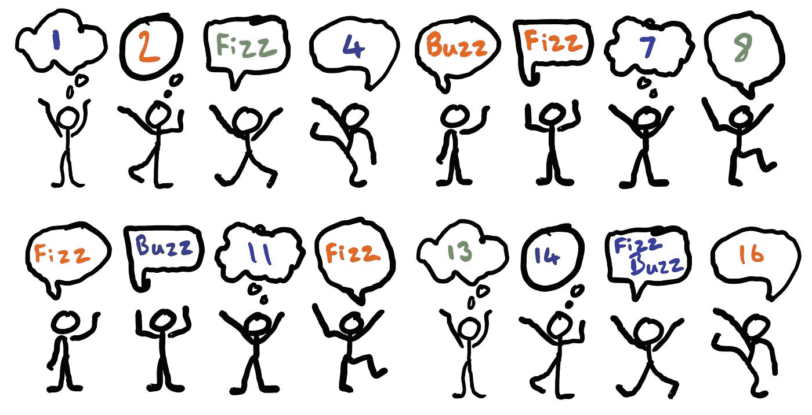
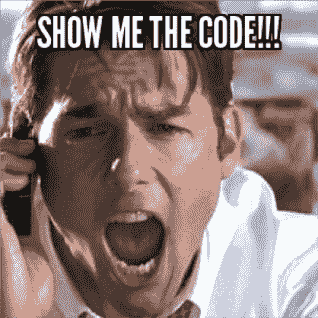

# 最著名的编码面试问题

> 原文：<https://medium.com/nerd-for-tech/the-most-famous-coding-interview-question-ee6d4ff338c4?source=collection_archive---------4----------------------->


# 最著名的面试问题是什么？

FizzBuzz 是最流行的编码问题，也许也是最容易的问题之一。

对于那些不知道的人，这里是问题陈述:

> *写一个短程序，在新的一行中打印从 1 到 100 的每个数字。对于 3 的每个倍数，打印“Fizz ”,而不是数字。对于 5 的每个倍数，打印“Buzz”而不是数字。对于同时是 3 和 5 的倍数的数字，打印“FizzBuzz”而不是数字。*



看起来很简单，对吗？，但是**你处理这个问题的方式揭示了你的编程技巧**

对于像我一样的大多数工程师来说，FizzBuzz 是我们首先解决的编码问题之一，但为什么它仍然被用作面试问题，即使是在谷歌这样的公司？

答案:**解决 FizzBuzz 比你的编程技能更能让面试官看到你的能力**

你对这个简单问题的解决方案决定了你是一个代码猴子还是一个有经验的工程师。

根据 wiki.c2.com 的说法,“嘶嘶嗡测试”是一个面试问题，旨在帮助筛选掉 99.5%的编程求职者，他们似乎无法从湿纸袋中找出编程的方法。

它需要你理解问题，运用逻辑想出解决方案，然后把这个翻译成代码。

有时候，即使是最简单的问题也会变得棘手。FizzBuzz 面试问题就是如此。

# 解决办法

这些简单问题的想法是检查你的编程风格，而不是检查复杂性或其他任何东西。

像其他编码问题一样，这个特殊问题的解决方案有很多，但并不是所有的都被认为是好的和最优的解决方案。

*也不要考虑复杂性，因为你只是从 1 到 100* *循环，那么最佳答案是什么呢？*

在继续之前，我想让你展示几个月前我在的 [**推特**](https://twitter.com/apoorv__tyagi/status/1308114075583311872) **上问这个问题时得到的**可能的解决方案🔽****

我得到的所有解决方案都给出了预期的结果。唯一的区别是它们的书写方式

这是我的方法👇



我想到的最直观的解决方案是:

```
for var in range(1,101):
    if i%3==0 and i%5==0:
        print('FizzBuzz')
    elif i%3==0:
        print('Fizz')
    elif i%5==0:
        print('Buzz')
    else:
        print(var)
```

但是你能找到如何改进的方法吗？？

让我们假设面试官说，当数字被 7 整除时，你需要改变代码中所有的 5，而不是 5。

在这样的小代码中，这似乎不是一个大的挑战，但是对于一个大的代码库，你需要注意可能出现的变化

> 在编码时，你应该总是考虑以后会发生什么变化&你的代码将如何适应它

仅仅为了适应另一个条件而回头修改多行代码并不是一个好的做法。

所以我们在这里可以做的是像这样调整我们的代码:

```
for var in range(1,101):
    output=""
    if i%3==0:
        output+='Fizz'
    if i%5==0:
        output+='Buzz'print(var if output=="" else output)
```

或者更简单:

```
for i in range(1,101):
    fizz = 'Fizz' if i%3==0 else ''
    buzz = 'Buzz' if i%5==0 else ''
    print(f'{fizz}{buzz}' or i)
```

*在这里，我们将最终的字符串值存储在一个名为 output 的变量中。*

如果输出为空，则意味着上面没有传递条件，因此只需打印`var`的值。

如果额外的条件出现，这看起来更干净/可读。 *现在，即使我们必须将条件从 5 改为 7，我们也只需转到 5 是&的那一行。*

此外，如果出现另一个条件，例如，如果我们为 2 添加一个新条件(假设当该数是 2 的倍数时，我们将打印' Tizz '，当该数可被 2、3 和 5 整除时，我们将打印' TizzFizzBuzz ')。我们将在不影响代码的整洁性和可读性的情况下添加它-

```
for variable in range(1,101):
    output=""
   if i%2==0:  #Adding new condition
        output+='Tizz'
    if i%3==0:
        output+='Fizz'
    if i%5==0:
        output+='Buzz'print(variable if output=="" else output)
```

总有改进的空间，我们可以进一步改进我们的代码，因为目前有这么多的`IF`语句，我们可以尝试用`SWITCH`替换它们，甚至使用`Spread Operator`或`Map Method`(在 Javascript 等中)。)来完全替换循环，但是我们将保留它以备将来使用。

现在，我们的目标是知道，如果在面试中问到这样的问题，不要只关注于解决正确答案，相反，我们也应该试着从代码的可维护性、可测试性和安全性方面考虑。确保你遵循基本的编程原则，如`KISS`、`DRY`和`YAGNI`，并尽可能地应用它们。

# 结论

Fizzbuzz 并不是决定候选人是否完美的银弹问题。顺便提一下:**我一直对一些筛选候选人的编码面试问题有一种复杂的感觉，以及它们到底有多有效**

但是正如我们所看到的，当程序员处理这个简单的问题时，我们可以学到很多关于他们的东西:

*   候选人关心**干净代码**吗？
*   候选人是否考虑过代码的**可维护性**？
*   候选人在接近解决方案时是否考虑到了**可扩展性**因素？
*   候选人在乎**模块化**吗？

如果你有任何问题或疑虑，请在下面的评论中告诉我。我很乐意回答你的问题！

感谢您的阅读:)

# 从 Web 开发开始？

查看 [**HTML 反应过来:终极指南**](https://gumroad.com/a/316675187)

这本电子书是一个全面的学习指南，通过大量易于理解的例子和经过验证的路线图，它将教你**成为一个自信的网络开发者所需要知道的一切**

有了这个链接，就可以拿**六折。**

[](https://gumroad.com/a/316675187)

HTML 反应:完整的网络开发电子书

*最初发表于*[*apoorvtyagi . tech*](https://apoorvtyagi.tech/the-most-famous-coding-interview-question)*。*