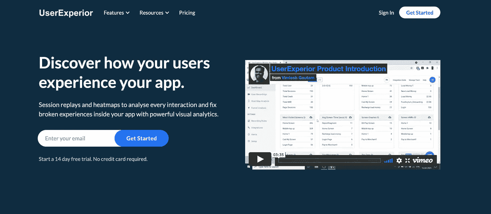

# 适用于您的移动应用的全新完美分析工具

> 原文：<https://medium.com/nerd-for-tech/the-new-and-perfect-analytical-tool-for-your-mobile-application-64a4541ef1d2?source=collection_archive---------19----------------------->

对于所有的开发者，在切换到 Firebase 或 Amplitude 之前，请尝试一下

UserExperior 分析工具

前天通过 LinkedIn 我见到了 UserExperior 团队，他们为你的移动应用开发了一个质量分析工具。我得到了 Vimlesh 的演示，他是 [**UserExperior**](https://userexperior.com/) **的创始人。**