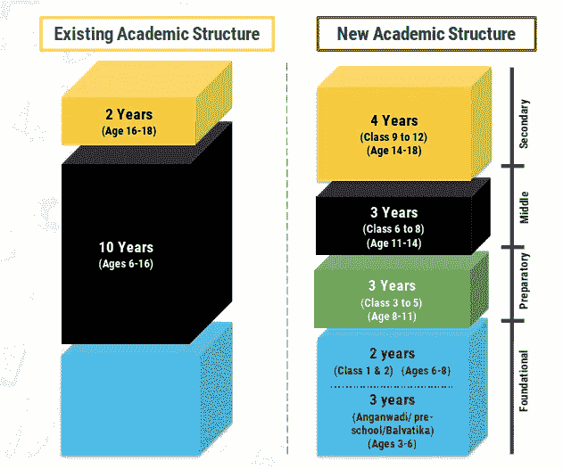

# 新的教育政策，为什么编码是强制性的，它将如何帮助孩子。

> 原文：<https://medium.com/nerd-for-tech/the-new-education-policy-and-why-coding-is-mandatory-and-how-it-would-be-helpful-for-kids-25854a7a6bd5?source=collection_archive---------0----------------------->

"我们今天在这个世界上看到的任何好处都是因为它背后有一颗教育的心."

照片由[思想目录](https://unsplash.com/@thoughtcatalog?utm_source=medium&utm_medium=referral)在 [Unsplash](https://unsplash.com?utm_source=medium&utm_medium=referral) 上拍摄

“印度的教育体系更糟糕……印度的教育体系专注于成为书呆子的技巧，也就是说，尽管提供了知识和创新，但如何获得分数。”大多数青年说。

但是现在情况完全相反，最后，印度的教育政策发生了变化。印度政府用 2020 年的新教育政策取代了 34 年前制定于 1986 年的国家教育政策。

> 尽管 2020 年是悲惨的一年，但印度还是发生了一些好事。

这项政策的细节在 6 月 29 日内阁批准后公布于众。据说，这项国家教育政策或 2020 年国家教育政策将是指导国家教育发展的全面框架。

**以下是 2020 年国家教育政策的要点:**

我将把政策分为两部分，即

> 1.低级教育:

*   **普及**从**学前班到**中学的教育，到 2030 年**学校教育毛入学率**达到 **100%。**
*   通过一个开放的教育系统，让两千万失学儿童重返主流。
*   目前的 **10+2 系统**将被**取代，由新的 **5+3+3+4** 课程结构取代，分别对应于**3-8 岁、8-11 岁、11-14 岁和 14-18 岁。****

*   它将把未被覆盖的 3-6 岁年龄组纳入学校课程，这是全球公认的儿童智力发展的关键阶段。
*   它也将有 12 年的学校教育，其中有 3 年的 Anganwadi/学前教育。
*   **10 级和 12 级考试将变得更容易，**测试核心能力而不是记忆的事实，所有学生都允许参加两次考试**。**
*   学校管理将会改变，将会有一个**新的认证框架和一个独立的权威机构**来管理公立和私立学校。
*   强调**基础读写和算术，**学校里的学术流、课外流和职业流之间没有严格的区分。
*   **职业教育**从**六班开始，以实习为主。**
*   至少在**五年级**用**母语/地区语言教学。不将任何语言强加给任何学生。**
*   使用 **360 度全面进步卡进行评估改革，**跟踪学生的进步以实现学习成果

> 2.高等教育:

*   到 2035 年，高等教育毛入学率将提高到 50%。此外，高等教育领域将增加 350 万个席位。
*   具有灵活课程的全人本科教育可以是 3 年或 4 年，在此期间有多种退出选择和适当的认证。
*   M.Phil 课程将会停办，所有本科、研究生和博士级别的课程都将是跨学科的。
*   **建立学分银行**以促进学分转移。
*   **多学科教育和研究大学(MERUs)，**与印度理工学院、印度管理学院一样，将成为印度全球标准的最佳多学科教育模式。
*   **国家研究基金会**将作为**最高机构**成立，以培养强大的研究文化，并在整个高等教育领域建设研究能力。
*   **印度(HECI)高等教育委员会**将作为整个高等教育的**单一伞式机构**，**医学和法律教育除外。**此外，HECI 将拥有**四个独立的垂直市场，即**

> 国家高等教育管理委员会(NHERC)进行监管，
> 
> 普通教育委员会(GEC)负责制定标准，
> 
> 高等教育资助局(HEGC)申请资助，
> 
> 国家认证委员会(NAC)进行认证。

*   **学院的附属关系**将在 15 年内**逐步取消**并将建立一个分阶段的机制来授予学院分级自主权。
*   经过一段时间后，每个学院都有望发展成为一个自主授予学位的学院或大学的成员学院。

> 每个人都应该知道如何给电脑编程，因为它教会你如何思考—史蒂夫·乔布斯

# 2020 国家教育政策最好的部分是什么？

这项新的教育政策早就应该实施了，但是**迟做总比不做好。**

虽然这个政策的每一部分都值得称赞，但在我看来，这个新经济政策最好的部分是**从 6 年级开始的强制性编码教学，**从目前的趋势来看，计算机科学的需求正处于高峰，并最终与日俱增。

我们生活在一个数字时代，技术在我们日常生活中扮演着重要角色。没有一个地方不存在技术/创新，所有这些都是由于计算机科学而成为可能。因此，为了平衡这个数字世界，我们必须专注于**编码技能、编程技能、实现、创新**，以及所有需要的东西。事实是，无论你选择哪个领域，你都必须通过计算机科学一次，我重复你选择的任何方向。

由 [Kelly Sikkema](https://unsplash.com/@kellysikkema?utm_source=medium&utm_medium=referral) 在 [Unsplash](https://unsplash.com?utm_source=medium&utm_medium=referral) 上拍摄的照片

现在问题来了…孩子们学习如何编码的需要并不重要，对吗？

嗯，在某种程度上这是真的，但事实是，从根本上理解这些技术如何工作，以及它们如何最终被定制为更强大的功能将会**增强孩子们对数字设备的体验**，并可能在他们以后的生活中变得更加重要。任何上过编程入门课的人都会告诉你，至少，它帮助他们理解了基本的编程逻辑、结构和设计。

众所周知，实际学习一件新事物会更有影响力。 *孩子天生好奇，爱探索*。编码对孩子来说非常容易掌握，因此，经过简单的介绍和一些探索，基本的技能就可以掌握了。这些基本的编码知识有助于儿童与他们周围的技术互动，从而建立他们的自信心。随着孩子们变得越来越自信，这鼓励他们在编码教育中进一步学习更多的东西。

> 即使是那些没有成为软件工程师的人也表示，在编码层面编写计算机程序的基础帮助他们塑造了逻辑思维方式，增强了他们的常识。

对于孩子来说，编码是必须的，因为编码和编程技能肯定会提高一个人的思考、行动、分析情况或问题、在某种情况下使用逻辑的能力，正如前面所说，它会提高一个人的常识。

> “空谈是廉价的。给我看看代码。”莱纳斯·托沃兹

# ✨Here 是为什么一个孩子应该开始他/她的编码之旅的一些要点？

照片由[阿里夫·里扬托](https://unsplash.com/@arifriyanto?utm_source=medium&utm_medium=referral)在 [Unsplash](https://unsplash.com?utm_source=medium&utm_medium=referral) 拍摄

1.  鼓励孩子跳出框框思考。
2.  在现实生活问题中使用数学。(编码将有助于你的孩子学习**数学科目**，因此对他们的学业也有好处。 **)**
3.  了解事物是如何工作的，并创造出有用的东西。
4.  如果他们创造的东西不起作用，要学会坚持。
5.  **学习算法思维。**
6.  **增加逻辑思维。**
7.  **增强** **一个人的思维能力，让他们更容易解决问题。**
8.  当一个孩子学习如何编码时，他们的创造力得到了扩展。
9.  会逐渐增加你孩子未来工作/实习的选择。
10.  未来在各行各业都有很多就业机会。

> 甚至许多需要使用计算机的非编程工作也需要一些编码知识。此外，当学习编码时，孩子们也学习其他重要的未来技能，如批判性思维、沟通、协作和创造力。

> 这是朝着更科学的教育方法的逐步转变。规定的结构将有助于迎合儿童的能力——认知发展阶段以及社会和身体意识。如果按照其真正的愿景实施，新的结构可以使印度与世界领先国家并驾齐驱。

感谢您的阅读。🙏