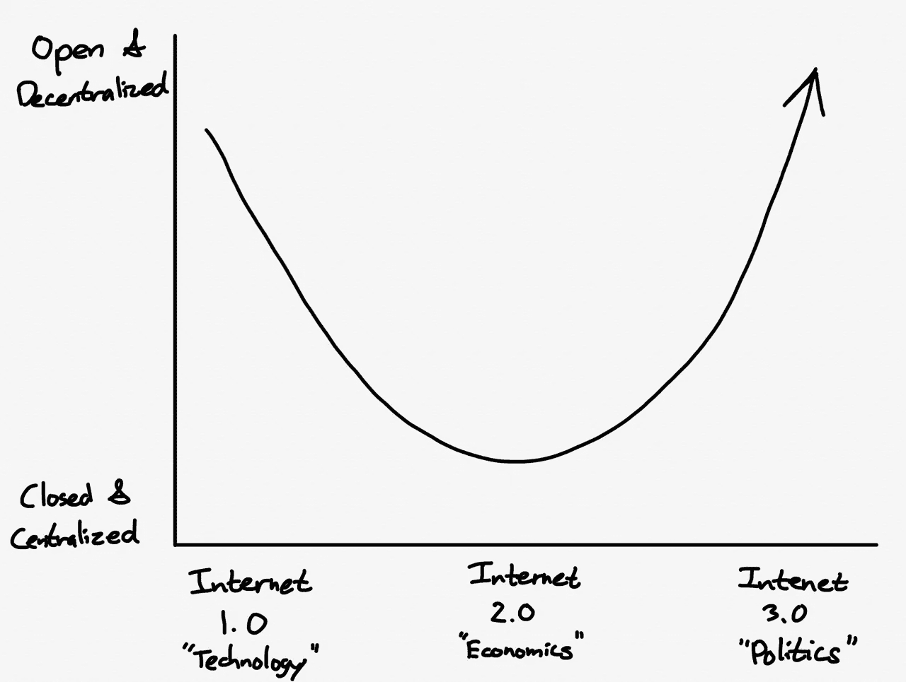

# 互联网的下一个时代

> 原文：<https://medium.com/nerd-for-tech/the-next-era-of-the-internet-5a3c69e81d4b?source=collection_archive---------14----------------------->

## 区块链、激情经济和元宇宙

图片来自本·汤普森的战略:[互联网 3.0 和(科技)历史的开端](https://stratechery.com/2021/internet-3-0-and-the-beginning-of-tech-history/)

下一个互联网时代即将到来。来自 Fred Wilson 的博客文章“[拥有自己](https://avc.com/2018/01/owning-yourself/)

> 互联网一号是一个开放的网络，开放的协议，开放的系统。互联网二是封闭的平台，越来越主导市场，拥有和控制我们的内容和我们。我们需要去互联网三，在那里我们重新控制自己。

扩展一下这句话，互联网 1.0 是黑客的准系统、黄页互联网、拨号调制解调器和 IRC。它有学术根源和个人授权的乌托邦式愿景，但笨拙的用户体验阻碍了它的发展。这个时代的大使(也是主要的继承者)是电子邮件。

互联网 2.0 是一个聚合时代，从 21 世纪初谷歌崛起开始，一直持续到现在。主要焦点是用户体验和让每个人都能访问互联网——以牺牲用户选择和个人数据为代价。这个时代由西方的 GAFA(谷歌、苹果、脸书、亚马逊)和东方的 BAT(百度、阿里巴巴、腾讯)主导。这个互联网时代建立在智能手机、移动应用商店和平台锁定的基础上。

即将到来的互联网 3.0 时代是从聚合者和大型平台手中夺回控制权，将个人带回到舞台中央。我们现在看到了互联网 3.0 的曙光，因为旧的守卫者已经崩溃了。当我们回顾这一时刻时，我们可能会认为特朗普在国会大厦被攻陷后的下台是迎来互联网 3.0 的历史性转折点。

特朗普的整个传奇暴露了互联网 2.0 模式的缺陷，该模式始于类似的乌托邦愿景，即通知数十亿用户并为其发声。它能够通过向大众提供免费服务来实现这一愿景，推动互联网 2.0 平台通过广告赚钱——这反过来意味着主要动机是抓住更多的关注和眼球。

这个游戏被证明是被操纵的，谁吸引了最多的注意力，谁就赢得了这场游戏。这导致特朗普这样的注意力寻求者成为自由世界的实际总司令。为了控制损害，同样的互联网 2.0 中坚分子不得不求助于去平台化和审查这种两败俱伤的主张，这实际上分裂了互联网本身，背叛了它所代表的价值观。

互联网 3.0 是对一切与互联网 2.0 不兼容的事物的反应和解毒剂。人们对寻租的中间商和大公司怀有深深的反感。自由、隐私和主权作为更高的价值出现，取代了体验、便利和易用的 2.0 价值。

互联网 3.0 将从广告转向直接的创造者货币化作为其主要的商业模式。COVID 和远程工作让整整一代专业人士认识到，互联网不仅仅是一个交流和消费内容的地方，也是一个培养受众和谋生的地方。创作者和粉丝的关系是下一个时代的核心。有影响力的人将有比以往更多的方式来赚钱和联系他们的粉丝群。反过来，粉丝群体对社会的重要性将与上一个时代的巨型平台一样。

在这些显著的发展中，我们看到了互联网新时代的迹象:

*   Substack、OnlyFans、Patreon、Roblox 和(可以说)Tiktok 等激情经济平台的崛起
*   现有平台的支点是成为创造者平台，如 Twitter 的空间、高级简讯和超级推文，以及 Linkedin 的自由职业者市场
*   Webflow 等无代码平台和 Twilio、Stripe 等 API 提供商使构建定制解决方案变得前所未有的简单
*   整个华尔街赌注的故事和公众对“这个人”越来越大的失望
*   NFTs 和密码艺术的优势——Beeple，hash masks……NBA 热门照片的总销售额超过 2 亿美元
*   COVID 重新定义围绕工作和消费的既定假设

互联网 3.0 的核心理念是将权力还给个人。它可以追溯到互联网最初的 1.0 价值观，但现在它配备了一项新技术，可以推动这种向去中心化的转变:区块链。来自 Packy McCormick 的《开放元宇宙的价值链》:

> Web3 是对早期互联网愿景的回归，具有内置的超能力。

在过去的十年里，区块链看起来像是一个寻找问题的解决方案。区块链最深远的影响是，在不需要可信中间人的情况下，使原本无限的介质变得稀缺。底层机制允许私有且安全地转移标记有自主身份的稀缺数字商品。这开启了一个新的价值互联网，挑战关于所有权、价值和信任本质的既定假设。

最近事件的汇合使得以区块链为中心的结构性转变的条件成熟了。风险投资家克里斯·狄克逊认为:

> 加密网络结合了前两个互联网时代的最佳特征:社区管理的分散网络，其能力最终将超过最先进的集中式服务。

天使投资人和哲学家 Naval Ravikant 更进了一步，他不仅将区块链视为一种使能技术，还将其视为互联网的下一个时代。

随着这第三个时代的到来，互联网继续它的轨迹，让池塘里的小鱼生活得更好，直到大鲸鱼被完全打乱。作为加密和破坏的啦啦队长，他为小人物担保，并反对大公司的中间人，埃隆·马斯克是这个新时代的海报男孩。今年早些时候，他登上了世界首富的宝座。颠覆者现在是国王。

这并不是说互联网 3.0 不是没有利弊。当前 2.0 时代的隐喻是一个有围墙的花园，其中大型平台拥有追踪和审查的独裁权力，但也确保遵守规则的人的法律和秩序。鉴于互联网 3.0 更加隐私和主权，它也将不可避免地更加混乱和不可预测，这是一个强大的流氓个人可以不受约束的新的狂野西部。新的分权治理体系必须发挥作用。

未来会怎样？如果互联网 1.0 的高潮是由拨号调制解调器驱动的台式电脑上的门户网站，互联网 2.0 是由高速移动数据驱动的 iPhone 应用程序上的社交媒体，那么互联网 3.0 的最终状态是什么？我们要去哪里？

围绕着被称为“元宇宙”的东西有很多谈论，它是互联网本身的进化。Packy McCormick 的《开放元宇宙的价值链》的另一段摘录提供了一个简洁的解释:

> 元宇宙的支持者预测，这将是一个数万亿美元的数字经济，用共享的虚拟世界取代互联网。如果互联网是 2D 和孤岛，元宇宙是三维和互操作的，就像如果视频游戏和物理世界有一个婴儿…
> 
> Web3 和 NFTs 可能掌握着通过在系统中建立连接组织和互操作性将元宇宙后端缝合在一起的关键。

我的观点是，互联网 3.0 的最终体现将是这样的:

由区块链经济支撑的元宇宙，由个人影响者和创造者驱动，可通过连接到全球卫星网络的混合现实眼镜访问。

我们生活在未来，这比我们想象的还要奇怪。从这里开始只会变得更奇怪。