# SQL 中唯一索引的“Nullbuster”变通方法

> 原文：<https://medium.com/nerd-for-tech/the-nullbuster-workaround-for-the-unique-index-in-sql-9423c315cd2e?source=collection_archive---------2----------------------->

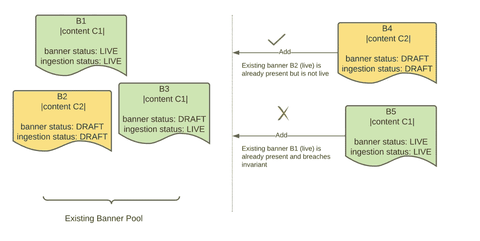

对于作为唯一索引键一部分的列来说,`“null”`意味着什么，SQL 社区在这个问题上存在相当大的分歧。`MySQL`允许它，而有些人如`SQL Server`则断然拒绝它。毫无疑问，没有 SQL 标准来决定空值是否具有可比性。

然而，这种错位并不排除空唯一索引实际上有用的情况。我们将通过一个真实的用例来演示为什么需要找到一个解决方法。

假设你是一名电子商务公司的广告技术开发人员，正在为用户建立一个可以上线的广告条幅系统。一旦上线，横幅就可以点击，并指向一个“内容”，点击它的人会被重定向到这个内容。

您系统的主要用户是*内部团队，他们*日复一日地为内容创建多个横幅。根据经验，可能会创建多个针对相同内容的横幅。

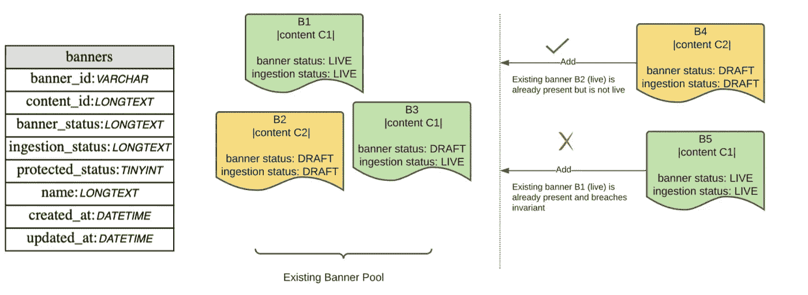

实体图(左)显示了模式。可以添加 B3，因为 B1 尚未上线。

**业务询问**

> 在任何给定时刻，给定内容只能有一个**实时**横幅。实时横幅的“横幅”和“接收”状态都设置为“实时”。
> 这一限制是为了避免同一内容出现多个横幅广告，以免引发机会损失。但是，草稿横幅或其他状态上没有。

因此，在上图中，可以添加`B4`，但不能添加`B5`，以免同一内容`C1`出现两个横幅(`B1`和`B5`)，这是一个问题。

## 你会怎么解决这个问题？

和往常一样，这里有多种方法需要权衡。您可以:

*   `Option I`在您的 API 中执行**“设置前检查”**，即在编写新标题之前，检查是否存在相同内容的活动标题。如果有，丢弃它，否则允许它。

`Pros:` 容易实现，偏向乐观锁定。没有模式更改或新的依赖关系。

`Cons:`功能上*不正确*。存在竞争情况，在这种情况下，可能会在同一时刻同时写入两个横幅。对于少数系统来说，这可能是可以忍受的，但是对于我们来说，这是不行的。

*   `Option II` **向中央协调服务**查询针对内容上的横幅的锁。如果一个新的横幅没有找到任何“锁定”的横幅内容，我们将锁定新的横幅，否则我们拒绝它。

`Pros:` 只要协调器启动，功能正常。协调器可以独立伸缩，也可以服务于其他锁请求。

`Cons:`国家泄漏真相的核心来源之外；服务变更需与协调员沟通；协调器设置的新依赖性和基础维护(如果从头开始)。对我们的问题来说，这感觉像是矫枉过正。

似乎最无创和直观的解决方案是以某种方式**依赖数据库唯一索引**。我们可以在“banner”上为这三列创建一个普通的唯一索引，这意味着如果所有三列在另一个记录中有重复值，则不能插入重复记录。

```
alter table banner add constraint **unique_live_banner_idx** UNIQUE      
          (content_id, banner_status, ingestion_status);
```

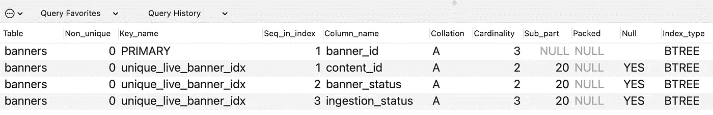

涵盖三个主要栏目的现有索引

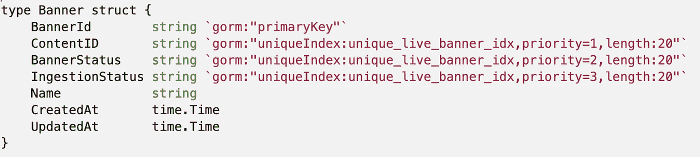

假设像 Gorm (Go)或 Hibernate (Java)这样的 ORM，我们可以如上定义索引映射

**然而，这是不正确的。**回忆，业务需求。除了`LIVE`之外，所有其他的横幅组合都是允许的。

让我们编写一个简单的 [Go 程序](https://gist.github.com/isopropylcyanide/039d9ab4a746672d6fef0424448c7768)(实际上可以是任何东西)使用 [Gorm](https://github.com/go-gorm/gorm) (也可以是任何东西)与 MySQL 对话来演示这种行为。

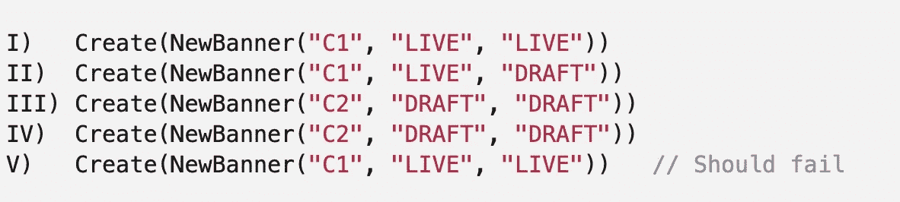

示例测试场景 I-V。注意，场景 IV 应该成功，因为它是草稿，但是 V 应该失败。

如果对我们系统的查询按上述顺序发出，我们当前的索引将会失败`query V`(如预期的那样)，还会失败`query IV`，这是**不正确的**。同一内容可能存在两个草稿横幅。

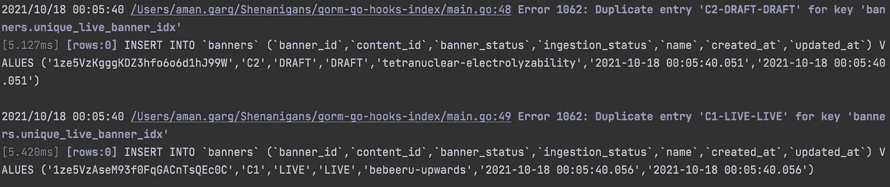

场景四也失败了，因为约束`C2-` DRAFT-DRAFT 似乎被违反了。不太好。

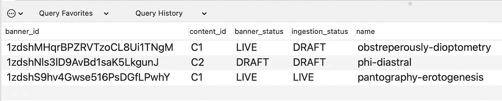

系统的状态。插入了 3/4 条记录。场景 IV 的记录应该在这里，但是没有。

# 那么，有什么诀窍呢？

看起来我们已经接近并朝着正确的方向前进*(数据库唯一的完整性是我们所追求的)*。但是，当值为`LIVE`时，我们需要一种过滤唯一索引的方法。

做这件事没有标准的方法。因此，我们在实体模式中引入了一个新的**可空的**位域/ bool，并将其默认值**设置为 null** 。

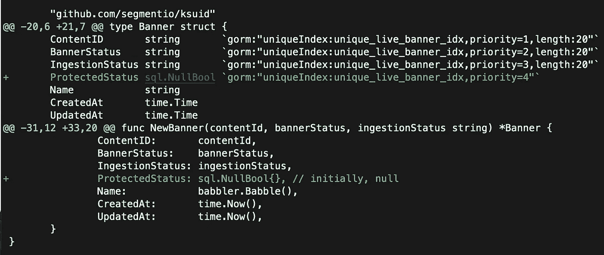

注意[补丁](https://gist.github.com/isopropylcyanide/bf56c4bd583412b599d63c9e2bb4043a)。我们添加了一个新字段(并添加到现有的索引中),并将其默认值设置为 null

然后，我们将它添加到现有的索引中，这样它就覆盖了新的列。

```
alter table banner add constraint unique_live_banner_idx UNIQUE      
    (content_id, banner_status, ingestion_status, **protected_status**);
```

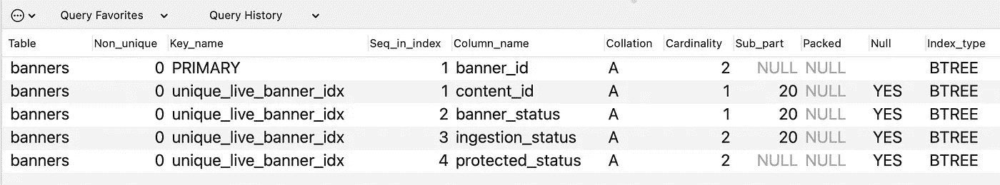

就其本身而言，`MySQL`将 null 解释为*不可比的*，这意味着下面的值组合现在是**“非唯一的”**，并且可以被插入。

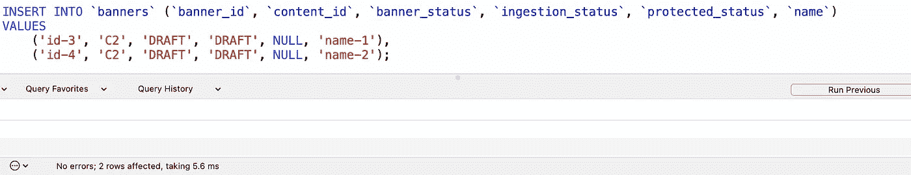

情景四现在可以过去了。请注意，即使一切都相同，空值也是不可比的，因此是唯一的

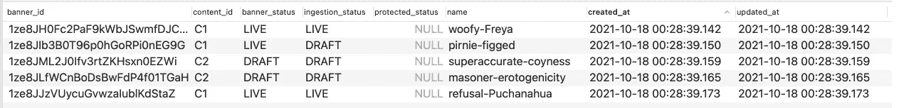

数据库在运行情景一至五时的新状态

然而，有一个问题。场景五现在也免费通过了，虽然它不应该通过。我们从来没有告诉系统专门处理一个`LIVE`横幅。

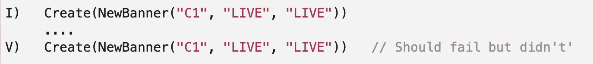

像键“`C2_DRAFT_DRAFT_NULL”`”`(scenario IV)`，键“`C1_LIVE_LIVE_NULL”`”

这就是使用`protected_status`的好处所在。无论何时，我们的业务逻辑保证我们是唯一的，我们可以简单地将其值设置为 **1(或任何非空值)。**

这样做可以保证不会插入两个重复的横幅，因为它们现在是**【非唯一】**的，并且没有通过约束

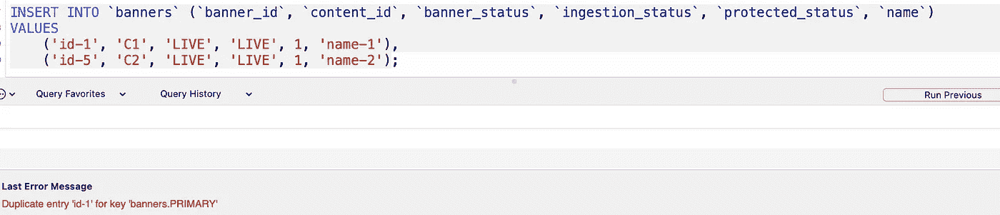

由于活动横幅现在具有相同的非空保护状态，因此只能插入其中一个。

## 在创建/更新之前，如何以及在哪里设置非空值？

这取决于用来与数据库通信的方法。像`Gorm for Go`、`Hibernate for Java`这样的 ORM 框架使得创建[钩子](https://gorm.io/docs/hooks.html) / [拦截器](https://docs.jboss.org/hibernate/orm/3.5/api/org/hibernate/Interceptor.html)变得极其容易，这些拦截器可以在 [*上插入*](https://www.yourdictionary.com/upsert) 之前修改实体。

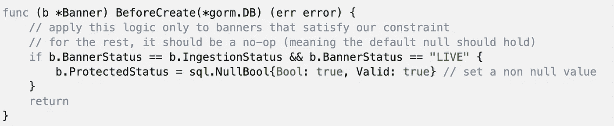

两行“BeforeCreate”挂钩修复了我们的用例。当我们检测到活动横幅时，我们会将其标记为受保护

如果你没有使用 ORM ( [*，我不怪你*](https://martinfowler.com/bliki/OrmHate.html) *)* ，那么你可以手工插入逻辑。唯一需要注意的是，如果有多条路径可能会写入“横幅”实体，那么它们都应该通过钩子。**即使是不符合逻辑的单个路径也会违反需要单独协调的不变量**。

因此，推荐的方法是创建一个专用的、记录良好的钩子。使用这个，让我们修改我们的[程序](https://gist.github.com/isopropylcyanide/421d0e89aec91e16647646d1c7e59532)来使用上面的钩子。

“修复”唯一约束的最后一个补丁现在看起来如下。

## 但是，我用的不是 MySQL。空值在我的数据库中不是唯一的

公平点。这包括大多数数据库。修复非常简单。除了`null`，您能为您的记录找到任何其他“现在唯一的”标识符吗？

是的，没错。 ***使用主键*** 。在默认块中，设置`protected_status: primary_key`并且只在钩子中修改。

# 那是一个包裹。

这就是诀窍。让我们总结一下我们所做的。

*   我们发现一个独特的约束是这里的首选方法，但必须稍微调整。
*   我们在模式中引入了一个可以为空的新字段`protected_status`。为了避免浪费，我们选择了一个可空的小比特/布尔字段。
*   然后，我们修改了我们的索引以包含新的列。理论上，如果原始索引存在，这种“更新”应该成本不高。
*   然后，我们为`protected_status`设置正确的默认值，并创建一个钩子来撤销“空惟一性”,如果我们的逻辑需要的话。

现在让我们考虑一下这种方法的利弊。这个巧妙的技巧有它的作用，但不能被称为万灵药。

`Pros:`

*   即使更新了业务逻辑，字段`protected_status`也可以扩展到多个索引和列。真相的一个来源，在钩子里。
*   **零竞争条件**并且不需要任何协调器就能工作。如果不能容忍重复，这可能是一个很好的选择。
*   如果使用 ORM，实现是微不足道的。

`Cons:`

*   实体模式编辑并不总是可行的。
*   如果不使用 ORM，就有可能绕过钩子。
*   新的索引不是免费的，虽然微不足道，但也占用了一些空间。

感谢您的阅读。感谢任何反馈。