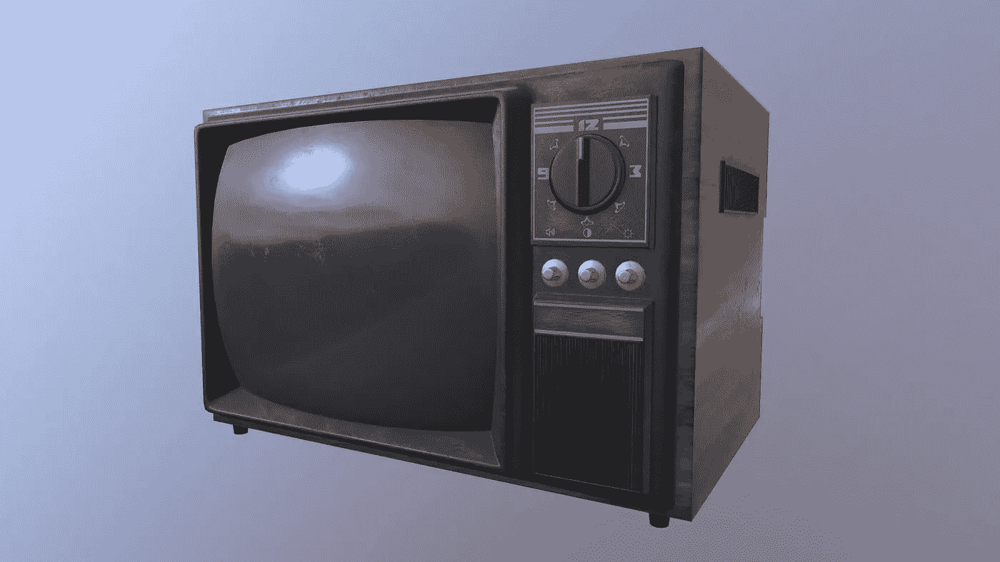
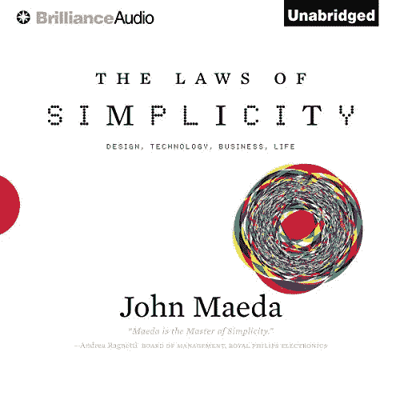
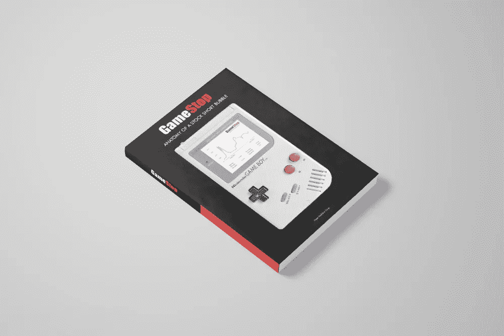

# 旧的电视型号

> 原文：<https://medium.com/nerd-for-tech/the-old-tv-model-1677bc79e2a2?source=collection_archive---------31----------------------->

## 系统简单性的模型

昨天这条推文

保罗·格拉厄姆在推特上谈论旧的电视模型

来自 YC 保罗·格拉厄姆的 combinator 让我想起了安德鲁·s·塔南鲍姆的发言

Andrew Tanenbaum 的创建者

操作系统 [Minix](https://mkrdiop.medium.com/just-publish-it-1f5becc150ad) 的创造者，他也声称是向霍华德·莱纳斯提供 Linux 基本内核的人。在他的演讲中，教授给出了他关于 Minix 的核心设计目标，也就是我所说的旧电视模型。这个原则就是电脑要像我们以前家里的旧电视一样简单。当我们插上一台旧电视并设置电视频道时，它几乎可以正常工作，而无需我们回来更新或调整系统。旧电视像收音机一样简单，但正如我注意到的，这些电视最终变成了电脑，安装和使用变得越来越复杂。

使用的简单性是许多科技消费产品成功的设计特征，但简单性并不是删除功能，而是通过使用移情思维来完善设计，让我们知道用户想要和需要的不是我们工程师和设计师想要和需要的。我们设计和构建的产品并不适合我们，所以最后的框架、最后的数据库、最后的语言不管是 Rust 还是 Scala 都没那么重要。重要的是用户是否会几乎本能地知道如何使用它。硅谷有句谚语说，如果我们的祖父母不用我们解释就能使用它，那么科技产品就设计得很好。

阅读这本书有助于更深入地了解这个话题

有声书[简单法则](https://www.amazon.com/The-Laws-of-Simplicity-audiobook/dp/B0077PC45K/ref=sr_1_1?dchild=1&keywords=design+simplicity&qid=1618837386&s=books&sr=1-1)

PS:点击[这里](http://clickmetertracking.com/nglj)获取我的新书《股市泡沫剖析》

