# 数据科学所需的唯一网络搜集工具

> 原文：<https://medium.com/nerd-for-tech/the-only-web-scraping-tool-you-need-for-data-science-f388e2afa187?source=collection_archive---------1----------------------->

## 数据科学|网络搜集

## 刮埃隆马斯克的推文，数据科学的招聘信息，和 YouTube 的评论，都没有代码。

Dmitry Chernyshov 在 [Unsplash](https://unsplash.com?utm_source=medium&utm_medium=referral) 上拍摄的照片

D ata 是所有行业的宝贵资源。一般来说，我们可以回答更多的问题，做出更多的数据驱动的决策，或者用更多的数据训练出更好的模型。

问题是，好的数据很难找到。解决办法？网页抓取。

## 什么是网页抓取？

网络抓取本质上是从互联网上提取信息，以非结构化的形式将其转化为可用的格式以备后用。

## 网页抓取的使用案例

网络抓取有很多用途。

下面是几个例子

*   营销:竞争对手监测，线索生成，搜索引擎优化监测
*   电子商务:价格智能
*   财经:综合财经新闻
*   个人:寻找旅行的最佳酒店，收集招聘信息
*   数据科学:用更多数据改进模型和实验

它可以应用于许多领域，用例几乎是无穷无尽的。

## 如何刮网

现在的问题是一个人如何开始抓取网页。

有两种选择:

1.  编写代码(例如 Python 和 BeautifulSoup)
2.  使用无代码工具。

每种工具都有其优点和缺点，但是无代码工具的最大优点是您可以花更少的时间编写代码来提取数据，而花更多的时间进行统计分析和实验，而不是提取数据。

那么，为什么不使用无代码工具呢？只需点击几下，您就可以轻松访问互联网上的任何数据。

有大量的无代码 web 抓取工具，但它们缺乏许多健壮的特性或定制，否则会使 web 抓取变得轻而易举。

介绍， [**八分解析**](https://www.octoparse.com/?bene=) ！

# 什么是八解析🐙？

Stephanie Harlacher 在 [Unsplash](https://unsplash.com?utm_source=medium&utm_medium=referral) 上拍摄的照片

[三言两语，八解](https://www.octoparse.com/)就是:

> 任何人都可以轻松进行[网页抓取](https://www.octoparse.com/WebScraping)

与所有无代码工具一样，Octoparse 允许您在不编码的情况下进行指向、点击和提取。

我以前用过很多网络抓取工具，但是 Octoparse 是另一个层次的高级功能。

Octoparse 内置了大量有用的功能:

*   一款内置浏览器的免费网络应用。
*   无限滚动，下拉，登录认证抓取网站
*   提供了一个 24/7 全天候运行的云平台
*   安排你的网络爬虫随时抓取
*   使用 Zapier 将数据自动导出到数据库或任何其他平台(例如 Google Sheets)
*   带有自动 IP 轮换的匿名刮擦
*   用于抓取网站的预建模板
*   还有更多！

[详见网站](https://www.octoparse.com/)

不要只相信我的话。

让我们看看 Octoparse 的实际应用吧！

# 3 刮擦示例

为了展示 Octoparse 可以做什么，我们将做几个抓取任务。

1.  埃隆·马斯克的推文
2.  事实上，数据科学实习的工作岗位
3.  来自 YouTube 视频的评论

开始吧！

# 抓取埃隆·马斯克的推文

假设你想训练一个像埃隆·马斯克一样发推特的人工智能。要做到这一点，你首先需要他的推文。

所以，让我们看看 Octoparse 如何轻松地为我们收集 Elon 的推文。

## 模板

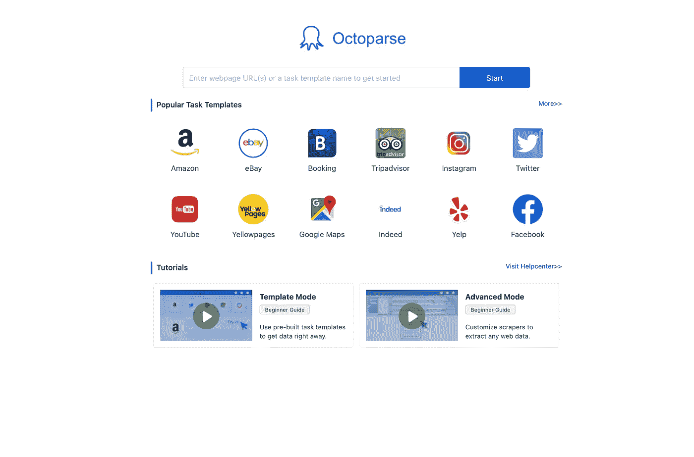

八分主页

在主页上，您可以查看用于抓取热门网站的热门任务模板。

点击 Twitter，你会看到几个可以用于 Twitter 的模板。

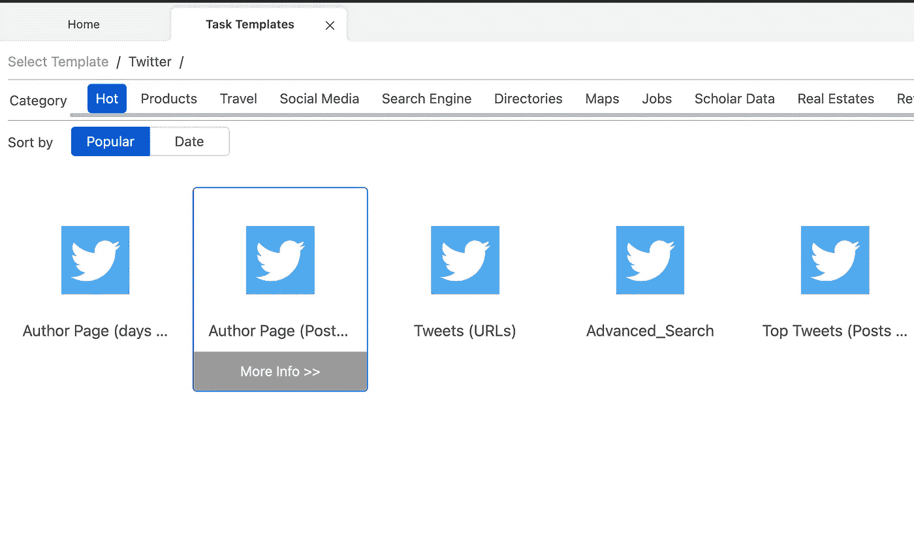

我们将使用“作者页面”,因为我们只想要作者的帖子。

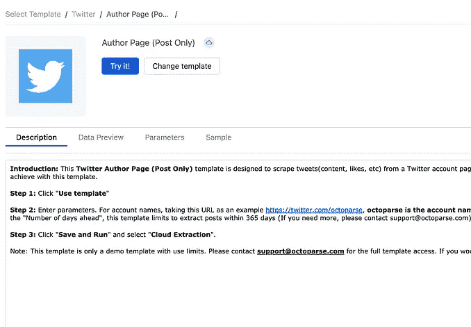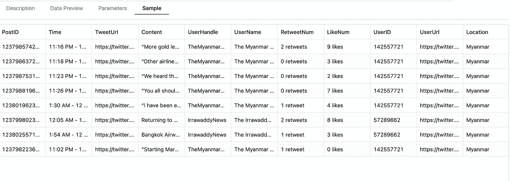

Twitter 作者页面模板

进入模板，您可以看到如何使用模板的描述，以及该特定模板的示例数据。

## 向模板提供信息

要使用它，请点击“试用”，您将被带到此页面，在此您可以输入刮擦所需的信息。

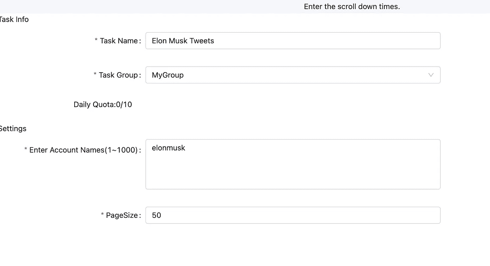

模板的参数

完成后，你可以点击左下角的“保存并运行”。

## 运行任务

你会有两个选择，在本地运行或者在 Octoparse 的云平台上运行。

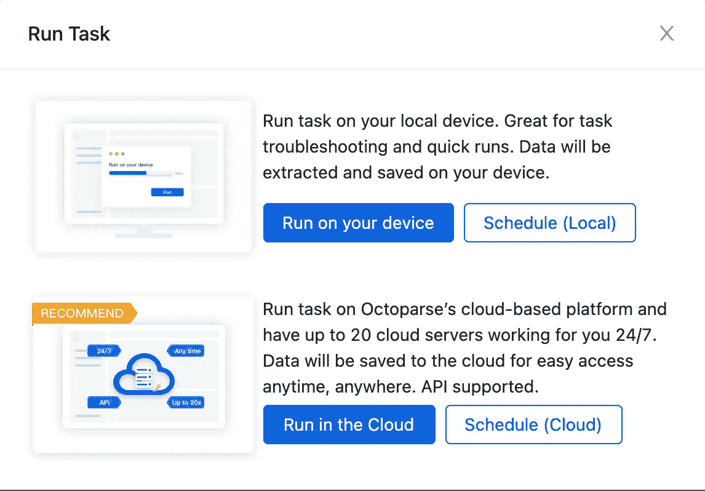

正在 Octoparse 上运行任务

运行任务后，转到您的仪表板，您将看到任务正在运行。

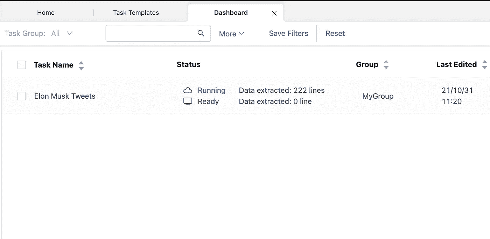

完成后，您现在可以查看您的数据！

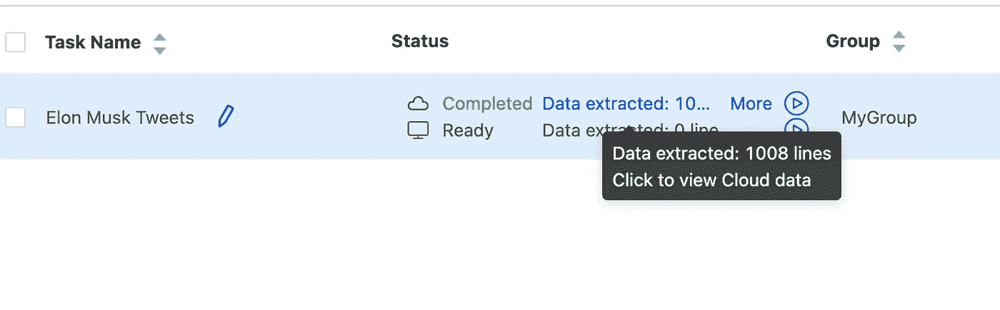

瞧啊。我们的数据准备好了！

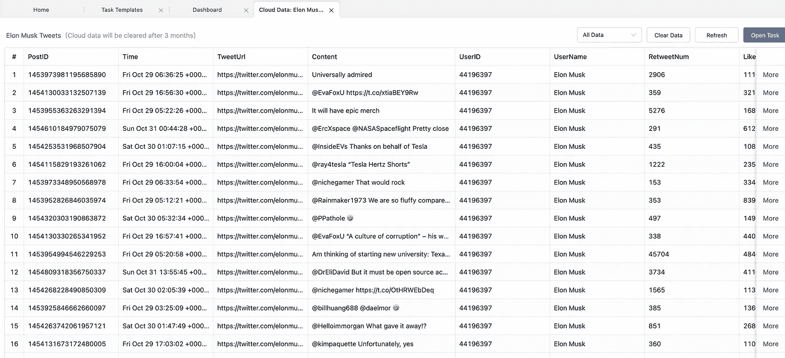

## 导出数据

现在导出数据！

如果你现在想要数据，你可以选择下载相应的格式。

但是如果你想自动保存到 Google Drive 或 Google Sheets，用电子邮件把文件发给别人，等等，Octoparse 现在允许你用 Zapier 自动导出！

如果你不知道 Zapier 是什么，它是一个为你自动化任何工作并在各种 web 应用程序之间移动信息的工具。

## Zapier + Octoparse

首先，设置触发器，这是一个正在处理的新文档。我们的触发器是 Octoparse，您将被要求登录到您的 Octoparse 帐户。

之后，您将选择触发器“新文档已处理”，并选择“Elon Must Tweets”任务。

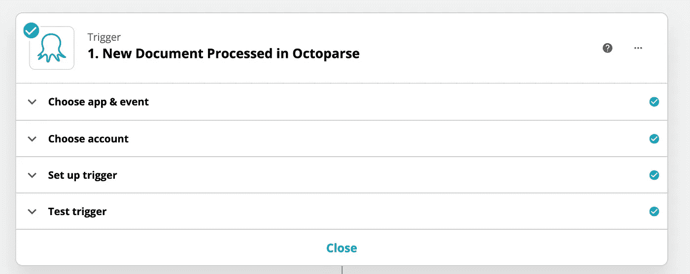

在扎皮尔触发

接下来，您设置操作，在这里您将选择您的帐户，操作如创建一个新的文件夹和上传文件，选择扩展名等。

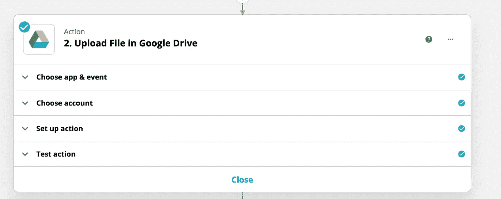

扎皮尔的行动

运行测试操作后，CSV 文件将在您的 Google Drive 中！

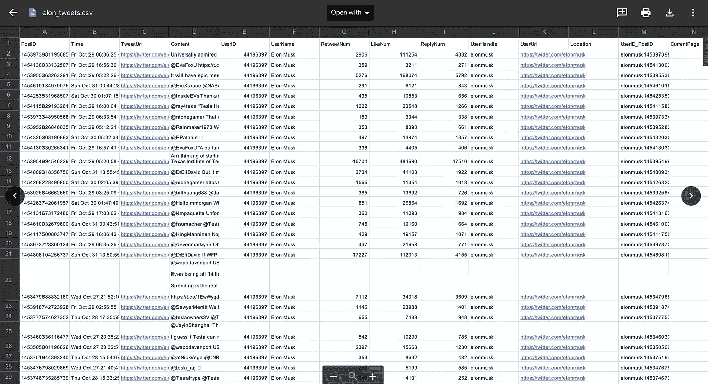

[查看我的 Zap 了解更多详情](https://zapier.com/shared/a2692a09816fce4ba4222f4ff7c062ed5de14ba3)

这是埃隆·马斯克的推文数据，你可以与之互动。

接下来，让我们在 Indeed.com 上收集一些数据科学实习职位的信息！

# 在 Indeed.com 搜集美国的数据科学工作

过程会和之前很像；我们只是使用不同的模板。

对于职位发布，Octoparse 提供了一个 Indeed.com 模板。

我们将使用实际上是美国的工作日期模板。

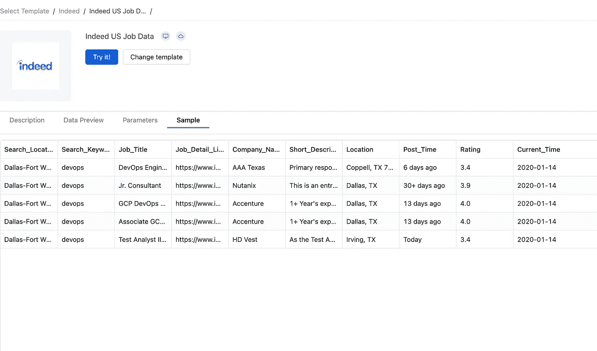

我们将获得的信息是位置、公司名称、评级、工作岗位的链接等。

首先，我们需要搜索的链接。我搜索了“数据科学实习生”，并根据“实习”类别进行了过滤。

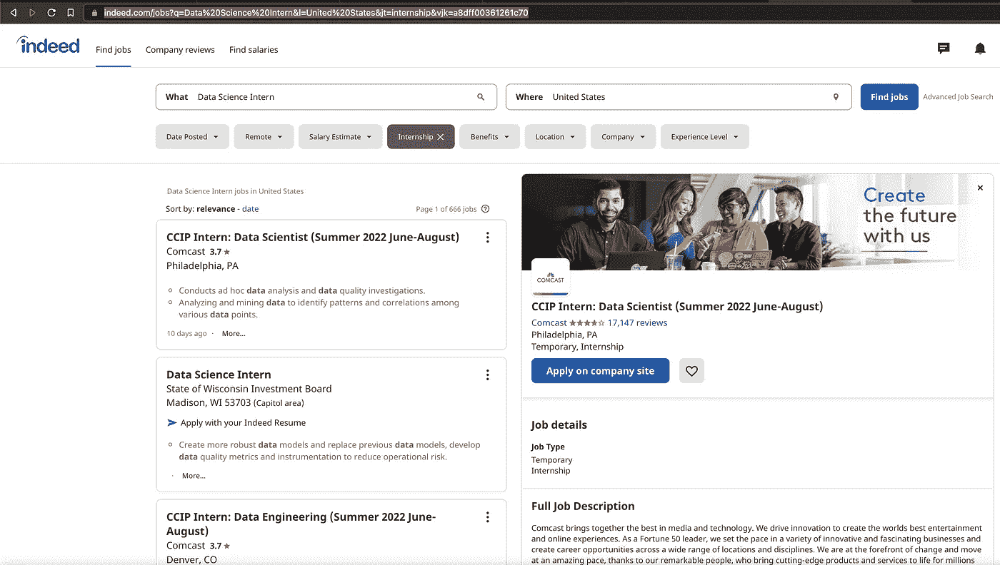

然后，我们将链接粘贴到参数中，我们就可以开始运行了。

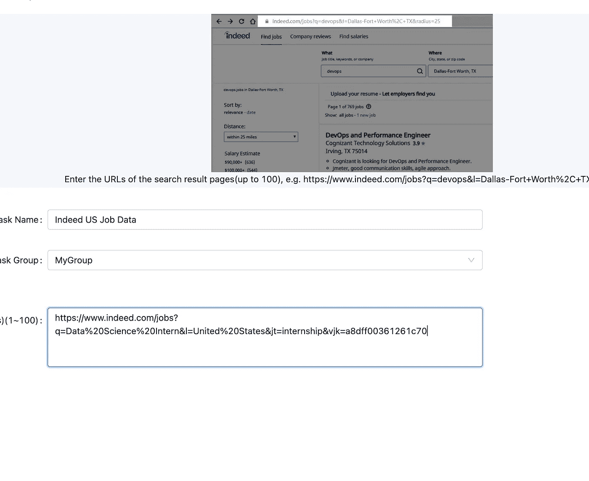

下面是我们将得到的数据！

我可以看到这些数据是有用的，如果你在美国搜索数据科学实习，你可以过滤评级，你可以在简短的描述中瞥见你会做什么。

如果你想更进一步，从工作细节(技能、要求等)入手。)，你可以在 Octoparse 上创建一个工作流，点击每一个招聘启事，选择你要刮的元素。我会把它作为对你的挑战！

最后，让我们看看如何收集 YouTube 评论！

# 抓取 YouTube 评论

鱿鱼游戏，网飞系列是一个巨大的成功，所以让我们找点乐子，刮刮这个节目的 [YouTube 预告片视频](https://www.youtube.com/watch?v=oqxAJKy0ii4)的评论。

像以前一样，我们传入 URL 并单击 run，我们将得到与上面的示例数据类似的数据。

下面是我们得到的数据！

你可以用这些数据做一些有趣的事情，通过情感分析模型运行它，然后确定观众对预告片的感觉，并给出视频的情感分数。

它的 Octoparse 显然是一个强大的工具，我只是触及了它的皮毛。

如果您无法从模板中找到您想要实现的内容，您可以利用他们的工作流工具来定制符合您目的的抓取。它可以做的事情有循环项目、分页、点击动作等等。

## 试用 Octoparse🐙今天👇

 [## 网络抓取工具&免费网络爬虫

### 无需编码即可快速抓取 web 数据只需点击鼠标，点击并…

www.octoparse.com](https://www.octoparse.com/?bene=) 

本文到此为止，感谢您的阅读，希望这个工具能让您的生活更轻松！

> 如果你喜欢我的文章，支持我的最好方式就是今天用 **5 美元**成为 [**的中等会员！你可以在媒体上获得大量关于各种主题的优秀作品。**](https://benedictxneo.medium.com/membership)

## 喜欢这篇文章吗？这里有一些你可能喜欢的文章👇

*   [训练、可视化和检查没有代码的计算机视觉模型](https://towardsdatascience.com/train-visualize-and-inspect-computer-vision-models-on-a-no-code-mlops-platform-6e26ea9c6fef)
*   [用 Python 刮 100+免费数据科学书籍](/bitgrit-data-science-publication/scraping-100-free-data-science-books-with-python-5b5c515033a7)
*   [5 大机器学习算法讲解](/bitgrit-data-science-publication/top-5-machine-learning-algorithms-explained-d15234b627f7)

请关注 bitgrit 数据科学出版物，在那里我撰写了关于教程和概念解释的数据科学文章。