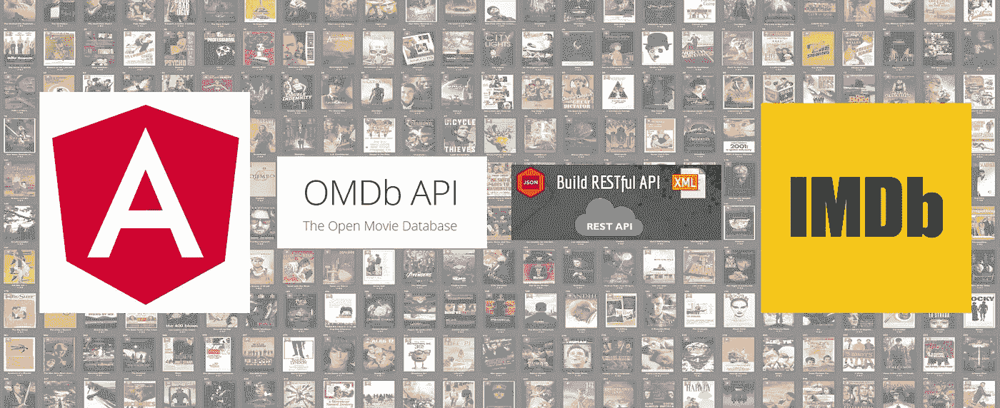
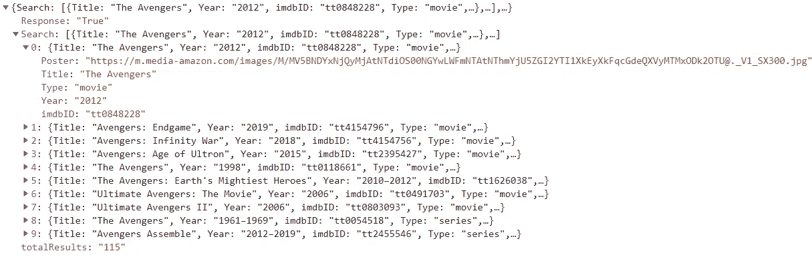
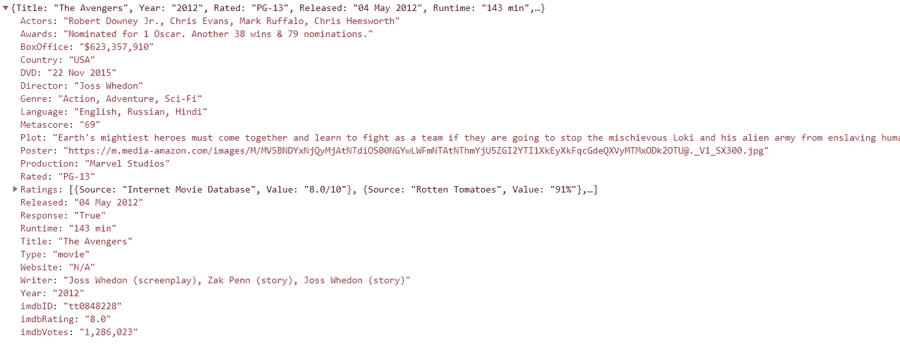
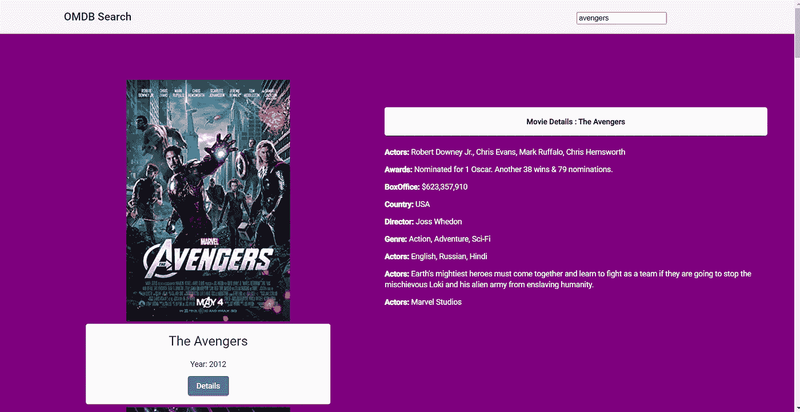

# 用于获取电影数据的开放式电影数据库(OMDb)

> 原文：<https://medium.com/nerd-for-tech/the-open-movie-database-omdb-for-fetch-movie-data-bc5ff46bec8?source=collection_archive---------1----------------------->

## 为互联网电影数据库(IMDB)/OMDB 制作自己的门户网站



从 IMDb 获取电影数据的角度应用程序

虽然 IMDb 是所有电影信息的权威来源，但他们没有公共 API。因此，为了检索电影信息，我们可以使用关于电影的开放数据库，例如[开放电影数据库](http://www.omdbapi.com/) (OMDB)。本文是关于为 OMDb 创建自己的门户。OMDB API 是一个 RESTful web 服务，用于检索电影或连续剧信息(标题、情节、演员、年份、海报等)。让我们通过使用第三方 API 实现一个获取远程服务器响应的应用程序来测试知识。使用 Angular 的 HttpClientModule 进行 HTTP 调用，并使用 RxJS 库来控制用户在与服务器通信时对服务器 API 的点击，从而限制网络资源。

# Angular 入门

首先运行`npm`命令设置 angular CLI，如下所示:

```
$ npm install -g @angular/cli
```

然后在 angular 的最新版本中，通过执行如下的`ng`命令创建一个 Angular 项目。示例项目是使用版本 12.0.2 的 [Angular CLI](https://github.com/angular/angular-cli) 生成的。

```
$ ng new potal
$ cd potal
```

# 从 OMDB API web 服务获取数据

首先，获取您的 OMDb API 密钥。为此，你必须在他们的网站上注册。如果你还没有，在 http://www.omdbapi.com/apikey.aspx 注册一个账户。您将收到一个包含 API 密钥的验证链接。单击链接将其激活。就是这样！您现在可以访问 OMDb API 了。

接下来，创建您的 OMDb/IMDb API 请求 URL。我们可以按照 [OMDb API 文档](https://www.omdbapi.com)来搜索关于电影的信息。将 API 根和查询字符串放在一起，我们可以获得完整的 API 请求 URL。

`http://www.omdbapi.com/?apikey=[YOUR_KEY]&`

只要代入你自己的 API 键，你就可以搜索字符串。

对于每个 JSON 项，API 返回:

*   标题
*   发布年份
*   IMDb 身份证
*   类型(电影、连续剧或剧集)
*   电影海报图像



chrome 中搜索字符串的 JSON 响应

这里可以使用 [OMDb API](http://www.omdbapi.com/) 来获取匹配搜索查询(JSON)的前 10 个结果。

**更新 App 组件**:

替换**app.component.html**文件中的以下 HTML。

为了进行搜索，输入字段控件与模板变量`#movieSearchInput` 一起使用，以使用 RxJs `fromEvent`方法绑定 keyUp 事件。Angular `*ngFor`指令迭代搜索电影列表，并为每部电影创建 angular material 卡片。`"Searching..."`消息由`isSearching`布尔标志显示，指示 API 命中进度。

用下面的代码更新 **app.component.ts** 文件。

`@ViewChild` decorator 使用类型为`ElementRef`的输入控件上的模板变量`#movieSearchInput`获取引用。由于我们将在`ngOnInit()`组件挂钩中绑定事件，因此`@ViewChild`将设置`{static:true}`。

在输入控制上，使用 RxJS 的`fromEvent`方法绑定`keyUp`事件。`pipe()`仅当输入值的长度超过 2 时，使用`**filter()**`触发事件，使用`**debounceTime()**`管理用户停止键入前按键事件之间的时间，使用`**distinctUntilChanged()**`检查当前输入是否来自先前输入的值，使用`**searchGetCall()**`在通过我们实现的所有场景后，对服务器进行 HTTP 调用。

# 获取更多 OMDb API 数据

要查看 Internet 电影数据库的更多详细信息，请请求一部电影，如下所示:

按标题:`http://www.omdbapi.com/?apikey=[YOUR_KEY]&t=[MOVIE_TITLE]`

由 IMDb ID: `http://www.omdbapi.com/?apikey=YOUR_KEY&i=[IMDB_ID]`

这里，可选参数包括:

*   一、IMDb 身份证
*   t —电影标题

该端点将返回关于 IMDb ID 或您想到的电影名称的更详细的结果。在这里，我用 IMDb 的 ID 请求了一部电影，如下所示。

添加`getDetails(obj)`函数作为**细节**按钮的点击函数，通过 IMDb ID 获取特定电影的更多细节，所选电影作为函数的参数给出。

```
<button mat-raised-button color="primary" (click)="getDetails(this.movie)">Details</button>
```

然后让 show hidden div 元素显示那些检索到的细节。

该函数具有更全面的结果，包括:

*   标题
*   发布年份
*   评级
*   出厂日期
*   运行时间
*   流派
*   董事
*   作者
*   演员
*   情节摘要
*   语言
*   一个/多个国家
*   获奖情况
*   电影海报(电影图像的 URL)
*   收到的评分
*   Metascore
*   IMDb 评级
*   IMDb 投票
*   IMDb 身份证
*   类型(电影、连续剧或剧集)
*   DVD 信息
*   票房成绩
*   制作公司
*   网站



chrome 中对 IMDb ID 的电影请求的 JSON 响应

在角度应用中实现 OMDb-Search 的步骤可以总结如下:

*   使用 [OMDb API](http://www.omdbapi.com/) 获取与您的搜索查询(JSON)匹配的前 10 个结果。
*   创建一个带有一个输入字段的界面，用于按标题搜索电影。
*   实时呈现结果，并在用户键入搜索查询时更新界面。
*   如果搜索查询没有结果，则显示 OMDb API 错误
*   一旦结果被显示，允许用户点击任何特定的电影来查看其细节。
*   对于特定的电影，细节视图显示更多的电影信息。

应用程序的完整代码可以在[这里](https://github.com/Isurie/OMDB-potal)访问。



电影门户的界面，搜索电影并显示电影的详细信息。