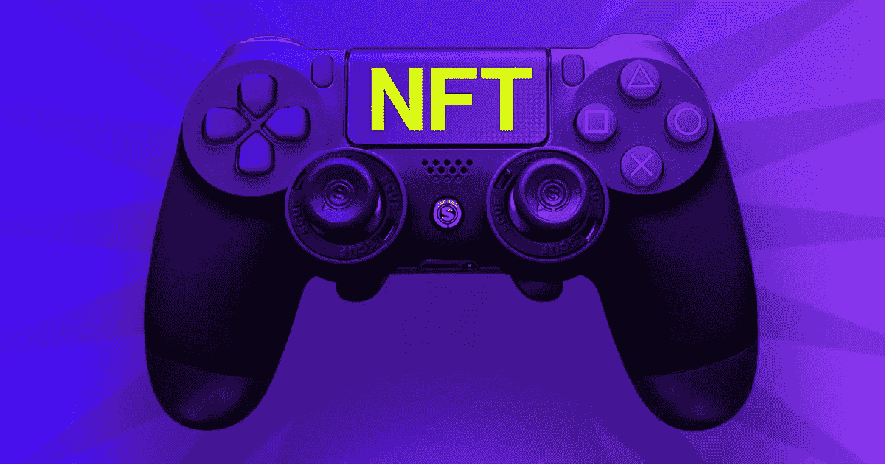
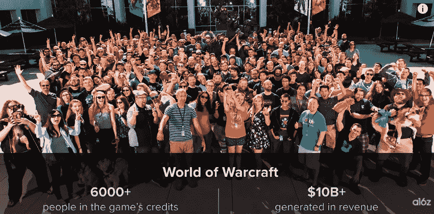
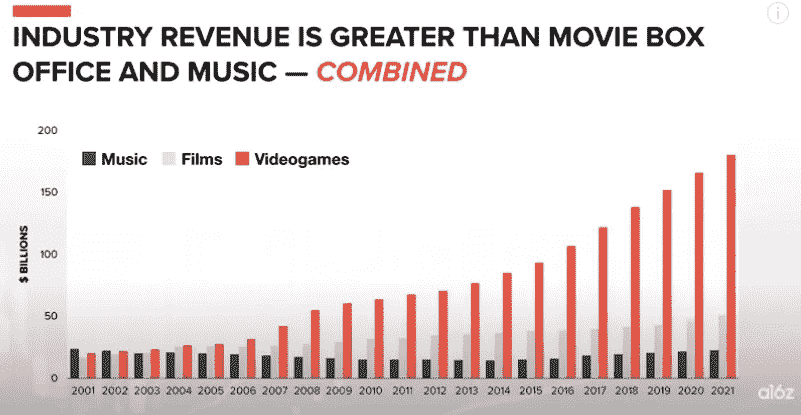
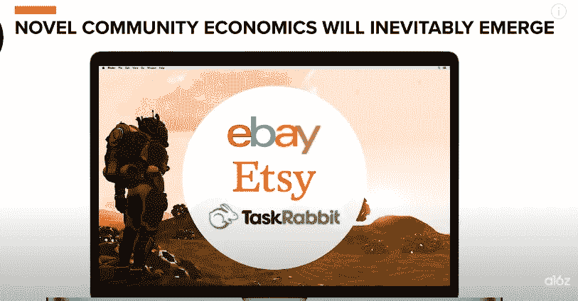

# 游戏信息化的机遇

> 原文：<https://medium.com/nerd-for-tech/the-opportunities-of-nftzation-of-games-5feb5ba8f2eb?source=collection_archive---------2----------------------->

## 区块链科技开启了投资者-游戏玩家时代

图片来自 [VentureBeat](https://venturebeat.com/2021/11/12/the-deanbeat-why-nft-game-startups-will-win-while-big-publishers-wait-for-regulation/)

在过去，游戏行业有三个创收的机会。这三个收入来源是制作和销售游戏和资产，成为电子竞技专业人士，或在 twitch 等平台上播放游戏

忍者是世界上最成功的游戏流光(图片来源: [a16z](https://a16z.com/tag/nfts/) )

区块链将有助于解决三个问题，这些问题将缓解去中心化游戏市场的创建。这三个问题是资产所有权的证明、资产所有权转移的可追溯性和资产的现实经济估价。这种分散化的游戏市场，我们已经看到从像魔兽世界这样的游戏中出现，玩家开始实现自己的资产和账户交易方式，这将通过区块链基础设施变得越来越成熟和节能而变得更加系统和安全。

魔兽世界是游戏创造整个经济的完美例子(图片来源: [a16z](https://a16z.com/tag/nfts/) )

区块链正在开启游戏的新篇章，随着区块链技术的发展，游戏开发商和游戏玩家正在进入一个新的货币化时代，这将带来除上述三种收入流之外的新收入流，并将使游戏行业成为一个越来越大的行业。

与音乐和电影相比，视频游戏行业每年的收入(来源: [a16z](https://a16z.com/tag/nfts/)

游戏工作室和开发者现在必须通过获取知识来弄脏区块链的东西，这些知识将帮助他们用 NFT 系统升级他们过去成功的芯片游戏，或者设计和构建全新的游戏，这些游戏利用了区块链和去中心化自治组织(DAO)的力量。游戏赚钱似乎是游戏行业的下一个趋势，就像当行业趋势逆转时几乎总是发生的那样，技能、地位和角色被重新分配，给这个行业的每个参与者带来了职业转变或商业模式转变的机会。

对于对游戏行业感兴趣的你来说，机会在于你可以成为这种在游戏中使用区块链的早期趋势的专家，通过了解这种技术的所有层面，并构思出一些创造性的想法，关于区块链如何使游戏体验更有趣，甚至在财务上更有利可图，因为区块链通常首先与金融科技联系在一起。

举个例子， 像模拟城市这样的城市建设游戏是模拟经济系统的游戏，允许玩家建立并拥有一个完整的环境。随着 NFT 的出现，这些类型的游戏可以与 NFT 系统绑定，这将为模拟的经济系统带来一种货币，并允许玩家进行资产交易，这甚至可以变成一项有利可图的业务，但如果我们提醒自己过去的游戏经历，我们可以先看到第二人生 我尝试过将游戏经济与实体经济联系起来，我们已经看到玩家通过在第二人生中出售财产赚了数百万美元。 这将会更多的发生在下一个 NFTzed 游戏经济中。游戏经济将效仿网络时代的大多数成功创业公司，如易贝、Etsy、TaskRabbit 等。

新的经济社区将从 NFTzed 游戏中出现(图片来源: [a16z](https://a16z.com/tag/nfts/) )

如果你现在正在做一个游戏项目，是时候停下来想想如何从这种 NFT 趋势中获利，从玩家的角度来看，这很可能是一种持续的趋势和习惯。从世界上 24 亿游戏玩家中，许多人将采用这种游戏来一点一点地赚取模型，直到这种游戏模型成为最重要的模型。游戏工作室。像 steam 这样的市场，像索尼和微软这样的主机制造商都将自然地将这种新的游戏赚取模式集成到他们的产品和服务中，然后让你的游戏 NFT 就绪将为你提供更多作为独立游戏开发商或工作室的成功机会。

区块链与 NFT 将为游戏开发者和玩家带来巨大的机会，我希望你能从这个区块链游戏的新时代中受益。

感谢您的阅读。

**PS:** [Godda Games](https://mkrdiop.medium.com/list/godda-game-598649249472) 转行更名为……NFT……