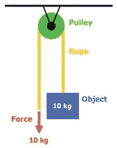
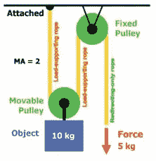
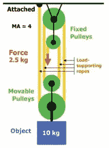

# 范例随着不同的开发:测试比率而变化

> 原文：<https://medium.com/nerd-for-tech/the-paradigm-shifts-going-from-1-1-to-10-1-to-100-1-dev-test-ratio-44183a734d77?source=collection_archive---------0----------------------->

## 从 1:1 到 10:1，再到 100:1，事情发生了怎样的变化

我在三家大公司(微软 1997 年至 2009 年，亚马逊 2009 年至 2020 年，谷歌 2020 年至今)参与了工程和运营卓越的各个方面。在那几十年里，我看到了开发人员和测试工程师之间关系的三个主要范例，这取决于开发:测试比率。每一次范式转变都迫使我进化，以不同的方式思考如何在工作中变得更有效率。这既威胁到了我的角色的未来，也给 T4 提供了新的发展机会。

这一切都归结于*杠杆和力量倍增。*我最喜欢的比喻是[滑轮](https://sciencing.com/3-types-of-pulleys-12393122.html)，滑轮改变了力的大小。对于单个滑轮，您必须施加 10kg 的力来提升 10k g——这就是您的 1:1 开发:测试比率。有了双滑轮，你需要更少的力——这是你的 1:10 比例。你可以制造越来越复杂的滑轮系统，让你用越来越小的力举起 10 公斤的东西——这就是 1:100 的比例。

首先，一些背景。微软有 SDEs(开发人员)、STEs(测试人员)和 sdet(测试中的软件设计工程师*),是开发人员和测试人员的混合体——这是一个开发人员的职位，但你专注于为测试目的和开发人员的生产力创造自动化)。我的职业生涯始于 SDET。亚马逊在 SDE、SDET 和 QAE(测试者)身上遵循了这个配方。Google 非常相似，有 SWE(开发人员)、TE(测试人员)和 SETI(混合角色)。在每家公司，这些角色都有自己的特点，但有足够多的相似之处。*

# **第一阶段——1:1 的开发:测试比率天数**

当我 1997 年开始在微软工作时，我们的开发与测试比率是 1:1，意味着测试人员和开发人员一样多*。*我认为推动因素之一是收缩包装软件的静态瀑布性质。当时，我们认证的是微软 Office 或微软 Windows 等产品的版本。该产品大约每三年发布一次。当它发行时，这意味着要刻录 5000 万张 CD，并把它们运送到商店。小组经理让所有的测试人员在一张实际的纸上签署他们对最终版本的认可，然后她把这张纸裱起来挂起来。我负责将我的 DLL 的最终官方位复制到 Microsoft Office 共享驱动器上，该驱动器将用于刻录主 CD。如果你有一个 bug，那么这个 bug 将会永远存在，永远被烧录到那个 CD 上(或者直到那个人用那个 CD 作为他们饮料的杯垫)。直到几年后，微软才增加了软件从互联网上获取更新并自动安装的功能。1997 年，如果我们幸运的话，一些客户可能会手动下载补丁。因此风险很高，微软用 1:1 的开发:测试比率减轻了风险。

然而，这创造了一些相当有害的动态。首先，开发人员根本懒得做太多的测试，因为他们知道有过多的测试人员作为安全网。只要把它扔到墙上，就会有一大群测试人员渴望测试你的代码并找到 bug。*我总是会得到甚至无法编译的代码。然而，开发者并不是唯一的错。把它扔到墙上的概念是双向的，测试人员会把 bug 扔到墙上，有时没有好的重现步骤，有时质量不是特别高。我们不是合作伙伴。*

1:1 的比例也限制了增长机会。当你的工作实际上是“测试 Bob 昨天写的代码”时，很难产生大的影响我还认为这导致了一种等级制度，在这种制度下，测试人员是二等公民。我个人从不认为自己是这样的人:我拥有计算机科学学位，就像我周围的任何一个 SDE 一样，当我被雇用时，我已经通过了 SDE 技术面试考试……我只是在我的头衔上多了一个“T ”,以反映我发现测试很有趣。但是有些人认为我是二等公民，这里有一个小故事可以证明这一点。我接着创建了负载和性能测试平台，亚马逊内部用它来测试成千上万的服务([这里是故事](https://carloarg02.medium.com/how-i-grew-an-engineering-productivity-tool-to-impact-thousands-of-engineers-at-amazon-and-how-28a990091207))。然而当我开始写它的时候，团队中有一个开发人员说，“嗯，这是*复杂的*代码，我更喜欢*开发人员*写这段代码，而不是*测试人员。*“我想我证明了个人错了。我写的代码在亚马逊各处的业务关键系统上每秒运行数百万次，十年来一直如此，并在我晋升为负责人时受到了许多首席工程师的审查。

滑轮模拟中 1:1 的开发:测试比率([来源](https://www.teachengineering.org/lessons/view/cub_simple_lesson05))。

就我个人的职业发展而言，这是一段极其令人沮丧的时期。在我从事软件行业的 24 年职业生涯中，至少有 10 年是不幸地困在了中级工程师的岗位上，不知道如何跨越障碍，进入高级职位。即将到来的开发:测试人口统计的转变将提供我所需要的东西来摆脱我的窠臼。

# 第二阶段——10:1 的开发:测试比率

当我 2009 年开始在亚马逊工作时，我们的开发与测试比率是 10:1。对我来说，这是一个重大的范式转变。主要的区别是我们在做*网络服务*而不是*收缩包装*软件。您可以在 web 服务中使用良好的遥测技术。这些实时指标(CPU 使用率、JVM 指标、事务延迟、错误率等)与连接到寻呼机的警报相关联，并且总是有人随时待命。如果某个指标超过了阈值，您将收到传呼，放下手头的工作，回滚环境(这些回滚甚至可以基于警报自动发生)，调查、修复 bug、推出修复，您的数百万客户将立即得到它。这是一个与热缩包装软件完全不同的世界，在热缩包装软件中，有数百万份你的软件拷贝被刻录到 CD 或 DVD 上。有了 web 服务，在您拥有的服务器中就有了您的软件的单一权威副本。因此，知道什么时候有东西坏了，并解决问题，比在旧世界要容易得多。对于生活和工作的平衡来说不是特别好，但是伟大的遥测技术和寻呼机可以弥补测试中的许多不足。

2009 年，亚马逊大约有 300 个 sdet 和 3000 个 SDE。10:1 的开发与测试比率改变了许多动态。开发人员并不认为他们的代码会被测试，因为测试人员被拉长了。所以他们自己做了很多测试——而不是翻墙。此外，如果他们推出了一个 bug，他们会被寻呼，没有人喜欢在他们的家庭晚餐中或在他们熟睡时被寻呼，所以有一种内在的激励来更好地测试你的代码。这在“所有权”中有明确的表述，这是亚马逊领导原则之一。亚马逊的服务所有权非常强大。开发人员和测试人员在一起，这导致了比我在微软的收缩包装软件世界中看到的更强大的伙伴关系。部分原因是交付速度:你需要在几个小时内将你的代码投入生产，而不是几年，因此拥有一个人工入口既不可持续也不可扩展。

但是这也威胁到了我这个角色的存在。突然间，我们需要以前十分之一的 SDETs。我是恐龙吗？我的角色正在走向消亡吗？

也许吧。但这也给了我独一无二的领导机会。一夜之间，我把思路从“测试 Bob 昨天写的代码”扩展到了“测试我的十个开发人员昨天写的代码。”我不能独自完成所有的测试，但是我是团队中的测试专家，所以其他人依靠我来决定需要测试什么，如何测试，以及测试的优先顺序，这样他们就可以处理我没有时间处理的任何任务。在我去过的每一个团队中，我都建立了伙伴关系，而不是像 90 年代在微软那样有些对立。也许有些是因为我更成熟了，但我确实相信比率和由此产生的文化也有很大关系。

滑轮类比中的 10:1 开发:测试比率([来源](https://www.teachengineering.org/lessons/view/cub_simple_lesson05))。

对我来说，这个新发现的*杠杆*是一个金蛋。我学会了如何领导他人，以及如何事半功倍。在经历了令人沮丧的十年 SDET 二世之后，我在几年后被提升为亚马逊的高级 SDET。

# 第三阶段——100:1 的开发:测试比率

这些大公司正在酝酿一场小小的变革。大约在 2015 年，微软[取消了 SDET 的头衔](https://www.quora.com/Is-Microsofts-SDET-position-no-more-What-happened)。谷歌[也取消了 SETI 的头衔](https://landing.google.com/engprod/careers/)(事实上 SETI 并没有完全消失，但他们成为了更正式的开发者，在工程生产力领域，或“EngProd”)。与此同时，亚马逊并没有放弃其在 SDET 的角色，而是放缓了 sdet 的招聘。2009 年，亚马逊有 300 个 sdet，3000 个 SDEs2020 年，Amazon 拥有 600 个 sdet 和 50，000 个 SDE，在十年的时间里，有效地将开发:测试比率从 10:1 变为 100:1。

我再次面临同样的困境。我是恐龙吗？我的角色正在走向消亡吗？

我是一个乐观的人。别人看到了厄运，*我看到了千载难逢的机会。*工程师*需要*测试:没有人愿意在半夜被传呼。但是他们并没有自然而然地在离开学校后开始一份全新的工作，也不知道如何去做。如果你获得了计算机科学学位，你主要学习如何*编写*代码，而不是如何*测试*代码。我们雇佣优秀、聪明的工程师，我们希望他们测试自己的代码，但我们没有给他们这样做的知识或工具。我们让他们失败。我们需要解决这个问题。

我做了两件事。

第一，我专注于*构建高度可扩展的工具。*我没有编写测试(比如在 1:1 的日子里)，或者为我的团队编写定制工具来测试(比如在 10:1 的日子里)，而是专注于编写所有 Amazon 都可以使用的通用工具。我最终创建了亚马逊用于负载和性能测试的平台([这是那个故事](https://carloarg02.medium.com/how-i-grew-an-engineering-productivity-tool-to-impact-thousands-of-engineers-at-amazon-and-how-28a990091207))，并创建了改变亚马逊代码覆盖率的工具([这是那个故事](/geekculture/how-i-met-jeff-bezos-2013-347f6c33c183))。这些工具很快被成百上千的内部开发人员采用，并为亚马逊节省了数百万美元的开发费用。

第二，我专注于*围绕测试实践建立可扩展和可持续的教育*。我们有成千上万的开发人员想要学习如何测试。我们有几百名 SDETs 和 qae 是测试专家。我们能利用这些测试专家来教公司的其他人如何思考测试吗？这是一个双赢的局面。它为那些与测试相关的角色创造了成长的机会，显著地影响了他们的团队之外，并且它为开发人员提供了他们自己进行测试所需要的知识。我们创建了课程，给成千上万的开发人员开了数百场会议，还举办了成千上万人参加的会议。

滑轮模拟中的 100:1 开发:测试比率([来源](https://www.teachengineering.org/lessons/view/cub_simple_lesson05))。

从职业成长来说，这给我的职业生涯充了超级电。我刚刚被提升为学长，两年半后我被提升为校长。这是一次极快的晋升，而且不同寻常:几年来，我一直是亚马逊唯一的首席 SDET。许多人告诉我，亚马逊永远不会把 SDET 提升为校长。我拍宣传片的时候，没有主要的 *SDET* 流程。我刚刚经历了校长 *SDE* 的晋升过程，所以从技术上讲，我可以选择只做一个 SDE(另一个人已经这样做了)。我拒绝了，并把这个“T”保留到我离开亚马逊的那一天，作为一种荣誉徽章。我很自豪我选择了少有人走的路，为我的角色打破了玻璃天花板。三年后，我的好朋友[菲尔](https://www.linkedin.com/in/philsegel/)加入了 SDET 校长的行列；第二年，我的朋友[米哈埃拉](https://www.linkedin.com/in/mihaela-petrescu-20280080/)和[瑞安](https://www.linkedin.com/in/ganttr/)也加入了。即使对于高级 sdet，我也看到了巨大的进步:十年前，1%的 sdet 处于高级水平；今天，10%的发展中国家高级官员。

这充分说明了高杠杆率如何迫使我们以积极的方式发展。*有时威胁也可能是机遇。*

# 第四阶段-？？？

我不知道未来会怎样。我继续定期问自己:我是恐龙吗？我需要进化吗？

这是我的个人看法。

我希望开发人员成为他们产品的强大所有者:这包括测试和操作。能够把这些踢给别人感觉像是缺乏所有权。亚马逊有这个权利。当您必须拥有操作时，您会关心测试。拥有开发、测试和运营，你就完全掌握了自己的命运。这不是更好的结果吗？为什么你不想完全掌握自己的命运呢？

同时，**我们*将始终需要特定的人在工程和卓越运营方面具有深厚的知识。*** **这可以是开发人员、测试人员，或者其他任何实际的角色。**不是每个人都是测试专家，所以那些专家和对测试充满热情的人会有三种责任:[a] *咨询*，在许多团队之间摇摆不定，审核测试过程，优先级和方法，[b] *教育*其他人如何测试，测试什么，何时测试，使用什么技术等，特别是通过可扩展的方法，如课程和会议上的演讲，以及[c]创建工程生产力工具来减少或消除与测试相关的辛劳。

公平地说:有并且总是会有特定的领域需要更多的测试人员，要么是因为自动化太昂贵，要么是因为赌注太高。探索性测试总是有价值的。但是一次又一次，大量的工程生产力工程师经常会导致定制工具的激增:大多数团队认为他们是特殊的，事实并非如此——他们可以并且应该使用标准工具。

**杠杆和力倍增才是进化之道。我确信亚马逊、微软和谷歌每年都在测试上花费超过 10 亿美元。对于那些对测试和质量有热情的人来说，这显然是一个改进的机会。如果有缺口，而你有热情，介入并填补它，不管你被分配的角色是什么。你可能会惊讶这会把你引向何方。**