# 人类傲慢的危险:使用机器学习预测泰坦尼克号幸存者

> 原文：<https://medium.com/nerd-for-tech/the-perils-of-human-hubris-predicting-titanic-survivors-using-machine-learning-74073a954d3b?source=collection_archive---------5----------------------->

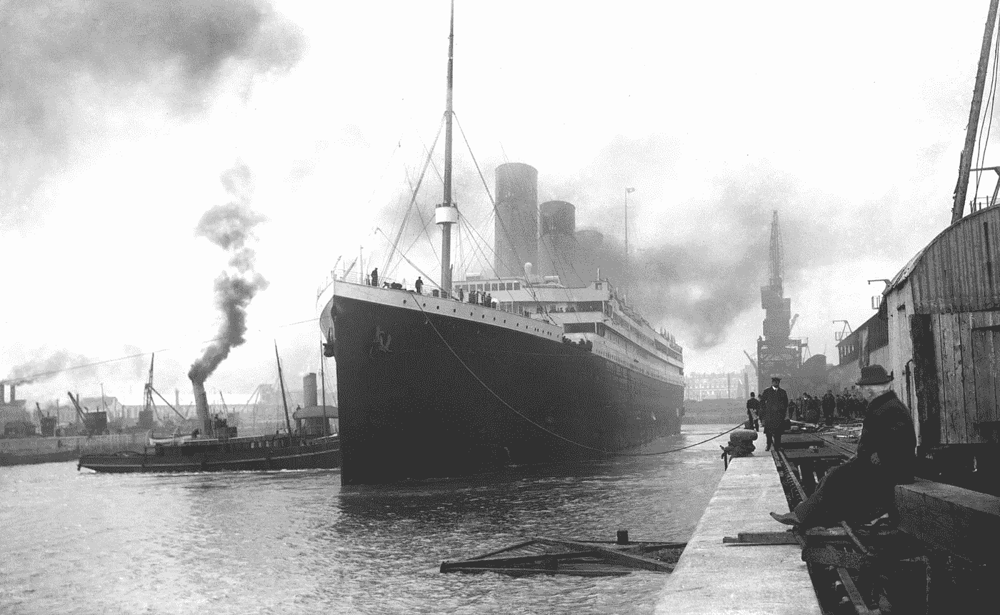

来源 Wiki[https://en . Wikipedia . org/Wiki/Titanic #/media/File:Titanic _ in _ Southampton . jpg](https://en.wikipedia.org/wiki/Titanic#/media/File:Titanic_in_Southampton.jpg)

历史上最臭名昭著的海难之一是泰坦尼克号。

这个著名的发布会吸引了大约 100，000 名观众和一群兴奋的记者。虽然这艘船是在贝尔法斯特建造的，并于 1912 年 4 月 2 日从这个港口开始了它的处女航，但航行被认为是从南安普敦开始的。它在南安普敦停留了 6 天，短暂开放给公众参观。

被认为是“不沉之船”的泰坦尼克号是一艘英国豪华蒸汽船，于 1912 年 4 月 10 日起航，船上有 2224 名乘客，在首航中沉没。这些乘客中的一些人正移民到美国。这场灾难发生在 1912 年 4 月 15 日凌晨，在北大西洋纽芬兰海岸附近，与一座冰山相撞，导致超过 1502 名乘客和船员在布满冰的水域中丧生。这是一个悲惨的事件，由于缺乏救生艇，导致了许多人丧生。

这一悲剧事件被称为海上最严重的灾难之一，它导致了众多安全法规和政策的产生，以防止未来的灾难。

*   这艘船有三种票价。人数最多的乘客是三等舱的乘客，他们中的一些人支付了不到 20 美元。
*   虽然谁能活下来有一些运气因素，但似乎一些群体，如特定年龄范围内的儿童、妇女和上层乘客，比其他人更有可能活下来。
*   总的来说有 32%的存活率。
*   船长在试图营救乘客时与船一起沉入海底。

# **目标**

探索影响一个人在泰坦尼克号上生存可能性的因素。

# **问题陈述**

基于乘客数据和特征，如年龄、性别、社会经济阶层等。建立一个预测模型，识别更有可能幸存的人。与已知地面数据进行比较，以验证模型性能。

# **关于数据集**

来自 [Kaggle](https://www.kaggle.com/c/titanic/data) 的 Titanic 数据集已用于分析，该数据集由具有以下 **11** 特征的 **891** 个案例和 1 个响应变量(幸存)组成。

**类别/名义特征:**具有两个或更多类别的特征。

*   **幸存**:标识乘客是否幸存为 a，0 表示未幸存，1 表示幸存。
*   **性别**:乘客的性别。
*   **登船**:登船港；c 代表瑟堡，Q 代表皇后镇，S 代表南安普顿。

**序数特征:**具有排序/等级的特征。

*   票价等级为 1 等/高级，2 等/中级，3 等/低级。社会经济地位的代表。

**连续特征:**可以有无穷大值的数值特征。

*   **年龄**:以年为单位，小于 1 时为小数。
*   **票价**:客运票价。

**离散特征:**具有明确边界的特征是不连续的。

*   **passengerid:** 唯一的行标识符，范围从 1 到 891。
*   T21:泰坦尼克号上的兄弟姐妹或配偶的数量。数据集将家庭关系定义为
    兄弟姐妹=兄弟、姐妹、继兄弟、继姐妹
    配偶=丈夫、妻子(情妇和未婚夫被忽略)
*   **烤盘**:乘客父母/子女号码。数据集将家庭关系定义为
    父母=母亲，父亲
    孩子=女儿，儿子，继女，继子
    如果孩子只和保姆一起旅行，那么 parch=0

**基于文字的特性:**

*   **票号**:票号字母数字。
*   **姓名**:乘客姓名，包括头衔、名、姓、昵称。
*   **客舱**:字母数字。

# **数据科学工作流程目标**

该工作流解决了以下目标。大类包括数据争论、特征提取/工程、特征缩放/选择和模型开发。下面的一些步骤可以结合起来并行执行:

*   **收集:**收集分析所需的数据。
*   **分类:**对样本进行分类，了解不同类别与我们的解决方案目标的含义或相关性。
*   **关联:**确定哪些特征(分类与数值)对响应变量的预测有显著贡献——幸存。这也有助于输入特征。最佳实践之一是在项目的早期执行特性相关性分析，然后将这些与我们建模的相关性进行匹配。
*   **转换/清除/纠正:**对于建模，分类文本特征需要转换为数值等值。我们可能还需要估计任何缺失的特性值，以确保模型在没有缺失值的情况下工作。可能需要对要素的异常值进行校正，以便起作用的因变量不会扭曲结果。我们也可以丢弃对分析没有贡献的特征。
*   **创建:**我们还可能基于现有的特性创建新的特性，以符合相关性、转换和完整性目标。
*   **图表:**我们将选择 apt 图表来可视化我们的数据。对于数据分析，最佳实践之一是使用多个图，而不是覆盖图，以提高可读性。
*   **情境化、归纳和交流**:通过统计模型、机器学习和算法进行深度分析，以建模、推断、预测、推荐和可视化。模型开发包括评估、调整、评估、部署和监控。

# 数据科学工具

统计计算库

# 探索性数据分析

EDA 是一种分析数据集的方法，目标是总结关键特征，通常是可视化的。可以使用统计模型，但主要目的是探索除了正式建模或假设检验之外，数据还能告诉我们什么。

数据列被转换为适用的数值或因子。

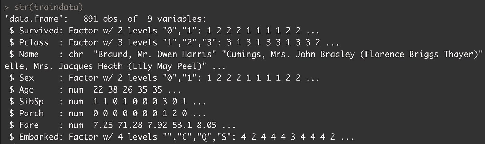

我们看到最低值、最高值、平均值和中值。

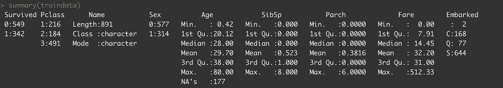

我们在名称功能中看到以下标题。

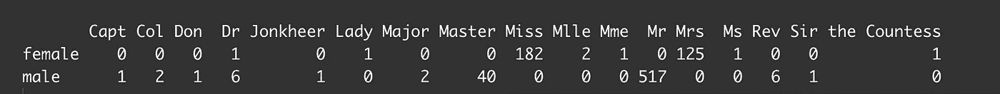

**创建新功能
-** 我们可能想要创建一个新功能，将 Parch 和 SibSp 结合起来，以获得所有家庭成员的数量。我们可以进一步把它分解成家庭规模的离散值，比如单身家庭、小家庭和大家庭。
-我们可能希望从姓名特征中提取头衔、名字和姓氏，以便进行探索性分析。然而，我们的模型不需要这个列。
-我们可能希望将连续年龄特征转换为有序分类特征。
-我们可能想要创建票价范围。
-我们可以根据姓氏推断种族，但预测模型不需要。
-基于年龄，我们可以创建一个新特征来识别乘客是儿童(< 18)还是成人(≥18)。

**更正&完成/输入数据
-年龄:**我们看到年龄栏有 177 个值空白(NA 的)。这些是使用年龄栏的平均值 29.70 估算的，因此分布保持不变。
- **登船:**有两个空值，根据乘客支付的 80 美元的票价，它们被估算为“S”，并且它们的票价等级为 1。
- **Ticket 和 PassengerID** :这个特性对我们的模型分析没有贡献，已经从数据集中删除。
- **船舱**:这个特性有 148 个唯一值，正在被丢弃，等级太多。这个特性也有 687 个空白值，而且非常不完整。
- **名称**:此特征是非标准的，对预测生存率没有贡献。

乘客的头衔是什么？
诸如“夫人”、“夫人”、“伯爵夫人”、“上尉”、“上校”、“唐”、“T3”、“博士”、“少校”、“牧师”、“爵士”、“琼基尔”等头衔被合并在“稀有头衔”下。这就剩下了先生、主人、小姐和夫人。我们看到 62%的乘客是男性，35%是女性。发现了 667 个独特的姓氏。

**按性别划分乘客的年龄是多少？** 大多数乘客都在 15-35 岁年龄段。从图表中我们看到更多的 10 岁以下的女性。15 岁以上大多数女性比男性年轻，65 岁以上的很少。总的来说，老年乘客很少，年龄最大的乘客高达 80 岁。28 至 35 岁年龄组的乘客存活率较高。

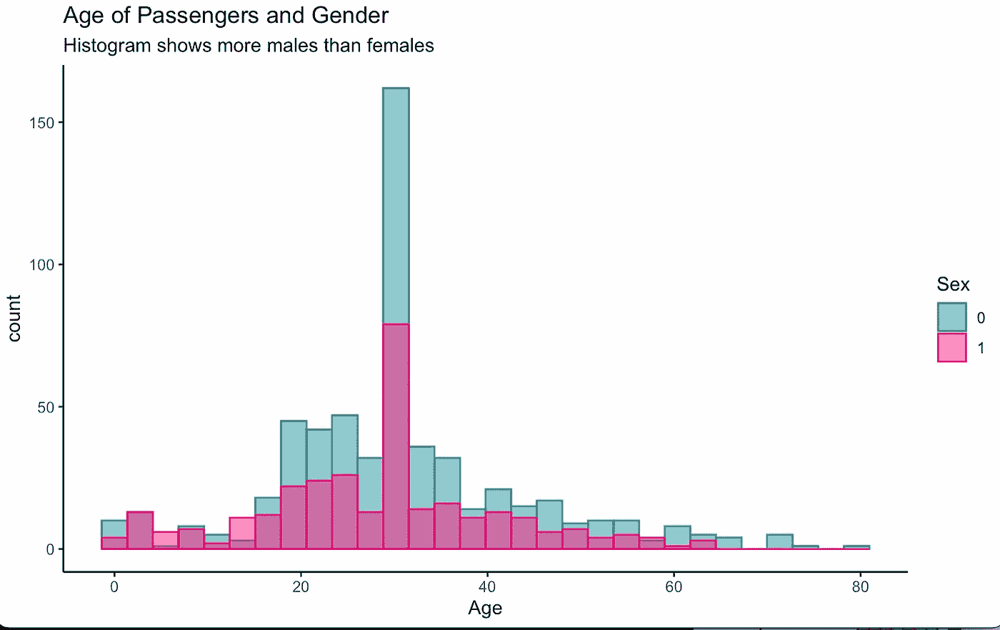

存活下来的是男性还是女性？机上共有 577 名男性乘客和 314 名女性乘客。从图表中，我们看到了更多幸存的女性。

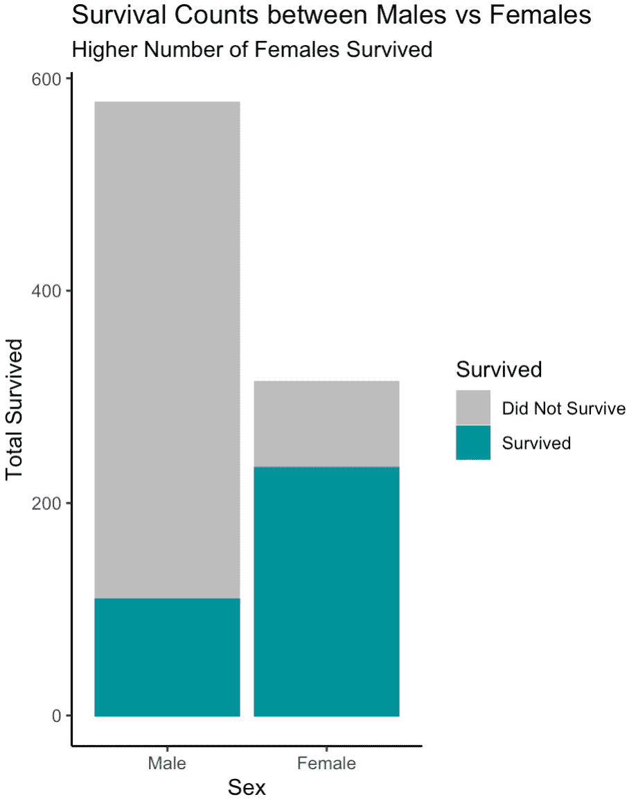

**死者 vs 幸存者的年龄？** 图中显示了幸存组和死亡组的乘客年龄分布。虽然存活组的平均年龄略低于死亡组，但没有明显的趋势。

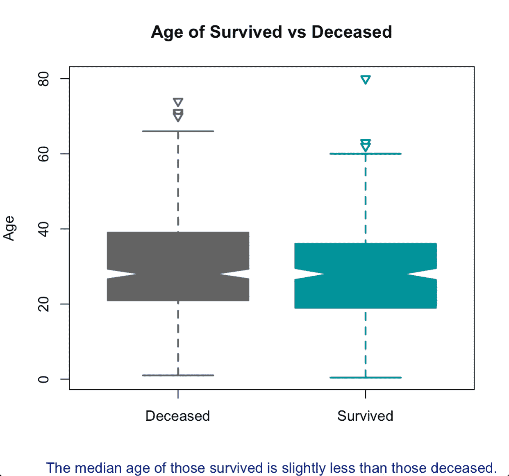

**基于客票等级的存活率有区别吗？**我们发现，支付更高票价或头等舱乘客的比例更有可能存活下来。

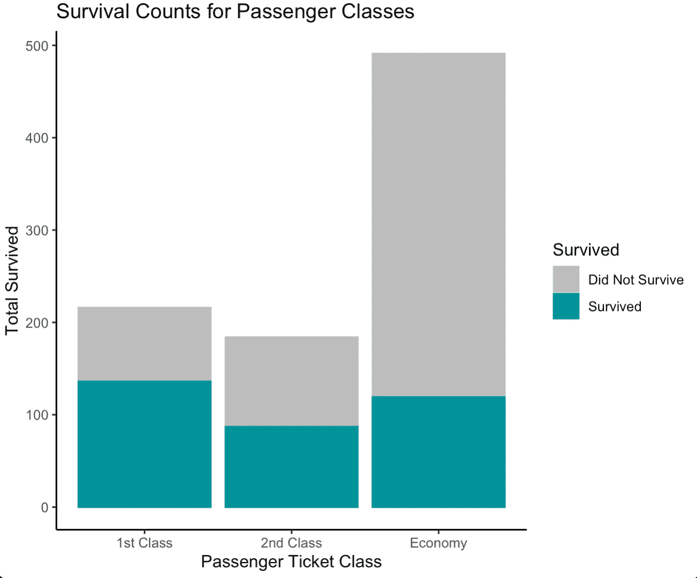

**有兄弟姐妹或配偶的乘客存活率如何？** 图表显示，大量遇难乘客没有兄弟姐妹或配偶随行。

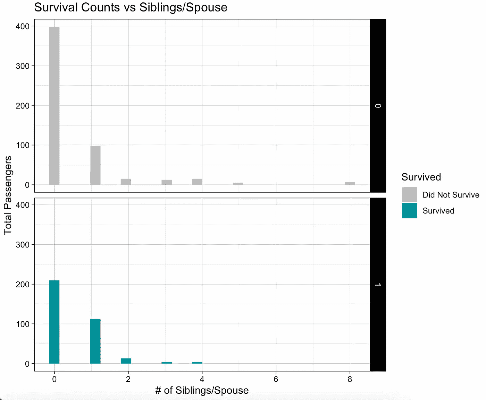

**家庭和单独旅行者的存活率是多少？图表显示，大量遇难乘客没有子女或父母随行。**

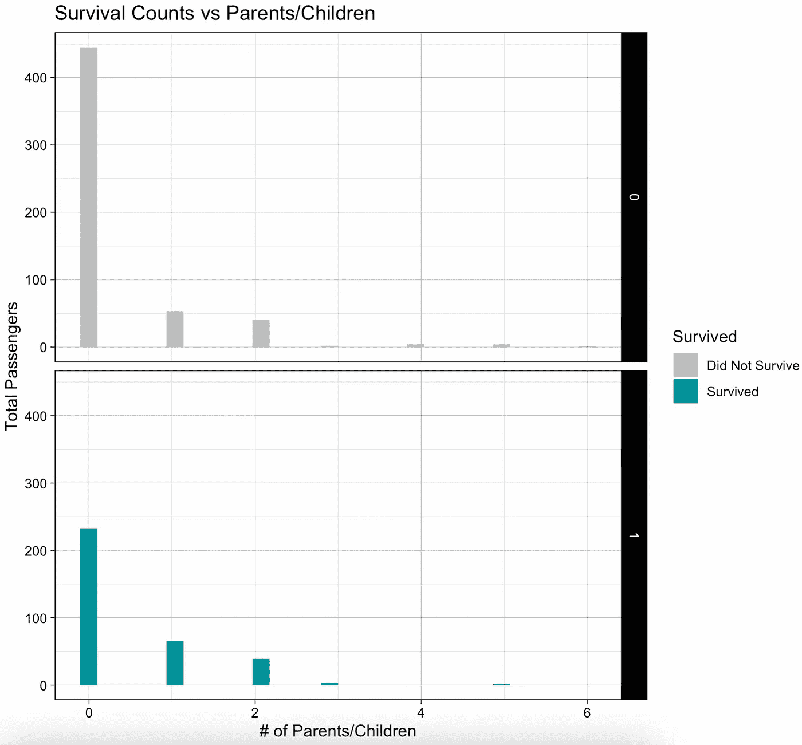

**幸存者和死者的票价相比如何？** 我们看到，那些幸存下来的人比那些没有幸存下来的人有着广泛的票价范围和总体较高的票价。一些乘客支付了高达 512 美元，占总乘客的 1%。

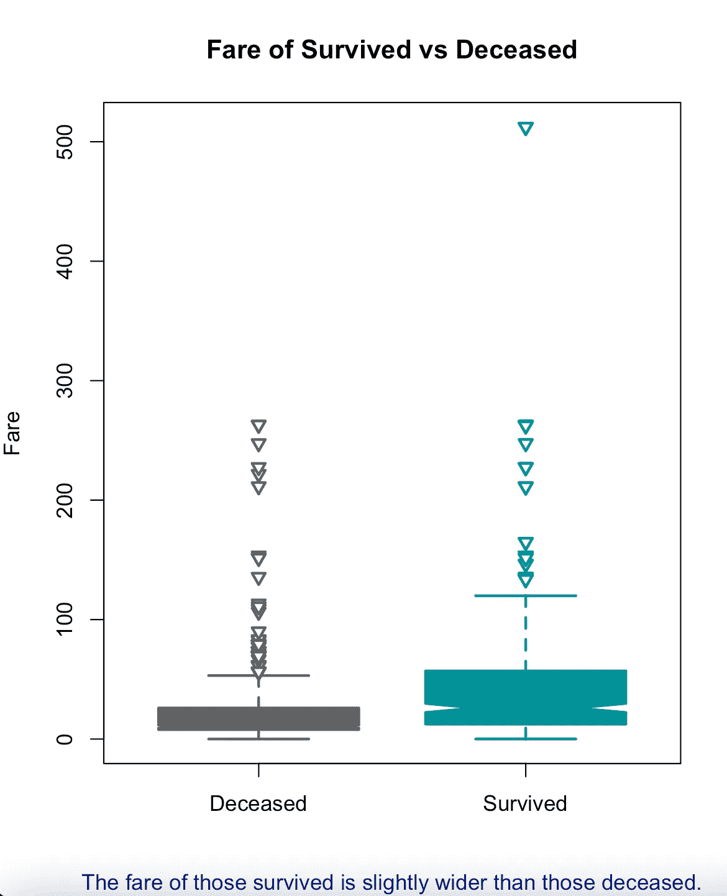

根据上船地点的不同，存活率有所不同吗？
大部分乘客从英国南安普顿的地点登机；这也是最主要的港口，其次是法国瑟堡，最后是人数最少的爱尔兰皇后镇。

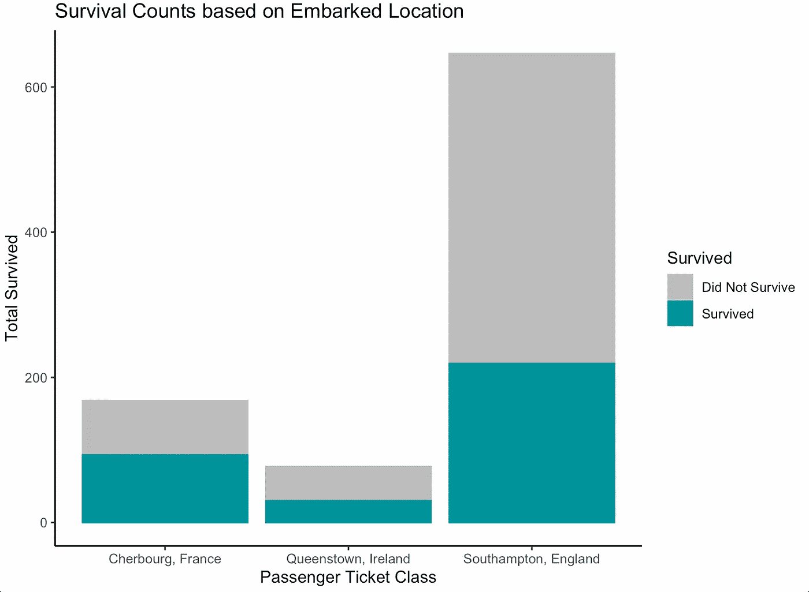

家庭是一起沉浮还是一起游泳？
根据兄弟姐妹/配偶的数量(可能某人有不止一个配偶)和子女/父母的数量创建新的特征家庭规模。虽然中位数是 1，平均值是 2，但最大值是 11 人的家庭规模。大多数家庭人口较多的上层乘客幸存了下来。

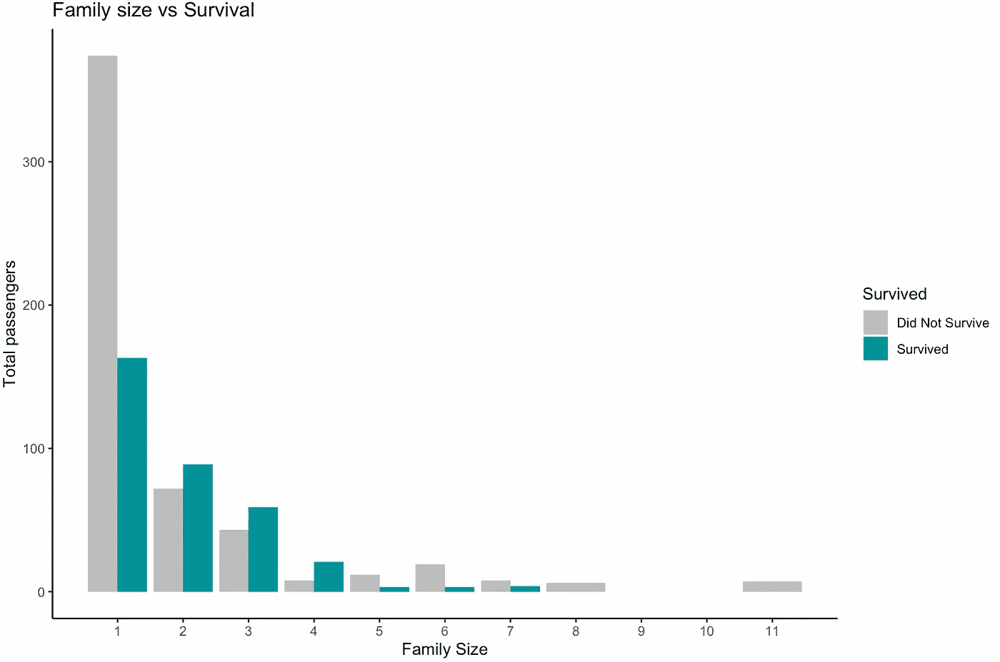

**特性之间的相互关系是什么？**
三等舱乘客生还的可能性最低，尽管女性的机会有所增加。令人震惊的是，50%的幼儿和青少年死亡。根据下面的条件干扰树图，一个合理的解释可能是他们来自更大的家族。

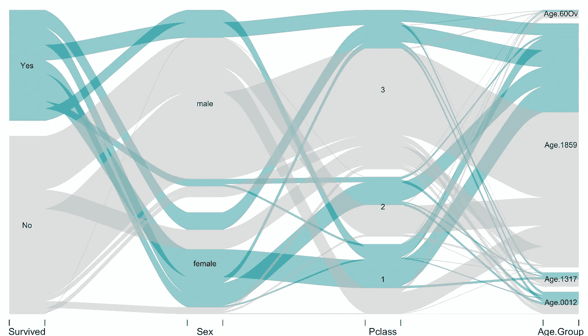

# **模型拟合&评估**

基于问题陈述，我们需要一个二元分类模型。训练集中的数据用于训练模型，测试集用于测量预测准确性。比较了以下机器学习算法，以选择性能最佳的算法。可以进行进一步的 10 倍交叉验证。r 编程语言已用于模型拟合和评估。

*   随机森林，**准确率 84.03%**
*   决策树， **83%** 准确率
*   拉索/岭回归， **82%** 准确率
*   径向支持向量机，**准确率 82%**
*   逻辑回归，**准确率 81%**
*   线性支持向量机，**准确率 81%**

选择随机森林模型是因为它具有 84%的最高准确率(来自混淆矩阵的最低错误分类率)来预测乘客是否幸存。