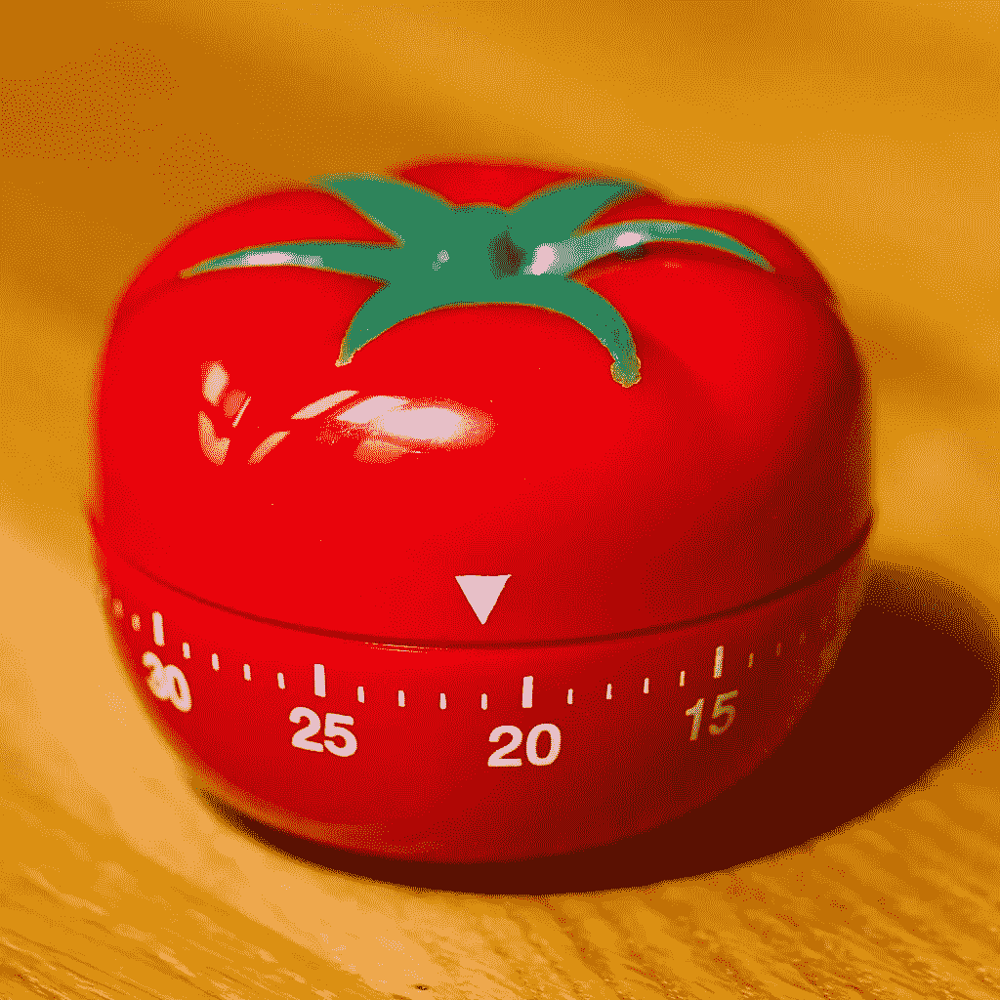

# 番茄工作法:生产力黑客

> 原文：<https://medium.com/nerd-for-tech/the-pomodoro-technique-productivity-hacks-1ef63e30282f?source=collection_archive---------26----------------------->

具有讽刺意味的是，最需要时间管理的人并没有意识到他们需要时间管理。有太多提高生产力的技巧，但是番茄工作法可能是讨论最多和使用最多的一个。它受欢迎的原因是它易于理解和实现。

这项技术的目的是交替番茄，中间有短暂的休息。我们说的番茄不是指西红柿(番茄在意大利语中是番茄的意思)。番茄工作法是一种专注的工作方式。

这个想法是在会议之间有短暂的休息，以促进持续的注意力集中，避免精神疲劳。这也有助于避免分心，因为在这项技术中，每件事都有时间和地点。

这种游戏化的目标设定帮助我优化了工作效率，完成了工作。

# 什么是番茄工作法？

番茄是一个循环系统。实现所需要的只是一个定时器。不需要其他特殊的应用程序或工具。(如果你想探索它们，有很多应用程序，但基本概念很简单)。以下是基本情况:

1.  定义任务
2.  设置 25 分钟的计时器
3.  执行任务，直到番茄定时器响起
4.  短暂休息 5 分钟
5.  重复
6.  吃完 4 个番茄后，休息 15-30 分钟

我已经把番茄工作法的持续时间改为 50 分钟，休息时间改为 10 分钟，我发现这对我更有效。

其他一些有帮助的事情有:

*   在开始之前，根据番茄来分解任务。这也有助于评估和清晰地跟踪进度。
*   将较小的任务分组放在番茄里。
*   番茄是不可分割的工作单位。它不应该被打破，以检查收到的信息，电子邮件等。任何介于两者之间的事情都应该推迟到 Pomodor 完成之后。
*   可能会有不可避免的干扰，创作者 Cirilo 建议应该跟踪这些干扰。然后，我们应该思考如何在下一届会议上避免这些问题。如果你决定不推迟转移注意力，就在那里结束番茄大战，稍后再开始新的一场。

# 什么使这种技术有效？

这个系统被有意保持简单，以保持我们的思想在完成任务的区域。

分解成更小的任务，一次解决一个，有助于避免拖延和消极情绪。开始变得容易，不用担心结果。我们倾向于一次只关注一个番茄。

番茄工作法也有助于对抗分心，它将我们的心流状态限制在一个番茄工作法之内，然后处理它之外的分心。我们也更容易意识到我们的时间去了哪里，因为我们在追踪番茄和番茄以外的分心事物的进展。

它有效的最大原因是，我们最终把我们的生产力游戏化了，欺骗我们的大脑去关注一致性而不是完美。

我也倾向于在休息的时候离开我的屏幕，散步，四处走动，或者只是伸个懒腰，吃点零食。

我使用 [Chrome 扩展](https://chrome.google.com/webstore/detail/marinara-pomodoro%C2%AE-assist/lojgmehidjdhhbmpjfamhpkpodfcodef?hl=en)来跟踪我的番茄，虽然一个简单的计时器也可以工作。但是这个扩展给了我对番茄工作法的分析，让我更容易坚持番茄工作法。

这就是关于番茄工作法的全部知识。如果你选择在你的时间表中实现它，请让我们知道进展如何！

*原载于 2021 年 7 月 21 日*[*【https://www.wisdomgeek.com】*](https://www.wisdomgeek.com/self-help/productivity/the-pomodoro-technique-productivity-hacks/)*。*