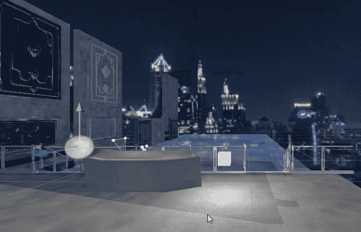
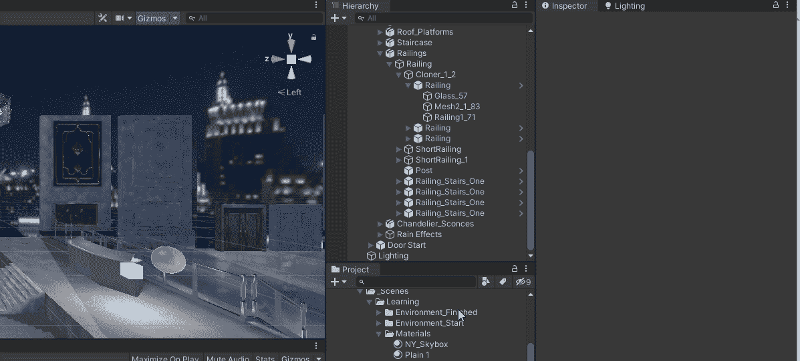
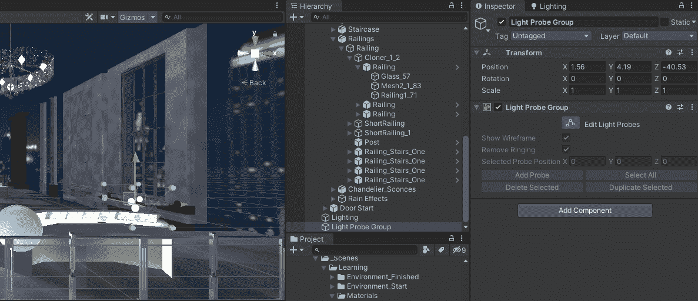

# 光在统一中探测的力量

> 原文：<https://medium.com/nerd-for-tech/the-power-of-light-probes-in-unity-bf8bad1d0960?source=collection_archive---------7----------------------->

**目标:**使用光探头组使用发射的光，将其投射到在场景中移动的动态游戏对象上。

光探头演示

灯光探针所做的是将场景中烘焙的灯光数据投射到穿过场景的动态对象上。在上面的场景中，我们在服务台和立方体上有一个发射通道，通过灯光探头，烘焙的灯光被投射到经过的球体上。

接下来，我将演示如何创建光探测器组。

创建光探针组

现在光探头组已经创建好了，我将调整并拉伸它到我想要反射光的区域。这是通过按住 Ctrl 键并单击每个探针然后单击复制来选择每个光探针来完成的。一旦复制，我们可以拖动他们到我们想要的地方。我们想确保它们覆盖我们想要的区域。

调整光探头组

现在我们已经设置好了光探针组，让我们看看它是如何工作的。

演示

使用光探头的一个优点是你可以用一个光源(非常昂贵)来照亮整个场景。这对于资源有限的手机游戏来说是非常好的。

编码快乐！！