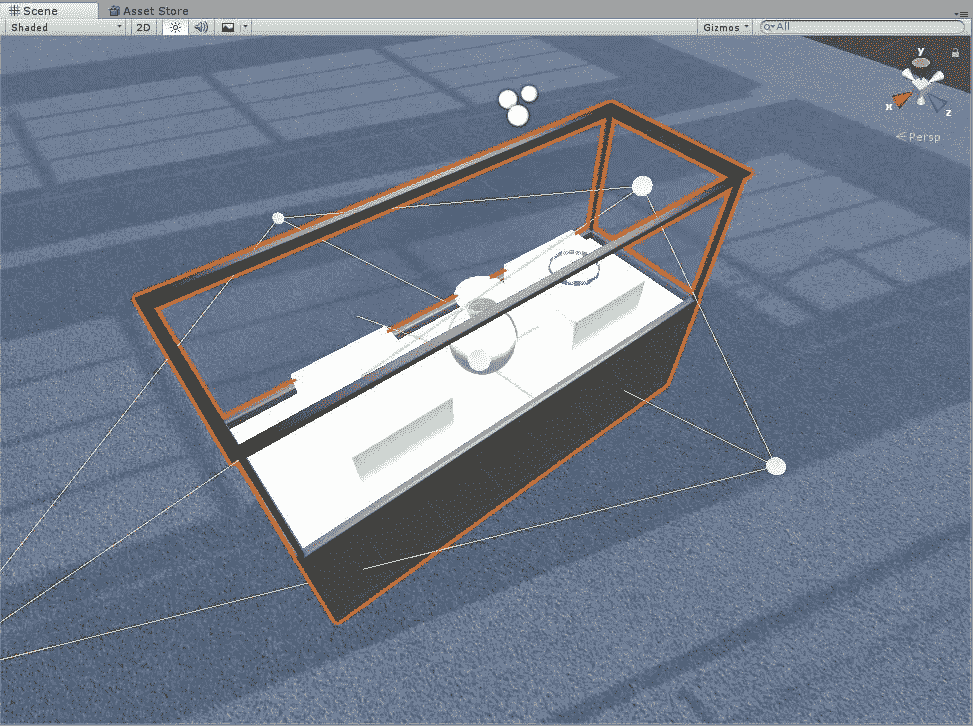
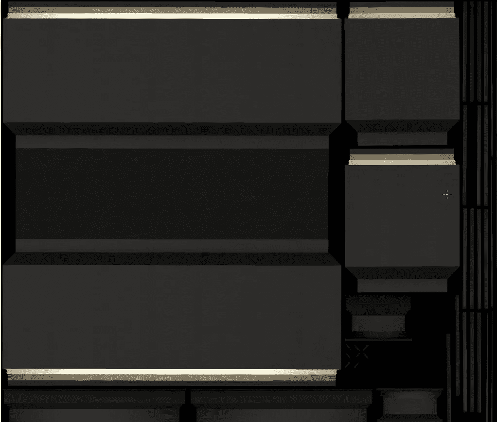
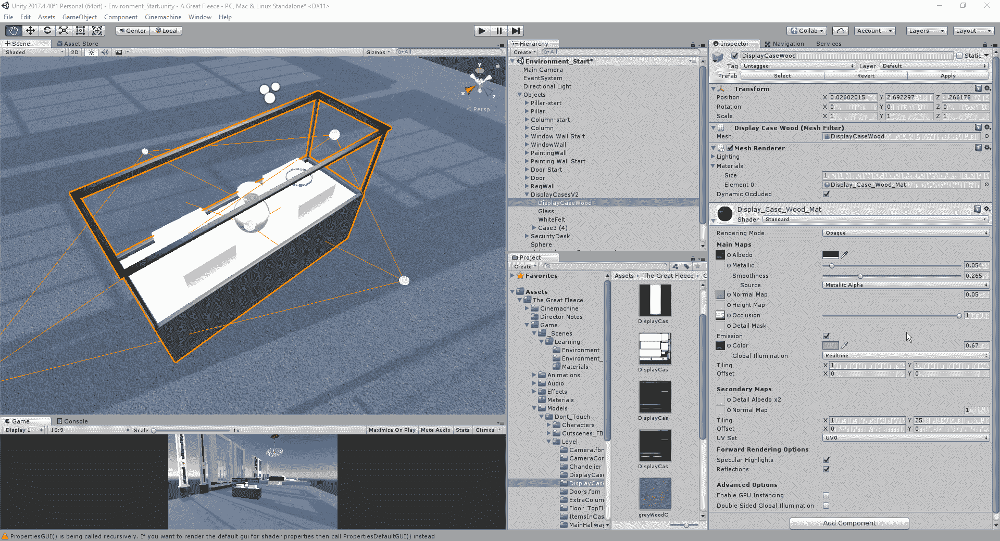
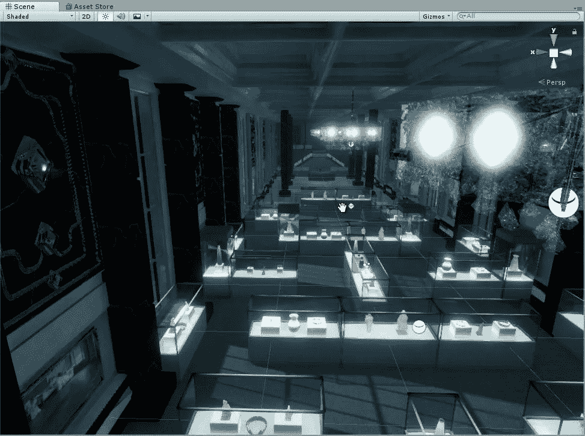
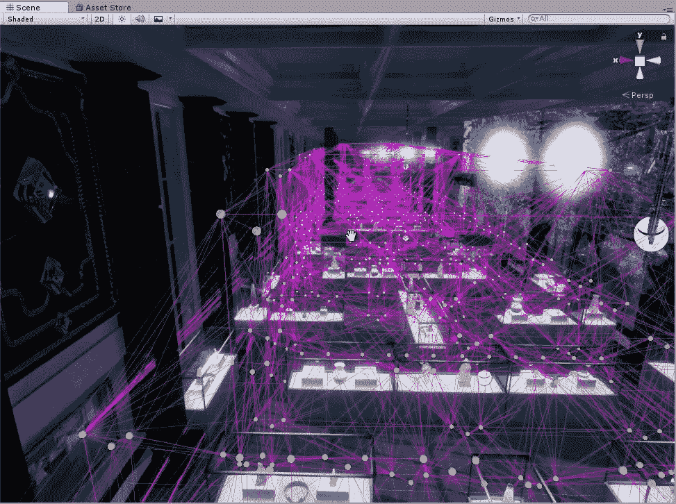

# 用探针和发射照明的力量

> 原文：<https://medium.com/nerd-for-tech/the-power-of-lighting-with-probes-and-emission-b5b2455b9d6b?source=collection_archive---------26----------------------->

在 Unity 中，我们有很多方法来照亮场景。今天，我将介绍几种不同的照明方式，以及它们的工作原理。

## 发射照明

首先，我们将看看发射照明。在 Unity 中，发射照明是指材料的颜色和强度以某种方式呈现，使物体看起来是自发光的。通常，艺术团队会制作一些贴图，详细说明物体的哪些部分会比其他部分更亮:

正如我们所看到的，这个陈列柜的边缘被照亮了，这在我们的场景中给了它一个错觉，它上面有一个光源。当我们回到编辑器中时，我们可以调整发射的强度，使它要么发射大量的光，要么完全没有光:

## 光探头

在 Unity 中，光探头主要有两种用途:

1.  主要用途是为场景中的移动对象提供高质量的照明
2.  当使用 Unity 的 LOD(细节层次)系统时，为静态场景提供照明信息

使用光探头如此有效的原因是，在有许多事情发生的场景中，看起来可能有多个光源，我们可以实施一个大规模的探头网格，并有效地使用单一光源:

看起来有很多光源的场景

巨大的探针网格提供一个光源

为了达到这种程度的照明，需要投入数小时的工作才能让它工作得如此之好。