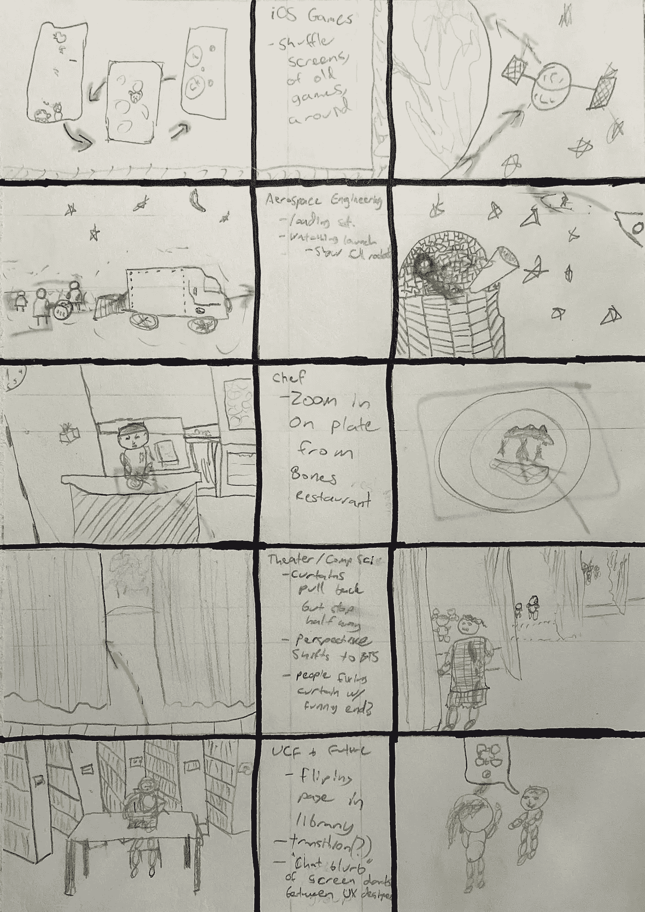
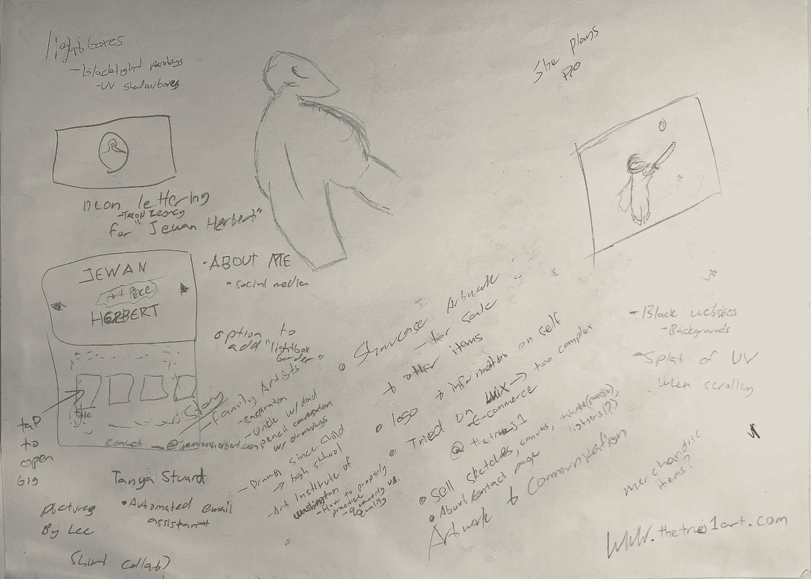
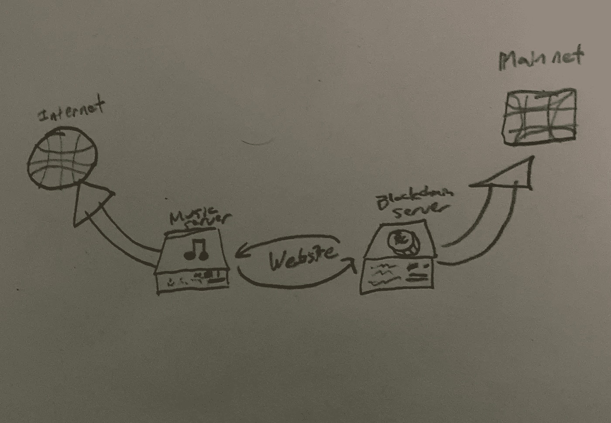

# 纸张的力量

> 原文：<https://medium.com/nerd-for-tech/the-power-of-paper-ead0a1eed2be?source=collection_archive---------6----------------------->

> “我认为，绘画是一种沉思的行为。因为当你赋予它形状，你画出它的线条，它的纹理，然后它的颜色，它会告诉你它想变成什么样子。”
> 
> ——内里·奥克斯曼，*麻省理工学院媒体实验室教授*，[摘要:设计的艺术；5:00](https://www.imdb.com/title/tt10984534/?ref_=ttep_ep2)

我的个人网站上的动画故事板草图， [Nikhil Designs](http://www.nikhildesigns.com)

将想法写在纸上可能是交流问题最快捷、最方便的方式之一。当处理产品设计的世界时；团队越快达成共识，想法就能越快实现。虽然我和其他设计师一样喜欢我的绘图板，但第一次见客户时，我只带笔和纸。除了将我从无数笔的选择中解放出来，设备的缺乏让我可以专注于更私人的对话。如果谈话特别技术性，或者涉及大量利益相关者，我会用手机录下音频。

给客户的草图和笔记；这些潦草的字迹不是交流思想所需要的，只是个人回忆。

我最喜欢的学画画的工具是[画个框](https://drawabox.com/)和 [Proko](https://www.proko.com/) 。感谢您的阅读时间，祝您愉快！

解释 NFT 的音乐服务