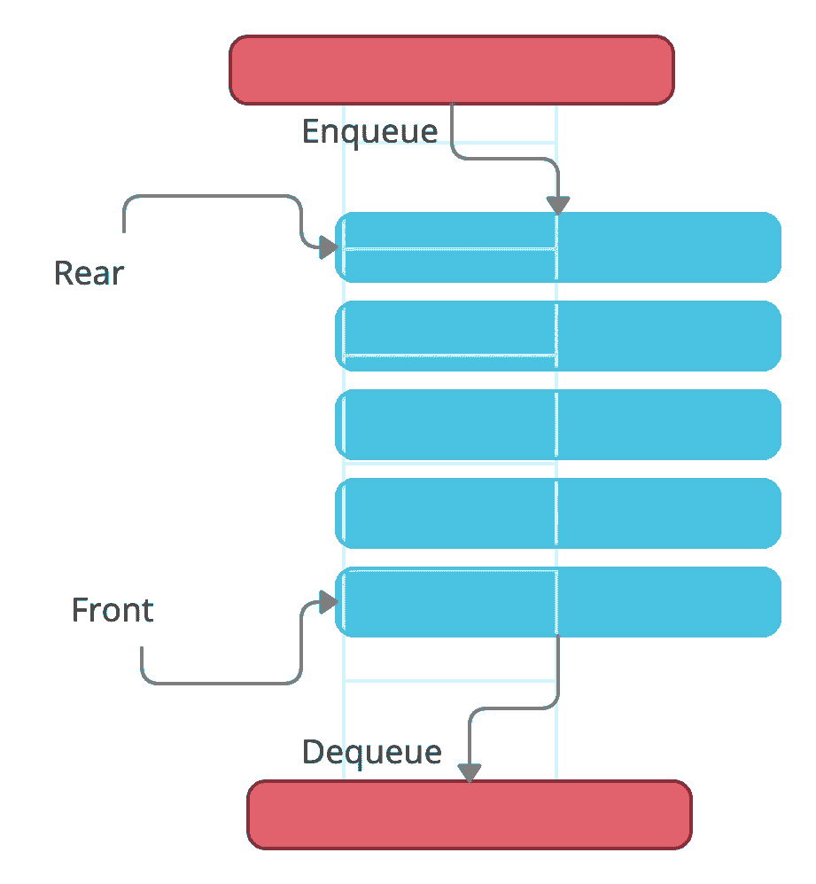
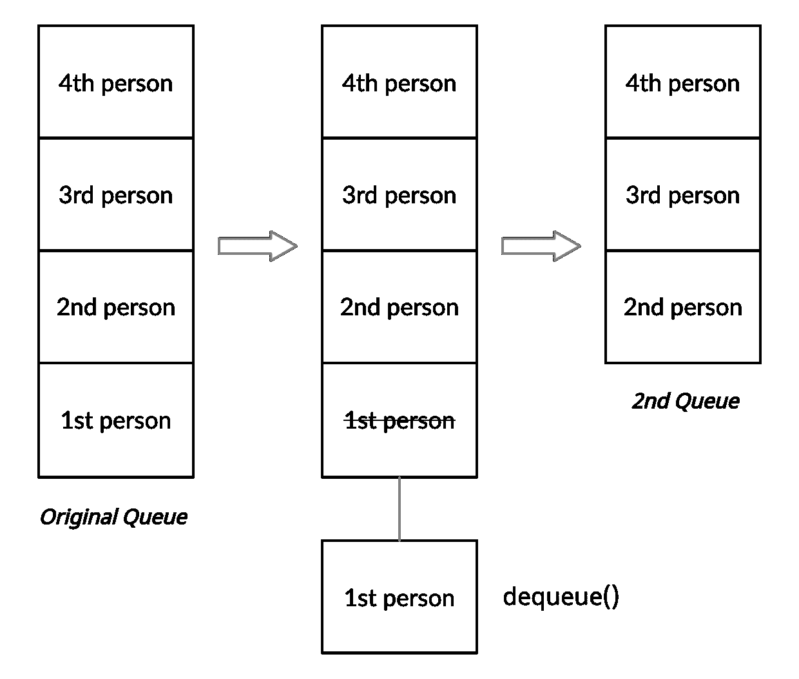
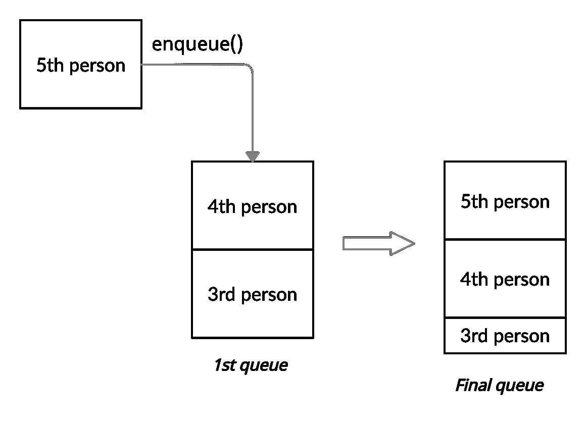
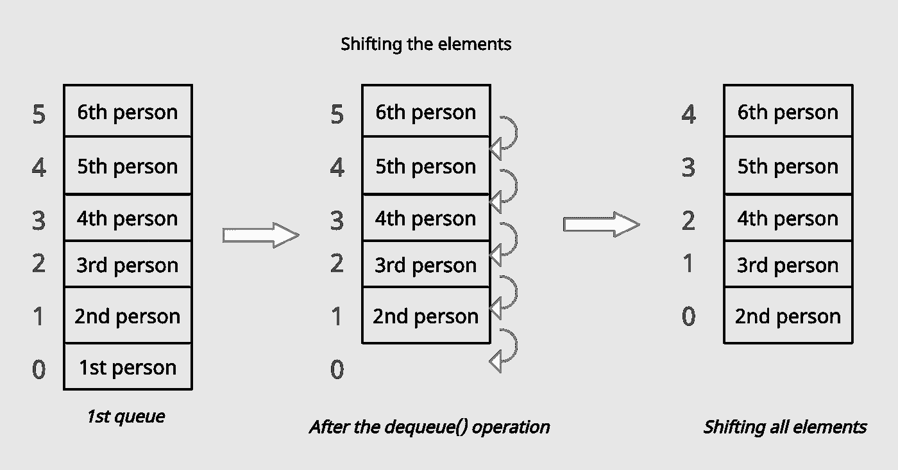

# 队列数据结构。

> 原文：<https://medium.com/nerd-for-tech/the-queue-data-structure-77be9054e67c?source=collection_archive---------5----------------------->

阿德里安·德尔福吉在 [Unsplash](https://unsplash.com/s/photos/queue?utm_source=unsplash&utm_medium=referral&utm_content=creditCopyText) 上的照片

# 基础知识

队列是一种线性数据结构，它遵循访问元素的顺序。它非常类似于堆栈，但唯一的区别是队列两端都是开放的。一端用于添加元素，另一端用于删除元素。添加和删除元素的技术术语分别叫做 ***入队*** 和 ***出列，*** 。

队列数据结构的简单说明。

队列令人兴奋的部分是我们不能对队列中的每个元素进行操作。只有队列的前端和后端可以被访问或操作。

> **问题:为什么我们不对队列的每个元素进行操作？
> 答:**如果我们可以对队列的每个元素进行操作，那么就没有队列点了。然后队列就变成了一个数组。在数组中，每个元素都可以被直接访问和操作。队列的应用不同于数组的应用(在本文中讨论)。

队列数据结构是先进先出(FIFO)数据结构。队列中的项按照插入的顺序进行检索。

> **注意:**为了实现队列数据结构，我们可以使用数组、堆栈或链表。

# 这些方法

队列使用这五种方法。

1.  *enqueue()* —将元素添加到队列中
2.  *dequeue()* —删除并返回队列中输入的第一个项目
3.  *isEmpty()* —根据队列是否为空返回真或假
4.  *front()* —返回队列的最前面的元素
5.  *print()* —返回队列的所有元素

> **注意**:*print()函数只是返回队列中的所有元素。这不是一种直接访问队列中特定元素的方法。*

# *详细的例子*

*一个简短的连环画，给出了队列数据结构的基本概念。*

*现在，让我们稍微从技术上理解一下上面的漫画！*

**

*展示上面漫画中队列数据结构的插图。*

*在上面的连环画中，有四个人在收银台等着买书。一旦第一个人支付了书款，他/她就退出队列(第一个元素出队)。因此，从原始队列(包含所有四个人)中，第一个元素出队，使第二个人成为队列中的第一个元素。类似地，当第二个人完成支付书籍时，他/她退出队列(出列)，之后第三个人成为队列中的第一个元素。如果另一个人加入队列，他/她将被添加到队列的顶部。*

**

*显示队列数据结构中 enqueue()操作的图示。*

*这是对队列数据结构如何工作的简单解释。现在让我们了解一下队列的优点以及何时应该使用它们。*

# *大 O 符号*

*根据队列数据结构理论，所有操作的时间复杂度应该是 ***O(1)。*** 对于不知道这是什么意思的人来说， ***O(1)*** 是一个数据结构或者一个算法所能拥有的最高效的时间复杂度。 ***O(1)*** 告诉我们，即使队列中的元素数量增加，完成该操作所需的时间也将保持不变。*

> ***问题:为什么时间复杂度 *O(1)* ？
> 答:**当我们在使用入队操作的时候，我们是在后面添加元素。不需要循环整个元素列表来完成操作。因此，时间复杂度为 O(1)。类似地，在出列操作中，您从前面移除元素，并且也没有必要循环所有元素；但是，当使用数组实现队列时，这种出队的复杂性会发生变化。*
> 
> ***问题:使用数组实现时，队列的时间复杂度为什么会变化？
> 答:**在使用数组实现的队列中使用出列操作时，时间复杂度变为 O(N)。原因很简单。由于数组是基于索引的，所以每当从前面移除一个元素时，队列中的每个元素都应该移位一个值-1(每个元素的索引应该是元素的**原始索引- 1** ) **。**因此，出列操作的时间复杂度发生变化。下图说明了同样的情况。*
> 
> *注意:上面的解释适用于我们使用数组实现队列的时候。如果我们使用链表来实现队列，那么入队和出队操作的时间复杂度是 **O(1)** 。*

**

*使用数组实现的队列中的出列操作的图示。*

# *队列数据结构的应用/用途*

*队列数据结构有多种用例。一些涉及到先到先服务的事情可能会用到队列。一些实际应用包括:*

1.  *基于多人视频游戏/皇家战役的视频游戏*
2.  *模拟实体队列，人们排队等候超市结账*
3.  *当通过互联网发送数据时，各种数据包在队列中等待发送。*
4.  *响应请求的服务器。通常，这些请求存储在队列中。在这种情况下，遵循先来后到的政策。*

*我还有一篇文章是关于如何在 javascript 中使用数组实现队列数据结构的。这里可以看[。](https://meghagarwal.medium.com/implementing-the-queue-data-structure-using-an-array-in-javascript-a39bc2c8ca45)*

*如果你喜欢这篇文章，掌声会激励我继续写这样的文章:)*