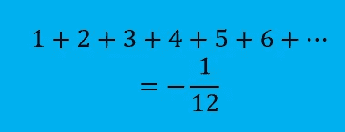
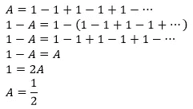
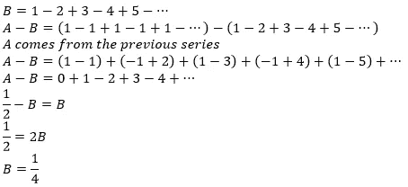
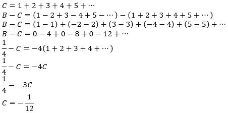
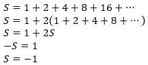
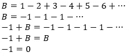

# Ramanujan 求和及其他

> 原文：<https://medium.com/nerd-for-tech/the-ramanujan-summation-and-others-97d17c876032?source=collection_archive---------1----------------------->

## 1+2+3+4+…=-1/12???

Ramanujan 求和似乎是一个悖论。毕竟，所有自然数之和怎么可能是负数，那也是一个分数？这件事背后似乎有一些无可辩驳的证据。然后我会告诉你为什么它是错的。

首先，我们将利用格兰迪的系列:

*注:我写了一篇关于格兰迪系列的文章，你可以在* [*这里*](/nerd-for-tech/how-to-refute-grandis-series-37f5c3cff3f9) *查看。*

这本身就很吸引人。然而，我们将在这个看起来相当正确的证据中看到一个错误。现在，让我们继续这个故事:

现在，我们进入这个证明的最后也是最疯狂的一步:

现在你知道了。所有自然数之和为-1/12 的证明。这个求和以著名的 Ramanujan 求和而闻名。现在，在我证明这是错误的之前，我想给你们看几个其他疯狂的答案，我们可以用这个来得出:

我不确定它是否有名字，但它很酷。不幸的是，这不是我自己的发现，但很遗憾，我不记得我最初是在哪里看到的。下一个例子实际上是我最近才想到的。我不确定它以前是否被发现过，所以请原谅我称之为我自己的发现:

这似乎比我们之前看到的任何东西都疯狂！-1=0?？这怎么可能？对于这一点，我想你可能会说这可能不成立，因为它取决于最后一项，只有最后一项为负时才成立。然而，我们做出这些结论**与上一届的**无关。这是我们做出所有这些结论的原因之一。因此，在这个假设下，我们可以说所有这些总和都是正确的。

*注意:这类求和其实是有名字的！它们被称为 Cesàro sums。你可以在* [*这里*](https://en.wikipedia.org/wiki/Ces%C3%A0ro_summation) *阅读更多关于他们的内容。它使用了一堆复杂的数学术语，但如果你真的想看，就去看吧。*

现在，是时候了。在看到所有这些疯狂的结论后，我真的怀疑你们想推翻它们。但是，完成这篇文章是我庄严的职责。因此，我现在怀着极大的悲伤声明:我们迄今所做的一切都是错误的。“为什么？”，你可能会问。这是因为我们不能假设所有这些数字的总和有一个值。例如，当我们说 B = 1–2+3–4+5-…时，我们假设他们有一个固定的和作为 B。只是因为我们做了这样的假设，我们才能做出所有这些疯狂的发现。

所以，这些系列相当有趣。把它们展示给你的朋友，并用这个逻辑难倒他们，玩得开心！

如果你喜欢这个故事，看看这个看似困难的问题。