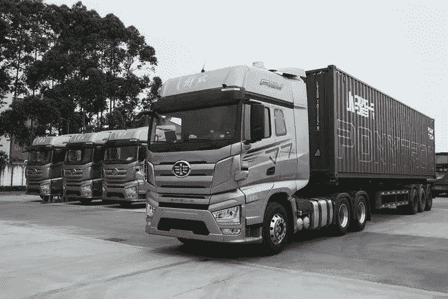

# 新一代自动驾驶数据标注解决方案

> 原文：<https://medium.com/nerd-for-tech/the-reason-why-high-tech-companies-choose-to-outsource-instead-of-building-the-in-house-labeling-bc8cb5891506?source=collection_archive---------7----------------------->

## 高科技公司选择外包而不是建立内部贴标团队的原因

小马。创

# 2021 世界人工智能大会(WAIC)几乎成了自动驾驶的主秀

将近一半的展区就像一个停车场，停满了各种不同的车辆。有 L4 级别的卡车，出租车，快车，清洁车，这是 WAIC 第一次开放 2.8 公里的无人驾驶道路。

其中比较著名的有商汤科技的 Senseauto AR 小巴，美团的无人驾驶外卖，小马的智能卡车。Tron、Inceptio Technology、TuSimple 也吸引了很多人的目光。在本次大会上，自动驾驶的普及与成熟的 AI 技术密切相关。

现在 L3 已经实现，L4 触手可及，似乎突破无人驾驶最后一公里已经不是什么大问题了。

与此同时，许多企业也加入了自动驾驶的行列。原因是新能源汽车行业发展迅速，让大家都有了分一杯羹的想法。但是，人工智能有自己的发展原理。算法、算力、数据缺一不可。

**前两者目前基本都是业界关注的，但是对数据的关注要少很多**。目前，人工智能逐渐在自动驾驶领域实现，并开发出自动驾驶、疲劳监测、无人配送、辅助驾驶、语音交互、手势交互等细分落地场景。

# 在活动上，数据标签服务提供商发布了新一代自动驾驶数据解决方案

贴标服务商贾提到，客户在汽车行业的上、中、下三个层次，主要包括汽车工厂、自动驾驶技术公司，以及一些使用地图、芯片、传感器的互联网公司。

通常情况下，汽车制造商和 AI 公司是共同的客户。如果公司是业务型的，他们大多在 L2-L3 水平左右，主要从事辅助驾驶和人机交互。如果是纯科技公司，早就从事 L4 甚至 L5 级别了。

根据企业的需求，自动驾驶算法的训练可以分为三个阶段。

**在第一阶段，有一些基本要求，如人脸识别、车辆识别等。**

第一阶段的企业需要识别一些特定的元素，如人、车、路标等。

此时，他们不依赖特定的设备。

**第二阶段是用特定的传感器收集和注释数据。**

在这个阶段，AI 模型可以识别某些内容。现在这些公司打算做 3D 识别。由于来自 2D 的标注方法不同，他们需要基于特殊场景的特定数据标注解决方案，这也对应于硬件配置。

目前深度学习网络对场景的依赖性很高，比如水杯的识别。如果你打算训练室外识别，你需要做一个特殊的算法来识别室外水杯，然后你可能需要得到 1000 个室外水杯图像来进行训练，而不是室内的。

**第三阶段是产品已经推出，我们需要积累可扩展的数据来更好的算法，像特斯拉一样。**其实特斯拉**T3 已经积累了很长时间的用户数据。**

高科技公司选择外包而不是建立内部团队的原因是**数据标签公司在定制数据服务方面非常有经验**。然而，许多企业没有这种经验，也不知道如何处理突发事件。

**日程上有严格的要求**。此外，在自动驾驶领域，对数据标注的需求水平也越来越高。

在过去，要求很简单——识别物体是否是车辆。现在，从 2D 到 3D 图像，有些甚至已经超过了人眼的极限，可以具体标注车型。

## 如果未来有公司实现了 L5 自动驾驶，那么所有的数据标注公司都会失去业务吗？

贾说，我们可能需要一段时间才能真正实现无人驾驶和商业化。即使在 L5，也会出现一些新的商业场景。例如，在车辆识别之后，我们要处理交通地图知识和车辆轨迹预测。人机交互也可能达到更高的水平:定制服务，使其更加智能。

# 结束

将你的数据标注任务外包给 [ByteBridge](https://tinyurl.com/ncfxexrb) ，你可以更便宜更快的获得高质量的 ML 训练数据集！

*   无需信用卡的免费试用:您可以快速获得样品结果，检查输出，并直接向我们的项目经理反馈。
*   100%人工验证
*   透明和标准定价:[有明确的定价](https://www.bytebridge.io/#/?module=price)(包含人工成本)

为什么不试一试呢？