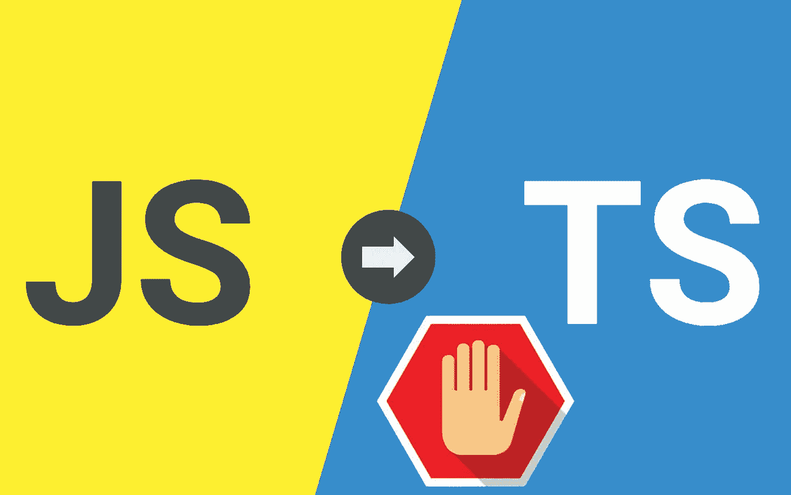

# 不从 JavaScript 迁移到 TypeScript 的一个原因

> 原文：<https://medium.com/nerd-for-tech/the-reasons-not-to-migrate-from-javascript-to-typescript-89b587ed9ac9?source=collection_archive---------3----------------------->

## Typescript 节省了大量的开发时间，但是整个迁移过程值得吗？

图片由[作者](https://www.udemy.com/user/arnold-abraham-3/)制作

每当有一个项目需要迁移到另一种语言时，你内心的声音会颤抖并尖叫:不，上帝！请不要！
它不在乎你是否在工作，你必须做，因为编码是你的…