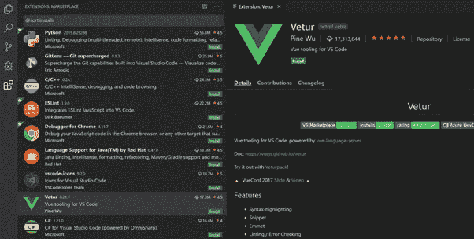

# 您必须使用 Visual Studio 代码的原因

> 原文：<https://medium.com/nerd-for-tech/the-reasons-why-you-must-use-visual-studio-code-ae3ecd72133f?source=collection_archive---------10----------------------->

**Visual Studio Code** 是一个非常流行的编码编辑器，被全球数百万开发人员使用。

如果你是一名**的 Web 开发人员，**你可能会使用**的 Visual Studio 代码**来编写你的项目。

它的流行是由于这些年来 web 开发领域的增长以及开发人员对拥有一个**轻量级优秀编辑器**的需求，与市场上的其他编辑器相比**功能较少，但没有**复杂。

它也是免费的，由微软用现代方法开发和维护。

这些是**将 VSCode 带到编码编辑器顶端的一些特征**，但在本文中我还想与您讨论其他一些特征。

1.开源

VS 代码大多是**[**开源**](https://github.com/microsoft/vscode) 的事实是一个前所未有的优势。**

**这不仅意味着该软件可以免费使用，而且你可以帮助改进它**

****

**如果你想增加社区参与度，开源是一个很好的选择。**

**虽然不是所有的 VS 代码用户都对它的代码库做出了贡献，但是他们有一种统一的感觉。**

**其他代码编辑器如 [**Atom**](https://atom.io/) 甚至整个 ide 如 [**Eclipse**](https://www.eclipse.org/) 或 [**NetBeans**](https://netbeans.org/) 也是开源的。**

**2.简单**

**从最初的步骤到安装新的扩展，VS 代码中的一切都感觉简单而直观。**

**也就是说，我并没有暗示 VS 代码在特性方面有任何不足，一点也没有。**

**由于它的**可扩展架构**(我们一会儿会谈到)，VS 代码，即使只是一个代码编辑器，也可以成为其他更复杂的 ide 的有价值的替代品。**

**但是，与那些 ide 不同，它仍然设法以一种紧凑的、用户友好的方式来做这件事。**

**这种简单性也通过 VS 代码**性能**表现出来，这是令人惊讶的好，尤其是对于一个电子 app 来说。**

**3.熟悉**

***VS 代码使用* [***电子***](https://www.electronjs.org/) *构建——借助****Chromium****和****node . js****用 JavaScript 创建桌面 app 的框架。***

**许多使用 VS 代码的 web 开发人员意识到并理解这一事实，但并不是所有人都这样做，主要是因为 Electron apps 臭名昭著的高内存使用率和低性能。**

**另一方面，VS Code 利用其令人印象深刻的 [**TypeScript**](https://www.typescriptlang.org/) 集成为**自动补全**和其他对 **JS** 和 **TS** 有用的编辑特性提供动力。**

**如果你正在使用 TypeScript，可以说 VS 代码是你最好的选择。**

**所以，事实上 VS 代码是建立在 web 技术之上的，并且也为 web 技术提供了很好的支持，这让它感觉很熟悉，并且几乎是其不断增长的用户群中的一大部分 web 开发人员的默认选择。**

**4.最小设计**

**设计通常是一件非常主观的事情，但未来是最小的，VSCode 决定接受这种设计方法的原则。**

**VS 代码的用户界面干净且设计良好**

**如果你不太喜欢默认的基本设计，你可以创建你自己的 [**定制主题**](https://areknawo.com/5-of-the-best-vs-code-themes-compared-an-opinionated-review/) **，它具有很高的灵活性，可以让你定制编辑器的几乎所有 UI 元素。****

**如果你没有时间自己制作一个，你可以从市场上的几千个主题中选择一个，其中很多都很不错。**

**在这方面，VS Code 的唯一对手可能是 **Atom** ，尽管它 [**在其他几个方面**](https://areknawo.com/vs-code-vs-atom-how-to-decide/) 有所欠缺。**

**5.扩展ˌ扩张**

**在 [**VS 代码市场**](https://marketplace.visualstudio.com/vscode) 中，几乎每天都有新的扩展出现！**

****

**扩展可以服务于许多目的**。****

****从类似扩展的 UI 主题到编程语言支持、调试、Git 集成，甚至 Spotify 播放器！****

****借助一些 JavaScript/TypeScript 和 [**详细文档**](https://code.visualstudio.com/api) 可以轻松制作自己的。****

****扩展非常重要，因为它们使 VS 代码成为现在的样子，**是一个非常有能力的软件**。****

****如果没有它们，VS 代码将不会比拥有良好设计和基本自动完成功能的文本编辑器好多少。****

****扩展对于定制你的软件以适应你的个人需求非常重要。****

****结论****

****所以，这些就是为什么 VSCode 是一个令人敬畏的代码编辑器，你不应该忽视的原因。****

****我们看到了许多方面，从**书写感觉**到它提供的**功能，并且**我们可以注意到它在所有领域都有一些有效的观点。****

****需要说明的是，我并不是说它没有缺陷，或者市场上的所有其他替代品都是垃圾， **VS 代码当然不是完美的**，并且有许多你可能感兴趣的 [**的替代品**](https://areknawo.com/top-7-vs-code-alternatives/) 。****

****感谢阅读，继续学习，快乐编码！****