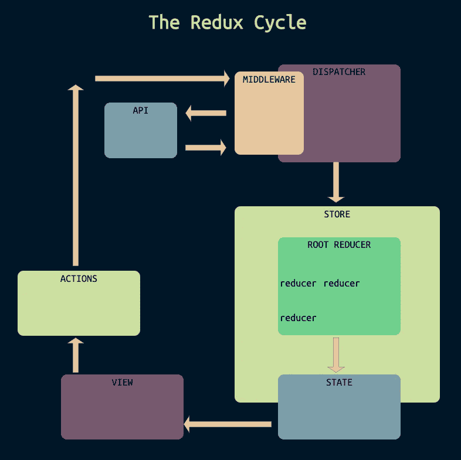

# Redux 循环，五种方式

> 原文：<https://medium.com/nerd-for-tech/the-redux-cycle-five-ways-29ac524fcfac?source=collection_archive---------16----------------------->

如果你在面试中需要解释 Redux 循环，你会想先看看这篇文章。

[Redux 循环](http://redux-cycle.herokuapp.com/)

## 简短的解释，18 个字:

要更新 Redux 应用程序中的状态，调用一个动作来激活 reducer，后者返回更新后的状态。

## 简短的解释，29 个字:

动作在按钮点击等事件上被激活。它们将一个具有类型的对象分派给 reducers。其类型被调用的缩减器在返回它之前改变状态。

## 中等解释，53 个字:

动作是当全局状态需要更新时调用的函数。它们包括 dispatch 方法，该方法将在操作中创建的对象传递给 reducers。每个 reducer 中的 switch 语句返回当前状态或更新状态，这取决于动作的类型是否与 reducer 中的类型相匹配。

## 长长的解释，90 个字:

Redux 状态保存在用初始状态创建的存储中。这家商店只有还原者才能进入。每个缩减器都位于一个开关内，监听它的类型被调用。当状态需要更新时，调用动作函数。它们返回一个包含类型和其他数据的对象。Dispatch 将操作连接到根缩减器，根缩减器连接到每个缩减器。减速器是默认返回状态的开关。类型与动作类型相匹配的缩减器在返回状态之前会对其进行更改。

## 延伸解释，156 个字:

Redux 应用程序中的状态保存在 store 中，应用程序中的任何组件都可以通过 *connect* 方法访问它的每一部分。商店由一个 *createStore* 函数在应用程序的顶层创建，并通过 *Provider* 组件连接到整个应用程序。然而，更新存储的唯一方法是调用一个*缩减器*。 *Reducers* 拉入状态，对其进行更改，并将该状态返回到商店。因此，当状态需要更新时，比如点击一个按钮打开一个表单进行编辑，组件调用一个动作，将指令发送给 reducers。如果动作的类型与 reducer 开关的大小写匹配，那么在状态返回到存储之前，这些指令将在状态上执行。因为任何组件都可以访问存储，所以更新后的状态立即可用，并且(至少在 React 中)自动触发重新呈现。