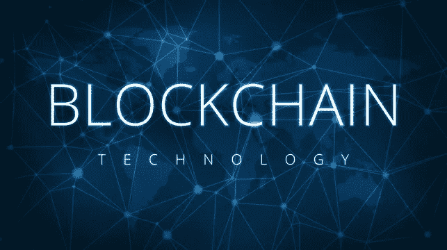
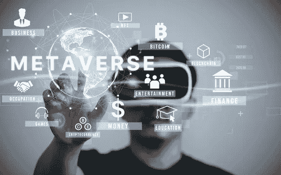

# 2022 年革命性的区块链趋势

> 原文：<https://medium.com/nerd-for-tech/the-revolutionary-blockchain-trends-of-2022-c841c916eaf8?source=collection_archive---------9----------------------->

[区块链](https://www.investopedia.com/terms/b/blockchain.asp)是一项随着广泛的应用而变得流行的发明。区块链的历史可以追溯到 1991 年，当时 Stuart Huber 和 W Scott Stonetta 首次提出了加密安全区块链的想法。当以笔名中本聪发布了一份关于区块链模型的白皮书时，区块链开始崭露头角。2009 年，中本聪利用区块链模型实现了广受欢迎的比特币。

**什么是区块链？**

让我们深入浅出地解释一下区块链。区块链可以被视为一种高级数据库，可以在商业网络中以透明的方式共享数据。与其名称“区块链”相似，数据块被链接在一起。数据总是一致的，因为没有网络的一致同意是不可能修改链的。区块链开发服务非常适合于通过不可变的分类账创建的跟踪目的。

区块链在很多方面超越了传统数据库。传统的数据库处理有其自身的问题。重复保存记录是白费力气。它容易受到欺诈和网络攻击。有限的透明度减慢了数据验证过程。我们生活在一个物联网(IoT)世界中，数据非常庞大，这意味着它会降低业务速度并影响利润。

有了区块链，您可以通过只有您的会员网络才能访问的准确和及时的数据来保证更大的信任。它提供了更高的安全性，因为所有经过验证的交易都被永久记录并且是不可改变的，所以数据准确性是通过来自网络的一致意见来实现的。为了加速交易，一套被称为智能合同的规则被存储在区块链上并执行。

**区块链趋势**

[**Web 3.0**](https://www.businesstoday.in/coindcx-crypto-exchange/article/story/what-is-web-30-342388-2022-08-05)

Web 3.0 是我们都希望看到的互联网的未来。目前，互联网受到 Alphabet、Meta、微软、苹果和亚马逊等大公司的高度影响。互联网数据是被控制的，我们只能看到被他们控制的信息。Web 3.0 的想法是由以太坊的联合创始人加文·伍德提出的，他提出了一个权力分散的互联网的想法。在去中心化的互联网中，每个人都有权拥有和控制信息。报告表明，区块链技术支持 web 3.0 的增长。[区块链开发公司](https://colaninfotech.com/services/blockchain-development-company/?utm_source=blog&utm_medium=medium&utm_campaign=deepika)投入精力开发 web 3.0 解决方案。

**元宇宙**

[元宇宙](https://en.wikipedia.org/wiki/Metaverse)在脸书更名为 Meta 后获得了关注，微软开始涉足元宇宙。元宇宙是一个 3D 世界，围绕着虚拟现实的理念，用户可以在虚拟环境中游戏、互动和操作。元宇宙是虚拟现实、增强现实和区块链技术的强大结合。像 Axie Infinity、Decentraland 和 Second Life 这样的平台已经成功地将元宇宙与区块链技术相结合。加密货币有助于建立数字经济，投资者可以将代币用于有目的的目的。像脸书和谷歌这样的大型科技公司热衷于这一领域，很可能会提出创新的想法。

**Defi 中的区块链**

在这个一切都数字化的时代，安全是当务之急。去中心化金融(Defi)已经成为一种可信、安全的数字经济赋能方式。目前，区块链在金融和保险领域有广泛的应用。在 2022 年，我们可能会在 Defi 领域看到更多版本的安全协议。

**加密货币在全球的扩张**

加密货币和区块链技术的受欢迎程度快速增长。Covid 19 危机导致了几种数字货币的主流采用。萨尔瓦多是第一个合法采用比特币来加强国内支付网络的国家。预计将有更多国家加入加密货币的行列。政府强调拥有中央银行数字货币，这将带来新的途径。该委员会正在采取必要的措施来规范运行数字货币的设置。

**物联网**

区块链和物联网的融合必将蓬勃发展。物联网是促进信息交换的数字设备的强大连接。专家指出，这可能会导致机器对机器的交易。这个概念将允许通过虚拟货币进行支付。5G 的到来也将通过更快的连接促进该领域的创新。

**结论**

[区块链开发服务](https://colaninfotech.com/services/blockchain-development-company/?utm_source=blog&utm_medium=medium&utm_campaign=deepika)自中本聪发明这一模式以来已经走过了相当长的路。区块链相对于传统数据库有明显的优势。未来一年，可能会有更多国家采用加密货币。随着大型科技区块链开发公司进入这一领域，可能会出现更多创新。使用区块链开发服务的 Web 3.0、元宇宙、物联网和加密货币的成功运行表明，未来属于去中心化资源。