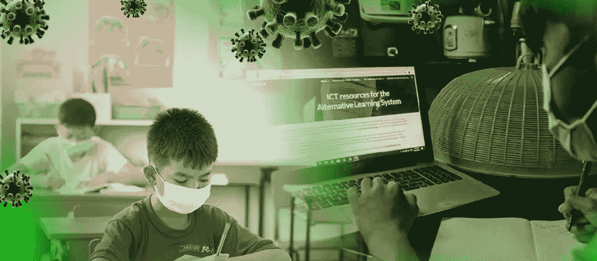

# 新冠肺炎创新教育的兴起

> 原文：<https://medium.com/nerd-for-tech/the-rise-in-innovative-education-amidst-covid-19-127f2f63de5e?source=collection_archive---------5----------------------->

新冠肺炎的教育

在新冠肺炎疫情之前，你有没有体验过远程教育和在线平台？你对在线阶段带来的新的学习环境和新的机会有什么感觉？目前，由于病毒在全球的传播，这个在线教育系统已经成为学生们的一个突出话题。因此，在这篇文章中，我们将确定什么是我们可以看到的影响，在斯里兰卡的教学和学习活动，由于这个新冠肺炎疫情。
作为一名仍在通过从学前到高等教育的免费教育学习的学生，我们对斯里兰卡的教育体系有着清晰的认识。当其他国家的趋势是将他们的传统教育系统转换成一个在线平台时，只有斯里兰卡还在使用传统系统。它的意思是身体上“出现在课堂上”。我们可以确定这种传统教育制度的利弊。
当谈到疫情之前的情况时，完全是在教室里。讲师/教师和学生都必须来到课堂，学习或遵循指导方针。在这种情况下，学生总是依赖老师/讲师，并且学生总是相信老师有责任在给定的时间内完成相关的内容。因此，学生们总是依赖负责分发信息的人，学生们毫无顾虑地把课本上的所有内容背下来。有必要提及的是，由于物理教室的障碍，这种情况在开始学习时发生了很大变化。
他们开始更具创新性地思考。如今，我们可以看到，从一年级到高级班，学生们都在通过在线平台学习，而不是实体课堂。他们通过“Zoom”或其他受欢迎的平台进行定期会议。这种突然的转变对双方都有利也有弊。斯里兰卡人不太熟悉网上创作的背景。

在这段时间里，学生通过从学生的角度进行提问和回答来感受自由，因为这产生了更多的好处，因为学生可以在他/她有空闲时间时参与到他们的课程中，并且如果需要，他们可以不止一次地听课程。从教学方面来说，他们的职责并没有太大的改变。他们不得不寻找教学信息，并像以前一样更新他们的知识。相反，斯里兰卡的教师必须学习如何管理新技术。现在我们可以发现大多数老师像以前一样去学校给学生留作业。
另一个需要特别提及的事实是技术能力和文化素养。在斯里兰卡，这已经成为一个主要的审讯问题。这种疫情局势使时间过得很慢，为双方提升技术能力创造了背景。现在，社交媒体的使用和在线平台在教育系统中的使用随处可见。这可能被认为是斯里兰卡教育系统的一个显著的转折点，因为他们多次试图替代这个在线系统，但由于官僚主义，它没有成功。因此，很高兴听到斯里兰卡教育部决定将这种新的教育提升延续到未来，他们决定在这个新冠肺炎期后继续通过在线完成 30%- 40%的课程胶囊。
在这种情况下可以看到的另一个重要影响是创造性的教学方法。虚拟教室不是阅读教科书或打印的幻灯片，而是通过动画图片、剪贴画、图表和视频剪辑，以创新和创造性的方式来指导学生。给老师定义课程很容易。我们可以看到这些方法在过去的几个月里被我们的老师/讲师/讲师们试验过。斯里兰卡仍然是一个发展中国家，因此在线环境为教师和学生创造了前所未有的动态学习体验。然而，虚拟教室不支持不愿问问题。学生为自己感受自由的环境。发生的主要积极影响是，这种新的学习环境有助于更多的自我指导和批判性思维。
不仅如此，我们还应该考虑到教育的巨大变化所带来的负面影响，因为我们不能说这种新变化不会有黑暗的一面。
在我看来，斯里兰卡学生面临的主要困难是获取技术。在疫情时期，一些斯里兰卡学生因缺乏接触机会而遭受痛苦。斯里兰卡学生苦于无法掌握虚拟教育的基本要素。我们知道我们需要一台具有强大网络连接的笔记本电脑/智能手机。因此，由于许多经济和后勤原因，这一重大问题在大多数农村和较低的社会经济环境中都可以看到。另一方面，一些学生对父母的这些做法感到满意。因此，那些很快被吸引成为社交媒体一员的人，把他们的全部时间都花在了网络上。而大多数学生不仅仅依靠老师的指导来搜索越来越多的事实/信息。因此，通过这种设施，他们很快吸收了学生的需求，增加了个人学习。
在斯里兰卡的背景下，与依赖型学习者相比，在线教育方法非常有效，能够培养成熟的自律能力。这种新的情况使得斯里兰卡学生能够控制自己的学习经历和灵活的学习时间表。
最后，我们可以识别教学活动中的积极和消极影响。学生有责任只吸收好处而忽略其他影响。值得一提的是，我们的教育部将继续这个新的平台，通过为技术障碍提供永久的解决方案来更好地提高学生的能力。

*社交媒体:* [*LinkedIn*](https://www.linkedin.com/in/sajith-dilshan/) *，*[*Twitter*](https://twitter.com/sajithd7)*，*[*insta gram*](https://www.instagram.com/sajithd_dilshan/)*，* [*YouTube*](https://www.youtube.com/channel/UCXvjoCD39q8s3zWCwKD-Qpw)