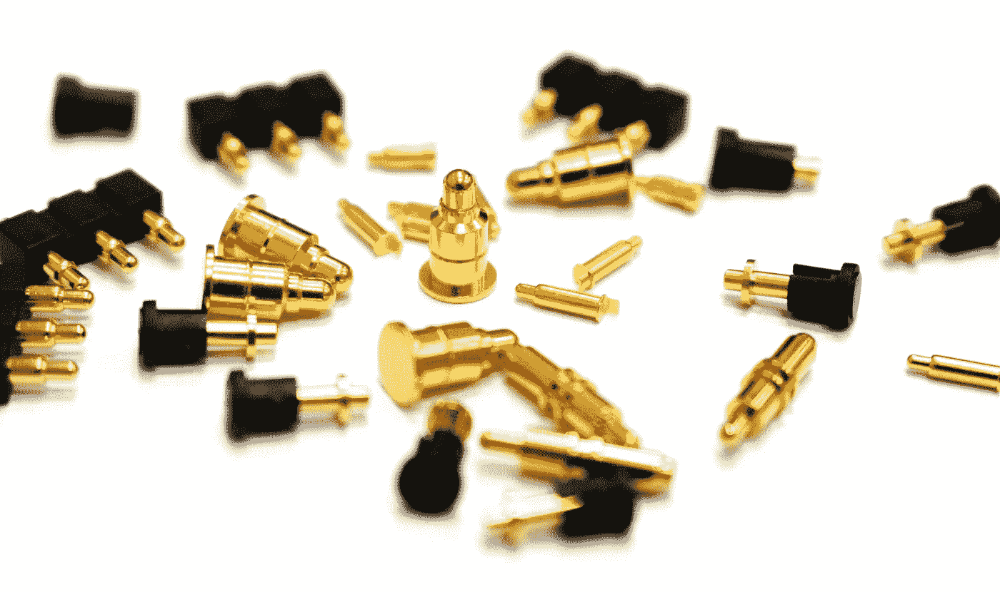

# 科学家连接器

> 原文：<https://medium.com/nerd-for-tech/the-scientist-connectors-649f8865392d?source=collection_archive---------28----------------------->

## 连接科学领域并发现有趣的应用

语言是强大的，因为它们使我们的思维更加结构化，并通过使用 T2 类比、隐喻和语法规则，为我们提供了组织思想和在思想之间建立联系的技能。

科学家和数学家过去不关心语言科学，但是这个人和知识相互联系的时代使得这种行为不再相关。昨天听一个数学讲座，演讲者的一句话就让我把他的工作与他感兴趣领域之外的另一个数学领域联系起来。我认为这是一个有趣的想法，可以应用到他处理[这个关键词](/running-a-publishing-startup/this-keyword-is-an-engine-53b97432886d)的算法中。我是对的，因为经过一番搜索，我发现有一项研究试图实现我的想法。我所了解到的，也期望你也会了解的是，有一种新型的科学家。这种科学家可以被称为连接器科学家，这意味着科学家没有特定的关注领域，但非常有能力跟踪许多专注的同行的工作，并试图将他们的工作联系起来。这些连接器科学家是那些缩小领域之间差距的人，更有可能发现理论思想应用的有趣领域。联系是我们在科学领域取得的进步的核心，因为你可能已经知道这个[事件](https://mkrdiop.medium.com/outdated-talents-discovery-process-698bb8af3a4d)是如何影响科学发展的。

只需一个词“图形”和一个漂亮的图形，我的大脑就能把这些点连接起来，并为这个理论找到一个有趣的实际想法。这个世界主要是科学世界需要更多的连接器，像你这样有广泛兴趣和创造力的人，帮助他们弥合差距，将许多看似脱节的理论联系起来，同时他们有一个关键的共享基础，当复合时有很大的应用。

我多年来看到了关于所有这些数学情节的非常有趣的想法，并致力于它们可能会导致突破性的新理论和应用，但我不知道我是否有足够的时间学习数学和书籍道场。

PS:有时做出决定并不容易，因为如果我们决定意味着你可以通过填写[这份表格](http://clickmetertracking.com/kiej)来参与 book Dojo，我们会留下一些东西的沉没成本。

数据驱动图书这个关键词

Book Dojo 是一家数据驱动的图书出版创业公司