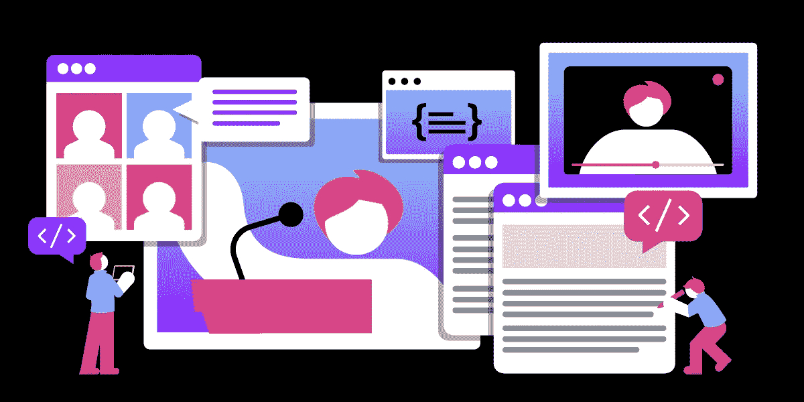
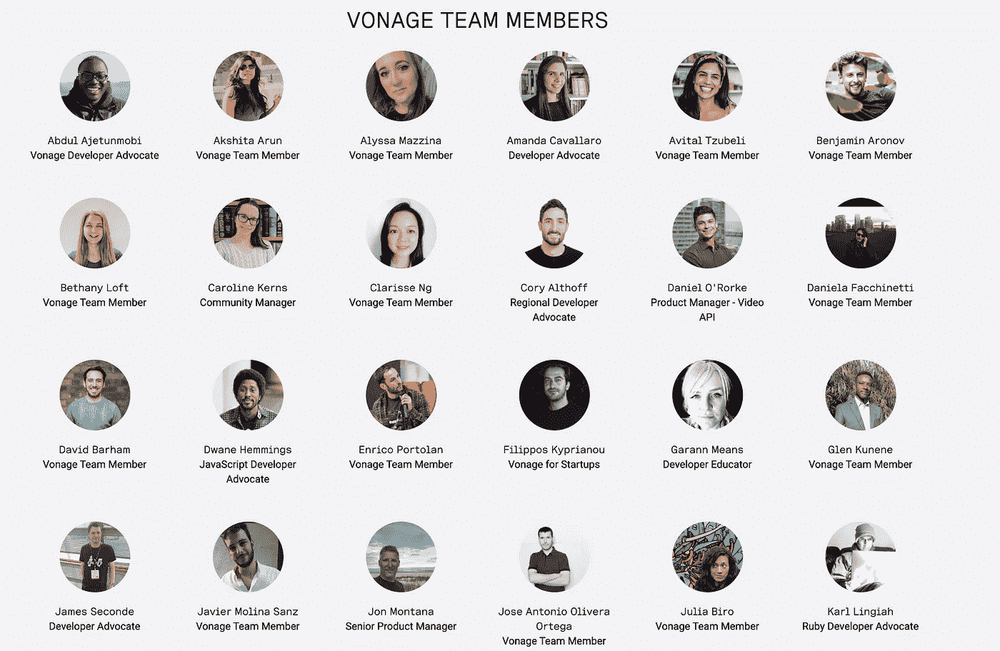

# 自学成才的开发者关系工程师

> 原文：<https://medium.com/nerd-for-tech/the-self-taught-developer-relations-engineer-861af7cb85a9?source=collection_archive---------8----------------------->

我喜欢教人们如何编程。我甚至写了一本名为《自学程序员》的书来帮助人们学习如何编程。那么，假设我希望每个人都成为软件工程师是公平的。虽然我鼓励大多数人学习编程，但除了软件工程之外，还有其他涉及编程的职业道路值得更多人考虑。

这篇文章将告诉你其中的一条道路:做一名开发者关系工程师。开发人员关系工程师，或者说开发人员倡导者，向程序员和其他技术决策者传播关于公司产品的意识，并确保开发人员在使用它们时有极好的体验。

我的职业生涯始于一名软件工程师，但我现在是一名开发者倡导者。我喜欢在开发人员关系部工作，因为它包含了我所有的兴趣:编程、商业和营销。

# 通往 DevRel 的道路

关于开发者关系最好的部分之一是有多少不同的途径进入这个领域。这意味着你会遇到很多了不起的人。例如，在我们 Vonage 的团队中，我们有一个作者、一个前 WNBA 玩家和前软件工程师，他们都在同一个团队工作。我们的团队中甚至有一个开发者拥护者，他在他的货车里生活和工作。

我来告诉你我是怎么进入开发者关系的，分享几个我队友的故事。

做了软件工程师后，我写了*自学程序员*，并在脸书成立了一个名为[自学程序员](https://www.facebook.com/groups/selftaughtprogrammers/)的小组。因此，当我写完第二本书后又要找工作的时候，我决定进入开发人员关系专业编程，而不放弃我热爱的所有其他事情，如写作和公开演讲。

我的队友兼开发者支持者 Tonya Sims 从篮球到编程再到开发者关系。Tonya 是名人堂大学篮球运动员，在 WNBA 打球。在自学编码的同时，她成为了 Python 社区的活跃成员，这帮助激励她进入 devrel。

在做了六年的软件工程师后，Amanda Cavallaro 加入了我们的团队。Amanda 是 GDG 云伦敦的创始人之一:世界上最大、最活跃的 GDG 云分部之一！Amanda 喜欢与人交流，所以在成功的软件工程师生涯后，她决定进入开发人员关系领域。

德韦恩·黑明斯在参加了一个编码训练营后学会了编程。在我们团队中，他因为他的副业项目而出名，因为他总是在做一些很酷的东西。Dwane 也住在一辆货车里，并计划明年在全国各地的开发者大会上发表演讲。

# 作为一名开发者倡导者是什么样的？

作为一名开发人员倡导者的工作各不相同，但是你通常可以期望它是编码、营销和业务的混合体。

在 Vonage 的开发人员关系团队中，我们为每一种编程语言[都有开发人员支持者，他们负责维护他们。因此，SDK 开发者拥护者将大部分时间花在他们的 SDK 上。当他们不开发 SDK 时，他们会创建内容并在会议上发言。](https://developer.nexmo.com/tools)

我们也有开发者拥护者，他们将大部分时间集中在构建演示、在会议上发言和创建内容上。我们的团队还负责建立我们的开发人员社区并与之互动，并回答社交媒体和 Stack Overflow 等平台上的问题，因此每个人都参与了这些事情的帮助。

# 怎样才能成为开发者关系工程师？

如果你想进入开发者关系，你需要具备公司所需要的技术技能和软件开发经验。

在开发人员宣传部门工作就是要对开发人员感同身受，帮助改善程序员使用贵公司产品的体验。要成功做到这一点，您需要了解开发人员的体验，以及什么能让开发人员开心。

除此之外，在公共场合演讲也很有帮助。大多数 devrel 团队的一个共同点是开发者拥护者在会议上发言。因此，如果公开演讲让你感到害怕，作为一名开发者关系工程师可能并不适合你。

# 职业方面有什么好处？

在开发人员关系部工作是推进你职业发展的一个很好的方式，因为你在工作中学到了很多技能。

一个成功的开发者倡导者将接受编程、营销、商业和公共演讲方面的教育:这是当今经济中宝贵技能的奇妙组合。

开发商关系是一个相对较新的领域。尽管如此，随着它变得越来越受欢迎，我们应该会看到更多的人在不同的科技公司担任领导职位，他们来自开发人员关系，因为开发人员倡导者拥有独特的技能。

# 最后的想法

开发者倡议并不适合所有人。

许多程序员宁愿花百分之百的时间写代码，宁愿做世界上的任何事情，也不愿在公共场合讲话。

然而，如果你是一个喜欢公开演讲或市场营销的程序员，你应该考虑从事开发者关系的职业。

如果你有任何关于在 devrel 工作的问题，请[在 Twitter 上联系我们](https://twitter.com/VonageDev)或者[在 Slack 上给我们发消息](https://developer.nexmo.com/community/slack)。

欢迎[在 Twitter](https://twitter.com/coryalthoff) 上与我联系。

最后，请查看我们在 Vonage 的开发者关系空缺。

我们目前正在寻找一名 [Android 开发者代言人](https://boards.greenhouse.io/vonage/jobs/5429611002?gh_src=996671b92us)、一名 [Java 开发者代言人](https://grnh.se/34fb4eff2us)和一名[社区经理](https://grnh.se/2363ff312us)，以及我们 devrel 团队中的一些其他职位！

祝你好运！

*最初发布于*[*https://learn . vonage . com/blog/2021/11/05/the-自学-开发者-关系-工程师/*](https://learn.vonage.com/blog/2021/11/05/the-self-taught-developer-relations-engineer/)