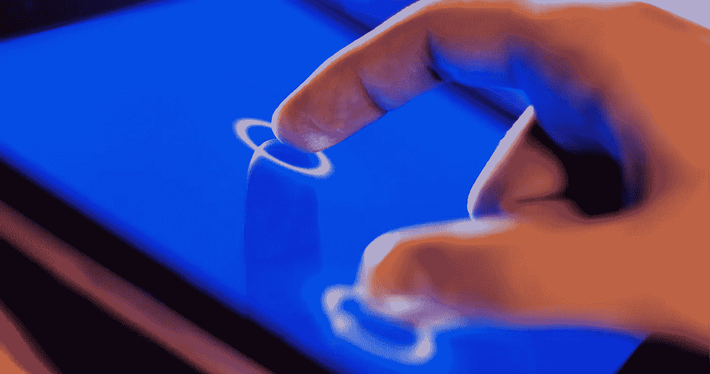
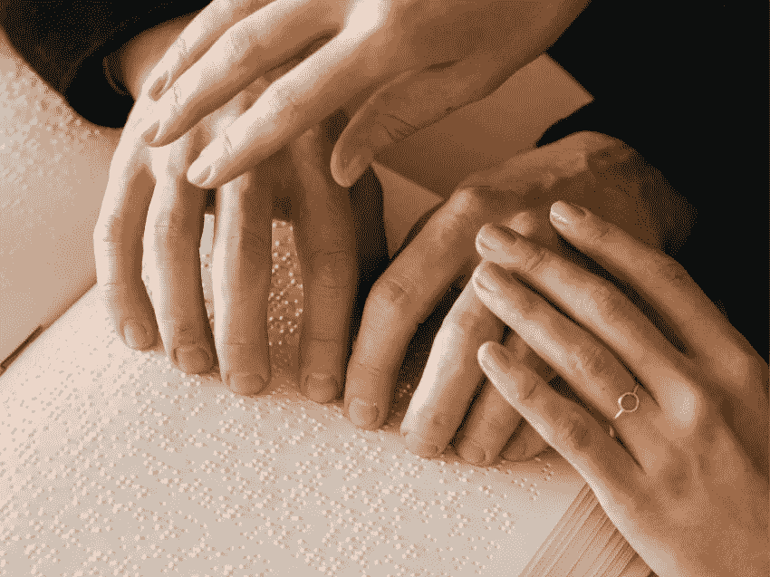
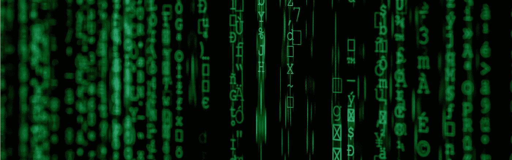

# 大卫·帕里西的触觉学令人震惊的历史(触觉学俱乐部#3)

> 原文：<https://medium.com/nerd-for-tech/the-shocking-history-of-haptics-with-david-parisi-haptics-club-3-68436ff223ba?source=collection_archive---------19----------------------->

Haptics Club 是一个面向 [#Haptics](https://twitter.com/search?q=%23Haptics&src=hashtag_click) 的开放社区。它是由 Unity、 [Interhaptics](https://www.interhaptics.com/) 、 [Senseglove](https://www.senseglove.com/) 和[nanopot](https://nanoport.io/)的成员创建的。每隔一周就有一场活动，演讲者来自各个行业和学术界。

你想听完整的播客吗？

# 谁是大卫·帕里西？

大卫·帕里西是查尔斯顿学院新兴媒体专业的副教授。他之前在纽约大学攻读媒体与传播博士学位。这也是他致力于触觉研究的起点。2018 年，他出版了一本基于他的研究的书，名为“[触摸的考古学家](https://www.amazon.com/Archaeologies-Touch-Interfacing-Electricity-Computing/dp/151790059X)”。对他来说，媒体是感觉的延伸，这是他开始对触觉感兴趣的时候，而思考媒体是不够触觉的。

# **3 个最疯狂的触觉实现**

第一个已经不存在了(19 世纪 50 年代)，但它是一个实验对象站在其中的框架，框架的一侧有一个小风箱，将空气推向框架周围的气囊，实验对象必须区分哪里有空气或没有空气。这基本上是一个触觉注意力的测试。

第二个来自 20 世纪早期，是一个街机游戏，你抓住一个手柄，感觉电击变得越来越强，直到你赢了，或者因为感觉太强烈而把手拿开。这个经历证明，回到一百年前，人们比我们今天更习惯于接触电。

第三张是 20 世纪 50 年代的。躯干上有五个振动马达，它们是军队使用的实验原型，有可能取代莫尔斯电码作为更快的语言传输系统。

# **触觉如何作为一种语言使用？**

最大的挑战不是考虑人们有能力解码什么，而是他们是否愿意解码。用户仍然缺乏将触觉解码为一种语言的意愿。此外，你的用户的解释框架不一定是不变的。这是关于它将意味着什么和对谁来说。一个很好的例子是对盲人使用触觉，由于盲文书写系统，你会希望他们更有信心通过触摸进行交流。事实上，他们试图尽可能多地坚持他们已经知道的东西。

# **作为媒介的触觉学**

媒体和通信领域的人们开始对触觉越来越感兴趣。《T2 哲学和心理学词典》(T3)(1801 年)将触觉描述为“触觉学说”，并将其与光学相比为“视觉学说”，与声学相比为“听觉学说”大卫·帕里西在他的书中将其称为模拟媒体化的逻辑，这意味着触觉技术受到视觉和听觉技术的启发，并对这两个领域应用相同的过程。

触觉不应该仅仅被认为是一种感觉，而是五到七种不同的感觉，区分疼痛、发痒、温度、压力、重量、振动等等。它们都是传递信息的不同方式。这是因为振动或疼痛会变得如此强烈，以至于它会被认为是一种独立于触觉的感觉。

# **触觉学的未来**

根据大卫·帕里西的说法，从现在开始看起来不会有什么不同。即使移动触觉现在是一个很大的挑战。他认为这是一步一步来的，而不是大步来的，原因很简单，因为触觉学已经存在了很长时间，并且已经做了很多。现在是时候将触觉软件和硬件提升到另一个水平，以实现真正的创新。

# **谁是 Haptics Club？**

Haptics Club 由 Unity 的 Manuel Sainsily、Nanoport 的 Ashley Huffman、Senseglove 的 Gijs den Butter 和 Irina Tripapina 以及 Interhaptics 的 Eric Vezzoli 和 Sarah Alkibsy 创建。

在 [Twitter](https://twitter.com/HapticsClub) 和 [LinkedIn](https://www.linkedin.com/company/haptics-club/) 上关注 Haptics Club，了解最新活动。

# **谁是 Interhaptics？**

Interhaptics 是一家专门从事触觉的软件公司。Interhaptics 为虚拟现实(VR)、混合现实(MR)、移动、增强现实(AR)和控制台应用程序提供手部交互和触觉反馈开发和部署工具。Interhaptics 的使命是促进可扩展的 haptics 生态系统的发展。Interhaptics 致力于为 VR/MR/AR、移动和控制台开发人员社区提供一流的开发工具，以及支持 haptics 的内容在任何支持 haptics 的平台上的互操作性。

