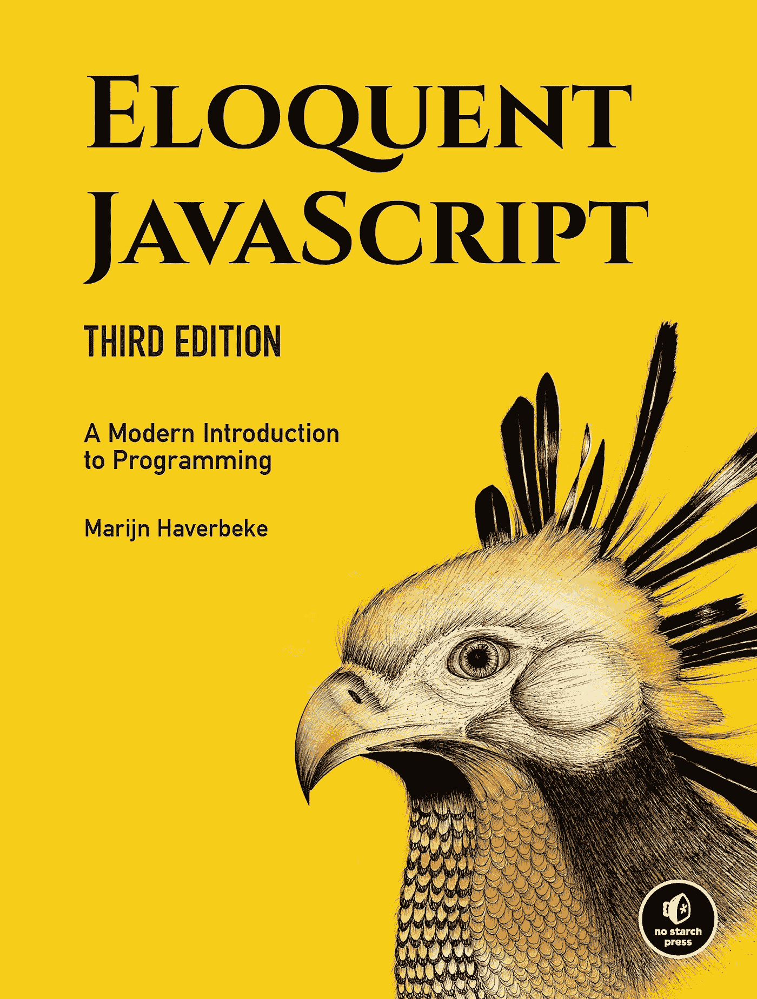
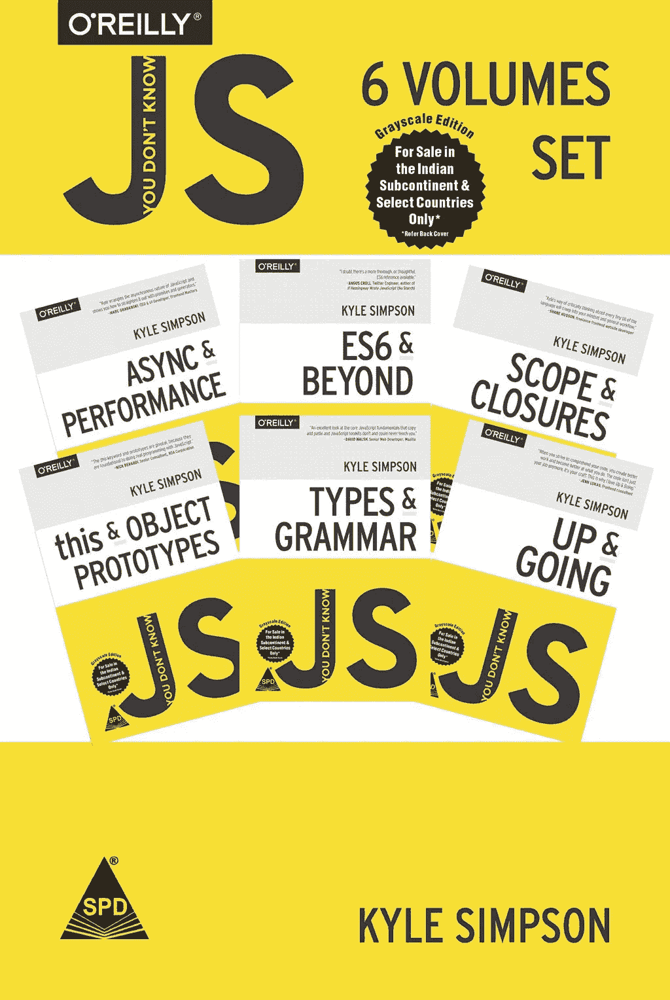
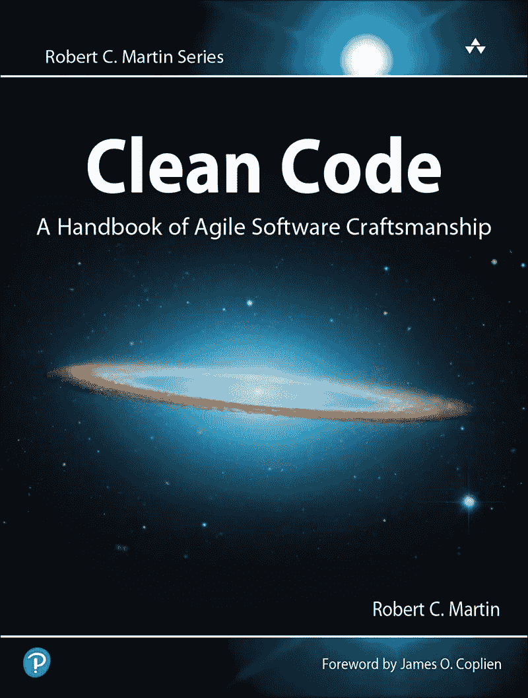
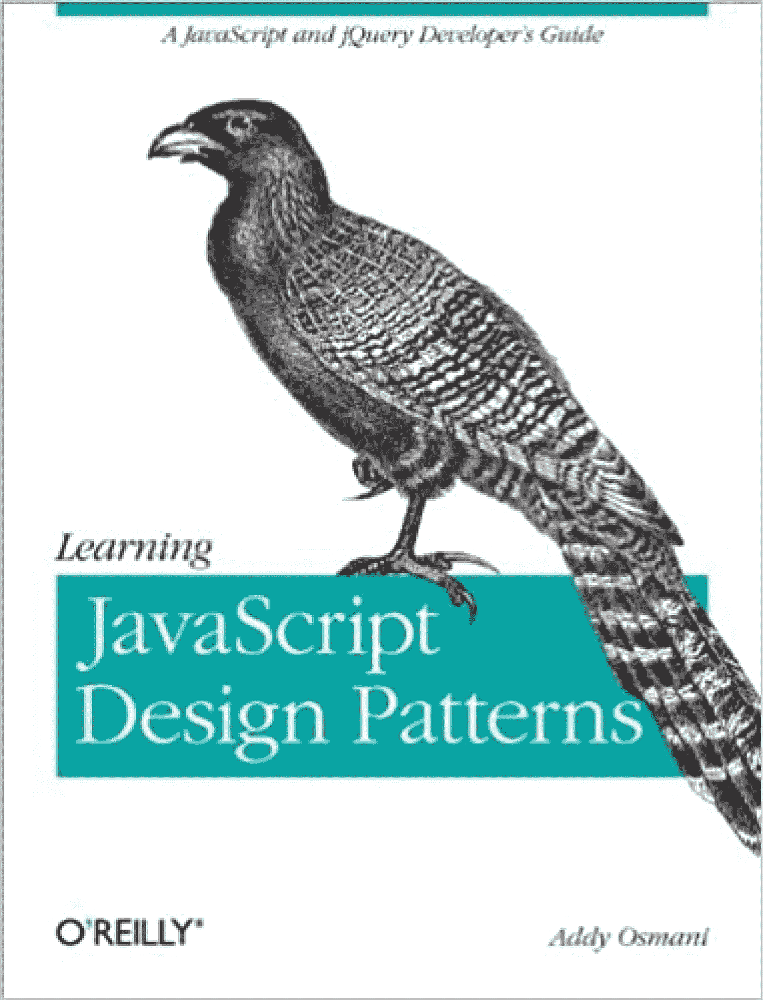
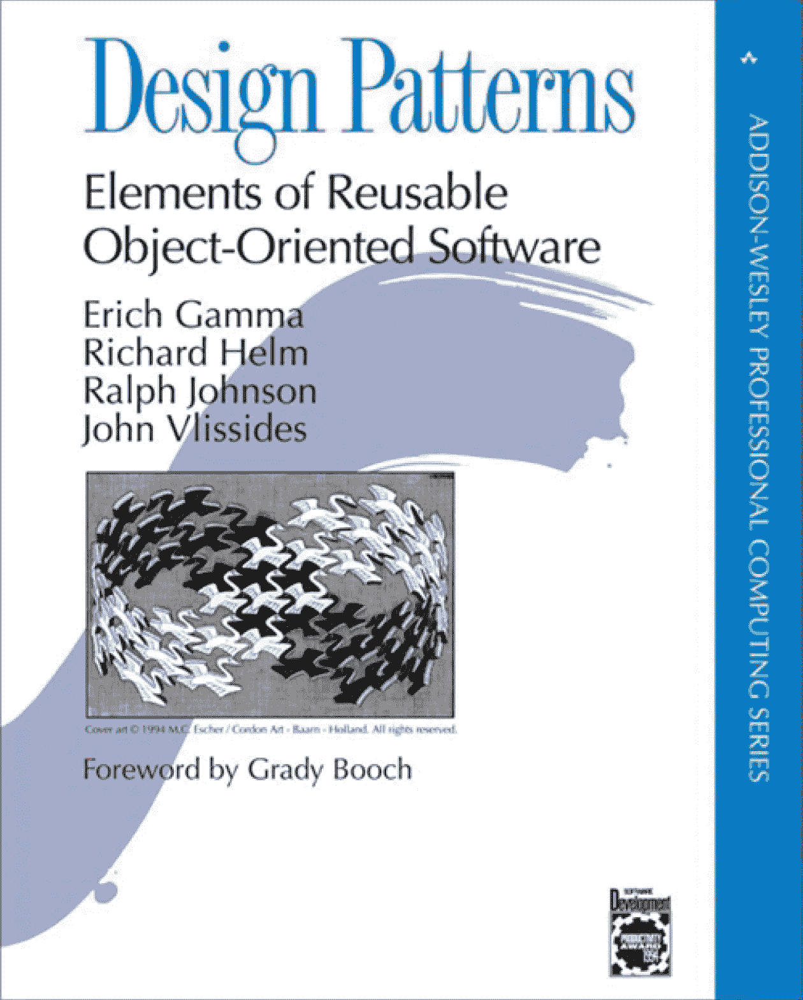

# JavaScript 开发人员最佳书籍的入围名单。

> 原文：<https://medium.com/nerd-for-tech/the-shortlist-of-the-best-books-for-javascript-developers-bb6d379f18a9?source=collection_archive---------1----------------------->

图片来自[unsplash.com](https://unsplash.com/)

现代社会充满了学习任何你想要的技能、编程语言或技术的优秀和可获得的资源。我们所有人都熟悉 Coursera、Educative 和 Pluralsight 平台，我们大多数人口袋里都有一部手机或 Kindle，可以提供比中等规模城市图书馆更多的书籍。是不是很神奇？

可访问性硬币的另一面是，由于互联网上的材料数量巨大，这可能会给那些寻找最佳信息的人带来问题。为了节省您的时间和麻烦，让我们仔细看看最好的 JavaScript 书籍，以帮助您以正确的方式和正确的顺序学习 JavaScript。

> 靠书的一个前提是先了解一些编程要领。在你过渡到从书本中学习之前，我肯定会建议你先通过哈佛大学的 CS50。

# 从头开始学习 JavaScript 的最佳书籍:雄辩的 JavaScript，现代编程入门

**作者马林·哈弗贝克**

这是一本免费的书，将对 JavaScript 本身进行概述。这是最适合初学者的 *JavaScript 书籍之一*，因为作者涵盖了语言的基础知识，并打开了浏览器和 Node.JS 的世界。有些人可能会说这对初学者来说有点挑战，但我建议你不要试图在第一次阅读这本书时理解每个短语，而是用它来熟悉基础知识并学习广泛使用的流行词汇。如果你在市场上寻找高质量的初学者 JavaScript 书籍，这当然是你应该关注的。

这本书在谷歌上的评分是 **4.9/5，在亚马逊**上的评分是 **4.6/5，我的**个人评分是 4.2/5** 。**

网址:[https://eloquentjavascript.net/](https://eloquentjavascript.net/)

# 你不知道 JS

凯尔·辛普森

****

**下一个推荐也是学习 JavaScript 最好的系列书籍是《你不知道的 JS》系列，共六本。**

**该系列的作者凯尔·辛普森(Kyle Simpson)是一个喜欢深入研究一个问题并与他人分享他的发现的人。他是 JS 界最受欢迎的演讲者之一；学生们观看了他关于前端大师的 70 多万小时的讲座。**

**该系列包括六本关于 JavaScript 的书，每本书都将让您沉浸在 JS 的一个特定部分，并且它们没有遗漏本质细节。他们会揭示一些新的东西，即使是对于有多年生产经验的专业人士。为了获得最大收益，阅读它们的顺序是:**

**1.向上发展**

**2.范围和关闭**

**3.对象原型**

**4.类型和语法**

**5.异步和性能**

**6.ES6 及以上**

**链接:[https://github . com/getify/You-Dont-Know-JS/blob/1st-ed/readme . MD](https://github.com/getify/You-Dont-Know-JS/blob/1st-ed/README.md)**

**好消息是，这些书的第二版目前正在进行中。你可以在这里跟随:【https://github.com/getify/You-Dont-Know-JS】T2**

**书籍在谷歌上的评分是 **4.6/5，在亚马逊**上的评分是 **4.7/5，我的**个人评分是 5/5** 。****

> **虽然阅读最好的 JavaScript 书籍并不能自动让你成为一名实践工程师，但我强烈建议在实践中应用你学到的理论(尝试书中的例子，尝试在类似 code-academy 的平台上完成编码任务，等等)。).**

**实际上，这些是学习 JavaScript 的最佳书籍。你从这些书中学到的东西不足以让你成为一名生产高质量代码的软件工程师。在你达到那一点之前，还需要更多的学习。如果这是你的目标，在本系列之后，你应该更深入地研究代码质量和架构的问题。**

# **干净的代码:敏捷软件工艺手册**

**罗伯特·马丁**

********

****这本书对任何软件工程师都很重要，不管是什么编程语言、国家还是宇宙。众所周知，Bob 叔叔引入了代码的可读性、可变性、可扩展性和可维护性等术语。它充满了代码示例和建议，可以帮助您理解如何以最佳方式编写代码。你准备好迎接代码的味道了吗，编写代码的实际规则？去吧！****

****该书在 Google 上的评分为 **4.9/5，在亚马逊**上的评分为 **4.7/5，我的**个人评分为 5/5** 。******

**链接:[https://www . Amazon . com/Clean-Code-Handbook-Software-craftness/DP/0132350882](https://www.amazon.com/Clean-Code-Handbook-Software-Craftsmanship/dp/0132350882)**

**下一步是了解 JS 设计模式。将它们视为解决最典型问题的蓝图，如建筑平面图或软件工程师的通用术语。例如，当有人说某个东西是“工厂模式”时，这被理解为一段代码，它通过一个公共接口创建一个对象，而不暴露外部逻辑。**

# **学习 JavaScript 设计模式**

**艾迪·奥斯马尼**

****

**Addy 是谷歌的高级工程经理，负责 Chrome。他在自己的媒体博客([https://medium.com/@addyosmani](/@addyosmani))上不断向读者更新新特性、性能技巧和案例研究。**

**他在 2012 年写了一本关于设计模式的最好的 JavaScript 书。虽然在某些情况下它可能看起来过时了，但我建议您阅读它，因为常用的模式从未改变过，并且所有示例都是用 JavaScript 编写的，因此更容易理解。**

**书**在亚马逊**上的评分是 4.5/5，我**个人评分是 4.5/5。****

# **设计模式:可重用面向对象软件的元素**

****埃里希·伽马、约翰·维里西德斯、理查德·赫尔姆、拉尔夫·约翰逊****

****

**目前，这是最后一个建议，也是另一本关于 JavaScript 的著名书籍，它是 23 种设计模式的绝佳参考，甚至在一百年后仍然有效。**

**该书在亚马逊上的评分 **4.7/5，畅销书**，我个人评分**5/5。****

# **结束语**

**当然，我可能推荐的最好的 JavaScript 书籍的完整列表很长。有很多优秀的作者和专业人士写了很棒的书来学习 JavaScript，我们应该在时间允许的情况下学习:马丁·福勒、肯特·贝克、埃里克·埃文斯、埃里克·埃利奥特、杰克·阿奇博尔德、伊利亚·格里戈利克等等。现在你已经有了我的主要初步建议，我想把未来的书籍选择留给你，因为它可以更鼓励你自己打开新的视野。**

**感谢阅读，我希望你喜欢它！**

**[https://anywhere . epam . com/en/blog/short list-of-the-best-the-JavaScript-books-for-every-skill-level](https://anywhere.epam.com/en/blog/shortlist-of-the-best-javascript-books-for-every-skill-level)**