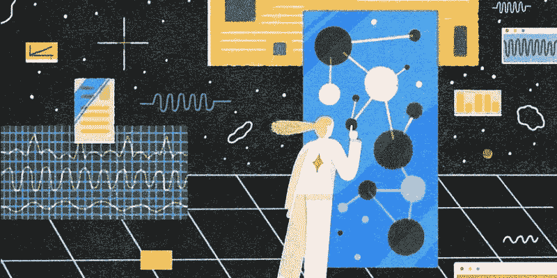
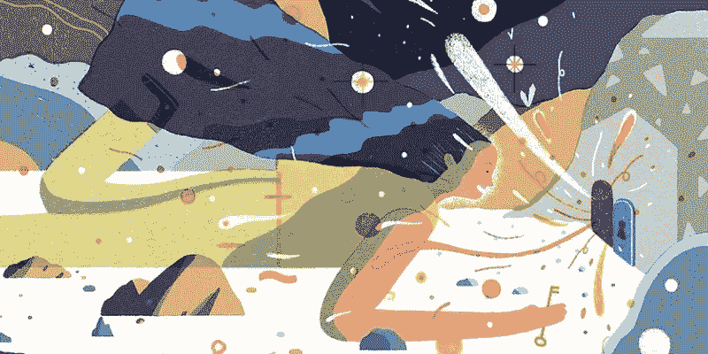
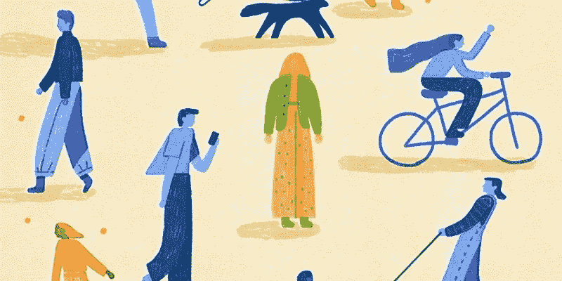

# 大多数 UX 设计师忽略的技能

> 原文：<https://medium.com/nerd-for-tech/the-skills-most-ux-designers-ignore-983c92b45a19?source=collection_archive---------26----------------------->

除了继续掌握基本的[设计技能](https://bit.ly/3rAW4Y1)之外，设计师还可以学习许多其他非设计的东西，这些与设计无关的技能可以帮助提高或补充你的设计能力和职业生涯。无论你是通过认证项目发展了自己的设计专长，还是完全自学成才。

那么，有哪些基本技能是大多数 UX / UI 设计师忽略的，尤其是在他们职业生涯的早期？成为一个伟大的设计师，是一个不断自我完善和接受教育的过程。

[Wondershare Mockitt](https://bit.ly/3ewCXuz) 分享了对 UX 行业中经常被忽视的技能的见解。我们将讨论 3 个辅助技能，它们可以帮助你成为更好的设计师:

# 神入

*图片来源:* [*基兰·布拉奇*](https://www.kieranblakey.co.uk/)

太多时候，设计师会陷入他们自己的偏见或他们自己对产品应该是什么的渴望中，以至于他们完全忽略了他们实际上是为谁设计的。

英语单词 empathy 来自古希腊单词 empathy，意思是“身体上的喜爱或激情”。同理心不仅允许理解他人的信仰、价值观和想法，还允许理解他们的处境对他们的意义以及他们相关的感受

随着设计师对客户情感反应理解的加深，设计师就越有可能为客户提供最好的用户体验。

# 好奇心

*图片来源:* [*基兰·布拉基*](https://www.kieranblakey.co.uk/)

> 唐·诺曼曾经说过:“我质疑自己的想法，这是取得进步的唯一途径，永远好奇，永远质疑。”

UX 是一个不断变化的领域。好奇心导致提出有见地的问题，积极倾听，并更深入地参与解决问题。通过观察、研究和测试，这些问题会有答案。因此，好奇的 UX 设计师将有能力以有意义的方式参与客户、产品和挑战。

培养好奇心有助于设计师跟上潮流。好奇的 UX 设计师会对人类行为着迷——人们在不同情况下是如何思考和行动的。这将使设计师养成每天学习新东西的习惯。学习过程将教会设计师对不同的观点或设计想法保持开放的心态是多么重要。

# 心理学

*图片来源:* [*基兰·布拉基*](https://www.kieranblakey.co.uk/)

心理学知识可以帮助许多不同的职业，包括市场营销、医疗保健、教育，当然还有设计。有些人习惯于认为设计是一项纯粹的艺术工作，但在它的背后有更多的东西。美感和灵感不足以创造一个熟练的设计。这就是为什么 UX 设计师应该具备心理技能来做好他们的工作。

当你问别人，“你为什么要这么做？”他们很有可能无法回答，或者你会误解他们的回答。用户体验(UX)是关于理解行为(例如痛点)，识别和预测用户的需求，并在必要时接近他们，以帮助为他们设计更好的体验。

任何一种好的设计都要考虑到大量的人类心理因素。理解基本的心理学原理有助于你了解人类共同的动机和消费者行为，并有助于更容易地创造出令人愉快的、用户友好的产品。

# 他们还说

> Aivaras bon kus:“我可以提出一个对机构/公司繁荣非常重要的技能，许多高层(高级、领导等)都需要这个技能。)设计师缺失:教学技能。当新设计师开始为一家公司工作时，大多数时候他们依赖于高级设计师，并把他们作为工作环境中有价值知识的主要来源。如果公司的高级职员缺乏传授知识的技能，那么公司就很难培养出顶级人才。”
> 
> **雅库布·雅辛**:“移情聆听。基本上，这是关于积极倾听客户，问正确的问题，让他们继续交谈，并向你透露他们真正需要什么。关键是把他们的话传达给他们，让他们觉得被理解了。这对建立信任有奇效。”
> 
> **迈克尔·a·德格蒂亚列夫***:*做好笔记(尤其是在设计评审会议上)是必须的。我见过太多初级设计师忘记改变设计元素，只是因为他们没有写下来。”

你会建议人们再看一看哪些技能？无论你是通过认证项目发展了自己的设计专长，还是完全自学成才，请在评论中告诉我们！

感谢您花时间阅读这篇文章。[了解更多关于 Mockitt 的信息](https://bit.ly/3ewCXuz)

我们为 UX 初学者创建了一个[终极指南](https://bit.ly/2OLPPlW)，它收集了来自多个 UXers 的知识、经验和建议。

订阅我们的 [YouTube](https://www.youtube.com/channel/UCESxamaRS8nOGpWYvP1VSqA) [脸书](https://www.facebook.com/mockitt) [Instagram](https://www.instagram.com/wondershare.mockitt/)

*原载于*[*https://mockitt.wondershare.com*](https://mockitt.wondershare.com/ui-ux-design/ux-designer-skills.html)*。*