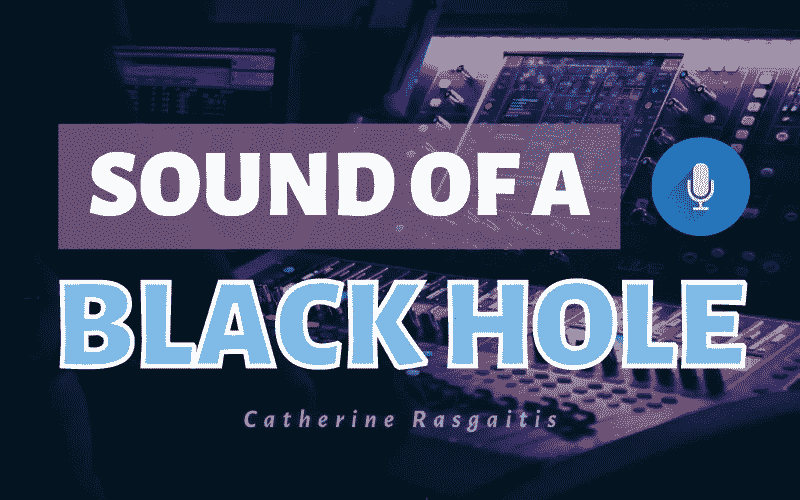

# 黑洞的声音

> 原文：<https://medium.com/nerd-for-tech/the-sound-of-a-black-hole-fe282e43a8b?source=collection_archive---------0----------------------->

## 星际管弦乐队中的一件乐器

照片由[丹尼斯·莱昂](https://unsplash.com/@denisseleon)拍摄，由 [Unsplash](https://unsplash.com/photos/OVEWbIgffDk) 提供

当你听到“波浪”这个词时，你会想到什么？也许你会想到海洋中的水波，或者如果你更倾向于数学，你可能会想到正弦图。

在物理学中，波被定义为空间和时间的扰动。