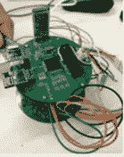
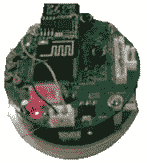
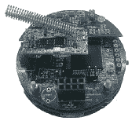
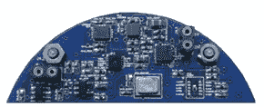
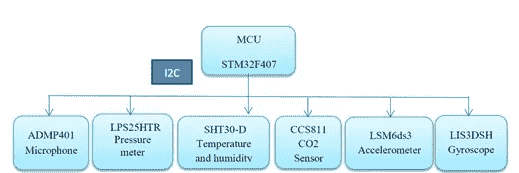
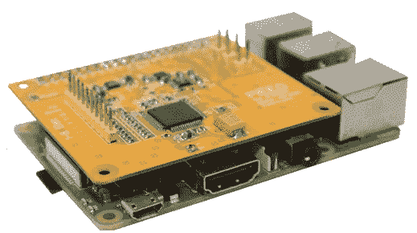
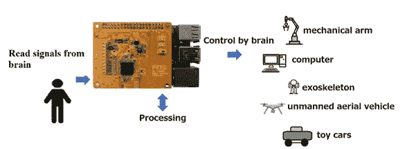

# 脑机接口是如何产生的故事(开源 DIY)

> 原文：<https://medium.com/nerd-for-tech/the-story-of-how-was-created-the-brain-computer-interface-ea922172fb78?source=collection_archive---------0----------------------->

缩写
BCI 脑机接口
EEG 脑电图
SBC 单板计算机
ADC 模数转换器

我的名字是伊尔达，我是一名电子研究员和开发人员。我们创造低成本脑机接口的想法出现在两年前东京的一次科学会议上，在一次未来主义的对话中，甚至在疫情事件之前。这个想法既天真又简单——我们想用**运动想象**方法用思维能力控制机器人。([https://en.wikipedia.org/wiki/Motor_imagery](https://en.wikipedia.org/wiki/Motor_imagery))

由于我是公司里唯一的电工，所以我亲自参加了这个活动。最初，我计划采用市场上最可用的设备，在我看来，应该是非常简单和负担得起的，像 Arduino 一样。最后，市场上的东西在很大程度上并不适合我——价格，事实上，开源开发者并没有太多的设备。

很简单，**什么是 BCI** 。BCI 测量来自头部表面的脑电图信号，这些信号以微伏为单位，分为几个频率范围(α-8–13 赫兹，β-14–40 赫兹，θ-4–8 赫兹，δ为 0.5–3 赫兹，γ高于 40 赫兹)。这些频率范围可以提供关于对象的一些信息。这听起来很简单，但有几个细微差别，除了设计良好的电路板，信号质量还受到以下因素的显著影响:
-任何身体活动(工件)；
-电磁干扰；
-电极连接的质量，实际上是一切，真的是一切。
通过电极测量脑电信号【1，2021】，我们选择干电极，因为干电极更容易使用(理想情况下不需要凝胶，但实际上用凝胶更好)。但即使在这一切之后，接收到的 EEG 信号仍然不适合接收任何有用的信息。下一步是信号处理，试图在 EEG 信号中找到有用的相关性，并去除其他噪声。而这是一个巨大的话题！而事实上，如果有魔法(或者哪里需要魔法)，那么它就在这里。方法很多，而且非常多样，我们就这个话题写了以下综述论文:
-神经加工(【2，2021】)；
-特征选择(【3，2020】)。
而且我还在朝这个方向努力。
现在言归正传，这篇笔记是关于 BCI 的**硬件。**我写得简明扼要，谁需要细节，所有来源都在公共领域，我将非常高兴收到您的评论。

起初，怀疑，但**可能吗？**在没有任何神经科学经验的情况下，取而代之开发 BCI。为了理解这一点，我读了很多书。首先，什么是更简单的:—媒体，论坛，关键词——各种不同的 BCI 变体。接下来，我研究了所有能在 T2 图书馆找到的资料——scholar . Google，researchgate，Elsevier，Taylor and Francis，Springer 等等。我理解许多人没有许可不开放获取的文章，这对许多研究人员来说是一个痛苦的话题，特别是在 2013 年马萨诸塞州非常悲伤的事件后加剧。只是，我们拥有我们所拥有的，科学家私下发表不是因为他们想隐藏他们的研究免受窥探或赚钱，而是因为，简单地说，根本没有出版的赞助商。你可以争辩说有预印本(比如 Arxiv)，我同意，只针对科学事业——发表评级很重要，我们可以长篇大论，但有必要谈一谈。如果文章不在开放存取中，那么给作者写信，提出问题，**永远不要害羞**，这是一个正常的过程，大多数情况下，作者很高兴有人对他们的工作感兴趣。我的阅读过程花了 1 个月，每天几个小时——但这是值得的，因为它让我了解市场上有什么，市场需要什么，前景如何，研究领域等。与其重新发明轮子，不如花时间。总的来说，市场调查让我相信，是的，我们必须这样做，尤其是以开源的形式。

**我们如何开发——脑机接口** BCI 的心脏是 ADC——该设备最薄弱的地方是电极和 ADC 之间的部分——这是 V 中的模拟信号——它只乐于收集只有它才能找到的所有可能的噪声。信号数字化后，标准操作已经开始——这是一个带通滤波器(我用的是 1–30Hz)，任何语言都可以帮助你——我用 Python 实现了它。市场上的 ADC 并不多，尤其是针对神经科学任务的——德州工具和模拟器件。我们选择了德州仪器的 ADS 1299。

**第一次尝试**(2020 年 3 月 1 日)
在第一次尝试中，我在试验板上组装了电路，所有元件都经过挑选，噪声极小。不出所料，一切看起来都很糟糕。好吧，尽管如此，我可以与 ADS 通信，研究寄存器，但正如所料，噪声量并没有让我明白，这是一个脑电图信号或不是。

**尝试 1 — ironbci**

**尝试二**(2020 年 10 月 8 日)
已经好了，我做了一个 PCB 板，成功了，板工作了。它能够读取脑电图信号，检测出主要的伪像。但电路板的尺寸太大了，在这个版本中使用了 Wi-Fi、蓝牙、无线电、串行端口和 SD 卡进行数据传输。对我来说，最重要的是这个装置工作正常，设计正确**【4，2020】**。

**尝试 2 — ironbci**

**尝试 3**(2021 年 1 月 1 日)
相同的设计，但形式有所简化。该器件工作正常，但由于我们有一个三明治，我仍然无法可靠地将电路板相互连接，这似乎是一个简单的部件，但我花了很多时间寻找必要的引脚，因为 MK 和 ADC 之间的 SPI 连接经常丢失。

**尝试 3 — ironbci**

尝试**4(2021 年 4 月 7 日)** 考虑到去年所有的错误，最终的装置——**iron BCI**诞生了。

尝试 **4 — ironbci**

使用下一代微控制器 STM32F406VE。在这个项目中，MK 并不特别涉及计算能力，而是根据外设(SPI)来选择的。[5, 2021].

**ironbci 项目详情** GitHub(电气方案，Gerber 文件，BOM 文件，hex。文件等。)
Youtube[https://youtu.be/y1O7FNJLeh4](https://youtu.be/y1O7FNJLeh4)D**STM 32 f 407 和 ADS1299 上的神器演示**(咀嚼和眨眼)
Youtube[https://youtu.be/kfbvYXvBCJk](https://youtu.be/kfbvYXvBCJk)铁 BCI **硬件** —拆解过程

其中一个主要想法是在初创公司中使用带有额外传感器的电路板，即所谓的“杀手级功能”——但对我来说，任务是消除脑电图信号中的所有伪像。任务是记录日常生活中的 EEG 信号，并使用一组传感器来控制和消除 EEG 信号中的伪信号。[6, 2021].这个想法还没有实现，需要更多的数据。

ironbci —传感器板

ironbci —传感器板方案

但是想法很好，希望继续努力。

一切似乎都很完美。但是**芯片荒**发生了。结果，我们设备的自身成本从 100 美元飙升至 600 美元(这还只是 8 个电极的成本)。但是**的好消息**是我让这个项目不仅仅是开放的，而是**尽可能的开放**，并提供了一个在 PCBWAY 上自助订购这个设备的视频说明(在我看来源代码就足够了，但是我收到了太多关于“如何 DIY”的问题，并意识到完整的解释更好)。每个人都可以自己订购这个设备，因为你不需要有电子等方面的经验。
**自己动手，关于如何在 pcbway 工厂创建该设备的完整说明**

但是，经过这么多的研究，我真的不想退出这项活动。这就是为什么决定最简单的方法是只从 ironbci 器件中取出一个 ADC 板，用作单板计算机的屏蔽。

**尝试 5(2021 年 10 月 16 日)** 现在，我们来到了将树莓派转化为 BCI 的 PIEEG shied**【2022 年 7 月】。**选择 Raspberry 只是因为它是市场上最受欢迎的单板电脑。Raspberry 和电路板之间的数据交换用 C 语言实现(传输速度很重要)

 [## EEGwithRaspberryPI/real _ time _ massive . h at 主 Ildaron/EEGwithRaspberryPI

### 此文件包含双向 Unicode 文本，其解释或编译可能与下面显示的不同…

github.com](https://github.com/Ildaron/EEGwithRaspberryPI/blob/master/GUI/real_time_massive.h) 

和实时数据处理，因为 python 是数据科学中最流行的语言之一。

**尝试 5 —** PIEEG

我们在这方面看到的主要应用是控制机器人设备，应用的可能性取决于用户的想象力和能力。(8, 2022)

GitHub 中提供了闪烁脚本，其中信号通过快速傅立叶变换进行分解，然后在每个频率范围内，我们检测闪烁的幅度信号。这个视频详细介绍了如何用这个设备实时控制机器人

在图片中，它看起来像这样

PIEEG 方案

当然，今天只通过侵入式接口就可以可靠地控制机器人，而这个设备**并不是真正的应用。**我们的目标是提供一个机会，研究通过脑电信号控制机器人的机制。机器学习是几年前才发生的数据处理领域的一场革命，因此数据集的可用性可以允许在该领域做许多新的事情。

如果有可能通过运动想象方法来控制机器人，那么唯一阻碍我们的就是缺乏数据集。使用非侵入性方法控制机械肢体的可能性将是神经科学领域的革命性事件。

总的来说，我非常简要地描述了开发过程，根据您的意见，如有必要，我会写得更详细。你的想法是受欢迎的，写)**这个项目没有任何人资助**，它是在工作的空闲时间完成的，所有资源都是开放的，所以要严格判断(不是打字错误)

今天我们正在为 PIEEG 申请**众筹**

 [## 皮埃格

### 生物感应树莓派这个项目即将推出。PiEEG 是一个开源的 Raspberry Pi 屏蔽，可以测量…

www.crowdsupply.com](https://www.crowdsupply.com/hackerbci/pieeg) 

我们这样做是为了创建一个社区，收集一个数据集，我希望我们能一起在这个方向上取得重大进展。

很难写出所有的事情——在每个阶段，我都犯了错误，我每天都在解决问题，但这是真的，很正常。

嗯，还有一点意识形态——开源不仅仅是利他主义(尽管这个论点已经足够了，技术，尤其是生物技术，不应该以浓缩为目的。你可以争辩，但有很多有独创性的人认为这是理所当然的)，主要是一种创造真正好的东西的方法，反馈产生奇迹，批评非常有用。

我诚实地进入了脑电图的世界，通过一种非侵入性的方法来控制机械肢体，简单易行。虽然还没成功，但这是迈向成功的一步。

**Slack—**pieeg.slack.com
**email**—ildar . o2010 @ yandex . ru
**Github—**[https://github.com/Ildaron/EEGwithRaspberryPI](https://github.com/Ildaron/EEGwithRaspberryPI)
**Linkedin**[https://www.linkedin.com/in/ildar-rakhmatulin-262a66112/](https://www.linkedin.com/in/ildar-rakhmatulin-262a66112/)

参考号
1。拉赫马图林岛；甘，于(2021)。回顾 2010-2021 年的干式和非接触式脑电图电极。预印本，2021030555(doi:10.20944/预印本 202103.0555.v1)。[https://www.preprints.org/manuscript/202103.0555/v1](https://www.preprints.org/manuscript/202103.0555/v1)2
。拉赫马图林岛(2021 年)。2021 年脑电信号识别的神经网络进展。arXiv:2103.15755，【https://arxiv.org/abs/2103.15755】
3。拉赫马图林岛(2020 年)。神经网络的脑电特征选择综述，DOI:10.5281/Zeno do . 3987894
4。拉赫马图林岛(2020 年)。用电子板代替耳垂上的参考电压进行脑电图测量，测量，173，108673[https://www . science direct . com/science/article/ABS/pii/s 0263224120311854？via%3Dihub](https://www.sciencedirect.com/science/article/abs/pii/S0263224120311854?via%3Dihub)
5。Rakhmatulin，I .，Parfenov，a .，Traylor，z .等人(2021 年)。日常使用的低成本脑机接口。Exp Brain Res 239，3573–3583[https://doi.org/10.1007/s00221-021-06231-4](https://doi.org/10.1007/s00221-021-06231-4)6。拉赫马图林岛(2022 年)。ironbci。开源。具有嵌入式板的脑机接口，用于监控生理对象的状况和环境参数。arXiv:2111.03656
7。拉赫马图林岛，沃尔克尔，S. (2022)。PIEEG:将树莓 Pi 变成脑机接口来测量生物信号，arXiv:2201.02228
8。拉赫马图林岛，沃尔克尔，S. (2022)。通过 RaspberryPi 和 PiEEG 的脑-计算机接口控制的机器人。