# 扼杀者模式:实践中的微服务设计模式因 AWS 无服务器而变得简单

> 原文：<https://medium.com/nerd-for-tech/the-strangler-pattern-microservices-design-patterns-in-practice-made-easy-with-aws-serverless-97437a82b052?source=collection_archive---------0----------------------->

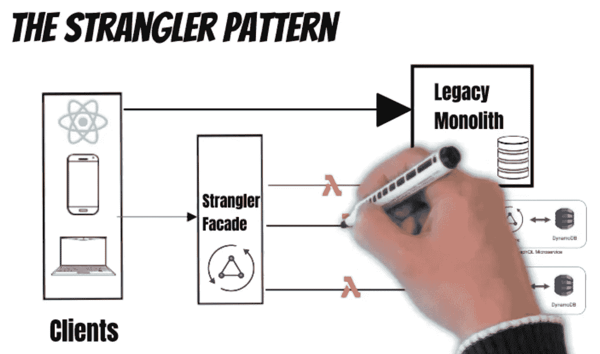

在本文中，我将解释马丁·福勒发明的著名微服务迁移模式“扼杀者模式”。此外，我将详细解释如何使用 AWS 无服务器 AppSync 和 Amplify 构建它

本文是在实践中解释微服务设计模式的系列文章的一部分

在下面的视频中，我将解释马丁·福勒发明的著名微服务迁移模式“扼杀者模式”。此外，我将详细解释如何使用 AWS 无服务器 AppSync 和 Amplify 构建它

当马丁·福勒看到被勒死的无花果树时，他首先发明了这种模式

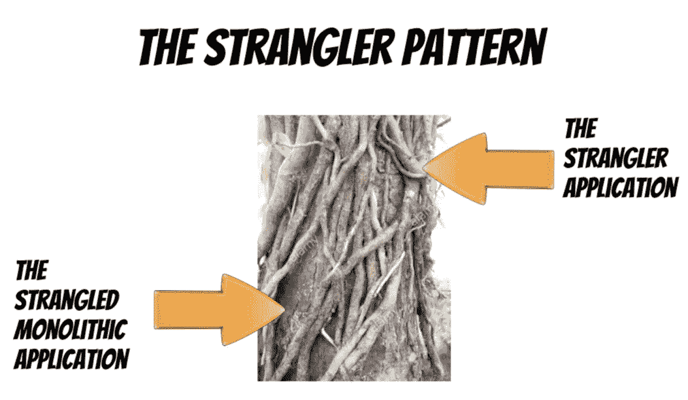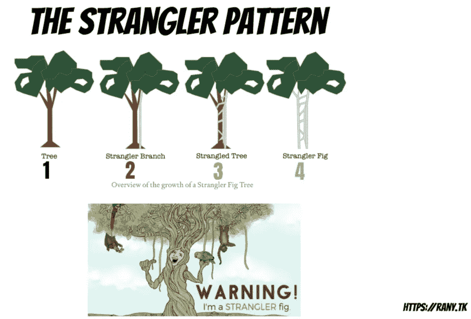

我们使用相同的方法从整体应用迁移(扼杀)到微服务

**首先，我们构建一个扼杀者外观(我在 Hands on 中使用了 app sync)**

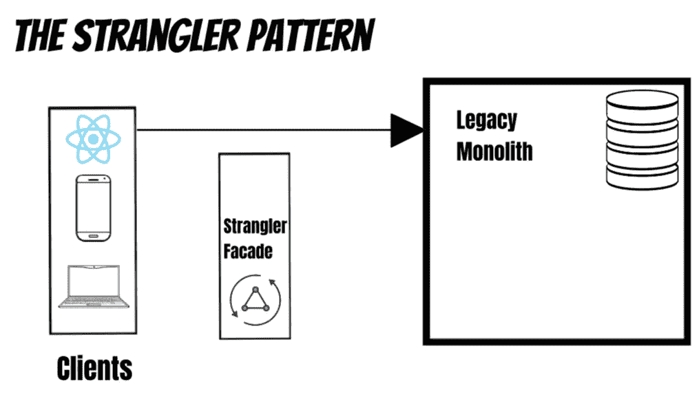

其次，我们确定一个可以分离的功能，并以渐进的方式将其转移到微服务。我们首先构建微服务，然后迁移功能

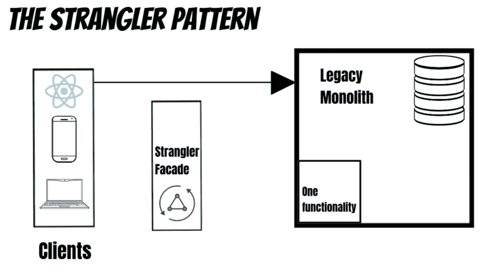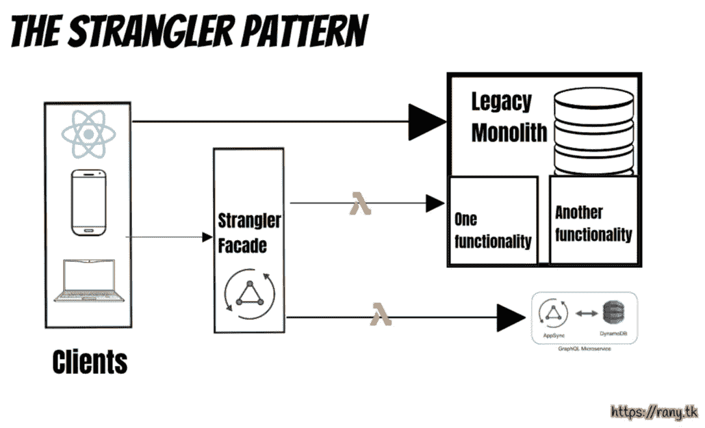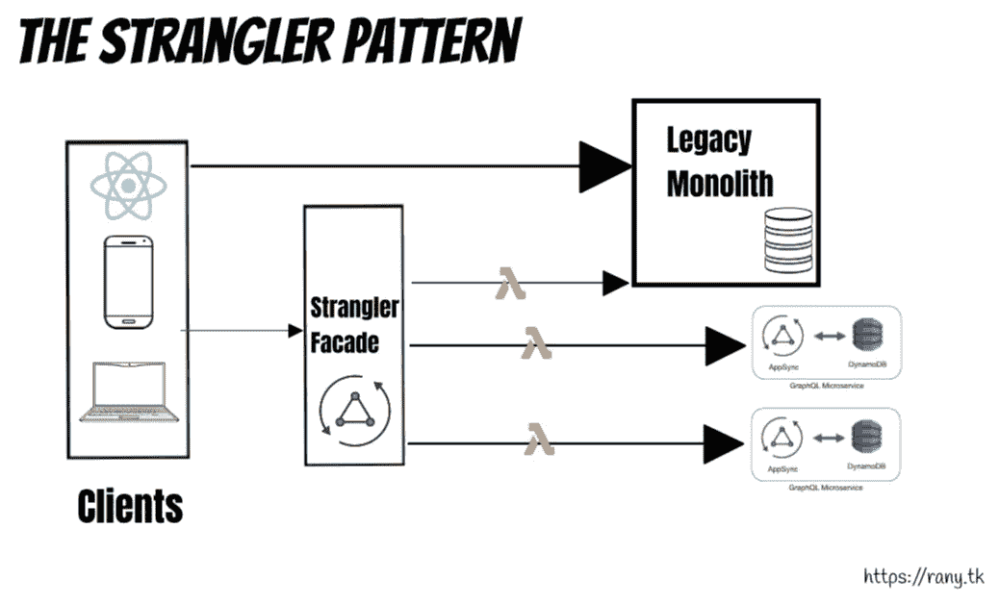

最终，微服务将扼杀传统的整体，直到它死去。

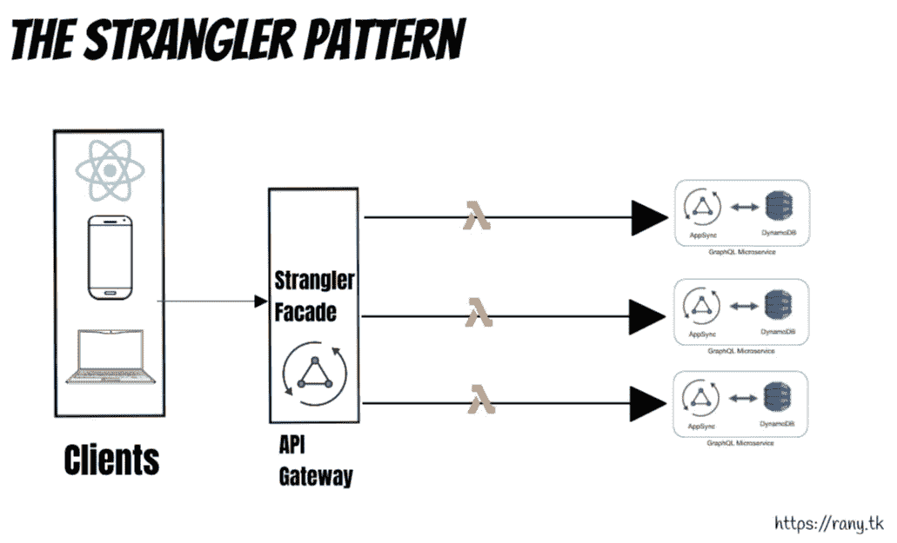

本文的其余部分将使用 AWS AppSync 和 Amplify 构建一个 GraphQL 微服务

# 使用 AWS AppSync 和 Amplify 构建 GraphQL 微服务

我想创建一个 GraphQL 微服务。AWS Amplify 和 AppSync 使得在几分钟内构建无服务器和无代码的微服务变得极其容易。展示差异的最佳方式是一起创建微服务。

在这篇短文中，我将解释我如何使用 AWS Amplify 在工作中构建了一个 GraphQL AppSync 端点，并将使用截图进行解释(一张照片胜过一堆文字:)

最终代码可在以下网址找到

 [## ranyelhousieny/graph QL _ Microservice

### 通过在 GitHub 上创建帐户，为 ranyelhousieny/graph QL _ Microservice 开发做出贡献。

github.com](https://github.com/ranyelhousieny/GraphQL_Microservice) 

# 以下视频中的详细演练:

在这个短视频中，我将解释我如何使用 AWS Amplify 构建了一个 GraphQL AppSync 微服务

以下是我在之前的视频中遵循的步骤

1.  **安装 amplify cli**

sudo NPM install-g @ AWS-amplify/CLI

**2。按照另一篇文章**中的解释创建一个 react 应用程序

npx 创建-反应-app graqhql-微服务

**3。完成后，进入目录并打开 VS 代码**

CD graqhql-微服务

代码。

**4。初始化放大器**

放大初始化

**5。添加 API**

放大添加 api

**6。将更改推送到 AWS 云**

放大推送

1.  在构建模式之后，您需要配置 Amplify 来将需要的文件注入到您的项目中
2.  运行“放大添加 api”来添加新的 API

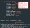

3.使用“放大推送”将您的更改推送到云

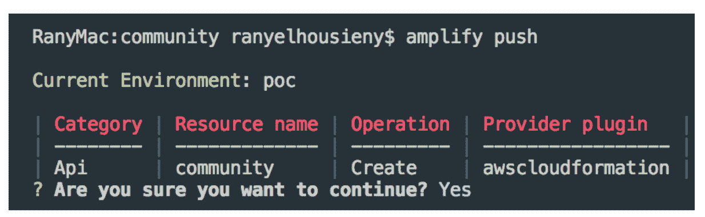

神奇的是，这将构建您的模式、解析器和数据库表:

类型之外的表格

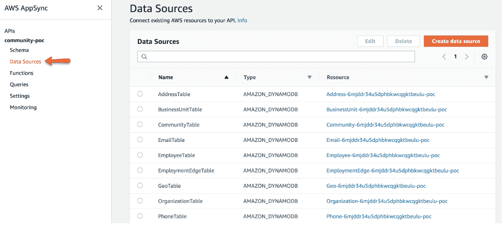

现在，您可以使用由 AWS 自动添加的 Mutation 来添加员工。

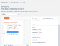

此外，正如您在上面的图片中看到的，文档是自动为您创建的，…太棒了:)

现在，您可以进入数据库并检查新员工

发布者

PhDᴬᴮᴰ雷尼·埃尔豪斯尼

高级经理软件工程师，AWS 解决方案架构师认证，PSM，ACSA，MIS，UPE，MSCA

**参考文献**:

 [## bliki:奇异应用

### 当辛迪和我去澳大利亚的时候，我们在昆士兰海岸的雨林里呆了一段时间。一个自然的…

martinfowler.com](https://martinfowler.com/bliki/StranglerFigApplication.html)  [## 扼杀者无花果迁移模式

### 这是一系列从整体到微服务迁移模式的一部分。

dianadarie.medium.com](https://dianadarie.medium.com/the-strangler-fig-migration-pattern-2e20a7350511)  [## 使用 AWS AppSync 和 Amplify 构建 GraphQL 微服务

### 由于我们创建了 REST 微服务，我想创建一个 GraphQL 微服务。AWS Amplify 和 AppSync 使它…

ranyel.medium.com](https://ranyel.medium.com/building-a-graphql-microservice-with-aws-appsync-and-amplify-58883d16f472)  [## 兰尼·埃尔豪斯尼

### https://www.linkedin.com/in/ranyelhousieny/·https://rany.elhousieny.com AWS 解决方案架构师认证…

www.youtube.com](https://www.youtube.com/channel/UCJ6bFYSkBws-ug6fqJ_9CNg)