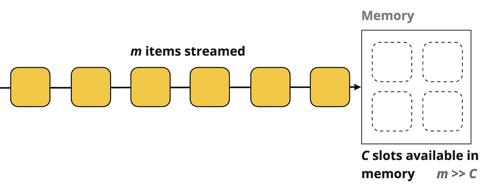
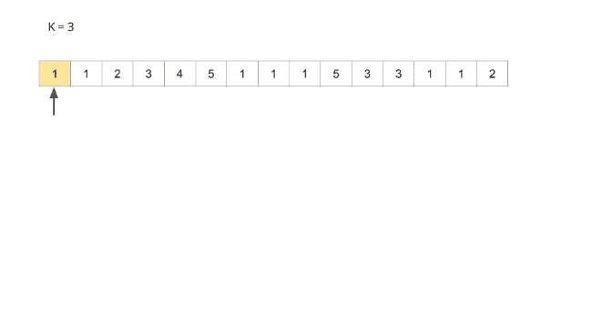

# 流模型，以及如何用 Misra-Gries 算法估计最频繁的元素。

> 原文：<https://medium.com/nerd-for-tech/the-streaming-model-and-how-to-estimate-the-most-frequent-elements-with-the-misra-gries-algorithm-c880bbe7218b?source=collection_archive---------1----------------------->

嘿大家好！我正在攻读计算机科学硕士学位，目前正在研究一些在主流文献中不太被提及的算法(又名。中型文章和其他博客文章)。如果你想了解那些不太为人所知的算法，但又没有耐心去钻研厚厚的研究论文，那么这篇文章就是为你准备的。

这篇帖子是关于**梅萨-格里斯**算法的。这是一个相当简单的算法，在**流模型**中用来计算所谓的**重量级人物。重量级元素**指的是流中出现**比其他元素**更频繁的元素。

**让我首先定义流模型**:在这个模型中，我们有一个项目序列(我将使用字母 *m* 来表示项目的数量)被流传输到一个计算单元，其中计算机没有关于数据进入的**信息**。

项目流的一个有趣的属性是其中不同元素的数量。你可能会想*“这很容易计算，我们只需跟踪来自流的所有项目，然后计算有多少不同的元素！”，*但是这种方法需要**存储所有的流项目**。我们也可以只为流中的每一项保留一个计数器，但是在每一项都不同的情况下，这最终会成为存储所有元素的相同问题。

事实上，在流模型中，我们说流中的 item ***m*** 的数量远远大于计算机所能存储的数量。这有点像如果你看着河上漂浮着的物体:你可以看着它们经过，也许可以抓住一两个，但你可能没有足够的手抓住所有的东西。

流式模型

那么，在只有一点内存空间的情况下，如何计算所有不同的元素呢？使用 **Misra-Gries** 算法，可以**估计**哪些元素是**重要元素**。使用这种算法，可以估计项目的频率，甚至更好的是，**找到在流中出现超过 *m/k* 次的所有元素，对于定义的 *k* 。**例如在带有 ***k=3*** 的数组[1，1，2，3，4，5，1，1，2]中，我们要查找出现次数超过***15/3 = 5****的元素。*

*以下是一些其他的符号:我们使用一个流 ***S*** ，大小为 ***m*** ，它包含一个元素列表***【aₓ】***来自一个宇宙***【n】= {1，2，…，n}*** *(每个元素 aₓ***可以有一个取自集合{ 1，2***

**对所有元素进行计数的**一遍**算法将需要计算机中的***ω(m)***空间，这不是我们想要的。但是通过用 Mesa-Gries 算法估计一个元素的频率，可以用**O(*k *(log(m)+log(n)))***来限定空间使用量。该算法所做的估计允许单边误差。这意味着即使所有最频繁的项目都在最后的输出中，也可能有一些**不频繁的元素**。**

## **该算法**

**算法本身相当简单。假设我们有一个流 ***S*** 带有来自它的 ***m*** 元素。我们使用一个字典 ***D*** 来保存流项目的计数器。**

****为来自流 *S* :
▹的每一项 *D*
初始化一个字典如果 a 在 *D* 中，则*d【a】++*
▹否则如果 *D* 的大小小于 *k-1* ，则插入*a*****

****

**米斯拉-格里斯算法动画**

## **为什么会起作用**

**设 **f̂** 为某一项的频率估计值， **f** 为该项在码流 ***S*** 中的真实频率。我们可以宣称***f-m/k****≤****f̂****≤****f .***即***f̂****项的估计频率大于或等于真实频率***

***假设 ***e*** 是一个频率大于 **m */k*** 的元素。***

**当元素 ***e*** 的出现没有被计数时，可能有两个原因:**

*   **因为我们试图将它插入到 **D** 中，但是它已经有了 **k-1** 项**
*   **或者因为当 ***D*** 已经满时发生了另一次插入，使得 ***e*** 的计数递减。**

**由于 ***|D| = k-1*** ，这样的事件最多有 **m */k*** 次发生。**

**因此如果 ***e*** 在算法结束时仍在 **D** 中，它发生的次数超过 **m */k*** 次。**

## **算法空间界限**

***中最多有 ***k-1*** 个计数器(这个我们可以简化为 ***k*** )。对于每个计数器，我们持有一个可以从 ***1*** 到 ***n*** 的 key，以及一个可以从 ***1*** 到 ***m*** 的对应值。***

**存储一个键***【n】***需要***【n】***空间(想想二进制表示)，而一个计数器***【m】***需要***【m】***空间。因此一个键-值对代表***log(n)+log(m)***空间。**

**因为我们有 k-1 个密钥，所以对于算法空间的使用，我们最终得到一个更高的界限**O(*k *(log(m)+log(n)))***)。**

## **限制**

**Misra-Gries 算法是一个简单的算法，可以很好地估计重要的项目，但是正如我上面提到的，它也可以输出不常见的项目。可以修改算法，或者甚至使用不同的算法来估计重拳出击的频率，而不输出不频繁的项目。**

****

**如果你有兴趣了解更多，我推荐阅读关于流算法和数据结构的书籍——比如 Bloom filters 和 Count-min sketch。**

**如果您对本文有任何问题或评论，请告诉我！干杯，斯蒂芬**