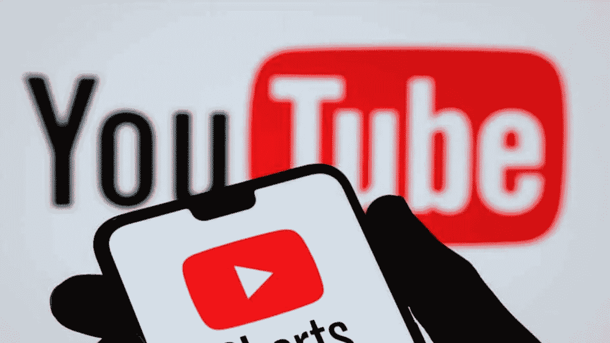
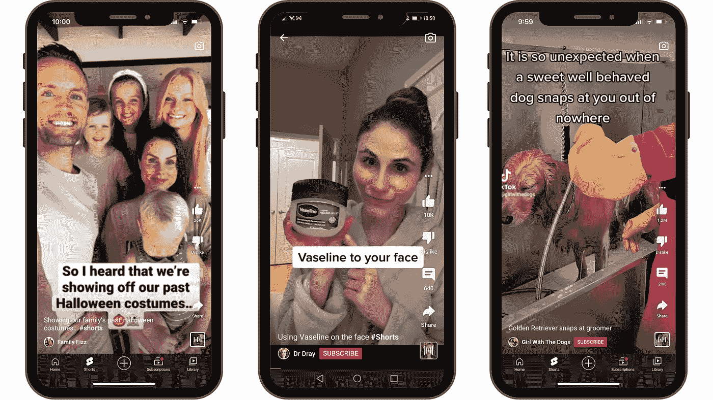
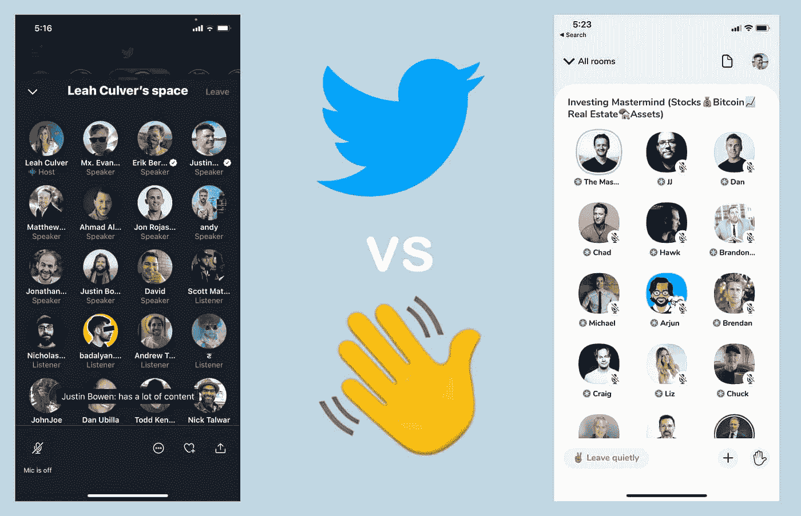
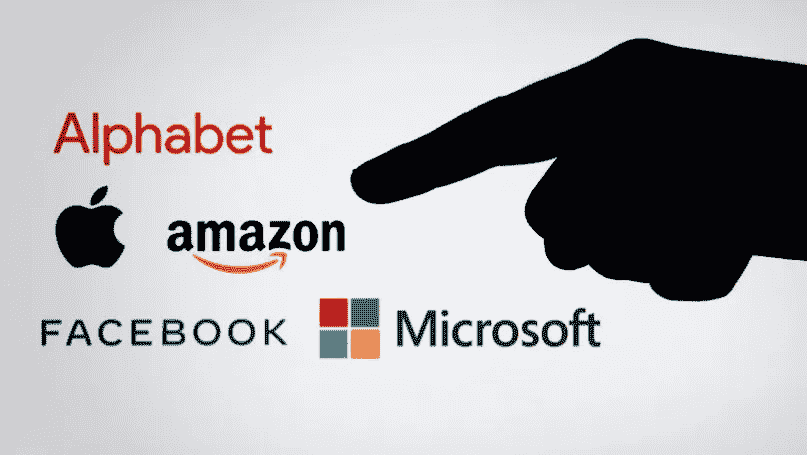

# Youtube 短片的成功开始

> 原文：<https://medium.com/nerd-for-tech/the-successful-start-of-youtube-shorts-37d25e2d8df?source=collection_archive---------9----------------------->

## 就像我们尝试用 Tinder 约会一样，如果我们用短视频约会

Youtube 短片

短视频内容是一个明显的类别，就像互联网早期和今天的动画礼物一样。互联网似乎主要是关于迷因的，其中大部分是我们用今天的技术重塑和实验的过去的迷因。在不到一分钟的时间内取悦观众的短视频内容已经是广告公司为向美国媒体消费者介绍产品和服务品牌而试验的一种内容形式，这种内容形式本身成为一种全新的内容类别，不仅可以用于传递促销信息，还可以用于通知、教育和取悦人们。

youtube 短片截图

抖音利用这种新形式的短视频内容制作了许多视频，主要是关于用短片娱乐 Z 一代的年轻消费者，让他们发笑，顺便说一下，分裂了这个媒体乳齿象的观众，这就是 youtube，但就像每个大型科技巨头如何在现有 Youtube 产生强大线程时对名为 youtube short 的子产品做出反应，就像 Twitter 如何对 Twitter 空间的 clubhouse 做出反应一样。

会所 VS 推特空间

昨天晚上，我一直在测试 youtube 的这一新功能，以便品尝已经提供的视频类型，与我认为的抖音对 Youtube 的看法不同，短片是由更严肃的信息和激励短片视频组成的，我关于短视频内容和长视频内容的理论似乎成立，因为我自己的测试经验。我所说的这个理论是这样一个假设，即我们更有可能观看五个连续的一分钟短视频，而不是一个 5 分钟长的完整视频，我几乎可以肯定，youtube 的团队将测试我揭示的这个假设，并发现他们向你推荐这 5 个短视频比我制作的这个 5 分钟的视频更好。

我的关于微软视窗的 youtube 视频

短片视频将与许多长度不到 5 分钟的视频竞争，我在昨天的夜间测试中看到的创意水平告诉我，许多长度在 1 到 5 分钟之间的视频将在他们的替代短片版本面前经历观众中断，这将受到 youtube 的青睐，YouTube 实际上正在推动这一新的竞争功能的采用，直到提供 1 亿美元的基金来支持最成功的短片视频创作者([此处](https://blog.youtube/news-and-events/introducing-youtube-shorts-fund/))。

大型技术竞争格局

大型科技公司的竞争格局是由新进入者的举动构成的，这些举动使得大型初创公司做出反应，推出模仿新进入者解决方案的新功能，或者使用定位策略，帮助大型科技初创公司防止一部分大型受众流失。这就是 Youtube 对 Youtube 短片所做的，作为对抖音主题的回应。但就像许多新功能一样，总有一些东西可以优化和变得更好。在设计方面，我认为 Youtube 也可以利用 Tinder 等应用程序开发约会应用程序 meme，允许 Youtube 短用户使用左右滑动来喜欢或不喜欢屏幕上的实际短视频，就像我们试图用 Tinder 约会一样。

科技初创公司和现有公司之间的战斗是一场永无休止的战斗，每天工程师、营销人员和设计师团队都在努力带来新的想法，这将为公司提供他们正在努力实现的这一飞跃，这将有助于他们在其他人面前拥有竞争优势。每个行业都是如此，但在大型科技行业，这种影响不仅被放大，还被加速。

图片由[economist.com](https://www.economist.com/leaders/2021/02/27/the-rules-of-the-tech-game-are-changing)提供