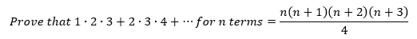
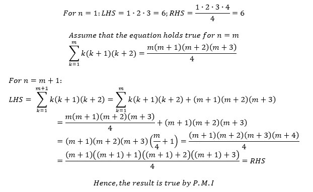
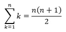
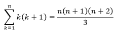
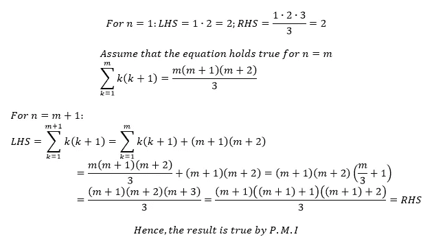
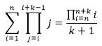
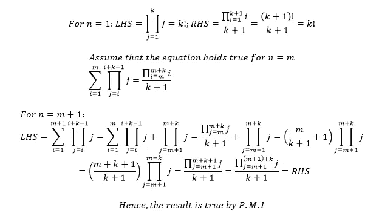

# 许多数的乘积之和

> 原文：<https://medium.com/nerd-for-tech/the-sum-of-the-product-of-lots-of-numbers-a44514dca820?source=collection_archive---------0----------------------->

由 [Saad Ahmad](https://unsplash.com/@saadahmad_umn?utm_source=medium&utm_medium=referral) 在 [Unsplash](https://unsplash.com?utm_source=medium&utm_medium=referral) 上拍摄的照片

## 声明:有很多 Sigmas 和 pi

最近，我遇到了一个起初看起来并不太难的问题。但正是这个问题让我想到了概括它的方法，也让我写了这篇文章。所以，继续这个问题！

问题如下:

这个问题可以用数学归纳法很简单地解决。这可以显示如下:

所以，这个证明并不是特别难。然而，当我看到这个的时候，我想起了那个著名的公式:

看着这两个方程，我在两者之间建立了心理联系。在我把我的想法写成一个方程之前，我想用两个整数的乘积之和来测试一下。当你看到那个证据时，你也许能自己建立联系！

因此，对于下一个问题，我将等式表述如下:

为了证明这个方程，我又用了数学归纳法。这可以表现为:

既然我能够证明这个方程也是正确的，我终于可以将所有这些工作整合成一个单一的广义方程:

这个等式基本上给出了所有整数乘积之和的一般形式，每次取 *k* 个整数。现在，是时候证明这个等式了！我们将再次使用数学归纳法来做这件事。我们将把 *k* 作为一个变量，并与 *n* 一起工作。如下所示:

尽管这项工作看起来很复杂，但它本质上与我们之前在 2 个证明中所做的是一样的。就像这样，我们已经展示了我们可以把所有整数的乘积之和压缩成什么样的形式。

有了这些，我们可以看到我们是如何从一个相当小的问题发展到一个出色的概括的。这就是数学的魅力——你可以从一个地方开始，在一个完全不同但同样迷人的地方结束！