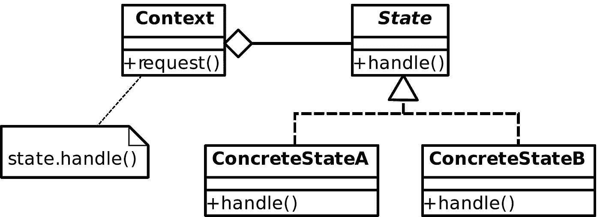
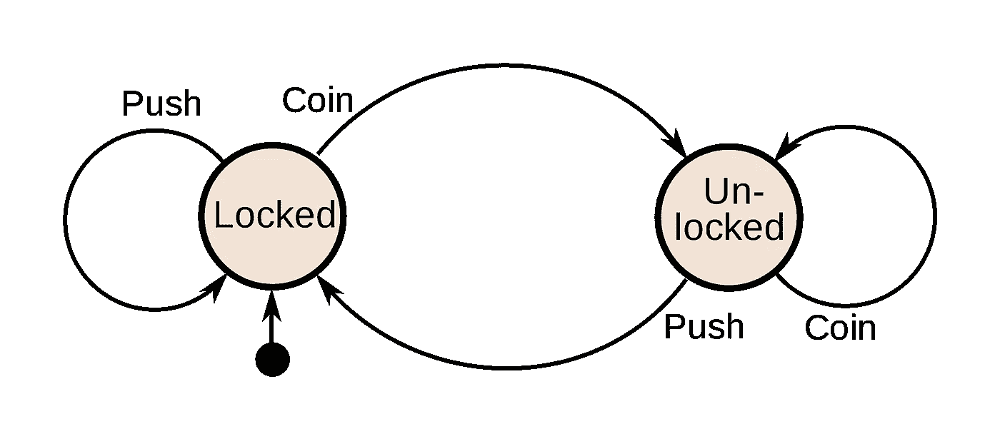
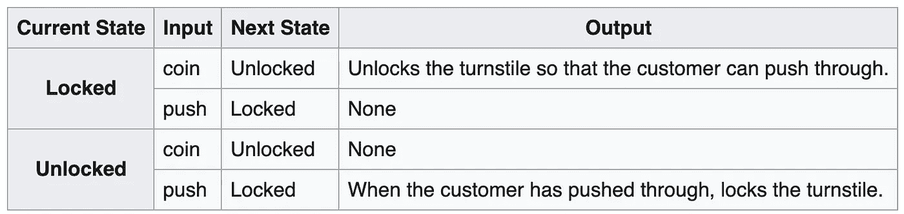

# 超状态设计模式

> 原文：<https://medium.com/nerd-for-tech/the-super-state-design-pattern-166127ce7c9a?source=collection_archive---------0----------------------->

# 结合状态设计模式和有限状态机

# **【TL；【T1 博士】**

**状态设计模式**用于根据对象的状态封装对象的行为。状态实现反映了对象在该状态下应该具有的行为。

一个**有限状态机**描述了一个计算机器，它在任何给定的时间都正好处于一个状态。它可以响应某些输入/触发/事件从一种状态变为另一种状态。

状态设计模式的重点是对行为的**封装，以创建可重用、可维护的组件(状态)。有限状态机的重点是**状态及其转换**(由状态图捕获)，而不是实际行为(那是实现细节)。**

本文描述了如何通过使用有限状态机来描述和管理对象的状态及其转换，从而将这两个概念结合起来，该对象使用状态设计模式将行为委托给状态对象。

# 状态设计模式

状态设计模式是四人帮记录的二十三种设计模式之一。这是为解决这两个主要问题而设置的策略模式:

*   当对象的状态改变时，它应该改变它的行为。
*   特定于状态的行为/代码应该独立定义。

这是通过将状态特定代码移动到状态类/对象中来实现的。主类(称为 Context)跟踪其状态，并将行为委托给状态对象。下图显示了上下文和状态对象之间的关系:



*   **上下文**保存对其当前状态的引用，并将请求()的执行委托给 state.handle()。
*   每个**状态**对象实现 handle()函数。这是特定于状态的行为，为我们提供了封装和重用。

下面的代码展示了该模式的一个简化的、不太通用的实现(所有代码示例都是 Kotlin 语言，无论您喜欢哪种语言，都应该易于理解):

```
class Context(private var state: State) {
    fun print(text: String) = state.handle(text)
}

interface State {
    fun handle(text: String)
}

class UpperCaseState : State {
    override fun handle(text: String) = *println*(text.*toUpperCase*())
}

class LowerCaseState : State {
    override fun handle(text: String) = *println*(text.*toLowerCase*())
}
```

上下文类知道它的内部状态(状态变量)并将对 print()函数的调用委托给 State.handle()。State 接口的两个具体实现只是以大写/小写形式打印传入的文本。

一个更传统的实现(不使用状态设计模式)会这样做:

```
fun printConventional(text: String) {
    when(state) {
        is UpperCaseState -> *println*(text.*toUpperCase*())
        is LowerCaseState -> *println*(text.*toLowerCase*())
    }
}
```

你会在这里找到一个非常相似的例子(基于 Java):[https://en.wikipedia.org/wiki/State_pattern](https://en.wikipedia.org/wiki/State_pattern)。你会注意到的一个区别是维基百科的例子也触发状态转换，例如

```
context.setState(**new** LowerCaseState());
```

这给我们带来了模式中的“缺口”。如上所述，它的焦点在于封装状态特定的行为，而不是管理状态及其转换，因此大多数实现只显示了管理和改变状态的基本方式

*   [https://blogs.oracle.com/javamagazine/the-state-pattern](https://www.dofactory.com/javascript/state-design-pattern):每个状态设置新的状态(light.change(新绿(light))；).
*   [https://medium . com/cocoacademymag/how-use-State-design-pattern-to-create-a-stateful-view controller-78c 224781918](/cocoaacademymag/how-use-state-design-pattern-to-create-a-stateful-viewcontroller-78c224781918):上下文公开 setter 方法设置状态。
*   【https://www.baeldung.com/java-state-design-pattern】:每个状态负责设置上一个和/或下一个状态。

对于某些用例来说，这可能已经足够好了。有些人甚至认为有了状态设计模式，就不需要有限状态机了:

> 在 Switch 和 If 语句以及状态机上使用状态设计模式是一个强大的工具，可以让您的工作更轻松，并为您的雇主节省时间和金钱。就这么简单。

[https://www . code project . com/Articles/509234/The-State-Design-Pattern-vs-State-Machine](https://www.codeproject.com/Articles/509234/The-State-Design-Pattern-vs-State-Machine)

显然我不同意这种说法。我来解释一下原因。

# **有限状态机**

有限状态机是一种抽象机器，它在任何给定时间都可以处于有限数量的状态中的一种状态。状态机可以响应一些外部输入从一种状态改变到另一种状态。从一种状态到另一种状态的变化称为过渡。

通常情况下，具体的状态机使用状态图进行建模，如下图所示，描述了一种硬币操作的旋转方式:



有时会使用状态转换表:



(建模状态图的更多方法:[https://en.wikipedia.org/wiki/State_diagram](https://en.wikipedia.org/wiki/State_diagram))

当处理一个程序时，状态机是非常强大的，这个程序有一个复杂的工作流程，有大量的条件代码(否则，switch 语句，循环等等)。).状态机帮助我们:

*   使用状态、外部输入和转换对程序的控制流进行建模。
*   将控制流与状态的实现分开。
*   在可能的状态和导致状态转换的触发器方面加强刚性。交通灯状态机可以确保将红灯设置为黄灯会导致错误(因为红灯通常会变成绿灯)。

最后一个例子提到使用状态机进行交通灯控制。我们大多数人可能会认为这是一个很好的学术例子，因为它非常简单。毕竟我们只有绿色-黄色-红色-绿色的转变，对吗？。

事实上，交通灯控制非常复杂，正如你在这里看到的[https://en . Wikipedia . org/wiki/Traffic-light _ signaling _ and _ operation](https://en.wikipedia.org/wiki/Traffic-light_signalling_and_operation):

*   闪烁红灯表示停止。
*   闪烁黄色信号表示小心(但仅在澳大利亚和美国)。
*   红色和绿色同时显示禁止转弯信号:
    在魁北克，一个信号可以只显示一个绿色的直箭头，通常持续 5 到 9 秒，然后是全绿色或右转箭头。
    绿色箭头与红球一起出现，红球一直亮着- >特拉华州威尔明顿哈里森街特拉华大道交叉口，明尼苏达州德卢斯西三街与梅萨巴大道交叉口)。
*   受保护的转向:
    绿色箭头表示箭头方向的受保护运动(加拿大+美国)。在爱尔兰和英国，绿灯旁边有时会显示一个右箭头，表示迎面而来的车辆已经停下，右转是安全的。在日本，带有绿色圆圈的绿色箭头是永远不会出现的。相反，绿色箭头必须与圆形红色一起显示。
*   你明白了…

想象一下在没有状态机或状态设计模式的情况下建模/实现这些规则的噩梦…

# 状态设计模式与状态机

状态设计模式和有限状态机有相似之处(不仅仅是因为它们的名字中有“状态”)。像下面这样的问题表明这些问题没有简单的答案:1)区别是什么，2)什么时候使用一个而不是另一个？

[](https://stackoverflow.com/questions/19859531/what-is-the-difference-between-a-state-machine-and-the-implementation-of-the-sta/50902441) [## 状态机和状态模式的实现有什么区别？

### 感谢贡献一个堆栈溢出的答案！请务必回答问题。提供详细信息并分享…

stackoverflow.com](https://stackoverflow.com/questions/19859531/what-is-the-difference-between-a-state-machine-and-the-implementation-of-the-sta/50902441) 

如前所述，由于强大的状态设计模式，一些人认为状态机已经过时([https://www . code project . com/Articles/509234/The-State-Design-Pattern-vs-State-Machine](https://www.codeproject.com/Articles/509234/The-State-Design-Pattern-vs-State-Machine))。其他人认为状态设计模式较差:

> 一般来说，这种设计模式[State Design Pattern]对于相对简单的应用程序来说非常棒，但是对于更高级的方法，我们可以看看 [Spring 的状态机教程](https://www.baeldung.com/spring-state-machine)。

[https://www.baeldung.com/java-state-design-pattern](https://www.baeldung.com/java-state-design-pattern)

事实是，它们相辅相成:

*   状态设计模式的优势在于封装了特定于状态的行为。
*   状态机的优势在于它定义和控制应用程序流的能力。

让我们把所有东西放在一起…

# 超状态设计模式

我们从状态设计模式的简单接口/类开始:

```
interface State<C : Context, P: Any?, R : Any?> {
    fun handle(context: C, parameters: P): R
}interface Context {
   fun transition(event: Event)
}open class Event
```

*   **状态**接口有一个功能来执行其核心功能。
    对其上下文的引用被传递到该函数中，因此它可以使用事件触发转换。
    传入该函数的第二个参数 P 用于在需要时传入更多参数(使用上下文来检索这些参数是可能的，但会导致上下文类端的笨拙实现)。
    该函数还返回一个参数 R，它可以是任何东西([https://kotlinlang.org/api/latest/jvm/stdlib/kotlin/-any](https://kotlinlang.org/api/latest/jvm/stdlib/kotlin/-any/))。我们对这个类使用了泛型(C 表示上下文，P 表示输入参数，R 表示结果),这样我们就可以重用它了。
*   **上下文**接口的目的是将转换函数暴露给状态。从设计模式的角度来看，这就是它所需要的。
*   事件类可以是任何东西。该类的具体实现可以拥有可以从一个状态传递到下一个状态的属性(并被具体的状态实现读取)。

我们的演示代码根据州打印星期几大写/小写(参见[https://en.wikipedia.org/wiki/State_pattern#Example](https://en.wikipedia.org/wiki/State_pattern#Example)):

> 星期一
> 星期二
> 星期三
> 星期四
> 星期五
> 星期六
> 星期天

因为我们想要一个有限状态机来管理状态和转换，所以我们将使用下面的抽象基类来管理我们的实际上下文。请注意，我们传入的是状态机。构造函数中的图形(下面有更多关于状态机的内容)。

```
abstract class ContextImpl<C : Context, P: Any?, R : Any?>(
    **graph**: StateMachine.Graph<State<C, P, R>, Event, Any>
) : Context { private val stateMachine = StateMachine.create(graph) **{ }** fun getState() = stateMachine.state

    override fun transition(event: Event) {
        stateMachine.transition(event)
    }
}
```

这个类所做的就是:

*   实现转换函数(从上下文接口继承)。
*   封装状态机(细节见下文)。
*   公开状态，这样上下文类实现就可以使用它来调用状态的唯一句柄(上下文)函数。

现在我们已经准备好实现我们的实际上下文了:

```
interface Writer {
    fun write(text: String)
}class WriterContext : 
      ContextImpl<WriterContext, String, Any?>(***graph***), Writer 
{
    override fun write(text: String) {
        getState().handle(this, text)
    }
}
```

这个类的作用是将写函数的执行委托给当前状态(由状态机管理)。所有与状态机的交互都由它的超类处理。

触发状态转换的状态和事件非常简单:

```
object OnLowerCaseDone : Event()

object OnUpperCaseDone : Event()

class LowerCaseState : State<WriterContext, String, Any?> { override fun handle(context: WriterContext, text: String) : Any? 
    {
        *println*(text.*toLowerCase*())
        context.transition(OnLowerCaseDone)
        return null
    }
}class MultipleUpperCaseState : State<WriterContext, String, Any?> {
    private var count = 0

    override fun handle(context: WriterContext, text: String) : Any?
    {
        *println*(text.*toUpperCase*())
        if (++count > 1) context.transition(OnUpperCaseDone)
        return null
    }
}
```

这里很重要的一点是，状态主要保存与行为相关的代码。唯一与控制流相关的代码是发出事件来触发状态转换的代码。国家本身不知道这种转变会导致什么，只有国家机器知道。

状态机实现是缺失的部分。在过去的项目中，我评估了这个实现:[https://github.com/Tinder/StateMachine](https://github.com/Tinder/StateMachine)。它有一个流畅的 API，因为它使用了 DSL(领域特定语言)，但它有两个主要缺点(这就是为什么我使用自己的不太优雅但更灵活的实现):

1.  为了将状态行为从状态机中分离出来，我必须将其包装起来，以事件流的形式公开状态(在我的例子中，我将其包装在 Rx Observable 中)。该事件流由一个观察器处理，该观察器可以将状态分派给实现所需行为的代码。
2.  当状态想要通过发出一个事件来触发到另一个状态的转换时，它们需要访问状态机，这就产生了一个从状态到状态机的依赖关系的恶性循环，我从来没有满意地解决过这个问题(没有上面的库)。

使用状态设计模式可以解决这两个问题。第一个问题消失了，因为我们没有使用反应式模式，而是简单地调用上下文的某个函数，根据其状态预期行为。第二个问题消失了，因为我们通过提供“转换(事件:事件)”功能的上下文将状态与状态机联系起来。

现在使用[https://github.com/Tinder/StateMachine](https://github.com/Tinder/StateMachine)我们可以简单地写:

```
private val *graph* = StateMachine
    .createGraph<State<WriterContext, String, Any?>, Event, Any> **{** initialState(LowerCaseState())
        state<LowerCaseState> **{** on<OnLowerCaseDone> **{** *transitionTo*(MultipleUpperCaseState()) 
            **}
        }** state<MultipleUpperCaseState> **{** on<OnUpperCaseDone> **{** *transitionTo*(LowerCaseState()) 
            **}
        }
    }**
```

上面的代码是纯控制流代码，没有引用状态的行为！

现在我们只需要:

```
val writer = WriterContext(graph)Observable.just("Monday", "Tuesday", "Wednesday", "Thursday", "Friday", "Saturday", "Sunday")
.subscribe **{** writer.write(it) }
```

获得:

> 周一
> 周二
> 周三
> 周四
> 周五
> 周六
> 周日

# **断路器设计模式**

使用“超级状态设计模式”来用大写和小写交替书写一周中的日子无疑是大材小用。更实际的应用是断路器模式的实现。

本质上，我们希望检测故障并封装防止故障不断重复出现的逻辑(例如，在维护期间、临时外部系统故障或意外的系统困难):[https://en . Wikipedia . org/wiki/Circuit _ breaker _ design _ pattern](https://en.wikipedia.org/wiki/Circuit_breaker_design_pattern)。

以下取自[https://martinfowler.com/bliki/CircuitBreaker.html](https://martinfowler.com/bliki/CircuitBreaker.html)的状态图描述了期望的行为:


为了使用超状态设计模式实现这一点，我们需要三个状态和三个事件(我们忽略从一个状态到其自身的状态转换，或者更确切地说，将该逻辑封装在状态中):

```
object OnSuccess : Event()
object OnFailed : Event()
object OnResetTimeout : Event()class Closed(private val failAfter: Int) : State...
class Open(private val timeout: Long) : State...
class HalfClosed : State...
```

每个状态仅保存状态特定代码，例如，关闭状态将:

*   调用目标 URL
*   计算连续失败的次数，如果次数超过阈值，将使用 OnFailed 触发状态转换
*   每次成功调用时重置失败计数

对此的处理函数非常简单:

```
override fun handle(context: CircuitBreaker, url: String) =
    *call*(url)
.doOnError **{** if (failures.incrementAndGet() >= failAfter) {
                context.transition(OnFailed)
            }
        **}
**        .doOnSuccess **{** failures.set(0) 
        **}**
```

控制上面状态图中所示流程的状态机也很简单:

```
const val *timeout* = 5 * 1000Lconst val *failAfter* = 5private val graph = StateMachine
    .createGraph<State<CircuitBreaker, String, Single<String>>, Event, Any> **{** initialState(Closed(failAfter))
        state<Closed> **{** on<OnFailed> **{** transitionTo(Open(timeout))
            **}
        }** state<Open> **{** on<OnResetTimeout> **{** transitionTo(HalfClosed())
            **}
        }** state<HalfClosed> **{** on<OnFailed> **{** transitionTo(Open(timeout))
            **}** on<OnSuccess> **{** transitionTo(Closed(failAfter))
            **}
        }
    }**
```

# 摘要

超状态设计模式为我们做了什么？

*   对象根据其内部状态改变行为。
*   特定于状态的行为完全封装在该状态中，允许我们编写松散耦合、可重用和可测试的组件。
*   状态控制流封装在一个状态机中，具有以下所有优点:
    -状态和转换的简单建模
    -即使在多线程环境中也容易防止无序执行
    -易于理解、更改和维护

完整的代码样本可以在这里找到:[https://github.com/1gravity/state_patterns](https://github.com/1gravity/state_patterns)