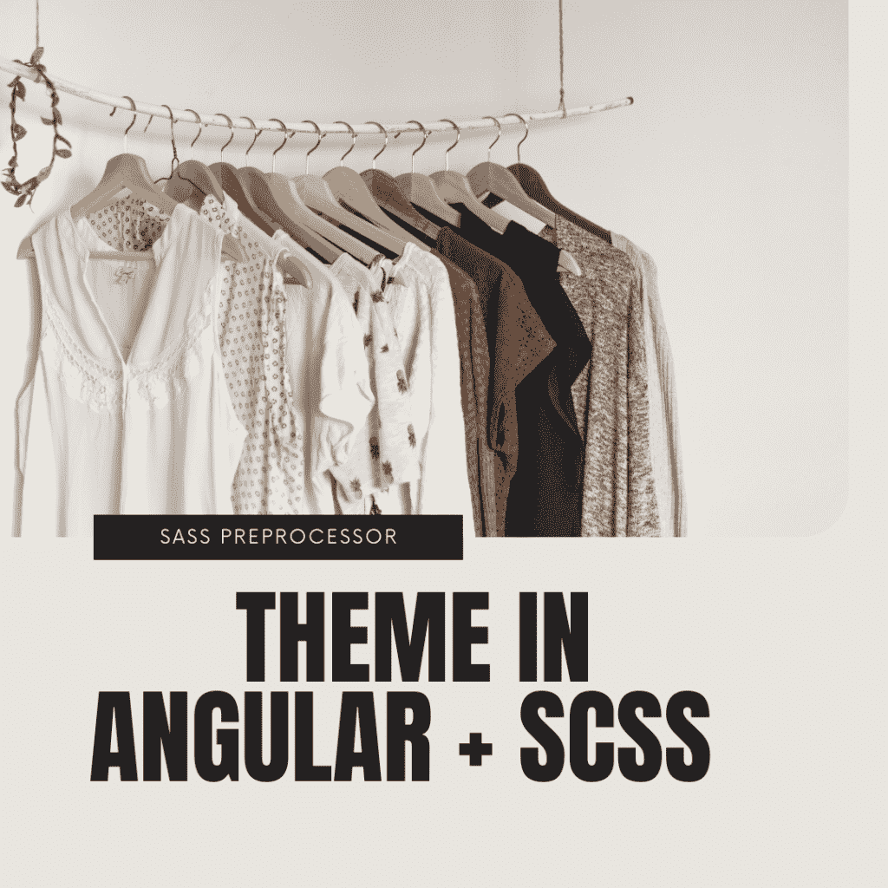
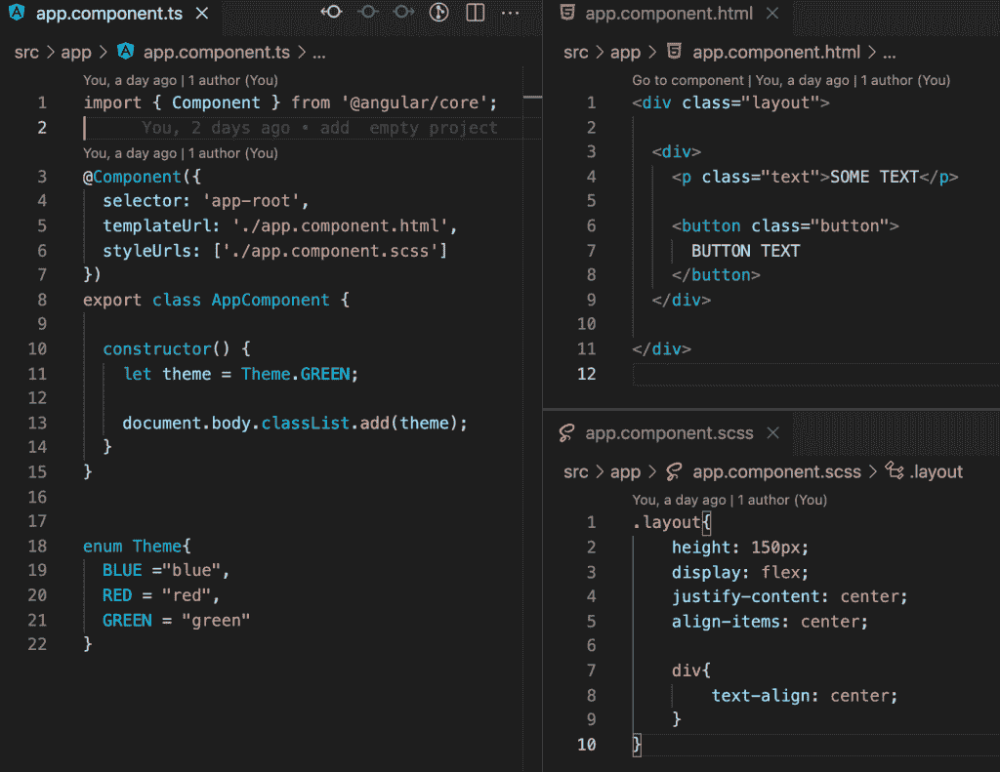
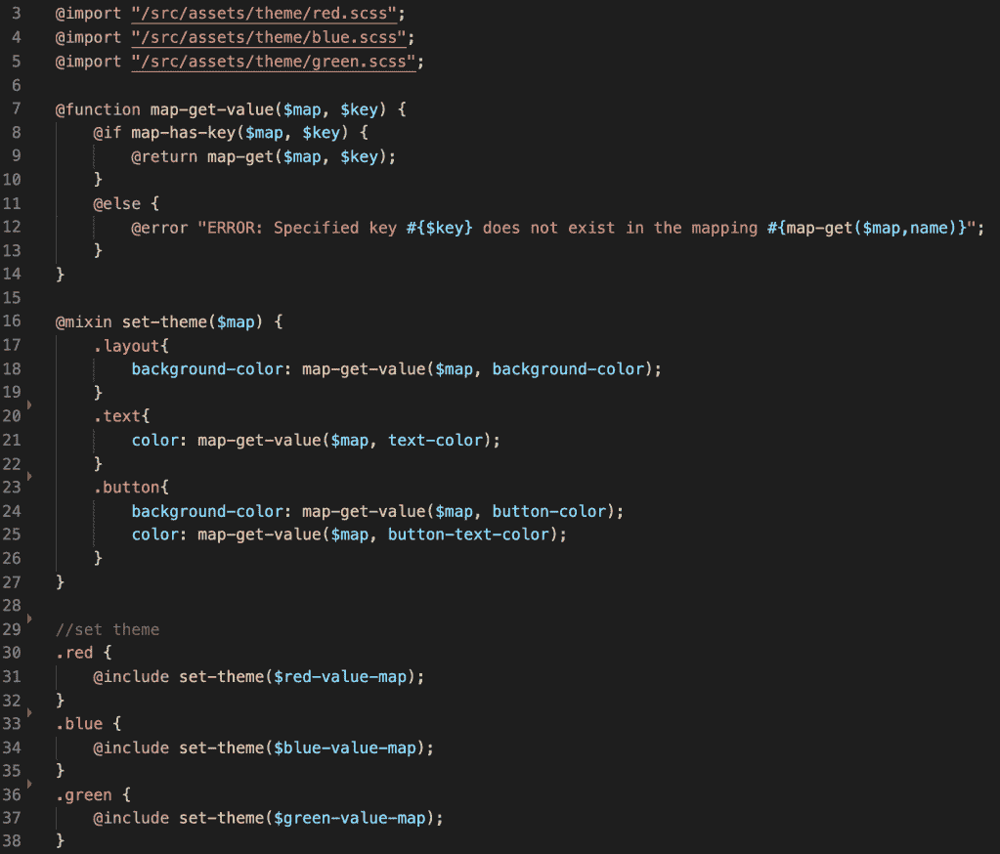
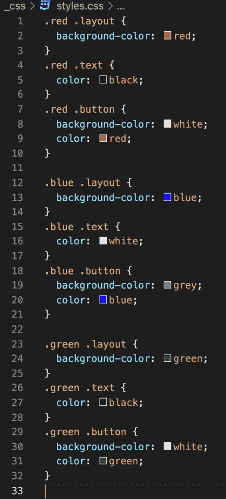
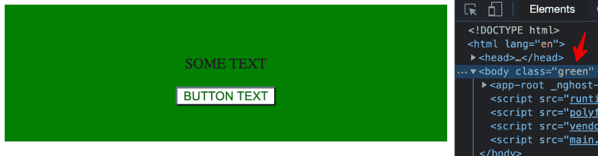
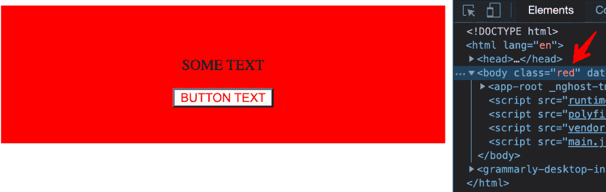
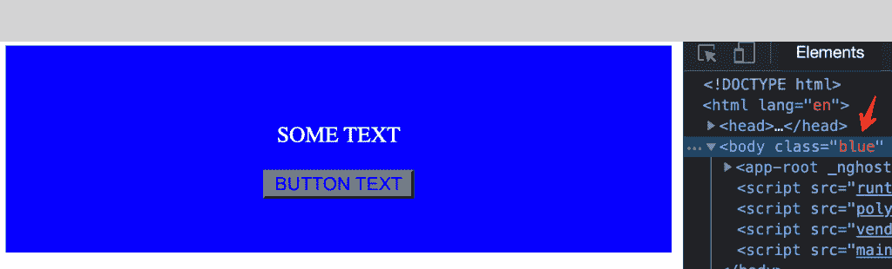

# 角度+ SCSS 中的主题

> 原文：<https://medium.com/nerd-for-tech/the-theme-in-angular-scss-2bdf6cc2a599?source=collection_archive---------0----------------------->

## SASS 预处理器

很多时候，你可以看到一个应用程序使用不同的客户端。这是相同的应用程序，但风格不同。你可能会想它是如何工作的？

计划很简单。第一步:创建一个带有一组变量的模板样式。第二步:创建一堆包含变量的文件来定义我们的主题。

让我们创建一个小组件。

最重要的部分是我们在构造函数中，在 body 标签中设置了一个类。那个类定义了我们的主题。

Scss 允许我们创建一个键值对象。在这个对象中，我们声明了用于创建主题的变量。

如果将来我们需要创造另一个主题。我们只需要添加一个包含新变量的文件。

最后一步是为每个主题创建一个主样式。在主 scss 中，我们导入所有的主题键值对象，这个函数检查一个对象是否有键，并通过键获取值，这是我们存储所有样式的主 mixin。

让我解释一下 scss 是如何工作的。我们有三个主题，我们从第 30–38 行声明它们。在每个主题中，我们使用主混音，在那里我们放置一组不同的设置(第 31，34，37 行)。Mixin 声明了一堆样式。它通过键从对象获取的样式值。

这个 scss 文件转换成一个 css 文件，存储每个主题的所有样式。

因此，我们可以通过改变 body 标签中的 class 来改变主题。

如果你需要仔细看看这个项目，这里有链接。

*原载于 2021 年 9 月 3 日*[*【http://tomorrowmeannever.wordpress.com】*](https://tomorrowmeannever.wordpress.com/2021/09/03/theme-in-angular-scss/)*。*