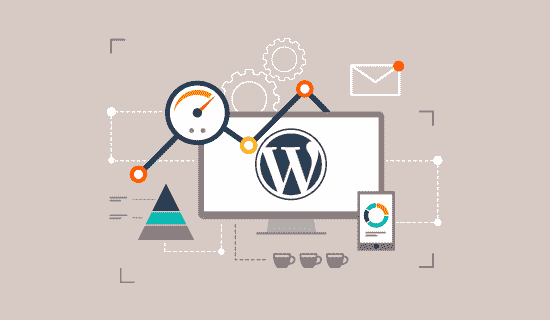
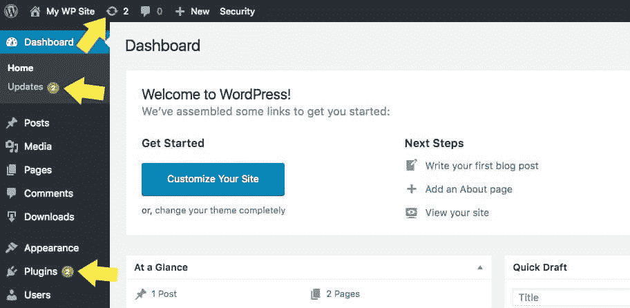
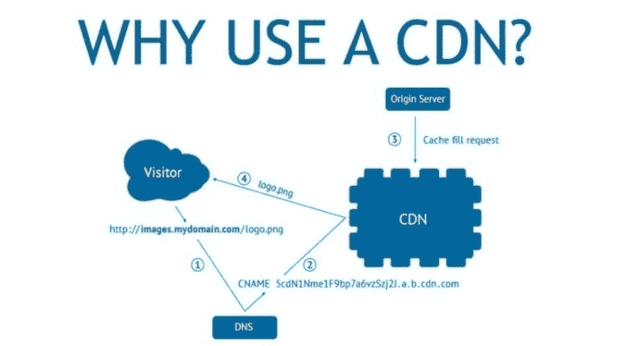

# 优化 WordPress 网站的终极指南

> 原文：<https://medium.com/nerd-for-tech/the-ultimate-guide-to-optimizing-the-wordpress-website-1a7dbc20c347?source=collection_archive---------6----------------------->

图片来源:WP 初学者

众所周知，WordPress 网站是互联网上使用最多的网站。数百万的网站正在使用它。这个平台在用户流量方面肯定会有很多竞争。然而，当你优化你的网站转化率优化，你将能够看到收入的增加和更多的销售上门！

关键要点:

*-****WordPress****是世界上非常* ***流行的内容管理系统*** *(CMS)，其中* ***占互联网上所有网站*** *的 34%。*

*-* ***WordPress 在* ***CMS 市场*** *中占有*******60.8%的市场份额。****

**-****WordPress****commands****14.7%****全球* ***prime 网站*** *。**

****- 500+网站*** *都是* ***开发的*** ***每天*** *使用****WordPress****，而在 square 等其他平台上每天只形成 60 到 80 个**

**-****WordPress 插件目录*** *包括****55000+****插件。**

*嗯，你想知道如何优化你的 WordPress 网站吗？如果是这样，那么你就在正确的页面上，因为它包含了优化 WordPress 网站的最佳技巧和诀窍。所以，让我们更进一步，看看最终的 WordPress 网站优化指南…*

# *专业级 WordPress 网站优化指南*

*网站优化指南可以帮助你优化你的 WordPress 网站，以增加转化率和收入。遵循下面描述的技巧来获得更好的 WordPress 网站性能和更好的用户体验。此外，如果你在遵循任何提示和技巧时遇到问题，向在一家优秀的 WordPress 开发公司工作的经验丰富的 WordPress 网站开发者寻求帮助。*

# *用简单的步骤加速 WordPress*

*页面加载速度对任何网站来说都是至关重要的。它对你整个网站和业务的成败起着重要的作用。如果用户等待浏览器加载的时间超过 30 秒，他们很可能会放弃它，转到其他加载时间更快的地方。有多个步骤可以优化你的 WordPress 网站的速度。*

# *使用缓存插件*

*这些插件在服务器上存储站点页面和图像的静态副本，这样就可以更快地提供给访问者，减少你的加载时间。WordPress 页面缓存通常是默认激活的，但是如果有太多的活动插件或主题，它可能不会很好的工作。按照以下过程安装缓存插件:*

## *安装缓存插件。*

*   *激活插件，设置为自动更新，这样你就不用担心手动更新缓存了。*
*   *检查你的网站的管理区域中的任何错误或警告，因为这些可能是由与此类优化工具不兼容的插件引起的。*

*安装插件并激活后，您应该会看到页面加载时间有所增加。*

# *优化图像*

**

*在不影响图像质量的情况下，通过尽可能压缩图像大小来优化图像(使用 TinyPNG 或 PicMonkey 等在线工具)。减小网站视频的文件大小，以加快加载速度并避免缓冲问题，这将提高客户满意度。按照下面提到的步骤来优化 WordPress 网站图片:*

*   *上传 jpg 和 gif 到 WordPress。*
*   *如果需要，将 png 转换成 JPEG 或 GIF 格式，然后使用编辑器窗口中的“添加图像”按钮上传它们。*
*   *通过更改文件大小和图像尺寸来设置您的图像尺寸，以便它们适合具有更快互联网速度的观众。*
*   *使用在线图像工具(如 PhotoShelter 或 PicMonkey)检查图像的质量和色彩平衡(如果需要),进行调整，如裁剪、添加滤镜等。*

# *压缩所有视频*

*在上传和发布到你的 WordPress 站点之前，压缩所有的视频。这将减少访问者的视频加载时间，从而增加做出购买决定的机会。压缩视频的过程:*

*   *使用 H.264 或 MPEG 压缩将所有视频转换为较低质量的视频，这是当今世界高质量全高清内容网络传输的行业标准。*
*   *上传每个压缩版本，使用 WordPress 的“视频嵌入”功能将你的视频设置为视频帖子的来源。*
*   *为每种类型的播放器设置你的压缩设置，以减少加载时间并节省运行 WordPress 的计算机的处理能力，这节省了大量的能量！*

*嗯，这两件事会帮助你加快网站的加载时间，但如果你想让你的网站在几秒钟内加载的高级速度，也要关注以下几件事。*

# *减少外部 HTTP 请求*

*当用户访问您的网站时，他们通常会从各种外部来源(如脸书或 YouTube)下载许多图像/文件。这些请求会显著影响网站的加载时间；这就是为什么减少它们很重要。有几种方法可以做到这一点:*

*   *使用一个图片替换插件，在你的网站上的图片上加载文本。这将减少你的网站发出的外部请求的数量，对于那些想要保护他们的图片不被在线窃取的人来说，这是一个完美的解决方案。*
*   *用较轻的脚本替换较重的脚本(如 Google Analytics)——这可以通过只替换某些页面和帖子上的脚本或使用另一个插件来完成，如 New Relic 或 Chartbeat。*

*对于其他人来说，完成这个练习有点困难，所以为了更好地完成它，你可以利用领先的 WordPress 网站开发公司的 [**WordPress 开发服务**](https://www.valuecoders.com/top-wordpress-development-services-company-india?utm_source=medioum&utm_medium=wordpress-d7) 。*

# *减少数据库调用*

*当加载一个网页时，WordPress 会从你的文章和页面中获取所有的信息。这会大大降低下载速度，因为这会消耗更多的服务器资源。有一些方法可以减少数据库调用以提高站点速度，例如:*

*   *将每篇文章或页面上不需要的滑块或其他功能移动到设置面板*
*   *删除草稿、垃圾评论和其他网站上不需要但占用数据库空间的内容。*
*   *构建只在特定页面或帖子上加载的小部件。*

# *限制帖子修订*

*如果你已经写了一段时间的帖子，你的 WordPress 站点可能会有很多修改。这些都可以通过点击“修订”来访问但是，这将占用服务器上的空间，并可能增加加载时间。优化页面加载速度:将文章的修改限制在一篇或两篇，这样每个修改都不必加载到浏览器上。*

# *WordPress 性能优化的最佳实践*

*除了站点加载速度，它的性能也很重要。所以在这里，我提到了一些方法，通过这些方法你可以提高你的站点性能水平，也可以用一种简单的方式优化你的 WordPress 站点。*

# *保持 WordPress 和插件更新*

**

*图片来源:iThemes*

*至少每三个月更新一次您的网站将有助于您避免安全风险、漏洞或错误，这些风险、漏洞或错误可能会导致 Google Analytics 等分析跟踪软件出现问题。当新版本发布时，请始终更新这两个版本，以确保您的网站获得最佳性能。如果你遇到任何问题，请通过他们的支持系统联系插件开发者。遵循更新 WordPress 和插件的流程:*

*   *转到 WordPress 仪表盘→更新。*
*   *点击“立即更新”按钮，然后点击每个需要更新的插件的链接，这将把你带到插件开发者的网站，那里有一个等待下载的可用更新列表。*
*   *下载前检查插件:在下载和安装任何插件之前，检查你的插件的所有更新。*
*   *安装所有可用的插件更新，然后再次回到 WordPress Dashboard → Updates 来检查是否还有新的插件在等待。*

# *最小化插件以避免冲突*

*当你有太多的活动插件或主题时，它们经常会导致彼此之间的问题，你的网站性能会因此受到影响！密切关注网站后端发生的事情可能有助于你在问题变得太大之前发现问题。*

# *更新主题和设计*

*更新你的网站主题将有助于让访问者关注他们可能感兴趣的新内容或优惠，这可能会导致进一步的转化，而用户体验是关键。当新版本发布时，请始终更新这两个版本，以确保您的网站获得最佳性能。更新主题和设计的过程:*

*   *将新文件复制并粘贴到现有主题的文件夹中，替换任何旧文件。*
*   *如果你是从免费主题迁移到付费主题，那么确保按照他们网站上的所有说明删除旧模板。*
*   *如果你打算同时安装两个主题，那么复制它以防更新不起作用。*

# *使用快速加载主题*

*WordPress 自带免费主题，你可以从 Envato Market 下载，或者在 Themeforest 上找到高质量的优质设计，然后通过你的 WordPress 仪表盘安装。或者，如果你希望从长远来看节省一些时间，投资一个高级主题可能是值得的。*

# *压缩 CSS*

*在 WordPress 中压缩 CSS 将帮助你避免任何不必要的站点加载时间或功能问题，所以总是尽量减少嵌套选择器的数量，删除任何不使用的样式，根据类型(例如，位置:相对)重新组织属性，使用属性值的简写，并删除不必要的空白。*

*如果你在压缩 CSS 时遇到了问题，那么就利用顶级 WordPress 网站设计公司提供的 **WordPress 网站开发服务**。*

# *优化后台流程*

*确保你的网站的后台流程得到优化。这样，当访问者来与网站交互时，您可以避免经历任何停机或延迟。后台进程管理可以使用 OneUpWP 这样的插件来完成。此外，使用插件，你将能够更好地控制 WordPress 后端的运行，这样就不会干扰其他插件的功能。优化背景的过程:*

*   *安装并激活 OneUpWP 插件。*
*   *在 OneUpSync 选项卡中，在“优化后台进程”下选择您站点的首选优化选项*
*   *在同一部分，也要检查是否有任何插件在后台运行，并相应地禁用它或完全删除它们。*

# *优化安全性*

*你应该始终关注 WordPress 的安全性，因为黑客会在不同的网站中寻找漏洞，而 WordPress 网站有很多这样的漏洞，也是黑客攻击的最大目标。为了保证你网站的安全，你应该确保所有的更新都是按时安装的，因为它们包含了对 WordPress 早期版本中新发现的漏洞的安全修复。*

# *主页和档案馆摘录的使用*

*摘录用于在您的主页和档案上显示内容。此外，使用摘录，你的主页和档案上的内容将与访问者更相关。在每一页上，如果访问者点击“阅读更多”，他们会看到该帖子内容的 20%的摘录，而不是整篇文章。使用摘录对于定位关键词和优化搜索引擎优化非常有用，因为它们允许你在文章中包含一个摘录，而不仅仅是标题。*

*在 WordPress 网站主页或存档页面上使用摘录的过程:进入设置>阅读>首页显示(或存档页面)并勾选“摘录”*

# *将注释拆分成页面*

*将评论分成页面是吸引访客的好方法，也能让评论区更具互动性。作为网站的所有者，当评论以这种方式分开时，管理评论也容易得多！允许读者在单独的页面上发表他们的想法将有助于其他人找到通常隐藏在评论部分的相关信息。此外，如果在一个页面上发布大量评论，那么页面加载速度将受到影响。使用多页进行评论的流程:*

*   *进入“设置”>“讨论”并选择“允许评论”——这将允许你的访问者在帖子上发表评论。*
*   *回到“设置”并勾选“注释分页”这将创建多个页面，您可以在其中看到所有的评论。*

# *使用内容交付网络(CDN)*

**

*图片来源:Backlinkfy*

*内容交付网络是向我们的用户交付内容的分布式服务器(位置)系统。CDN 为网站所有者提供了一种有效的方式，将他们的大量文件(如图像和视频)分发到世界各地的许多不同位置，以便通过减少加载时间来提高网站性能。使用 CDN 的过程:*

*   *前往“设置”>“通用”并向下滚动，直到您看到“CDN”点击它。*
*   *这将带您进入一个屏幕，在该屏幕中，您可以选择自己的首选项，以确定该网络发送内容的频率(选择每小时、每天或每周)以及您希望从哪里发送内容。*

# *结论*

*这篇文章有一些很好的技巧来提高你的 WordPress 网站的性能和速度。我还包括了一些优化 WordPress 的最佳实践，这将是一种简单、快速、轻松的方式！*

*如果你在印度寻找一个 [**WordPress 开发者**](https://www.valuecoders.com/hire-developers/hire-wordpress-developers?utm_source=medioum&utm_medium=wordpress-d7) 来帮助处理所有这些 WordPress 网站优化，那么联系顶尖的 [**WordPress 开发公司**](https://www.valuecoders.com/top-wordpress-development-services-company-india?utm_source=medioum&utm_medium=wordpress-d7) 。*