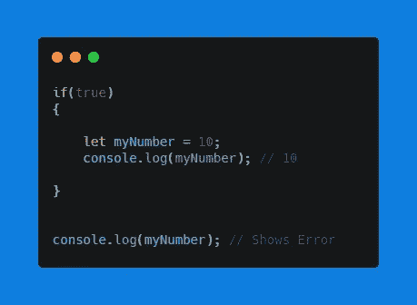
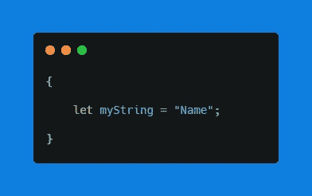
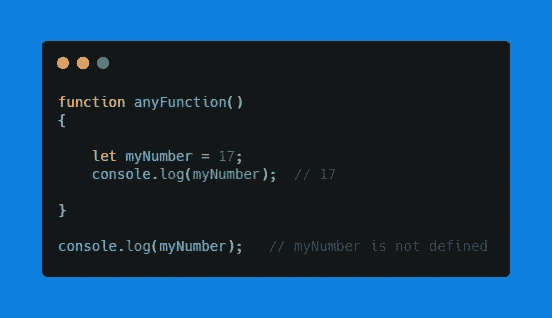
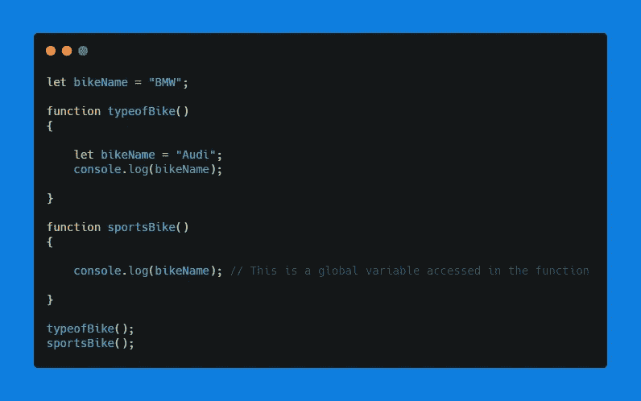

# 理解 JavaScript 范围的终极指南。

> 原文：<https://medium.com/nerd-for-tech/the-ultimate-guide-to-understand-javascript-scope-917e6723a5d3?source=collection_archive---------7----------------------->

在本文中，您将详细了解块、局部、函数和全局作用域。

图片由 [Free-Photos](https://pixabay.com/photos/?utm_source=link-attribution&utm_medium=referral&utm_campaign=image&utm_content=1209892) 来自 [Pixabay](https://pixabay.com/?utm_source=link-attribution&utm_medium=referral&utm_campaign=image&utm_content=1209892)

作为一个编程初学者，你会因为作用域而在程序中遇到错误。

理解 JavaScript 作用域对于避免代码中奇怪的 bug 或错误非常重要。

范围控制代码中使用的变量的可见性，并且它们为变量添加了额外的安全层，防止从外部访问块。

JavaScript 中有四种类型的作用域。

*   **屏蔽范围**
*   **局部范围**
*   **功能范围**
*   **全局范围**

# — →闭塞范围:

在新版 JavaScript(ES6)中，引入了两个新的关键字 **let** 和 **const** 。

let 和 const 关键字带来了块范围的新概念。用 **var** 关键字定义的变量没有块范围。

块范围就像连接到 JavaScript 引擎本身给定的变量的边界。如果变量是从作用域边界之外调用的，那么就不能访问该变量。

***例如:***

# — →本地范围:

在左{和右}大括号之间声明的变量被认为是该块的局部变量。可以在局部范围内使用 let、const 和 var 关键字声明变量。

局部变量只能在局部范围内访问和修改。

***举例:***

如果在函数中声明了一个变量，那么该变量只有在函数被调用时才在作用域中可用，而在函数完成工作后被删除。

# — →功能范围:

当我们编写一个函数时，JavaScript 引擎会自动为该函数指定一个不可见的作用域。

在这个函数作用域中，当使用 let、const 和 var 声明变量时，这些变量不能从函数作用域之外访问。

***举例*** *:*

与全局变量相比，函数变量的寿命较短。

# — →全球范围:

全局作用域就是在函数体之外声明变量的作用域，那么这个变量就是全局变量。

在函数之外但在程序顶部声明的变量可以被允许在整个程序中使用。

JavaScript 引擎自动将范围分配给全局变量。

***例如:***

只要网页加载到浏览器中，全局变量就会保留。如果网页关闭或重新加载，全局变量就会被破坏。

# 结论:

现在你明白了如何控制你的变量在作用域之外访问。对于初学者来说，作用域不容易理解，但是在任何编程语言中都是非常重要的概念。

在代码中处处使用全局变量不是好的做法，只有在需要时才使用全局变量，否则就在局部使用。在您的代码中，全局和局部范围各有各的好处。

希望这篇文章能帮助你学习 JavaScript 中不同类型的作用域。

**如果你喜欢这篇文章，请随意鼓掌、评论，并与你的朋友分享。别忘了关注我更多有趣的文章。**

**感谢您的阅读！**