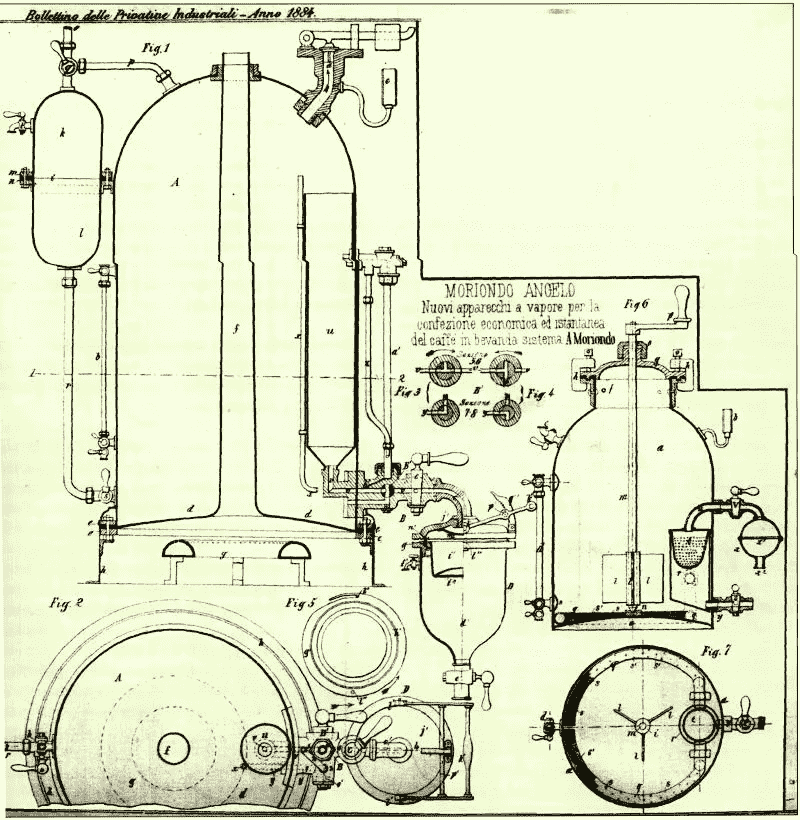
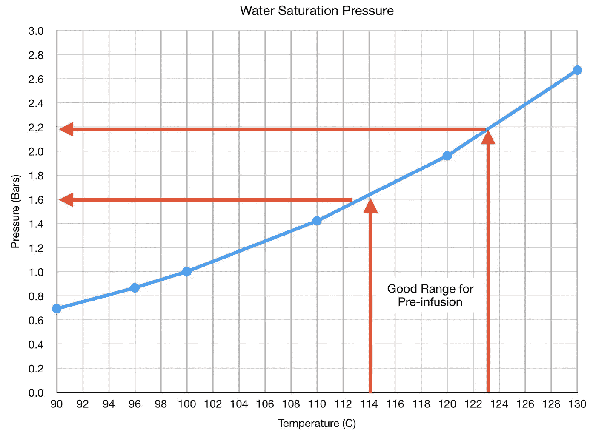
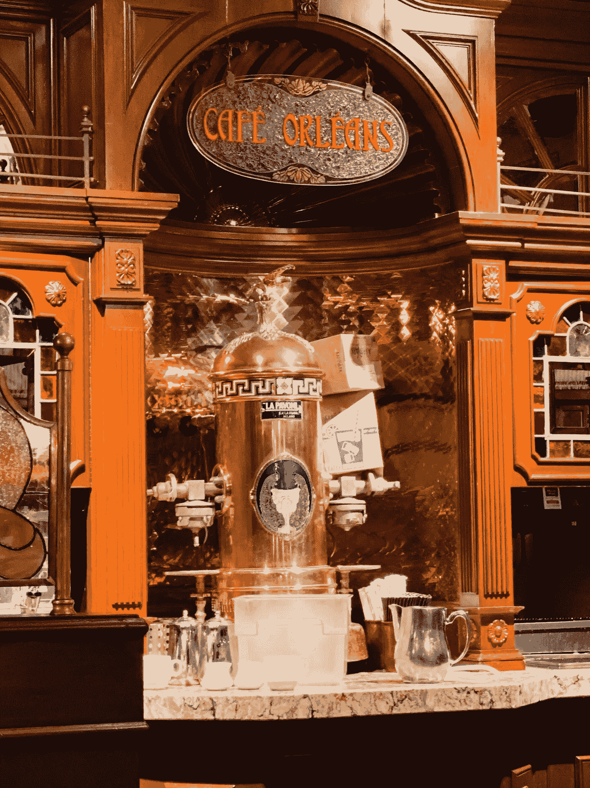
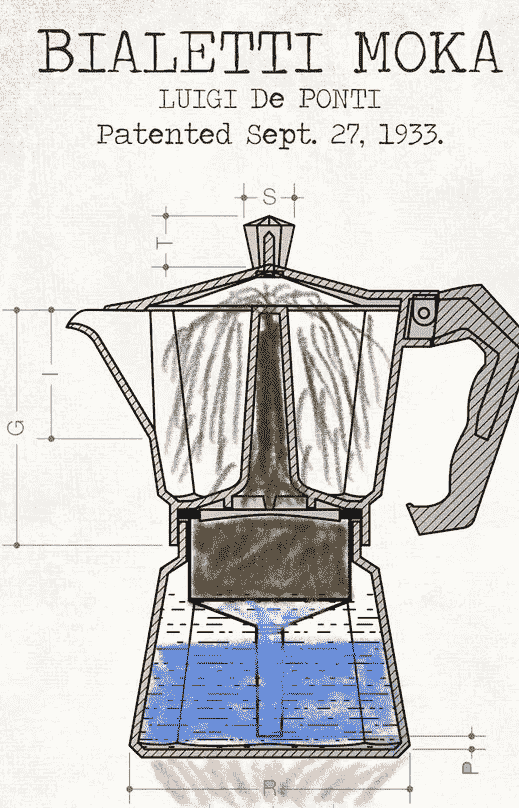
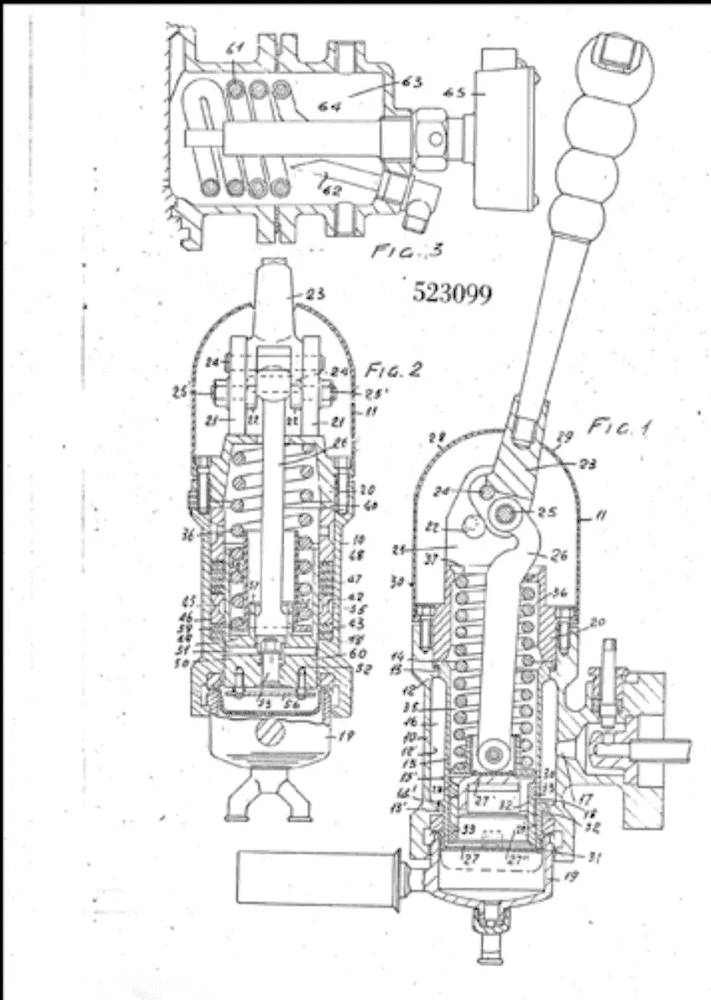
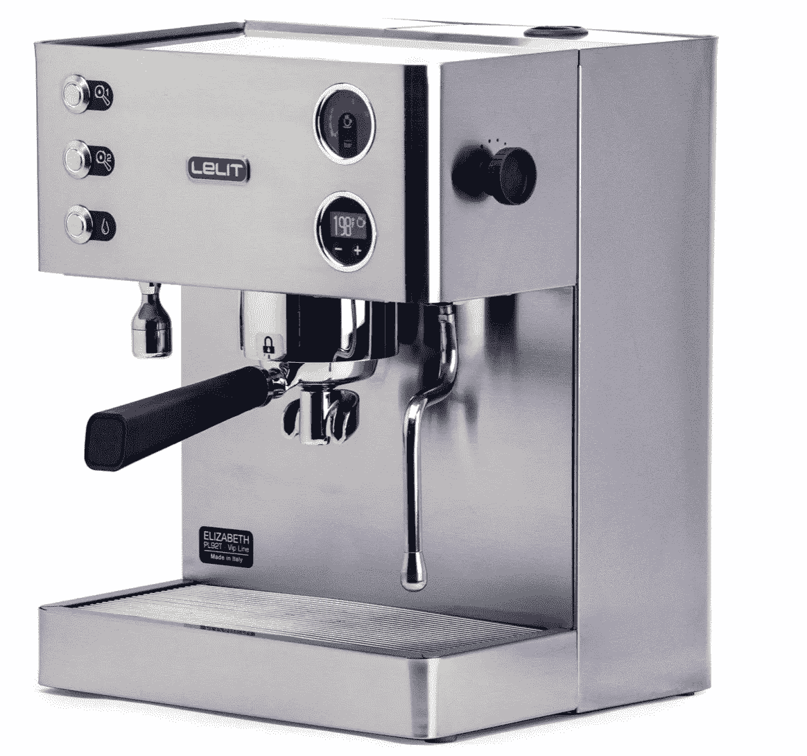

# 浓缩咖啡蒸汽预注入的不为人知的故事

> 原文：<https://medium.com/nerd-for-tech/the-untold-story-of-steam-pre-infusion-for-espresso-e41a3a559153?source=collection_archive---------0----------------------->

## 咖啡数据科学

## 一些幸运机器的意外收益

最近，我[比较了](https://towardsdatascience.com/decent-espresso-de1pro-vs-kim-express-round-1-54dffdfd2892?source=your_stories_page-------------------------------------)我的像样的浓缩咖啡机和我的 Kim Express 弹簧驱动手动浓缩咖啡机。我发现在性能上有很大的差异，金是明显的赢家。我想深入挖掘。于是我进一步检查了[咖啡喷嚏](/geekculture/the-coffee-sneeze-in-espresso-b759aeb8d825)。

我的理论是，金快车不仅水温比德快车高；它肯定还有其他优势。我发现金确实蒸汽预注入，我相信这是秘密武器。我不认为这是有意为金或任何其他机器使用蒸汽预注入，但我相信这是一个被忽视和研究不足的变量。

左边是金快线，右边是 DE1Pro。除非另有说明，所有图片均由作者提供。

对于金正日来说，[的最佳水温](https://towardsdatascience.com/water-temperature-for-espresso-1abe656b54d3)在 116 摄氏度到 123 摄氏度之间，所以当你拉下杠杆让水进入活塞时，水的第一部分立即变成蒸汽。蒸汽开始快速穿过咖啡球，不到 20 毫秒，水就出来了。

当水流过咖啡时，暴露在空气中的水正在蒸发，因为水温远高于沸点。一旦冰球底部有咖啡流出，冰球内部的压力就和锅炉一样，所以水温可以保持很高。

这与 E61 机器不同，因为水温较低，通常上限为 105 摄氏度。此外，没有这个房间突然充满蒸汽导致打喷嚏。咖啡喷嚏是蒸汽预浸的开始。

让我们沿着记忆之路走一趟，更好地了解蒸汽预注入的历史。

# 拉麦克奇纳

该作品在其来源国 [**公有领域**](https://en.wikipedia.org/wiki/public_domain) 及其他国家和地区[版权期限](https://en.wikipedia.org/wiki/List_of_countries%27_copyright_lengths)为作者**寿命加 70 年以下**。

Moriondo 发明了最早的浓缩咖啡机，它是一个将水加热到 1.5 巴压力的沸水器。这意味着水温约为 113 摄氏度。它的优点是温度较高，但没有蒸汽预浸。

# 拉帕沃尼

帕沃尼最初的浓缩咖啡机(大约在 1910 年)将水加热到 1.5 到 2 巴的压力。这意味着水温应该在 113 度到 122 度之间。这与 Kim Express 处于相似的良好范围，但允许水流的机制仍然是流量控制旋钮。

华特·迪士尼在迪斯尼乐园。

# 摩卡壶

1933 年，比亚莱蒂发明了摩卡壶。奇怪的是，陆丹蓝的设计已经预先注入了蒸汽。陆丹蓝让水在容器中沸腾，迫使水通过一个小管，穿过咖啡，流到顶部。然而，在腔室被加压之前，会产生一些蒸汽，并通过咖啡向上传播。这个量取决于你加热锅的时间和加热强度。

# 加吉亚

由 Gaggia 制造的第一台弹簧驱动浓缩咖啡机(1948 年)允许更高的压力，但它们也有预注入蒸汽的潜力。唯一的阻碍是保持群头的水温。

【https://www.gaggia-na.com/pages/history 号

# [金特快](https://rmckeon.medium.com/kim-express-espresso-machine-instructions-93288f70be6c)

金的独特设计是，集团首脑坐在锅炉内。这种设计不用于任何其他封闭式锅炉杠杆机器。因此，组头处的水温更接近锅炉，通常在 2C 以内。

# 李莉伊丽莎白

2020 年，Lelit 推出了 Elizabeth，这是一款使用振动泵的双锅炉可编程咖啡机。伊丽莎白可以通过打开水流几秒钟来进行预浸泡，或者它可以使用锅炉作为蒸汽棒。我以为它是在进行实际的蒸汽预注入，但我发现水是在酿造组中传送的，所以唯一的好处是压力，而不是蒸汽部分。我希望它会有这样的优势。

[https://lelit.com/product/elizabeth-pl92t/](https://lelit.com/product/elizabeth-pl92t/)

# [像样的意式浓缩咖啡机](https://towardsdatascience.com/developing-a-decent-profile-for-espresso-c2750bed053f)

我目前的目标是找到一种方法来破解 DE，以模仿蒸汽预注入。我相信，更好地理解如何实现蒸汽预浸和对它的研究将有助于不仅是德，但所有的咖啡机设计。

有些时候，创新是在没有完全理解的情况下做出的。我认为蒸汽预注入是这些创新之一。

如果你愿意，可以在推特、 [YouTube](https://m.youtube.com/channel/UClgcmAtBMTmVVGANjtntXTw?source=post_page---------------------------) 和 [Instagram](https://www.instagram.com/espressofun/) 上关注我，我会在那里发布不同机器上的浓缩咖啡照片和浓缩咖啡相关的视频。你也可以在 [LinkedIn](https://www.linkedin.com/in/dr-robert-mckeon-aloe-01581595) 上找到我。也可以关注我在[中](https://towardsdatascience.com/@rmckeon/follow)和[订阅](https://rmckeon.medium.com/subscribe)。

# [我的进一步阅读](https://rmckeon.medium.com/story-collection-splash-page-e15025710347):

[我未来的书](https://www.kickstarter.com/projects/espressofun/engineering-better-espresso-data-driven-coffee)

[我的链接](https://rmckeon.medium.com/my-links-5de9eb69c26b?source=your_stories_page----------------------------------------)

[浓缩咖啡系列文章](https://rmckeon.medium.com/a-collection-of-espresso-articles-de8a3abf9917?postPublishedType=repub)

工作和学校故事集