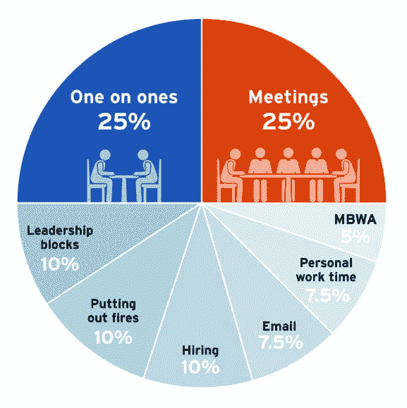

# 授权的真空

> 原文：<https://medium.com/nerd-for-tech/the-void-of-empowerment-1d253eaf3cbf?source=collection_archive---------2----------------------->

随着人们在公司中的职位变得更高——无论是因为晋升还是因为公司在他们的领导下成长——一个反复出现的问题是，他们感觉自己正在慢慢远离对团队的影响。我们都在谈论授权的团队，但是当你真正实现了类似于圣杯的东西时会发生什么呢？突然之间，你的日程表似乎没那么满了，你可能会觉得自己没那么被需要了。你应该如何度过你的时间？

# 打破恐惧

到底是什么问题？为什么许多人发现自己被遗弃在路边？我相信有几个共同因素。

**害怕微观管理:**好的领导意识到自己的行为，知道微观管理不好。有时，这可能会走向极端，我们觉得每一条评论都可能会踩到人们的脚趾，或者一个建议意味着你正在伤害人们的自主权和权力。

**日历怪:**如果，通过某种神奇的方式，你的日历上突然有了更多的空闲时间，你会开始觉得自己没有在工作。我们告诉自己我们必须忙碌，但是*忙碌是容易的*。有时间思考并不是一件坏事！

**缺乏方向:**到最后，如果你还没有进化出思考自己角色和成功定义的方式，随着团队变得越来越独立，你会感到错位。

# 你应该做什么

上图出自[*Tech Executive 操作系统*](https://techexecutiveoperatingsystem.com) 第五章。在这本书里，我列出了一个推荐的默认分配，当你领导一个健康的团队时。这并不是说你的日历应该和这个一模一样，但是想想为什么和哪里不同会有帮助。

这种分配源于对领导力的定义，我们认为领导者的角色是发展团队本身。你的产出不是团队的产出，而是团队的产出。你能创建一个不断进步的团队吗？能够应对即将到来的挑战？定期为整个公司提供卓越的创新和影响？

我不会在这里讨论整个分配，但我想列出一些块，并展示它们是如何从定义中派生出来的，这样你就可以理解我在帮助我的客户塑造他们的日常生活时的思维方式。

首先，要意识到，这里的大部分时间并不是“坐在房间里与人交谈”领导街区、走动式管理、个人工作时间(和电子邮件)看起来都像是你一个人坐着或走动。抛开日历的责备，不要为坐下来思考一会儿而感到羞愧。如果你不停地从一个会议跑到另一个会议，你就没有时间看更大的图片和缩小。

第二，很多人的目标是让团队中的*工作，而不是团队中的*T2。将 25%的时间花在一对一上是因为辅导和指导应该是你关注的相当大的一部分。你不应该自己做大量的工作，而是指导你的经理和高级 IC 成长到他们的下一个水平。这就是你如何发挥力量倍增器的作用:让你周围的人变得更好。

最后，时间分配和关注的另一个重要方面应该是确保你与团队、产品和市场保持联系。定期跳过级别一对一意味着您仍然可以了解团队在各个级别的表现。在健康的客户摩擦中投入一些领导力，例如，加入电话、阅读评论和类似的活动。其他部分可以用来磨练你的产品掌握。有些只是让你战略性地思考问题。在一个大多数人都在考虑灭火和吉拉仪表盘上今天应该做的事情的组织中，有一个负责任的成年人时不时地展望未来是无价的。

如果你很难定义自己的角色或确保自己发挥应有的效力，我很乐意和[聊聊](https://avivbenyosef.com/)。

*Aviv Ben-Yosef 2022 —最初发表于* [*科技高管最佳时事通讯*](https://avivbenyosef.com/newsletter/)