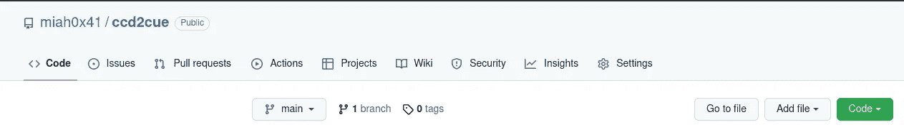
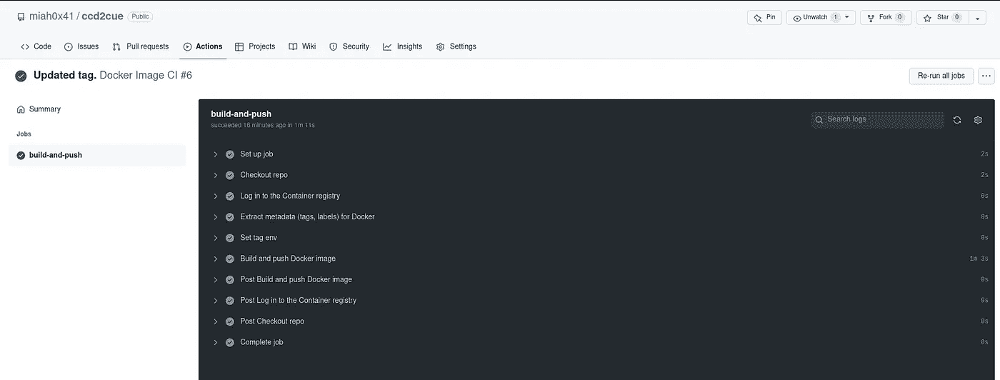
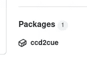
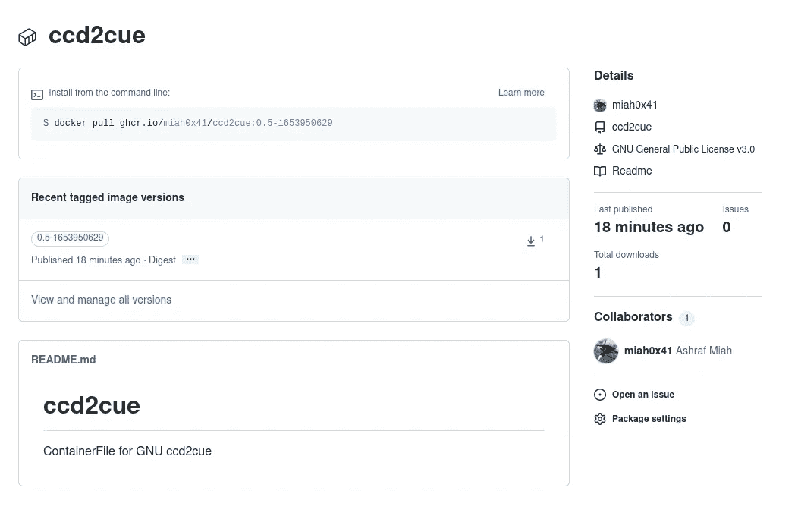

# GNU 和 OCI 集装箱的奇迹

> 原文：<https://medium.com/nerd-for-tech/the-wonders-of-gnu-and-oci-docker-containers-7fd2bc906fb3?source=collection_archive---------2----------------------->

> 创建下载、编译和创建 OCI 兼容容器的管道。


照片由 [Timelab Pro](https://unsplash.com/@timelabpro?utm_source=unsplash&utm_medium=referral&utm_content=creditCopyText) 在 [Unsplash](https://unsplash.com/s/photos/containers?utm_source=unsplash&utm_medium=referral&utm_content=creditCopyText) 上拍摄

我偶然发现了一些旧的奇怪的文件格式，扩展名为`.ccd`属于现在已经不存在的*克隆 CD* 应用程序，那是在 21 世纪初风靡一时的。该程序最初是由一家名为*Slysoft*的公司创建的，当被各种实体针对时，该程序被替换为 [*Redfox*](https://en.wikipedia.org/wiki/RedFox) ，这些实体反对在拷贝或一般 CD 拷贝时绕过数字版权管理(DRM)。

大多数转换`.ccd`格式的工具都是为 Windows 设计的，但是也有一些 GNU/Linux 环境的开源工具，比如`[ccd2iso](https://github.com/jkmartindale/ccd2iso)`和`[ccd2cu](https://www.gnu.org/software/ccd2cue/)e`。后者没有用于 *Ubuntu* 的软件包，因此这是一个展示容器和开源软件奇迹的机会！


数据科学指南作者: [Ashraf Miah](https://aero-data-science.medium.com/) |图片作者

## 手动编译

在使用`x86_64`架构的 Ubuntu 20.04 主机上，下载源文件，安装典型的构建工具和 C 编译器，比如`gcc:`

```
# Create suitable directory
mkdir -p source/ccd2cue# Change into directory
cd source/ccd2cue# Download source files
wget [https://ftp.gnu.org/gnu/ccd2cue/ccd2cue-0.5.tar.gz](https://ftp.gnu.org/gnu/ccd2cue/ccd2cue-0.5.tar.gz)# Untar
tar xvzf ccd2cue-0.5.tar.gz# Change into source directory
cd ccd2cue-0.5
```

安装说明可以概括为:

```
# Check configuration
./configure# Make artifacts
make# Install (using privileged account)
# if installing in default or secure
# path.  On Ubuntu can use sudo:
sudo make install
```

运行`./configure`将显示缺少 C 编译器，像`make`这样的基本构建工具也是如此。这可以通过以下方法来纠正:

```
# Install dependencies
sudo apt install build-essential gcc
```

检查配置:

```
# Check configuration
./configurechecking for a BSD-compatible install... /usr/bin/install -c
checking whether build environment is sane... yes
checking for a thread-safe mkdir -p... /usr/bin/mkdir -p
checking for gawk... gawk
checking whether make sets $(MAKE)... yes
checking whether make supports nested variables... yes
checking whether make supports nested variables... (cached) yes
checking whether NLS is requested... yes
checking for msgfmt... no
checking for gmsgfmt... :
checking for xgettext... no
checking for msgmerge... no
checking for style of include used by make... GNU
checking for gcc... gcc
checking whether the C compiler works... yes
checking for C compiler default output file name... a.out
checking for suffix of executables... 
checking whether we are cross compiling... no
checking for suffix of object files... o
checking whether we are using the GNU C compiler... yes
checking whether gcc accepts -g... yes
checking for gcc option to accept ISO C89... none needed
checking whether gcc understands -c and -o together... yes
checking dependency style of gcc... gcc3
checking build system type... x86_64-unknown-linux-gnu
checking host system type... x86_64-unknown-linux-gnu
checking for ld used by GCC... /usr/bin/ld
checking if the linker (/usr/bin/ld) is GNU ld... yes
checking for shared library run path origin... done
checking how to run the C preprocessor... gcc -E
checking for grep that handles long lines and -e... /usr/bin/grep
checking for egrep... /usr/bin/grep -E
checking for CFPreferencesCopyAppValue... no
checking for CFLocaleCopyCurrent... no
checking for GNU gettext in libc... yes
checking whether to use NLS... yes
checking where the gettext function comes from... libc
checking whether ln -s works... yes
checking for grep that handles long lines and -e... (cached) /usr/bin/grep
checking for a sed that does not truncate output... /usr/bin/sed
checking for gcc... (cached) gcc
checking whether we are using the GNU C compiler... (cached) yes
checking whether gcc accepts -g... (cached) yes
checking for gcc option to accept ISO C89... (cached) none needed
checking whether gcc understands -c and -o together... (cached) yes
checking dependency style of gcc... (cached) gcc3
configure: checking programs needed in order to build documentation
checking for makeinfo... no
configure: WARNING: GNU Texinfo not found.  It is required at least version 5.1.
You can find it at [https://gnu.org/software/texinfo/](https://gnu.org/software/texinfo/).
It will not be possible to rebuild the Info documentation
nor generate any other documentation format.
checking for help2man... no
checking for doxygen... no
configure: WARNING: doxygen not found - will not generate any doxygen documentation
checking for perl... /usr/bin/perl
configure: Checking meta-information
checking available translations... da de uk vi
checking that generated files are newer than configure... done
configure: creating ./config.status
config.status: creating Makefile
config.status: creating po/Makefile.in
config.status: creating po/LINGUAS
config.status: creating src/Makefile
config.status: creating doc/Makefile
config.status: creating doc/Doxyfile
config.status: creating doc/man/Makefile
config.status: creating doc/release/release.texi
config.status: creating config.h
config.status: config.h is unchanged
config.status: executing po-directories commands
config.status: creating po/POTFILES
config.status: creating po/Makefile
config.status: executing depfiles commands## ---------------------- ##
## GNU Make Targets Table ##
## ---------------------- ##Build:all            Compile entire program.info, html, pdf, ps, dvi
                Build documentation in the respective format.doxygen-doc    Build source-code documentation.
 check          Run test suite.tags, ctags
                Build respective tags table file.Installation:install-exec     Install architecture-dependent files.
 install-data     Install architecture-independent files.
 install          Same as `install-exec' followed by `install-data'.
 install-strip    Same as `install' but strip executables.install-{info,html,pdf,ps,dvi}
                  Install documentation in the respective format.install-man      Install man pages.
 installdirs      Create the installation directory tree.
 installcheck     Perform installation tests.
 uninstall        Delete installed files.Cleaning:mostlyclean         Delete files that `make' built and usually
                      one would like to rebuild.
 clean               Same as `mostlyclean' but delete also
                      any file `make' built but was ignored by
                      `mostlyclean'.
 distclean           Same as `clean' but delete also files
                      generated by the configuration script.
 maintainer-clean    Same as `distclean' but delete also
                      files maintainers built.Distribution:distdir      Create distribution directory.
 dist         Same as `distdir' but package the distribution
               directory into a tarball.
 distcheck    Same as `dist' but also check generated
               tarball for correctness.Maintenance:These can only be made from VCS checkouts.homepage     Generate package's homepage.
 distgnu      Same as `distcheck' but also sign and upload the
               resulting tarball to the GNU ftp site.
 announcegnu  Send release announcement to '[info-gnu@gnu.org](mailto:info-gnu@gnu.org)',
               '[ccd2cue@gnu.org](mailto:ccd2cue@gnu.org)' and
               '[coordinator@translationproject.org](mailto:coordinator@translationproject.org)'
 fetchpo      Fetch the latest PO translation files from the
               Translation Project.
```

制作神器:

```
# Build
makemake  all-recursive
make[1]: Entering directory '/home/helix/source/ccd2cue/ccd2cue-0.5'
Making all in po
make[2]: Entering directory '/home/helix/source/ccd2cue/ccd2cue-0.5/po'
make[2]: Leaving directory '/home/helix/source/ccd2cue/ccd2cue-0.5/po'
Making all in src
make[2]: Entering directory '/home/helix/source/ccd2cue/ccd2cue-0.5/src'
  CC       ccd2cue.o
  CC       memory.o
  CC       io.o
  CC       file.o
  CC       array.o
  CC       errors.o
  CC       crc.o
  CC       ccd.o
ccd.c: In function ‘stream2ccd’:
ccd.c:362:33: warning: format ‘%a’ expects argument of type ‘float *’, but argument 3 has type ‘char **’ [-Wformat=]
  362 |    if (sscanf (line, " FLAGS = %a[a-zA-Z0-9 ] ", &ccd->TRACK[TRACK].FLAGS) == 1)
      |                                ~^                ~~~~~~~~~~~~~~~~~~~~~~~~
      |                                 |                |
      |                                 float *          char **
  CC       cue.o
  CC       cdt.o
  CC       convert.o
  CCLD     ccd2cue
make[2]: Leaving directory '/home/helix/source/ccd2cue/ccd2cue-0.5/src'
Making all in doc
make[2]: Entering directory '/home/helix/source/ccd2cue/ccd2cue-0.5/doc'
Making all in man
make[3]: Entering directory '/home/helix/source/ccd2cue/ccd2cue-0.5/doc/man'
make[3]: Nothing to be done for 'all'.
make[3]: Leaving directory '/home/helix/source/ccd2cue/ccd2cue-0.5/doc/man'
make[3]: Entering directory '/home/helix/source/ccd2cue/ccd2cue-0.5/doc'
make[3]: Nothing to be done for 'all-am'.
make[3]: Leaving directory '/home/helix/source/ccd2cue/ccd2cue-0.5/doc'
make[2]: Leaving directory '/home/helix/source/ccd2cue/ccd2cue-0.5/doc'
make[2]: Entering directory '/home/helix/source/ccd2cue/ccd2cue-0.5'
make[2]: Leaving directory '/home/helix/source/ccd2cue/ccd2cue-0.5'
make[1]: Leaving directory '/home/helix/source/ccd2cue/ccd2cue-0.5'
```

最后一步是在系统上安装:

```
# Install into default location
sudo make installMaking install in po
make[1]: Entering directory '/home/helix/source/ccd2cue/ccd2cue-0.5/po'
installing da.gmo as /usr/local/share/locale/da/LC_MESSAGES/ccd2cue.mo
installing de.gmo as /usr/local/share/locale/de/LC_MESSAGES/ccd2cue.mo
installing uk.gmo as /usr/local/share/locale/uk/LC_MESSAGES/ccd2cue.mo
installing vi.gmo as /usr/local/share/locale/vi/LC_MESSAGES/ccd2cue.mo
if test "ccd2cue" = "gettext-tools"; then \
  /usr/bin/mkdir -p /usr/local/share/gettext/po; \
  for file in Makefile.in.in remove-potcdate.sin quot.sed boldquot.sed en@quot.header en@boldquot.header insert-header.sin Rules-quot   Makevars.template; do \
    /usr/bin/install -c -m 644 ./$file \
     /usr/local/share/gettext/po/$file; \
  done; \
  for file in Makevars; do \
    rm -f /usr/local/share/gettext/po/$file; \
  done; \
else \
  : ; \
fi
make[1]: Leaving directory '/home/helix/source/ccd2cue/ccd2cue-0.5/po'
Making install in src
make[1]: Entering directory '/home/helix/source/ccd2cue/ccd2cue-0.5/src'
make[2]: Entering directory '/home/helix/source/ccd2cue/ccd2cue-0.5/src'
 /usr/bin/mkdir -p '/usr/local/bin'
  /usr/bin/install -c ccd2cue '/usr/local/bin'
make[2]: Nothing to be done for 'install-data-am'.
make[2]: Leaving directory '/home/helix/source/ccd2cue/ccd2cue-0.5/src'
make[1]: Leaving directory '/home/helix/source/ccd2cue/ccd2cue-0.5/src'
Making install in doc
make[1]: Entering directory '/home/helix/source/ccd2cue/ccd2cue-0.5/doc'
Making install in man
make[2]: Entering directory '/home/helix/source/ccd2cue/ccd2cue-0.5/doc/man'
make[3]: Entering directory '/home/helix/source/ccd2cue/ccd2cue-0.5/doc/man'
make[3]: Nothing to be done for 'install-exec-am'.
 /usr/bin/mkdir -p '/usr/local/share/man/man1'
 /usr/bin/install -c -m 644 ccd2cue.1 '/usr/local/share/man/man1'
make[3]: Leaving directory '/home/helix/source/ccd2cue/ccd2cue-0.5/doc/man'
make[2]: Leaving directory '/home/helix/source/ccd2cue/ccd2cue-0.5/doc/man'
make[2]: Entering directory '/home/helix/source/ccd2cue/ccd2cue-0.5/doc'
make[3]: Entering directory '/home/helix/source/ccd2cue/ccd2cue-0.5/doc'
make[3]: Nothing to be done for 'install-exec-am'.
 /usr/bin/mkdir -p '/usr/local/share/info'
 /usr/bin/install -c -m 644 ./ccd2cue.info '/usr/local/share/info'
make[3]: Leaving directory '/home/helix/source/ccd2cue/ccd2cue-0.5/doc'
make[2]: Leaving directory '/home/helix/source/ccd2cue/ccd2cue-0.5/doc'
make[1]: Leaving directory '/home/helix/source/ccd2cue/ccd2cue-0.5/doc'
make[1]: Entering directory '/home/helix/source/ccd2cue/ccd2cue-0.5'
make[2]: Entering directory '/home/helix/source/ccd2cue/ccd2cue-0.5'
make[2]: Nothing to be done for 'install-exec-am'.
make[2]: Nothing to be done for 'install-data-am'.
make[2]: Leaving directory '/home/helix/source/ccd2cue/ccd2cue-0.5'
make[1]: Leaving directory '/home/helix/source/ccd2cue/ccd2cue-0.5'
```

测试应用程序:

```
# Test application
ccd2cue --versionccd2cue (GNU ccd2cue) 0.5Copyright (C) 2010, 2013, 2014, 2015 Bruno Fe'lix Rezende Ribeiro <[oitofelix@gnu.org](mailto:oitofelix@gnu.org)>License GPLv3+: GNU GPL version 3 or later <[http://gnu.org/licenses/gpl.html](http://gnu.org/licenses/gpl.html)>
This is free software: you are free to change and redistribute it.
There is NO WARRANTY, to the extent permitted by law.Written by Bruno Fe'lix Rezende Ribeiro.
```

## `OCI or Docker Container`

另一种方法是使用下面的`ContainerFile`(类似于`DockerFile`)构建、编译并安装在一个容器中。

> [开放容器倡议](https://opencontainers.org/) (OCI)是一个旨在用一致的标准取代`docker`容器格式的标准。

虽然`docker`应用程序可以用来构建和管理容器，但是像`buildah`和`podman`这样的工具越来越轻便、灵活和符合标准。以下文件总结了手动步骤:

```
FROM ubuntu:20.04LABEL "org.opencontainers.image.authors"="miah0x41"# Install dependencies
RUN apt update && apt install -y \
      build-essential \
      gcc \
      wget \
      && rm -rf /var/lib/apt/lists/*# Create folder
RUN mkdir -p /source/ccd2cue# Change working directory
WORKDIR /source/ccd2cue# Download source code
RUN wget [https://ftp.gnu.org/gnu/ccd2cue/ccd2cue-0.5.tar.gz](https://ftp.gnu.org/gnu/ccd2cue/ccd2cue-0.5.tar.gz) \
  && tar xvzf ccd2cue-0.5.tar.gz \
  && rm ccd2cue-0.5.tar.gz# Change into source directory
WORKDIR /source/ccd2cue/ccd2cue-0.5# Configure, make and install
RUN ./configure \
  && make \
  && make install# Set default command
ENTRYPOINT ["/usr/local/bin/ccd2cue"]
```

通过以下命令使用`buildah`创建`image`:

```
# Build image
buildah bud -f ContainerFile -t miah0x41/ccd2cue:0.5-0WARN[0000] Failed to decode the keys ["machine"] from "/usr/share/containers/containers.conf". 
WARN[0000] Failed to decode the keys ["machine"] from "/usr/share/containers/containers.conf". 
STEP 1/9: FROM ubuntu:20.04
STEP 2/9: LABEL "org.opencontainers.image.authors"="miah0x41"
STEP 3/9: RUN apt update && apt install -y       build-essential       gcc       wget       && rm -rf /var/lib/apt/lists/*
WARN[0000] Failed to decode the keys ["machine"] from "/usr/share/containers/containers.conf".WARNING: apt does not have a stable CLI interface. Use with caution in scripts.Get:1 [http://archive.ubuntu.com/ubuntu](http://archive.ubuntu.com/ubuntu) focal InRelease [265 kB]
Get:2 [http://security.ubuntu.com/ubuntu](http://security.ubuntu.com/ubuntu) focal-security InRelease [114 kB]
Get:3 [http://archive.ubuntu.com/ubuntu](http://archive.ubuntu.com/ubuntu) focal-updates InRelease [114 kB]
Get:4 [http://security.ubuntu.com/ubuntu](http://security.ubuntu.com/ubuntu) focal-security/restricted amd64 Packages [1205 kB]
Get:5 [http://archive.ubuntu.com/ubuntu](http://archive.ubuntu.com/ubuntu) focal-backports InRelease [108 kB]
<snip>
0 added, 0 removed; done.
Running hooks in /etc/ca-certificates/update.d...
done.
STEP 4/9: RUN mkdir -p /source/ccd2cue
WARN[0000] Failed to decode the keys ["machine"] from "/usr/share/containers/containers.conf". 
STEP 5/9: WORKDIR /source/ccd2cue
STEP 6/9: RUN wget [https://ftp.gnu.org/gnu/ccd2cue/ccd2cue-0.5.tar.gz](https://ftp.gnu.org/gnu/ccd2cue/ccd2cue-0.5.tar.gz)   && tar xvzf ccd2cue-0.5.tar.gz   && rm ccd2cue-0.5.tar.gz
WARN[0000] Failed to decode the keys ["machine"] from "/usr/share/containers/containers.conf". 
--2022-05-30 21:24:37--  [https://ftp.gnu.org/gnu/ccd2cue/ccd2cue-0.5.tar.gz](https://ftp.gnu.org/gnu/ccd2cue/ccd2cue-0.5.tar.gz)
Resolving ftp.gnu.org (ftp.gnu.org)... 2001:470:142:3::b, 209.51.188.20
Connecting to ftp.gnu.org (ftp.gnu.org)|2001:470:142:3::b|:443... connected.
HTTP request sent, awaiting response... 200 OK
Length: 626071 (611K) [application/x-gzip]
Saving to: 'ccd2cue-0.5.tar.gz'0K .......... .......... .......... .......... ..........  8%  257K 2s
    50K .......... .......... .......... .......... .......... 16%  516K 1s
   100K .......... .......... .......... .......... .......... 24% 94.9M 1s
   150K .......... .......... .......... .......... .......... 32%  518K 1s
   200K .......... .......... .......... .......... .......... 40% 77.5M 1s
   250K .......... .......... .......... .......... .......... 49% 94.8M 0s
   300K .......... .......... .......... .......... .......... 57%  111M 0s
   350K .......... .......... .......... .......... .......... 65%  523K 0s
   400K .......... .......... .......... .......... .......... 73% 39.1M 0s
   450K .......... .......... .......... .......... .......... 81%  118M 0s
   500K .......... .......... .......... .......... .......... 89%  110M 0s
   550K .......... .......... .......... .......... .......... 98%  115M 0s
   600K .......... .                                          100% 65.0M=0.5s2022-05-30 21:24:38 (1.22 MB/s) - 'ccd2cue-0.5.tar.gz' saved [626071/626071]<snip>
ccd2cue-0.5/INSTALL
ccd2cue-0.5/TODO
STEP 7/9: WORKDIR /source/ccd2cue/ccd2cue-0.5
STEP 8/9: RUN ./configure   && make   && make install
WARN[0000] Failed to decode the keys ["machine"] from "/usr/share/containers/containers.conf". 
checking for a BSD-compatible install... /usr/bin/install -c
checking whether build environment is sane... yes
checking for a thread-safe mkdir -p... /usr/bin/mkdir -p
checking for gawk... no
checking for mawk... mawk
checking whether make sets $(MAKE)... yes
checking whether make supports nested variables... yes
<snip>
STEP 9/9: ENTRYPOINT ["/usr/local/bin/ccd2cue"]
COMMIT miah0x41/ccd2cue:0.5
Getting image source signatures
Copying blob bf8cedc62fb3 skipped: already exists  
Copying blob 3bd397d87e45 done  
Copying config 9b3c5ca6c6 done  
Writing manifest to image destination
Storing signatures
--> 9b3c5ca6c6c
Successfully tagged localhost/miah0x41/ccd2cue:0.5
9b3c5ca6c6c4b8518c4259cf73baeb468a6d72f8f4dd74ba52239f5b5b8265a3
```

用`--version`命令测试容器:

```
# Check version
podman run --rm -it miah0x41/ccd2cue --versionccd2cue (GNU ccd2cue) 0.5Copyright (C) 2010, 2013, 2014, 2015 Bruno Fe'lix Rezende Ribeiro <[oitofelix@gnu.org](mailto:oitofelix@gnu.org)>License GPLv3+: GNU GPL version 3 or later <[http://gnu.org/licenses/gpl.html](http://gnu.org/licenses/gpl.html)>
This is free software: you are free to change and redistribute it.
There is NO WARRANTY, to the extent permitted by law.Written by Bruno Fe'lix Rezende Ribeiro.
```

虽然这为`ccd2cue`程序创建了一个可移植的容器，但它并不是广泛可访问的。这当然可以通过手动上传到 *Docker Hub* 来解决，但是对于透明度和更广泛的社区来说，使用公共回购更好。

## GitHub 操作

我们可以使用预定义的模板来利用 GitHub 动作，而不是在本地机器上手动运行`buildah`。第一步是将`ContainerFile`托管在诸如`[miah0x41/ccd2cue](https://github.com/miah0x41/ccd2cue)`的存储库中。顶栏包含可用的操作:



GitHub 菜单作者 [Ashraf Miah](https://aero-data-science.medium.com/) |图片作者

在“动作”下，点击“新工作流”，在“持续集成”下可以使用“Docker 图像”模板。


[阿什拉夫·米亚](https://aero-data-science.medium.com/)的 CI 行为|图片由作者提供

然而，文档中有一个`build-and-push`动作，它更适合。本例中使用了以下操作文件:

这一行动有许多部分；基本上，`on:`键定义了自动和手动运行动作的时间。环境变量用于定义注册表(作为 Github 自己的)以及 GitHub 令牌的权限(用于向注册表认证)。在这种情况下，注册表的名称`ccd2cue`也是图像的名称。

`job`中的键`steps`是检查存储库，然后登录到注册中心，注册中心使用 Github 变量(如`actor`)、环境变量和 Github 秘密的组合。下一步是从图像中提取元数据(老实说，我不确定这一步到底是做什么的！).

为了利用秒格式的日期作为`tag`的一部分，`bash`命令存储在一个名为`TAG`的环境变量中。这用于为构建过程设置`context`的最后一步。`path`被标识为 repo 的根(即`.`),而`tag`由代表注册表、图像名称和标签的环境变量组合而成。

提交更改将触发构建过程:



构建过程由 [Ashraf Miah](https://aero-data-science.medium.com/) |图片由作者提供

在回购主页的“packages”下，提供了该图片的链接:



包装说明由 [Ashraf Miah](https://aero-data-science.medium.com/) |图片由作者提供

点击它会显示图像细节:



包装细节由 [Ashraf Miah](https://aero-data-science.medium.com/) |图片由作者提供

虽然还需要更多的步骤，但是 GitHub 动作一旦生成，就可以复制到其他项目中。

## 结论

从 Ubuntu 20.04 中不可用的一个晦涩的包开始，本指南展示了如何在容器内迁移之前在本地编译它，然后自动完成这个过程。

# 属性

所有`gists`，笔记本，终端演员表均为作者。所有的作品都是基于明确的 [CC0、公共领域](https://creativecommons.org/share-your-work/public-domain/cc0/)许可或[SIL of](https://scripts.sil.org/cms/scripts/page.php?item_id=OFL_web)的资产，因此不侵权。主题灵感来自并基于我最喜欢的`vim`主题:[grubbox](https://github.com/morhetz/gruvbox)。